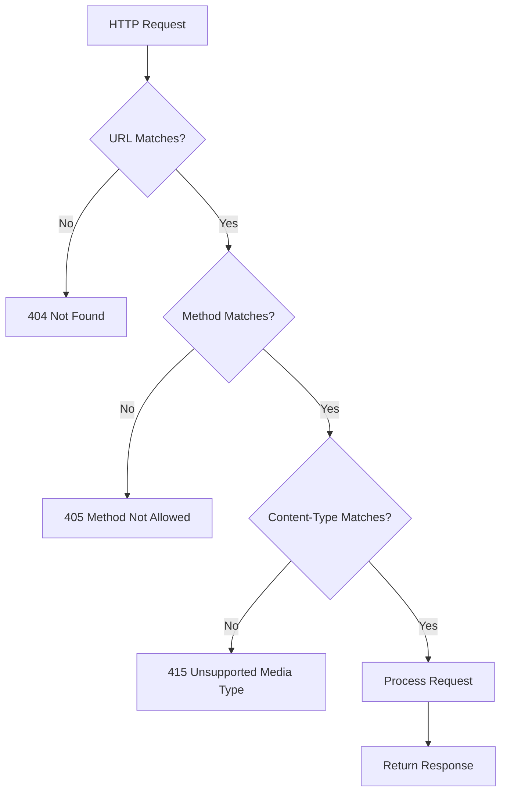

# How to Handle 'Method not allowed' Errors in Spring MVC

Author: [nawazdhandala](https://www.github.com/nawazdhandala)

Tags: Java, Spring Boot, Spring MVC, HTTP Methods, REST API, Error Handling

Description: Learn how to diagnose and fix '405 Method Not Allowed' errors in Spring MVC applications. This guide covers common causes, proper request mapping, and implementing custom error handling.

---

> The HTTP 405 "Method Not Allowed" error occurs when you send a request with an HTTP method that the server endpoint does not support. This guide helps you understand why this happens in Spring MVC and how to fix it properly.

When your Spring Boot application returns a 405 error, it means the URL exists but doesn't accept the HTTP method you're using (GET, POST, PUT, DELETE, etc.).

---

## Understanding the Error

The typical error response looks like:

```json
{
    "timestamp": "2024-01-15T10:30:00.000+00:00",
    "status": 405,
    "error": "Method Not Allowed",
    "message": "Request method 'POST' is not supported",
    "path": "/api/users"
}
```

---

## Request Mapping Flow



---

## Common Causes and Solutions

### 1. Wrong HTTP Method Annotation

The most common cause is using the wrong annotation or missing the method entirely.

```java
// Wrong - only handles GET requests
@RestController
@RequestMapping("/api/users")
public class UserController {

    @GetMapping
    public List<User> getAllUsers() {
        return userService.findAll();
    }

    // Missing POST mapping - POST /api/users returns 405
}

// Correct - includes POST mapping
@RestController
@RequestMapping("/api/users")
public class UserController {

    @GetMapping
    public List<User> getAllUsers() {
        return userService.findAll();
    }

    @PostMapping
    public User createUser(@RequestBody User user) {
        return userService.save(user);
    }
}
```

### 2. Incorrect Path Variables

```java
// Wrong - path doesn't match
@RestController
@RequestMapping("/api/users")
public class UserController {

    // This handles /api/users/{id}, not /api/users/123/profile
    @GetMapping("/{id}")
    public User getUser(@PathVariable Long id) {
        return userService.findById(id);
    }
}

// Correct - proper path structure
@RestController
@RequestMapping("/api/users")
public class UserController {

    @GetMapping("/{id}")
    public User getUser(@PathVariable Long id) {
        return userService.findById(id);
    }

    @GetMapping("/{id}/profile")
    public UserProfile getUserProfile(@PathVariable Long id) {
        return userService.getProfile(id);
    }
}
```

### 3. Using @RequestMapping Without Method

```java
// Wrong - accepts all HTTP methods
@RequestMapping("/api/data")
public String getData() {
    return "data";
}

// Correct - specify the method
@RequestMapping(value = "/api/data", method = RequestMethod.GET)
public String getData() {
    return "data";
}

// Better - use specific annotation
@GetMapping("/api/data")
public String getData() {
    return "data";
}
```

### 4. Form Submission Issues

HTML forms only support GET and POST. For PUT/DELETE, you need special handling.

```java
@RestController
@RequestMapping("/api/users")
public class UserController {

    // Standard REST endpoint
    @PutMapping("/{id}")
    public User updateUser(@PathVariable Long id, @RequestBody User user) {
        return userService.update(id, user);
    }

    // Alternative for HTML forms - use POST with _method parameter
    @PostMapping("/{id}/update")
    public User updateUserViaPost(@PathVariable Long id, @RequestBody User user) {
        return userService.update(id, user);
    }
}
```

Enable hidden method filter for form support:

```yaml
# application.yml
spring:
  mvc:
    hiddenmethod:
      filter:
        enabled: true
```

```html
<!-- HTML form with hidden _method field -->
<form action="/api/users/1" method="POST">
    <input type="hidden" name="_method" value="PUT">
    <!-- form fields -->
    <button type="submit">Update</button>
</form>
```

---

## Implementing Proper REST Endpoints

### Complete CRUD Controller

```java
@RestController
@RequestMapping("/api/users")
public class UserController {

    private final UserService userService;

    public UserController(UserService userService) {
        this.userService = userService;
    }

    // GET /api/users
    @GetMapping
    public ResponseEntity<List<User>> getAllUsers() {
        return ResponseEntity.ok(userService.findAll());
    }

    // GET /api/users/{id}
    @GetMapping("/{id}")
    public ResponseEntity<User> getUserById(@PathVariable Long id) {
        return userService.findById(id)
            .map(ResponseEntity::ok)
            .orElse(ResponseEntity.notFound().build());
    }

    // POST /api/users
    @PostMapping
    public ResponseEntity<User> createUser(@Valid @RequestBody UserRequest request) {
        User created = userService.create(request);
        URI location = ServletUriComponentsBuilder
            .fromCurrentRequest()
            .path("/{id}")
            .buildAndExpand(created.getId())
            .toUri();
        return ResponseEntity.created(location).body(created);
    }

    // PUT /api/users/{id}
    @PutMapping("/{id}")
    public ResponseEntity<User> updateUser(
            @PathVariable Long id,
            @Valid @RequestBody UserRequest request) {
        return userService.update(id, request)
            .map(ResponseEntity::ok)
            .orElse(ResponseEntity.notFound().build());
    }

    // PATCH /api/users/{id}
    @PatchMapping("/{id}")
    public ResponseEntity<User> partialUpdateUser(
            @PathVariable Long id,
            @RequestBody Map<String, Object> updates) {
        return userService.partialUpdate(id, updates)
            .map(ResponseEntity::ok)
            .orElse(ResponseEntity.notFound().build());
    }

    // DELETE /api/users/{id}
    @DeleteMapping("/{id}")
    public ResponseEntity<Void> deleteUser(@PathVariable Long id) {
        if (userService.delete(id)) {
            return ResponseEntity.noContent().build();
        }
        return ResponseEntity.notFound().build();
    }
}
```

---

## Custom Error Handling

### Global Exception Handler

```java
@RestControllerAdvice
public class GlobalExceptionHandler {

    @ExceptionHandler(HttpRequestMethodNotSupportedException.class)
    public ResponseEntity<ErrorResponse> handleMethodNotSupported(
            HttpRequestMethodNotSupportedException ex,
            HttpServletRequest request) {

        String supportedMethods = ex.getSupportedHttpMethods() != null
            ? ex.getSupportedHttpMethods().stream()
                .map(HttpMethod::name)
                .collect(Collectors.joining(", "))
            : "None";

        ErrorResponse error = new ErrorResponse(
            HttpStatus.METHOD_NOT_ALLOWED.value(),
            "Method Not Allowed",
            String.format("HTTP method '%s' is not supported for this endpoint. " +
                         "Supported methods: %s", ex.getMethod(), supportedMethods),
            request.getRequestURI()
        );

        HttpHeaders headers = new HttpHeaders();
        if (ex.getSupportedHttpMethods() != null) {
            headers.setAllow(ex.getSupportedHttpMethods());
        }

        return new ResponseEntity<>(error, headers, HttpStatus.METHOD_NOT_ALLOWED);
    }
}

record ErrorResponse(int status, String error, String message, String path) {}
```

### Including Allowed Methods in Response

```java
@RestControllerAdvice
public class MethodNotAllowedHandler {

    @ExceptionHandler(HttpRequestMethodNotSupportedException.class)
    public ResponseEntity<Map<String, Object>> handleMethodNotAllowed(
            HttpRequestMethodNotSupportedException ex) {

        Map<String, Object> response = new LinkedHashMap<>();
        response.put("status", 405);
        response.put("error", "Method Not Allowed");
        response.put("message", "The " + ex.getMethod() + " method is not supported");
        response.put("allowedMethods", ex.getSupportedHttpMethods());
        response.put("timestamp", Instant.now());

        HttpHeaders headers = new HttpHeaders();
        if (ex.getSupportedHttpMethods() != null) {
            headers.setAllow(ex.getSupportedHttpMethods());
        }

        return new ResponseEntity<>(response, headers, HttpStatus.METHOD_NOT_ALLOWED);
    }
}
```

---

## Debugging Method Not Allowed Errors

### Enable Request Mapping Logging

```yaml
# application.yml
logging:
  level:
    org.springframework.web.servlet.mvc.method.annotation: DEBUG
    org.springframework.web.servlet.handler: DEBUG
```

### List All Registered Mappings

```java
@Component
public class MappingLogger implements ApplicationListener<ApplicationReadyEvent> {

    private static final Logger log = LoggerFactory.getLogger(MappingLogger.class);

    private final RequestMappingHandlerMapping handlerMapping;

    public MappingLogger(RequestMappingHandlerMapping handlerMapping) {
        this.handlerMapping = handlerMapping;
    }

    @Override
    public void onApplicationEvent(ApplicationReadyEvent event) {
        log.info("Registered Request Mappings:");
        handlerMapping.getHandlerMethods().forEach((key, value) -> {
            log.info("  {} -> {}", key, value);
        });
    }
}
```

### Using Actuator Mappings Endpoint

```yaml
# application.yml
management:
  endpoints:
    web:
      exposure:
        include: mappings
```

Access `/actuator/mappings` to see all registered endpoints.

---

## Common Mistakes and Fixes

### CORS Preflight Requests

```java
// Wrong - OPTIONS request returns 405
@PostMapping("/api/upload")
public ResponseEntity<String> upload(@RequestBody byte[] data) {
    return ResponseEntity.ok("Uploaded");
}

// Correct - handle CORS properly
@Configuration
public class CorsConfig implements WebMvcConfigurer {

    @Override
    public void addCorsMappings(CorsRegistry registry) {
        registry.addMapping("/api/**")
            .allowedOrigins("http://localhost:3000")
            .allowedMethods("GET", "POST", "PUT", "DELETE", "OPTIONS")
            .allowedHeaders("*");
    }
}
```

### Trailing Slash Handling

```yaml
# application.yml
spring:
  mvc:
    pathmatch:
      trailing-slash: true  # /api/users and /api/users/ both match
```

---

## Testing HTTP Methods

```java
@SpringBootTest
@AutoConfigureMockMvc
class UserControllerTest {

    @Autowired
    private MockMvc mockMvc;

    @Test
    void whenGetUsers_thenReturns200() throws Exception {
        mockMvc.perform(get("/api/users"))
            .andExpect(status().isOk());
    }

    @Test
    void whenPostUsers_thenReturns201() throws Exception {
        mockMvc.perform(post("/api/users")
                .contentType(MediaType.APPLICATION_JSON)
                .content("{\"name\":\"Test\",\"email\":\"test@example.com\"}"))
            .andExpect(status().isCreated());
    }

    @Test
    void whenPatchWithoutEndpoint_thenReturns405() throws Exception {
        mockMvc.perform(patch("/api/users"))
            .andExpect(status().isMethodNotAllowed());
    }
}
```

---

## Conclusion

The 405 "Method Not Allowed" error typically indicates a mismatch between the HTTP method used and what your controller supports. Key solutions:

- **Use correct annotations** - @GetMapping, @PostMapping, @PutMapping, @DeleteMapping
- **Check path patterns** - Ensure URLs match your mappings
- **Handle CORS properly** - OPTIONS requests need proper handling
- **Implement custom error handlers** - Provide helpful error messages
- **Enable debug logging** - See which mappings are registered

Understanding your request mapping configuration prevents these errors and improves API usability.

---

*Need to monitor your Spring Boot API health and catch errors quickly? [OneUptime](https://oneuptime.com) provides API monitoring with detailed error tracking and instant alerts.*

**Related Reading:**
- [How to Handle "Request method not supported" Errors](/blog/post/2025-12-22-request-method-not-supported-spring/view)
