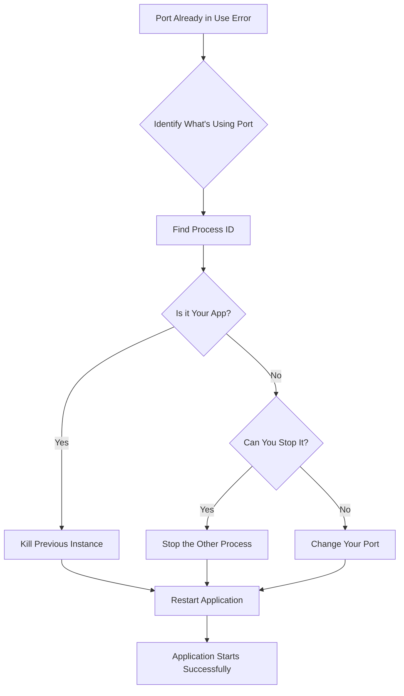

# How to Fix 'Port already in use' Errors in Spring Boot

Author: [nawazdhandala](https://www.github.com/nawazdhandala)

Tags: Java, Spring Boot, Port Conflict, Troubleshooting, DevOps, Configuration

Description: Learn how to diagnose and fix 'Port already in use' errors in Spring Boot applications. This guide covers finding processes using ports, changing ports, and setting up dynamic port allocation.

---

> The "Port already in use" error is one of the most common issues when starting Spring Boot applications. This guide shows you how to quickly identify the cause and implement solutions to prevent this from happening again.

When you see `Web server failed to start. Port 8080 was already in use`, it means another process is using the port your Spring Boot application wants to bind to.

---

## Understanding the Error

The full error typically looks like this:

```
***************************
APPLICATION FAILED TO START
***************************

Description:

Web server failed to start. Port 8080 was already in use.

Action:

Identify and stop the process that's listening on port 8080 or configure this application to listen on another port.
```

---

## Error Diagnosis Flow



---

## Finding What's Using the Port

### On macOS and Linux

```bash
# Find process using port 8080
lsof -i :8080

# Output shows process details
# COMMAND   PID   USER   FD   TYPE  DEVICE  SIZE/OFF NODE NAME
# java    12345   user   50u  IPv6  0x1234      0t0  TCP *:8080 (LISTEN)

# Alternative using netstat
netstat -vanp tcp | grep 8080

# Using ss (Linux)
ss -tulpn | grep 8080
```

### On Windows

```powershell
# Find process using port 8080
netstat -ano | findstr :8080

# Output: TCP    0.0.0.0:8080    0.0.0.0:0    LISTENING    12345
# The last number (12345) is the PID

# Find process name by PID
tasklist /fi "pid eq 12345"
```

---

## Stopping the Conflicting Process

### On macOS and Linux

```bash
# Kill process by PID
kill 12345

# Force kill if regular kill doesn't work
kill -9 12345

# Kill all Java processes (use with caution)
pkill -f java

# Kill specific Spring Boot app by port
kill $(lsof -t -i:8080)
```

### On Windows

```powershell
# Kill process by PID
taskkill /PID 12345 /F

# Kill all Java processes
taskkill /IM java.exe /F
```

---

## Solution 1: Change the Server Port

### Using application.properties

```properties
# application.properties
server.port=8081
```

### Using application.yml

```yaml
# application.yml
server:
  port: 8081
```

### Using Command Line Argument

```bash
# Override port at startup
java -jar myapp.jar --server.port=8081

# Or using JVM property
java -Dserver.port=8081 -jar myapp.jar
```

### Using Environment Variable

```bash
# Set environment variable
export SERVER_PORT=8081
java -jar myapp.jar
```

---

## Solution 2: Dynamic Port Allocation

### Random Available Port

```properties
# application.properties
# Use port 0 for random available port
server.port=0
```

```java
// Get the actual port at runtime
@Component
public class PortLogger implements ApplicationListener<WebServerInitializedEvent> {

    private static final Logger log = LoggerFactory.getLogger(PortLogger.class);

    @Override
    public void onApplicationEvent(WebServerInitializedEvent event) {
        int port = event.getWebServer().getPort();
        log.info("Application started on port: {}", port);
    }
}
```

### Finding and Using Available Port Programmatically

```java
@Configuration
public class ServerPortConfig {

    @Bean
    public WebServerFactoryCustomizer<ConfigurableWebServerFactory> portCustomizer() {
        return factory -> {
            int port = findAvailablePort(8080, 8090);
            factory.setPort(port);
        };
    }

    private int findAvailablePort(int startPort, int endPort) {
        for (int port = startPort; port <= endPort; port++) {
            if (isPortAvailable(port)) {
                return port;
            }
        }
        throw new RuntimeException("No available port found in range " + startPort + "-" + endPort);
    }

    private boolean isPortAvailable(int port) {
        try (ServerSocket socket = new ServerSocket(port)) {
            socket.setReuseAddress(true);
            return true;
        } catch (IOException e) {
            return false;
        }
    }
}
```

---

## Solution 3: Profile-Based Port Configuration

```yaml
# application.yml
spring:
  profiles:
    active: dev

---
spring:
  config:
    activate:
      on-profile: dev
server:
  port: 8080

---
spring:
  config:
    activate:
      on-profile: test
server:
  port: 8081

---
spring:
  config:
    activate:
      on-profile: prod
server:
  port: 80
```

---

## Solution 4: Graceful Shutdown for Clean Restarts

Ensure your application shuts down cleanly to release the port:

```yaml
# application.yml
server:
  shutdown: graceful

spring:
  lifecycle:
    timeout-per-shutdown-phase: 30s
```

```java
@Component
public class GracefulShutdown implements ApplicationListener<ContextClosedEvent> {

    private static final Logger log = LoggerFactory.getLogger(GracefulShutdown.class);

    @Override
    public void onApplicationEvent(ContextClosedEvent event) {
        log.info("Application shutting down, releasing resources...");
        // Perform cleanup
    }
}
```

---

## Solution 5: Using Actuator for Application Management

```yaml
# application.yml
management:
  server:
    port: 8081  # Separate port for actuator
  endpoints:
    web:
      exposure:
        include: health,info,shutdown
  endpoint:
    shutdown:
      enabled: true
```

```bash
# Gracefully shutdown running application
curl -X POST http://localhost:8081/actuator/shutdown
```

---

## Preventing Port Conflicts in Development

### Using Spring Boot DevTools

```xml
<!-- pom.xml -->
<dependency>
    <groupId>org.springframework.boot</groupId>
    <artifactId>spring-boot-devtools</artifactId>
    <scope>runtime</scope>
    <optional>true</optional>
</dependency>
```

DevTools automatically restarts the application on code changes, preventing multiple instances.

### IDE Configuration

In IntelliJ IDEA:
1. Go to Run/Debug Configurations
2. Check "Single instance only" option
3. This prevents starting multiple instances

### Script to Kill and Start

```bash
#!/bin/bash
# start-app.sh

PORT=8080
PID=$(lsof -t -i:$PORT)

if [ ! -z "$PID" ]; then
    echo "Killing process $PID on port $PORT"
    kill -9 $PID
    sleep 2
fi

echo "Starting application..."
java -jar target/myapp.jar
```

---

## Docker Considerations

### Port Mapping Conflicts

```yaml
# docker-compose.yml
version: '3.8'
services:
  app:
    image: myapp:latest
    ports:
      - "8080:8080"  # host:container
```

If port 8080 is already used on the host:

```yaml
# Use different host port
ports:
  - "8081:8080"  # Map to different host port
```

### Using Docker Networks

```yaml
# docker-compose.yml
version: '3.8'
services:
  app1:
    image: myapp:latest
    ports:
      - "8080:8080"
    networks:
      - app-network

  app2:
    image: myapp:latest
    ports:
      - "8081:8080"  # Different host port, same container port
    networks:
      - app-network

networks:
  app-network:
```

---

## Kubernetes Deployment

In Kubernetes, port conflicts are handled differently:

```yaml
# deployment.yaml
apiVersion: apps/v1
kind: Deployment
metadata:
  name: spring-app
spec:
  replicas: 3
  selector:
    matchLabels:
      app: spring-app
  template:
    metadata:
      labels:
        app: spring-app
    spec:
      containers:
      - name: spring-app
        image: myapp:latest
        ports:
        - containerPort: 8080
---
apiVersion: v1
kind: Service
metadata:
  name: spring-app-service
spec:
  selector:
    app: spring-app
  ports:
  - port: 80
    targetPort: 8080
```

Each pod gets its own IP, so the same container port can be used across replicas.

---

## Quick Reference Commands

| Platform | Find Process | Kill Process |
|----------|-------------|--------------|
| macOS/Linux | `lsof -i :8080` | `kill $(lsof -t -i:8080)` |
| Windows | `netstat -ano \| findstr :8080` | `taskkill /PID <pid> /F` |

---

## Conclusion

The "Port already in use" error is easy to fix once you understand the cause. Key solutions:

- **Find and kill** the conflicting process
- **Change the port** in configuration
- **Use dynamic port allocation** for testing
- **Configure graceful shutdown** for clean restarts
- **Use DevTools** to prevent multiple instances in development

With these techniques, you can quickly resolve port conflicts and prevent them from recurring.

---

*Need to monitor port availability and application health? [OneUptime](https://oneuptime.com) provides port monitoring, health checks, and instant alerts when your Spring Boot applications become unreachable.*

**Related Reading:**
- [How to Configure Actuator Endpoints in Spring Boot](/blog/post/2025-12-22-configure-actuator-endpoints-spring-boot/view)
