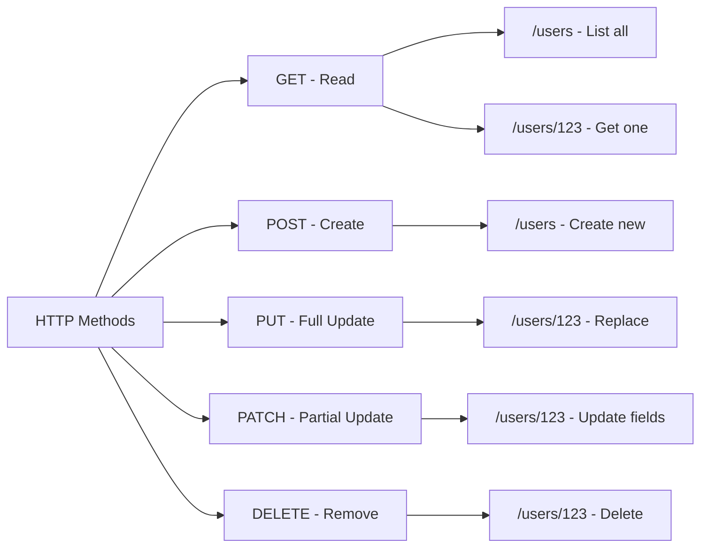

# How to Handle "Request method not supported" Errors

Author: [nawazdhandala](https://www.github.com/nawazdhandala)

Tags: Java, Spring Boot, REST API, HTTP Methods, Error Handling, Spring MVC

Description: Learn how to diagnose and fix "Request method X not supported" errors in Spring Boot. This guide covers identifying mismatched HTTP methods, proper request mapping, and implementing helpful error responses.

---

> The "Request method 'POST' not supported" error (HTTP 405) occurs when your endpoint doesn't accept the HTTP method being used. This is different from a 404 - the URL exists, but not for that specific HTTP method.

Understanding the difference between HTTP methods and how Spring maps them helps you quickly resolve these errors.

---

## Understanding the Error

The error typically appears as:

```json
{
    "timestamp": "2024-01-15T10:30:00.000+00:00",
    "status": 405,
    "error": "Method Not Allowed",
    "message": "Request method 'POST' is not supported",
    "path": "/api/users/123"
}
```

The `Allow` header in the response tells you which methods are supported:

```
Allow: GET, HEAD, DELETE
```

---

## HTTP Methods and Use Cases



---

## Common Causes and Solutions

### 1. Missing HTTP Method Mapping

```java
// Controller only has GET, but POST is requested
@RestController
@RequestMapping("/api/users")
public class UserController {

    @GetMapping
    public List<User> getAllUsers() {
        return userService.findAll();
    }

    @GetMapping("/{id}")
    public User getUser(@PathVariable Long id) {
        return userService.findById(id);
    }

    // POST /api/users returns 405 - no @PostMapping!
}
```

**Solution**: Add the missing method mapping:

```java
@RestController
@RequestMapping("/api/users")
public class UserController {

    @GetMapping
    public List<User> getAllUsers() {
        return userService.findAll();
    }

    @GetMapping("/{id}")
    public User getUser(@PathVariable Long id) {
        return userService.findById(id);
    }

    @PostMapping  // Now POST is supported
    public User createUser(@RequestBody UserRequest request) {
        return userService.create(request);
    }

    @PutMapping("/{id}")
    public User updateUser(@PathVariable Long id, @RequestBody UserRequest request) {
        return userService.update(id, request);
    }

    @DeleteMapping("/{id}")
    public ResponseEntity<Void> deleteUser(@PathVariable Long id) {
        userService.delete(id);
        return ResponseEntity.noContent().build();
    }
}
```

### 2. Wrong Endpoint Path

```java
// POST to /api/users/create, but endpoint is /api/users
@PostMapping  // Maps to POST /api/users, not /api/users/create
public User createUser(@RequestBody UserRequest request) {
    return userService.create(request);
}
```

**Solution**: Match the path exactly:

```java
// Option 1: Change endpoint
@PostMapping("/create")  // POST /api/users/create
public User createUser(@RequestBody UserRequest request) {
    return userService.create(request);
}

// Option 2: Update client to use correct path
// POST /api/users (without /create)
```

### 3. Collection vs Resource Confusion

```java
// Wrong - POST to /api/users/123 (resource URL)
// POST should go to collection URL /api/users

@RestController
@RequestMapping("/api/users")
public class UserController {

    // POST /api/users - Create new user (correct)
    @PostMapping
    public User createUser(@RequestBody UserRequest request) {
        return userService.create(request);
    }

    // POST /api/users/123 - Not typically valid
    // Use PUT or PATCH to update existing resource
    @PutMapping("/{id}")
    public User updateUser(@PathVariable Long id, @RequestBody UserRequest request) {
        return userService.update(id, request);
    }
}
```

### 4. Static Resources Interference

```java
// Static resources at /resources/** might intercept API calls
@Configuration
public class WebConfig implements WebMvcConfigurer {

    @Override
    public void addResourceHandlers(ResourceHandlerRegistry registry) {
        registry.addResourceHandler("/resources/**")
            .addResourceLocations("classpath:/static/");
    }
}
```

Ensure API paths don't conflict with static resource paths.

---

## Complete REST Controller Example

```java
@RestController
@RequestMapping("/api/v1/products")
public class ProductController {

    private final ProductService productService;

    public ProductController(ProductService productService) {
        this.productService = productService;
    }

    // GET /api/v1/products
    @GetMapping
    public ResponseEntity<Page<Product>> listProducts(
            @RequestParam(defaultValue = "0") int page,
            @RequestParam(defaultValue = "20") int size) {
        return ResponseEntity.ok(productService.findAll(PageRequest.of(page, size)));
    }

    // GET /api/v1/products/{id}
    @GetMapping("/{id}")
    public ResponseEntity<Product> getProduct(@PathVariable Long id) {
        return productService.findById(id)
            .map(ResponseEntity::ok)
            .orElse(ResponseEntity.notFound().build());
    }

    // POST /api/v1/products
    @PostMapping
    public ResponseEntity<Product> createProduct(@Valid @RequestBody ProductRequest request) {
        Product created = productService.create(request);
        URI location = ServletUriComponentsBuilder
            .fromCurrentRequest()
            .path("/{id}")
            .buildAndExpand(created.getId())
            .toUri();
        return ResponseEntity.created(location).body(created);
    }

    // PUT /api/v1/products/{id}
    @PutMapping("/{id}")
    public ResponseEntity<Product> replaceProduct(
            @PathVariable Long id,
            @Valid @RequestBody ProductRequest request) {
        return productService.replace(id, request)
            .map(ResponseEntity::ok)
            .orElse(ResponseEntity.notFound().build());
    }

    // PATCH /api/v1/products/{id}
    @PatchMapping("/{id}")
    public ResponseEntity<Product> updateProduct(
            @PathVariable Long id,
            @RequestBody Map<String, Object> updates) {
        return productService.partialUpdate(id, updates)
            .map(ResponseEntity::ok)
            .orElse(ResponseEntity.notFound().build());
    }

    // DELETE /api/v1/products/{id}
    @DeleteMapping("/{id}")
    public ResponseEntity<Void> deleteProduct(@PathVariable Long id) {
        if (productService.delete(id)) {
            return ResponseEntity.noContent().build();
        }
        return ResponseEntity.notFound().build();
    }

    // POST /api/v1/products/{id}/archive (action on resource)
    @PostMapping("/{id}/archive")
    public ResponseEntity<Product> archiveProduct(@PathVariable Long id) {
        return productService.archive(id)
            .map(ResponseEntity::ok)
            .orElse(ResponseEntity.notFound().build());
    }
}
```

---

## Custom Error Handler

```java
@RestControllerAdvice
public class MethodNotAllowedHandler {

    @ExceptionHandler(HttpRequestMethodNotSupportedException.class)
    public ResponseEntity<ErrorResponse> handleMethodNotSupported(
            HttpRequestMethodNotSupportedException ex,
            HttpServletRequest request) {

        Set<HttpMethod> supportedMethods = ex.getSupportedHttpMethods();
        String allowedMethods = supportedMethods != null
            ? supportedMethods.stream()
                .map(HttpMethod::name)
                .collect(Collectors.joining(", "))
            : "None";

        ErrorResponse error = new ErrorResponse(
            HttpStatus.METHOD_NOT_ALLOWED.value(),
            "Method Not Allowed",
            String.format(
                "HTTP method '%s' is not supported for endpoint '%s'. Supported methods: %s",
                ex.getMethod(),
                request.getRequestURI(),
                allowedMethods
            ),
            request.getRequestURI()
        );

        HttpHeaders headers = new HttpHeaders();
        if (supportedMethods != null && !supportedMethods.isEmpty()) {
            headers.setAllow(supportedMethods);
        }

        return new ResponseEntity<>(error, headers, HttpStatus.METHOD_NOT_ALLOWED);
    }
}

record ErrorResponse(
    int status,
    String error,
    String message,
    String path
) {}
```

---

## Debugging Method Support

### List All Registered Endpoints

```java
@Component
public class EndpointLogger implements ApplicationListener<ApplicationReadyEvent> {

    private static final Logger log = LoggerFactory.getLogger(EndpointLogger.class);

    private final RequestMappingHandlerMapping handlerMapping;

    public EndpointLogger(RequestMappingHandlerMapping handlerMapping) {
        this.handlerMapping = handlerMapping;
    }

    @Override
    public void onApplicationEvent(ApplicationReadyEvent event) {
        log.info("=== Registered Endpoints ===");

        handlerMapping.getHandlerMethods().forEach((mapping, method) -> {
            Set<RequestMethod> methods = mapping.getMethodsCondition().getMethods();
            Set<String> patterns = mapping.getPatternValues();

            String methodsStr = methods.isEmpty() ? "ALL" :
                methods.stream().map(Enum::name).collect(Collectors.joining(", "));

            patterns.forEach(pattern ->
                log.info("  {} {} -> {}.{}",
                    methodsStr,
                    pattern,
                    method.getBeanType().getSimpleName(),
                    method.getMethod().getName())
            );
        });
    }
}
```

### Using Actuator

```yaml
# application.yml
management:
  endpoints:
    web:
      exposure:
        include: mappings
```

Access `/actuator/mappings` to see all endpoint mappings.

---

## Testing HTTP Methods

```java
@SpringBootTest
@AutoConfigureMockMvc
class ProductControllerTest {

    @Autowired
    private MockMvc mockMvc;

    @Test
    void getAllProducts_ReturnsOk() throws Exception {
        mockMvc.perform(get("/api/v1/products"))
            .andExpect(status().isOk());
    }

    @Test
    void createProduct_WithPost_ReturnsCreated() throws Exception {
        mockMvc.perform(post("/api/v1/products")
                .contentType(MediaType.APPLICATION_JSON)
                .content("{\"name\":\"Test\",\"price\":9.99}"))
            .andExpect(status().isCreated());
    }

    @Test
    void createProduct_WithGet_Returns405() throws Exception {
        mockMvc.perform(get("/api/v1/products")
                .contentType(MediaType.APPLICATION_JSON)
                .content("{\"name\":\"Test\",\"price\":9.99}"))
            .andExpect(status().isOk());  // GET returns list, not 405

        // But creating with wrong method:
        mockMvc.perform(put("/api/v1/products")  // PUT without ID
                .contentType(MediaType.APPLICATION_JSON)
                .content("{\"name\":\"Test\",\"price\":9.99}"))
            .andExpect(status().isMethodNotAllowed());
    }

    @Test
    void updateProduct_WithPatch_ReturnsOk() throws Exception {
        mockMvc.perform(patch("/api/v1/products/1")
                .contentType(MediaType.APPLICATION_JSON)
                .content("{\"price\":19.99}"))
            .andExpect(status().isOk());
    }

    @Test
    void deleteProduct_ReturnsNoContent() throws Exception {
        mockMvc.perform(delete("/api/v1/products/1"))
            .andExpect(status().isNoContent());
    }
}
```

---

## Quick Reference

| HTTP Method | Endpoint Pattern | Use Case |
|-------------|-----------------|----------|
| GET | /resources | List all resources |
| GET | /resources/{id} | Get single resource |
| POST | /resources | Create new resource |
| PUT | /resources/{id} | Replace entire resource |
| PATCH | /resources/{id} | Partial update |
| DELETE | /resources/{id} | Delete resource |
| POST | /resources/{id}/action | Perform action on resource |

---

## Common Mistakes

### Using GET for State Changes

```java
// Wrong - GET should not modify state
@GetMapping("/users/{id}/activate")
public User activateUser(@PathVariable Long id) {
    return userService.activate(id);
}

// Correct - Use POST for actions
@PostMapping("/users/{id}/activate")
public User activateUser(@PathVariable Long id) {
    return userService.activate(id);
}
```

### Inconsistent URL Patterns

```java
// Inconsistent
@PostMapping("/user/create")     // Singular, with verb
@GetMapping("/users")            // Plural
@DeleteMapping("/delete-user/{id}") // Verb in URL

// Consistent
@PostMapping("/users")           // Plural, method implies create
@GetMapping("/users")            // Plural
@DeleteMapping("/users/{id}")    // Plural, method implies delete
```

---

## Conclusion

The "Request method not supported" error indicates a mismatch between what your client sends and what your endpoint accepts. Key solutions:

- **Verify endpoint mappings** match the HTTP method you're using
- **Follow REST conventions** for method usage
- **Use Actuator** to inspect registered endpoints
- **Implement error handlers** that show allowed methods
- **Test all HTTP methods** your API should support

Understanding REST conventions and proper request mapping prevents these errors.

---

*Need to monitor your API endpoints for errors? [OneUptime](https://oneuptime.com) provides comprehensive API monitoring with method-level tracking and instant alerts.*

**Related Reading:**
- [How to Handle "Method not allowed" Errors in Spring MVC](/blog/post/2025-12-22-method-not-allowed-spring-mvc/view)
