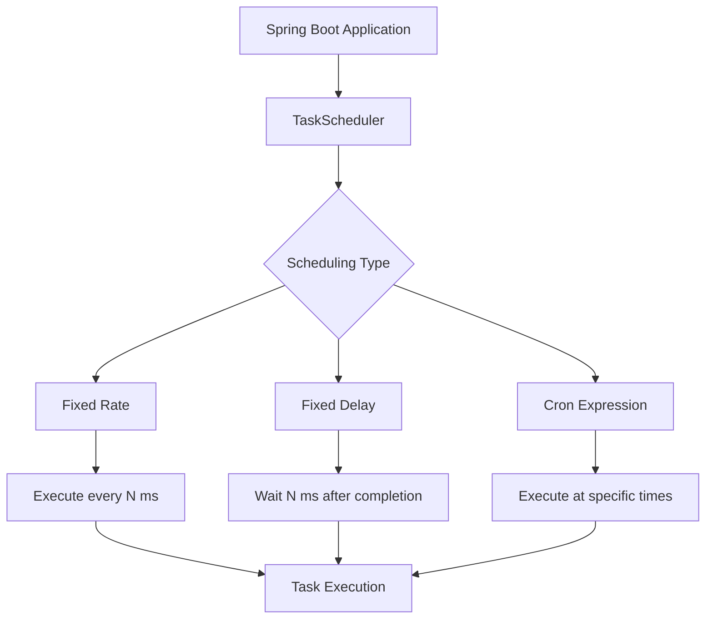

# How to Set Up Scheduled Tasks in Spring Boot

Author: [nawazdhandala](https://www.github.com/nawazdhandala)

Tags: Java, Spring Boot, Scheduling, Cron, Background Tasks, Automation

Description: Learn how to implement scheduled tasks in Spring Boot using @Scheduled annotation. This guide covers cron expressions, fixed-rate scheduling, dynamic scheduling, and distributed task management.

---

> Scheduled tasks are essential for background operations like data cleanup, report generation, health checks, and synchronization jobs. Spring Boot's scheduling support makes it easy to run tasks at specified intervals or times.

With proper scheduling configuration, you can automate repetitive tasks and ensure they run reliably.

---

## Scheduling Architecture



---

## Basic Setup

### Enable Scheduling

```java
@SpringBootApplication
@EnableScheduling
public class Application {
    public static void main(String[] args) {
        SpringApplication.run(Application.class, args);
    }
}
```

### Simple Scheduled Task

```java
@Component
public class ScheduledTasks {

    private static final Logger log = LoggerFactory.getLogger(ScheduledTasks.class);

    // Run every 5 seconds
    @Scheduled(fixedRate = 5000)
    public void reportCurrentTime() {
        log.info("Current time: {}", LocalDateTime.now());
    }
}
```

---

## Scheduling Options

### Fixed Rate

Execute at fixed intervals, regardless of previous task completion:

```java
@Component
public class FixedRateScheduler {

    private static final Logger log = LoggerFactory.getLogger(FixedRateScheduler.class);

    // Every 10 seconds (overlaps possible)
    @Scheduled(fixedRate = 10000)
    public void fixedRateTask() {
        log.info("Fixed rate task - {}", Instant.now());
        // If this takes 15 seconds, next execution starts while this is running
    }

    // With initial delay
    @Scheduled(fixedRate = 10000, initialDelay = 5000)
    public void fixedRateWithDelay() {
        log.info("Started after 5s delay, then every 10s");
    }

    // Using strings (can be externalized)
    @Scheduled(fixedRateString = "${scheduler.rate:10000}")
    public void configurableRate() {
        log.info("Rate from configuration");
    }
}
```

### Fixed Delay

Wait for specified time after previous task completes:

```java
@Component
public class FixedDelayScheduler {

    private static final Logger log = LoggerFactory.getLogger(FixedDelayScheduler.class);

    // Wait 5 seconds after previous execution completes
    @Scheduled(fixedDelay = 5000)
    public void fixedDelayTask() {
        log.info("Starting task...");
        try {
            Thread.sleep(3000); // Simulate work
        } catch (InterruptedException e) {
            Thread.currentThread().interrupt();
        }
        log.info("Task completed. Next execution in 5 seconds.");
    }

    // Using TimeUnit for clarity
    @Scheduled(fixedDelay = 30, timeUnit = TimeUnit.SECONDS)
    public void thirtySecondDelay() {
        log.info("Runs 30 seconds after last completion");
    }
}
```

### Cron Expressions

```java
@Component
public class CronScheduler {

    private static final Logger log = LoggerFactory.getLogger(CronScheduler.class);

    // Every day at midnight
    @Scheduled(cron = "0 0 0 * * *")
    public void dailyMidnight() {
        log.info("Daily midnight task");
    }

    // Every hour at minute 0
    @Scheduled(cron = "0 0 * * * *")
    public void hourlyTask() {
        log.info("Hourly task");
    }

    // Every Monday at 9 AM
    @Scheduled(cron = "0 0 9 * * MON")
    public void weeklyReport() {
        log.info("Weekly Monday report");
    }

    // Every 15 minutes
    @Scheduled(cron = "0 */15 * * * *")
    public void every15Minutes() {
        log.info("Every 15 minutes");
    }

    // Weekdays at 8:30 AM
    @Scheduled(cron = "0 30 8 * * MON-FRI")
    public void weekdayMorning() {
        log.info("Weekday morning task");
    }

    // With timezone
    @Scheduled(cron = "0 0 9 * * *", zone = "America/New_York")
    public void nineAmNewYork() {
        log.info("9 AM New York time");
    }

    // From configuration
    @Scheduled(cron = "${scheduler.cleanup.cron:0 0 2 * * *}")
    public void configurableCron() {
        log.info("Cron from configuration");
    }
}
```

---

## Cron Expression Reference

```
 ┌───────────── second (0-59)
 │ ┌───────────── minute (0-59)
 │ │ ┌───────────── hour (0-23)
 │ │ │ ┌───────────── day of month (1-31)
 │ │ │ │ ┌───────────── month (1-12 or JAN-DEC)
 │ │ │ │ │ ┌───────────── day of week (0-7 or SUN-SAT)
 │ │ │ │ │ │
 * * * * * *
```

| Expression | Description |
|------------|-------------|
| `0 0 * * * *` | Every hour |
| `0 */10 * * * *` | Every 10 minutes |
| `0 0 8-18 * * *` | Every hour from 8 AM to 6 PM |
| `0 0 0 * * *` | Daily at midnight |
| `0 0 0 1 * *` | First day of every month |
| `0 0 12 * * MON-FRI` | Noon on weekdays |
| `0 0 0 1 1 *` | January 1st at midnight |

---

## Task Configuration

### Thread Pool Configuration

```java
@Configuration
public class SchedulerConfig implements SchedulingConfigurer {

    @Override
    public void configureTasks(ScheduledTaskRegistrar taskRegistrar) {
        ThreadPoolTaskScheduler scheduler = new ThreadPoolTaskScheduler();
        scheduler.setPoolSize(10);
        scheduler.setThreadNamePrefix("scheduled-task-");
        scheduler.setErrorHandler(t ->
            LoggerFactory.getLogger(getClass())
                .error("Error in scheduled task", t));
        scheduler.initialize();

        taskRegistrar.setTaskScheduler(scheduler);
    }
}
```

### Using Properties

```yaml
# application.yml
spring:
  task:
    scheduling:
      pool:
        size: 5
      thread-name-prefix: scheduled-

scheduler:
  cleanup:
    enabled: true
    cron: "0 0 2 * * *"
  sync:
    enabled: true
    rate: 60000
```

```java
@Component
@ConditionalOnProperty(name = "scheduler.cleanup.enabled", havingValue = "true")
public class CleanupScheduler {

    @Scheduled(cron = "${scheduler.cleanup.cron}")
    public void cleanup() {
        // Cleanup logic
    }
}
```

---

## Practical Examples

### Database Cleanup Task

```java
@Component
public class DatabaseCleanupScheduler {

    private static final Logger log = LoggerFactory.getLogger(DatabaseCleanupScheduler.class);

    private final SessionRepository sessionRepository;
    private final AuditLogRepository auditLogRepository;

    public DatabaseCleanupScheduler(
            SessionRepository sessionRepository,
            AuditLogRepository auditLogRepository) {
        this.sessionRepository = sessionRepository;
        this.auditLogRepository = auditLogRepository;
    }

    // Clean expired sessions every hour
    @Scheduled(cron = "0 0 * * * *")
    @Transactional
    public void cleanExpiredSessions() {
        log.info("Starting expired session cleanup");

        LocalDateTime cutoff = LocalDateTime.now().minusHours(24);
        int deleted = sessionRepository.deleteByLastAccessedBefore(cutoff);

        log.info("Deleted {} expired sessions", deleted);
    }

    // Clean old audit logs monthly
    @Scheduled(cron = "0 0 3 1 * *")  // 3 AM on first day of month
    @Transactional
    public void cleanOldAuditLogs() {
        log.info("Starting audit log cleanup");

        LocalDateTime cutoff = LocalDateTime.now().minusMonths(6);
        int deleted = auditLogRepository.deleteByCreatedAtBefore(cutoff);

        log.info("Deleted {} old audit log entries", deleted);
    }
}
```

### Health Check Scheduler

```java
@Component
public class HealthCheckScheduler {

    private static final Logger log = LoggerFactory.getLogger(HealthCheckScheduler.class);

    private final List<ExternalService> externalServices;
    private final AlertService alertService;
    private final MeterRegistry meterRegistry;

    @Scheduled(fixedRate = 30000)  // Every 30 seconds
    public void checkExternalServices() {
        for (ExternalService service : externalServices) {
            try {
                long startTime = System.currentTimeMillis();
                boolean healthy = service.healthCheck();
                long duration = System.currentTimeMillis() - startTime;

                meterRegistry.timer("external.service.health",
                    "service", service.getName(),
                    "status", healthy ? "up" : "down"
                ).record(duration, TimeUnit.MILLISECONDS);

                if (!healthy) {
                    log.warn("Service {} is unhealthy", service.getName());
                    alertService.sendAlert(service.getName() + " health check failed");
                }

            } catch (Exception e) {
                log.error("Health check failed for {}", service.getName(), e);
                alertService.sendAlert(service.getName() + " health check error: " + e.getMessage());
            }
        }
    }
}
```

### Report Generation

```java
@Component
public class ReportScheduler {

    private static final Logger log = LoggerFactory.getLogger(ReportScheduler.class);

    private final ReportService reportService;
    private final EmailService emailService;

    // Daily report at 6 AM
    @Scheduled(cron = "0 0 6 * * *")
    public void generateDailyReport() {
        log.info("Generating daily report");

        try {
            LocalDate yesterday = LocalDate.now().minusDays(1);
            Report report = reportService.generateDailyReport(yesterday);

            emailService.sendReport(
                "admin@example.com",
                "Daily Report - " + yesterday,
                report
            );

            log.info("Daily report sent successfully");

        } catch (Exception e) {
            log.error("Failed to generate daily report", e);
        }
    }

    // Weekly report every Monday at 8 AM
    @Scheduled(cron = "0 0 8 * * MON")
    public void generateWeeklyReport() {
        log.info("Generating weekly report");

        LocalDate endDate = LocalDate.now().minusDays(1);
        LocalDate startDate = endDate.minusDays(6);

        Report report = reportService.generateWeeklyReport(startDate, endDate);
        emailService.sendReport(
            "management@example.com",
            "Weekly Report",
            report
        );
    }
}
```

---

## Handling Long-Running Tasks

### Async Execution

```java
@Configuration
@EnableAsync
public class AsyncConfig {

    @Bean
    public Executor taskExecutor() {
        ThreadPoolTaskExecutor executor = new ThreadPoolTaskExecutor();
        executor.setCorePoolSize(5);
        executor.setMaxPoolSize(10);
        executor.setQueueCapacity(25);
        executor.setThreadNamePrefix("async-task-");
        executor.initialize();
        return executor;
    }
}

@Component
public class LongRunningScheduler {

    private final AtomicBoolean isRunning = new AtomicBoolean(false);

    @Async
    @Scheduled(cron = "0 0 2 * * *")
    public void longRunningTask() {
        // Prevent overlapping executions
        if (!isRunning.compareAndSet(false, true)) {
            log.warn("Previous execution still running, skipping");
            return;
        }

        try {
            log.info("Starting long-running task");
            // Long operation
            Thread.sleep(30000);
            log.info("Long-running task completed");
        } catch (InterruptedException e) {
            Thread.currentThread().interrupt();
        } finally {
            isRunning.set(false);
        }
    }
}
```

### With ShedLock (Distributed Locking)

```xml
<dependency>
    <groupId>net.javacrumbs.shedlock</groupId>
    <artifactId>shedlock-spring</artifactId>
    <version>5.10.0</version>
</dependency>
<dependency>
    <groupId>net.javacrumbs.shedlock</groupId>
    <artifactId>shedlock-provider-jdbc-template</artifactId>
    <version>5.10.0</version>
</dependency>
```

```java
@Configuration
@EnableSchedulerLock(defaultLockAtMostFor = "10m")
public class ShedLockConfig {

    @Bean
    public LockProvider lockProvider(DataSource dataSource) {
        return new JdbcTemplateLockProvider(
            JdbcTemplateLockProvider.Configuration.builder()
                .withJdbcTemplate(new JdbcTemplate(dataSource))
                .usingDbTime()
                .build()
        );
    }
}

@Component
public class DistributedScheduler {

    @Scheduled(cron = "0 0 * * * *")
    @SchedulerLock(
        name = "hourlySync",
        lockAtLeastFor = "5m",
        lockAtMostFor = "30m"
    )
    public void synchronizeData() {
        // Only one instance runs this across all nodes
        log.info("Running distributed sync task");
    }
}
```

---

## Dynamic Scheduling

```java
@Component
public class DynamicScheduler implements SchedulingConfigurer {

    private final ScheduleRepository scheduleRepository;

    @Override
    public void configureTasks(ScheduledTaskRegistrar taskRegistrar) {
        taskRegistrar.addTriggerTask(
            () -> executeTask(),
            triggerContext -> {
                // Get next execution time from database
                String cronExpression = scheduleRepository
                    .findByTaskName("dynamic-task")
                    .map(Schedule::getCronExpression)
                    .orElse("0 0 * * * *");

                return new CronTrigger(cronExpression)
                    .nextExecution(triggerContext);
            }
        );
    }

    private void executeTask() {
        log.info("Executing dynamic task at {}", Instant.now());
    }
}
```

---

## Monitoring and Metrics

```java
@Component
public class MonitoredScheduler {

    private final MeterRegistry meterRegistry;

    @Scheduled(fixedRate = 60000)
    public void monitoredTask() {
        Timer.Sample sample = Timer.start(meterRegistry);

        try {
            // Task logic
            doWork();

            meterRegistry.counter("scheduled.task",
                "name", "monitoredTask",
                "status", "success"
            ).increment();

        } catch (Exception e) {
            meterRegistry.counter("scheduled.task",
                "name", "monitoredTask",
                "status", "failure"
            ).increment();
            throw e;

        } finally {
            sample.stop(meterRegistry.timer("scheduled.task.duration",
                "name", "monitoredTask"));
        }
    }
}
```

---

## Conclusion

Spring Boot scheduling provides powerful task automation capabilities. Key points:

- Use **@EnableScheduling** to activate scheduling
- Choose **fixedRate** for regular intervals, **fixedDelay** for sequential tasks
- Use **cron expressions** for specific times
- Configure **thread pools** for concurrent tasks
- Use **ShedLock** for distributed environments
- Add **monitoring** to track task execution

With proper scheduling, you can automate background operations reliably.

---

*Need to monitor your scheduled tasks? [OneUptime](https://oneuptime.com) provides task monitoring with execution tracking, failure alerts, and performance metrics.*

**Related Reading:**
- [How to Set Up Caching in Spring Boot](/blog/post/2025-12-22-setup-caching-spring-boot/view)
