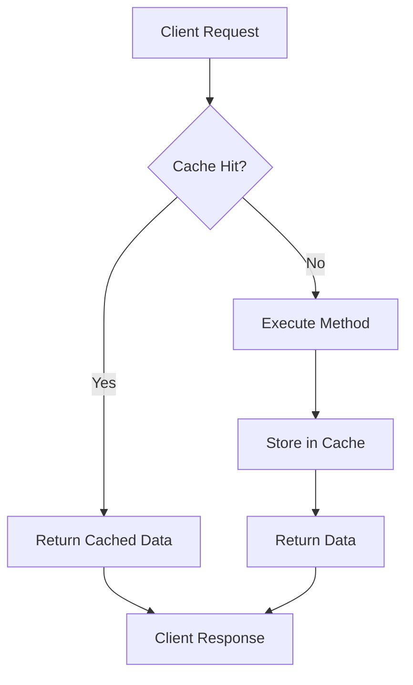

# How to Set Up Caching in Spring Boot

Author: [nawazdhandala](https://www.github.com/nawazdhandala)

Tags: Java, Spring Boot, Caching, Performance, Redis, Caffeine

Description: Learn how to implement caching in Spring Boot applications using Spring Cache abstraction. This guide covers in-memory caching with Caffeine, distributed caching with Redis, and best practices for cache management.

---

> Caching is one of the most effective ways to improve application performance. Spring Boot's caching abstraction makes it easy to add caching to your methods with simple annotations. This guide shows you how to implement both in-memory and distributed caching.

With proper caching, you can reduce database load, lower response times, and improve overall application scalability.

---

## Caching Architecture



---

## Basic Setup

### Add Dependencies

```xml
<!-- pom.xml -->
<dependencies>
    <!-- Spring Boot Cache Starter -->
    <dependency>
        <groupId>org.springframework.boot</groupId>
        <artifactId>spring-boot-starter-cache</artifactId>
    </dependency>

    <!-- Caffeine for in-memory caching -->
    <dependency>
        <groupId>com.github.ben-manes.caffeine</groupId>
        <artifactId>caffeine</artifactId>
    </dependency>
</dependencies>
```

### Enable Caching

```java
@SpringBootApplication
@EnableCaching
public class Application {
    public static void main(String[] args) {
        SpringApplication.run(Application.class, args);
    }
}
```

---

## Simple Caching with @Cacheable

```java
@Service
public class UserService {

    private final UserRepository userRepository;

    public UserService(UserRepository userRepository) {
        this.userRepository = userRepository;
    }

    @Cacheable("users")
    public User findById(Long id) {
        // This method will be cached
        // Second call with same ID returns cached result
        return userRepository.findById(id)
            .orElseThrow(() -> new UserNotFoundException(id));
    }

    @Cacheable(value = "users", key = "#email")
    public User findByEmail(String email) {
        return userRepository.findByEmail(email)
            .orElseThrow(() -> new UserNotFoundException(email));
    }

    @Cacheable(value = "users", key = "#root.methodName + #name")
    public List<User> findByName(String name) {
        return userRepository.findByNameContaining(name);
    }
}
```

---

## Cache Annotations

### @Cacheable - Cache Method Results

```java
@Cacheable(
    value = "products",           // Cache name
    key = "#id",                  // Cache key
    condition = "#id > 0",        // Only cache if condition is true
    unless = "#result == null"    // Don't cache null results
)
public Product findById(Long id) {
    return productRepository.findById(id).orElse(null);
}
```

### @CachePut - Update Cache

```java
@CachePut(value = "users", key = "#user.id")
public User updateUser(User user) {
    // Always executes and updates cache
    return userRepository.save(user);
}
```

### @CacheEvict - Remove from Cache

```java
@CacheEvict(value = "users", key = "#id")
public void deleteUser(Long id) {
    userRepository.deleteById(id);
}

@CacheEvict(value = "users", allEntries = true)
public void clearAllUsers() {
    // Clears entire cache
}

@CacheEvict(value = "users", allEntries = true, beforeInvocation = true)
public void refreshUsers() {
    // Cache cleared before method execution
}
```

### @Caching - Multiple Cache Operations

```java
@Caching(
    evict = {
        @CacheEvict(value = "users", key = "#user.id"),
        @CacheEvict(value = "usersByEmail", key = "#user.email")
    },
    put = {
        @CachePut(value = "users", key = "#result.id")
    }
)
public User updateUser(User user) {
    return userRepository.save(user);
}
```

---

## Caffeine Cache Configuration

```java
@Configuration
@EnableCaching
public class CacheConfig {

    @Bean
    public CacheManager cacheManager() {
        CaffeineCacheManager cacheManager = new CaffeineCacheManager();
        cacheManager.setCaffeine(Caffeine.newBuilder()
            .initialCapacity(100)
            .maximumSize(500)
            .expireAfterWrite(Duration.ofMinutes(10))
            .recordStats());
        return cacheManager;
    }
}
```

### Multiple Caches with Different Settings

```java
@Configuration
@EnableCaching
public class CacheConfig {

    @Bean
    public CacheManager cacheManager() {
        SimpleCacheManager cacheManager = new SimpleCacheManager();
        cacheManager.setCaches(List.of(
            buildCache("users", 100, Duration.ofMinutes(30)),
            buildCache("products", 500, Duration.ofHours(1)),
            buildCache("configurations", 50, Duration.ofHours(24))
        ));
        return cacheManager;
    }

    private CaffeineCache buildCache(String name, int maxSize, Duration ttl) {
        return new CaffeineCache(name, Caffeine.newBuilder()
            .maximumSize(maxSize)
            .expireAfterWrite(ttl)
            .recordStats()
            .build());
    }
}
```

### Configuration via Properties

```yaml
# application.yml
spring:
  cache:
    type: caffeine
    caffeine:
      spec: maximumSize=500,expireAfterWrite=600s
    cache-names:
      - users
      - products
      - configurations
```

---

## Redis Caching (Distributed)

### Add Redis Dependencies

```xml
<dependency>
    <groupId>org.springframework.boot</groupId>
    <artifactId>spring-boot-starter-data-redis</artifactId>
</dependency>
```

### Redis Configuration

```yaml
# application.yml
spring:
  data:
    redis:
      host: localhost
      port: 6379
      password: ${REDIS_PASSWORD:}
      timeout: 2000ms
  cache:
    type: redis
    redis:
      time-to-live: 3600000  # 1 hour in milliseconds
      cache-null-values: false
```

### Redis Cache Manager

```java
@Configuration
@EnableCaching
public class RedisCacheConfig {

    @Bean
    public RedisCacheManager cacheManager(RedisConnectionFactory connectionFactory) {
        RedisCacheConfiguration defaultConfig = RedisCacheConfiguration.defaultCacheConfig()
            .entryTtl(Duration.ofMinutes(30))
            .disableCachingNullValues()
            .serializeKeysWith(
                RedisSerializationContext.SerializationPair.fromSerializer(
                    new StringRedisSerializer()))
            .serializeValuesWith(
                RedisSerializationContext.SerializationPair.fromSerializer(
                    new GenericJackson2JsonRedisSerializer()));

        Map<String, RedisCacheConfiguration> cacheConfigs = Map.of(
            "users", defaultConfig.entryTtl(Duration.ofHours(1)),
            "products", defaultConfig.entryTtl(Duration.ofMinutes(15)),
            "sessions", defaultConfig.entryTtl(Duration.ofMinutes(30))
        );

        return RedisCacheManager.builder(connectionFactory)
            .cacheDefaults(defaultConfig)
            .withInitialCacheConfigurations(cacheConfigs)
            .transactionAware()
            .build();
    }
}
```

---

## Multi-Level Caching

Combine local (Caffeine) and distributed (Redis) caching:

```java
@Configuration
@EnableCaching
public class MultiLevelCacheConfig {

    @Bean
    @Primary
    public CacheManager cacheManager(
            CaffeineCacheManager localCacheManager,
            RedisCacheManager distributedCacheManager) {
        return new CompositeCacheManager(localCacheManager, distributedCacheManager);
    }

    @Bean
    public CaffeineCacheManager localCacheManager() {
        CaffeineCacheManager manager = new CaffeineCacheManager();
        manager.setCaffeine(Caffeine.newBuilder()
            .maximumSize(100)
            .expireAfterWrite(Duration.ofMinutes(5)));
        return manager;
    }

    @Bean
    public RedisCacheManager distributedCacheManager(RedisConnectionFactory factory) {
        return RedisCacheManager.builder(factory)
            .cacheDefaults(RedisCacheConfiguration.defaultCacheConfig()
                .entryTtl(Duration.ofMinutes(30)))
            .build();
    }
}
```

Custom multi-level cache implementation:

```java
@Component
public class TwoLevelCache implements Cache {

    private final Cache localCache;
    private final Cache distributedCache;
    private final String name;

    public TwoLevelCache(String name, Cache localCache, Cache distributedCache) {
        this.name = name;
        this.localCache = localCache;
        this.distributedCache = distributedCache;
    }

    @Override
    public ValueWrapper get(Object key) {
        // Check local cache first
        ValueWrapper value = localCache.get(key);
        if (value != null) {
            return value;
        }

        // Check distributed cache
        value = distributedCache.get(key);
        if (value != null) {
            // Populate local cache
            localCache.put(key, value.get());
        }

        return value;
    }

    @Override
    public void put(Object key, Object value) {
        localCache.put(key, value);
        distributedCache.put(key, value);
    }

    @Override
    public void evict(Object key) {
        localCache.evict(key);
        distributedCache.evict(key);
    }

    // ... implement other methods
}
```

---

## Cache Key Generation

### Custom Key Generator

```java
@Component("customKeyGenerator")
public class CustomKeyGenerator implements KeyGenerator {

    @Override
    public Object generate(Object target, Method method, Object... params) {
        StringBuilder key = new StringBuilder();
        key.append(target.getClass().getSimpleName());
        key.append(".");
        key.append(method.getName());
        key.append(":");
        for (Object param : params) {
            key.append(param != null ? param.toString() : "null");
            key.append(",");
        }
        return key.toString();
    }
}

// Usage
@Cacheable(value = "users", keyGenerator = "customKeyGenerator")
public User findUser(String name, String department) {
    return userRepository.findByNameAndDepartment(name, department);
}
```

### SpEL Key Expressions

```java
// Simple key
@Cacheable(value = "users", key = "#id")
public User findById(Long id)

// Multiple parameters
@Cacheable(value = "users", key = "#firstName + '_' + #lastName")
public User findByName(String firstName, String lastName)

// Object property
@Cacheable(value = "users", key = "#user.email")
public User update(User user)

// Method name + param
@Cacheable(value = "users", key = "#root.methodName + #id")
public User findById(Long id)

// Conditional key
@Cacheable(value = "users", key = "#id", condition = "#id > 0")
public User findById(Long id)
```

---

## Cache Statistics and Monitoring

```java
@RestController
@RequestMapping("/api/cache")
public class CacheController {

    private final CacheManager cacheManager;

    public CacheController(CacheManager cacheManager) {
        this.cacheManager = cacheManager;
    }

    @GetMapping("/stats")
    public Map<String, Object> getCacheStats() {
        Map<String, Object> stats = new HashMap<>();

        for (String cacheName : cacheManager.getCacheNames()) {
            Cache cache = cacheManager.getCache(cacheName);
            if (cache instanceof CaffeineCache caffeineCache) {
                com.github.benmanes.caffeine.cache.Cache<Object, Object> nativeCache =
                    caffeineCache.getNativeCache();

                CacheStats cacheStats = nativeCache.stats();
                stats.put(cacheName, Map.of(
                    "hitCount", cacheStats.hitCount(),
                    "missCount", cacheStats.missCount(),
                    "hitRate", cacheStats.hitRate(),
                    "evictionCount", cacheStats.evictionCount(),
                    "size", nativeCache.estimatedSize()
                ));
            }
        }

        return stats;
    }

    @DeleteMapping("/{cacheName}")
    public ResponseEntity<Void> clearCache(@PathVariable String cacheName) {
        Cache cache = cacheManager.getCache(cacheName);
        if (cache != null) {
            cache.clear();
            return ResponseEntity.ok().build();
        }
        return ResponseEntity.notFound().build();
    }
}
```

---

## Best Practices

### 1. Cache Only Expensive Operations

```java
// Good - database query
@Cacheable("users")
public User findById(Long id) {
    return userRepository.findById(id).orElseThrow();
}

// Bad - simple calculation (overhead not worth it)
@Cacheable("calculations")  // Don't do this
public int add(int a, int b) {
    return a + b;
}
```

### 2. Handle Cache Failures Gracefully

```java
@Service
public class ResilientCacheService {

    private static final Logger log = LoggerFactory.getLogger(ResilientCacheService.class);

    private final UserRepository userRepository;
    private final CacheManager cacheManager;

    public User findById(Long id) {
        try {
            Cache cache = cacheManager.getCache("users");
            if (cache != null) {
                Cache.ValueWrapper cached = cache.get(id);
                if (cached != null) {
                    return (User) cached.get();
                }
            }
        } catch (Exception e) {
            log.warn("Cache read failed for user {}", id, e);
        }

        User user = userRepository.findById(id).orElseThrow();

        try {
            Cache cache = cacheManager.getCache("users");
            if (cache != null) {
                cache.put(id, user);
            }
        } catch (Exception e) {
            log.warn("Cache write failed for user {}", id, e);
        }

        return user;
    }
}
```

### 3. Set Appropriate TTLs

```java
@Bean
public CacheManager cacheManager() {
    Map<String, RedisCacheConfiguration> configs = Map.of(
        // Frequently changing data - short TTL
        "activeSessions", config(Duration.ofMinutes(5)),

        // Relatively stable data - medium TTL
        "users", config(Duration.ofHours(1)),

        // Rarely changing data - long TTL
        "configurations", config(Duration.ofDays(1))
    );

    return RedisCacheManager.builder(connectionFactory)
        .withInitialCacheConfigurations(configs)
        .build();
}
```

---

## Conclusion

Caching significantly improves Spring Boot application performance. Key points:

- Use **@Cacheable** for read operations and **@CacheEvict** for invalidation
- Choose **Caffeine** for single-instance apps, **Redis** for distributed
- Configure appropriate **TTLs** based on data volatility
- Monitor cache **hit rates** to tune effectiveness
- Handle cache **failures gracefully** - cache is an optimization, not a requirement

With proper caching, you can dramatically reduce response times and database load.

---

*Need to monitor your cache performance? [OneUptime](https://oneuptime.com) provides comprehensive monitoring for Redis and application metrics with instant alerting.*

**Related Reading:**
- [How to Configure Spring Boot with Redis](/blog/post/2025-12-22-configure-redis-spring-boot/view)
