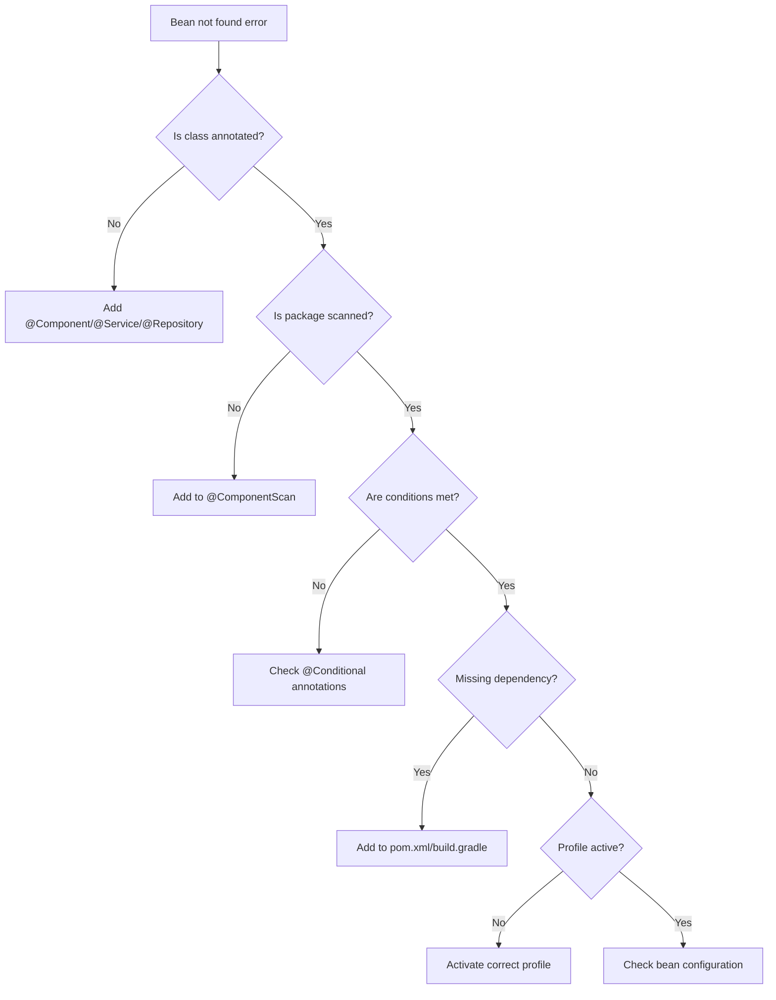

# How to Fix 'Bean of type not found' Errors

Author: [nawazdhandala](https://github.com/nawazdhandala)

Tags: Java, Spring Boot, Dependency Injection, Debugging, Configuration, Backend

Description: Learn how to diagnose and resolve 'Bean of type not found' errors in Spring Boot with systematic debugging approaches and common solutions.

---

"Bean of type not found" is a frustrating error that stops your Spring Boot application from starting. This error occurs when Spring's dependency injection container cannot find a bean that another component needs. This guide provides a systematic approach to diagnosing and fixing these issues.

## Understanding the Error

The full error message typically looks like this:

```
***************************
APPLICATION FAILED TO START
***************************

Description:

Parameter 0 of constructor in com.example.service.UserService required a bean of type
'com.example.repository.UserRepository' that could not be found.

Action:

Consider defining a bean of type 'com.example.repository.UserRepository' in your configuration.
```

## Systematic Debugging Approach



## Common Causes and Solutions

### 1. Missing Stereotype Annotation

```java
// Problem: No annotation
public class UserService {
    private final UserRepository userRepository;

    public UserService(UserRepository userRepository) {
        this.userRepository = userRepository;
    }
}

// Solution: Add @Service
@Service
public class UserService {
    private final UserRepository userRepository;

    public UserService(UserRepository userRepository) {
        this.userRepository = userRepository;
    }
}
```

### 2. Package Not Being Scanned

```java
// Main application in com.example.app
package com.example.app;

@SpringBootApplication
public class Application {
    public static void main(String[] args) {
        SpringApplication.run(Application.class, args);
    }
}

// Bean in different root package - won't be found
package com.other.services;

@Service
public class ExternalService {
}
```

**Solution: Expand component scan**

```java
@SpringBootApplication
@ComponentScan(basePackages = {"com.example.app", "com.other.services"})
public class Application {
    public static void main(String[] args) {
        SpringApplication.run(Application.class, args);
    }
}
```

### 3. Missing Auto-Configuration Dependency

```java
// Using JPA repository
public interface UserRepository extends JpaRepository<User, Long> {
}
```

**Solution: Add the correct starter**

```xml
<!-- Add Spring Data JPA starter -->
<dependency>
    <groupId>org.springframework.boot</groupId>
    <artifactId>spring-boot-starter-data-jpa</artifactId>
</dependency>

<!-- Don't forget the database driver -->
<dependency>
    <groupId>org.postgresql</groupId>
    <artifactId>postgresql</artifactId>
    <scope>runtime</scope>
</dependency>
```

### 4. Conditional Bean Not Created

```java
@Service
@ConditionalOnProperty(name = "feature.new-payment", havingValue = "true")
public class NewPaymentService implements PaymentService {
}
```

**Solution: Set the required property**

```properties
# application.properties
feature.new-payment=true
```

Or make condition optional:

```java
@Service
@ConditionalOnProperty(
    name = "feature.new-payment",
    havingValue = "true",
    matchIfMissing = true  // Default to true if not set
)
public class NewPaymentService implements PaymentService {
}
```

### 5. Profile-Specific Bean Not Active

```java
@Service
@Profile("production")
public class ProductionEmailService implements EmailService {
}

@Service
@Profile("development")
public class MockEmailService implements EmailService {
}
```

**Solution: Activate the correct profile**

```properties
# application.properties
spring.profiles.active=production
```

Or via command line:

```bash
java -jar app.jar --spring.profiles.active=production
```

### 6. Interface Without Implementation

```java
// Interface defined but no implementation
public interface NotificationService {
    void send(String message);
}

// Service expects implementation to exist
@Service
public class AlertService {
    private final NotificationService notificationService;  // No bean found!

    public AlertService(NotificationService notificationService) {
        this.notificationService = notificationService;
    }
}
```

**Solution: Create an implementation**

```java
@Service
public class EmailNotificationService implements NotificationService {
    @Override
    public void send(String message) {
        // Implementation
    }
}
```

### 7. Configuration Class Missing @Configuration

```java
// Problem: Missing @Configuration
public class AppConfig {

    @Bean
    public RestTemplate restTemplate() {
        return new RestTemplate();
    }
}

// Solution: Add @Configuration
@Configuration
public class AppConfig {

    @Bean
    public RestTemplate restTemplate() {
        return new RestTemplate();
    }
}
```

## Debugging Techniques

### Enable Debug Logging

```properties
# application.properties
logging.level.org.springframework.beans.factory=DEBUG
logging.level.org.springframework.context.annotation=DEBUG
```

### List All Registered Beans

```java
@Component
public class BeanInspector implements CommandLineRunner {

    @Autowired
    private ApplicationContext ctx;

    @Override
    public void run(String... args) {
        System.out.println("=== Registered Beans ===");

        String[] beanNames = ctx.getBeanDefinitionNames();
        Arrays.sort(beanNames);

        for (String beanName : beanNames) {
            System.out.println(beanName);
        }
    }
}
```

### Check for Specific Bean Type

```java
@Component
public class BeanTypeChecker implements CommandLineRunner {

    @Autowired
    private ApplicationContext ctx;

    @Override
    public void run(String... args) {
        // Check if any beans of type exist
        Map<String, UserRepository> repos =
            ctx.getBeansOfType(UserRepository.class);

        if (repos.isEmpty()) {
            System.out.println("No UserRepository beans found!");
        } else {
            repos.forEach((name, bean) ->
                System.out.println("Found: " + name + " = " + bean.getClass()));
        }
    }
}
```

### Inspect Auto-Configuration Report

```properties
# application.properties
debug=true
```

This prints a report showing:
- Positive matches (auto-configurations that were applied)
- Negative matches (auto-configurations that were not applied and why)

## Handling Optional Dependencies

When a bean might not exist:

```java
@Service
public class NotificationService {

    // Option 1: Optional injection
    private final Optional<SmsService> smsService;

    public NotificationService(Optional<SmsService> smsService) {
        this.smsService = smsService;
    }

    public void notify(String message) {
        smsService.ifPresent(service -> service.send(message));
    }
}

// Option 2: @Autowired(required = false)
@Service
public class NotificationService {

    @Autowired(required = false)
    private SmsService smsService;

    public void notify(String message) {
        if (smsService != null) {
            smsService.send(message);
        }
    }
}

// Option 3: ObjectProvider for lazy resolution
@Service
public class NotificationService {

    private final ObjectProvider<SmsService> smsServiceProvider;

    public NotificationService(ObjectProvider<SmsService> smsServiceProvider) {
        this.smsServiceProvider = smsServiceProvider;
    }

    public void notify(String message) {
        SmsService sms = smsServiceProvider.getIfAvailable();
        if (sms != null) {
            sms.send(message);
        }
    }
}
```

## Test Context Issues

### Missing Mock Bean

```java
// Problem: Test context missing bean
@SpringBootTest
class UserServiceTest {

    @Autowired
    private UserService userService;  // Fails - needs UserRepository
}

// Solution: Mock the dependency
@SpringBootTest
class UserServiceTest {

    @MockBean
    private UserRepository userRepository;

    @Autowired
    private UserService userService;

    @Test
    void testFindUser() {
        when(userRepository.findById(1L))
            .thenReturn(Optional.of(new User()));

        User user = userService.findById(1L);
        assertThat(user).isNotNull();
    }
}
```

### Slice Test Missing Configuration

```java
// Problem: @WebMvcTest doesn't load services
@WebMvcTest(UserController.class)
class UserControllerTest {

    @Autowired
    private MockMvc mockMvc;

    // UserService is not loaded by @WebMvcTest
    // Need to mock it
    @MockBean
    private UserService userService;
}
```

## Multiple Beans of Same Type

```java
// Problem: Multiple implementations, Spring can't choose
@Service
public class StripePaymentService implements PaymentService { }

@Service
public class PayPalPaymentService implements PaymentService { }

// Consumer - which one to inject?
@Service
public class OrderService {
    private final PaymentService paymentService;  // Ambiguous!
}
```

**Solution 1: Use @Primary**

```java
@Service
@Primary
public class StripePaymentService implements PaymentService { }
```

**Solution 2: Use @Qualifier**

```java
@Service
public class OrderService {
    private final PaymentService paymentService;

    public OrderService(@Qualifier("stripePaymentService") PaymentService paymentService) {
        this.paymentService = paymentService;
    }
}
```

**Solution 3: Name-based matching**

```java
@Service
public class OrderService {
    private final PaymentService stripePaymentService;  // Matches bean name

    public OrderService(PaymentService stripePaymentService) {
        this.stripePaymentService = stripePaymentService;
    }
}
```

## Checklist for "Bean not found" Errors

| Check | What to Look For |
|-------|------------------|
| Annotation | @Component, @Service, @Repository, @Controller present? |
| Package | Under main application package or explicitly scanned? |
| Dependency | Required starter/library in pom.xml? |
| Condition | @ConditionalOn* requirements met? |
| Profile | Correct @Profile active? |
| Configuration | @Configuration class has @Configuration? |
| Interface | Implementation class exists and is annotated? |
| Test | @MockBean for dependencies in test context? |

## Summary

"Bean of type not found" errors always have a logical cause. Start with the basics - check annotations and package locations. Then verify that auto-configuration dependencies are present and conditions are met. When all else fails, enable debug logging to see exactly what Spring is doing during startup. The error message itself often provides the best clue about what to check first.
