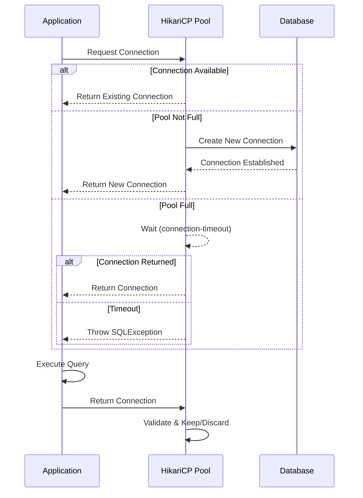

# How to Configure Connection Pooling in Spring Boot

Author: [nawazdhandala](https://github.com/nawazdhandala)

Tags: Java, Spring Boot, Database, HikariCP, Performance, Backend

Description: Learn how to configure and optimize database connection pooling in Spring Boot using HikariCP with practical examples for production environments.

---

Database connection pooling is essential for any production Spring Boot application. Creating a new database connection for every request is expensive - it involves TCP handshakes, authentication, and resource allocation. Connection pooling maintains a cache of database connections that can be reused, dramatically improving performance and reducing database load.

## Why Connection Pooling Matters

| Without Pooling | With Pooling |
|-----------------|--------------|
| New connection per request | Reuse existing connections |
| 50-100ms connection overhead | Sub-millisecond connection acquisition |
| Database connection exhaustion | Controlled connection limits |
| Resource waste | Efficient resource utilization |

## HikariCP - The Default Pool

Spring Boot 2.x and later uses HikariCP as the default connection pool. It's known for its performance, reliability, and sensible defaults.

### Basic Configuration

```properties
# application.properties
spring.datasource.url=jdbc:postgresql://localhost:5432/mydb
spring.datasource.username=myuser
spring.datasource.password=mypassword
spring.datasource.driver-class-name=org.postgresql.Driver

# HikariCP settings
spring.datasource.hikari.pool-name=MyAppPool
spring.datasource.hikari.maximum-pool-size=10
spring.datasource.hikari.minimum-idle=5
spring.datasource.hikari.idle-timeout=300000
spring.datasource.hikari.connection-timeout=20000
spring.datasource.hikari.max-lifetime=1200000
```

### YAML Configuration

```yaml
spring:
  datasource:
    url: jdbc:postgresql://localhost:5432/mydb
    username: myuser
    password: mypassword
    driver-class-name: org.postgresql.Driver
    hikari:
      pool-name: MyAppPool
      maximum-pool-size: 10
      minimum-idle: 5
      idle-timeout: 300000
      connection-timeout: 20000
      max-lifetime: 1200000
      leak-detection-threshold: 60000
```

## Understanding Pool Parameters

### Pool Size Settings

```java
@Configuration
public class DataSourceConfig {

    @Bean
    @ConfigurationProperties("spring.datasource.hikari")
    public HikariDataSource dataSource() {
        HikariDataSource ds = new HikariDataSource();

        // Maximum connections in the pool
        // Rule of thumb: connections = (core_count * 2) + effective_spindle_count
        ds.setMaximumPoolSize(10);

        // Minimum idle connections to maintain
        // Set equal to maximumPoolSize for consistent performance
        ds.setMinimumIdle(10);

        return ds;
    }
}
```

### Timeout Settings

```properties
# How long to wait for a connection from the pool (ms)
# If exceeded, SQLException is thrown
spring.datasource.hikari.connection-timeout=30000

# How long a connection can sit idle before being removed (ms)
# Only applies when minimumIdle < maximumPoolSize
spring.datasource.hikari.idle-timeout=600000

# Maximum lifetime of a connection in the pool (ms)
# Should be several minutes shorter than database timeout
spring.datasource.hikari.max-lifetime=1800000

# How often to validate idle connections (ms)
spring.datasource.hikari.keepalive-time=300000
```

## Connection Pool Flow



## Production Configuration

### Recommended Settings for Production

```properties
# application-production.properties

# Pool identification
spring.datasource.hikari.pool-name=ProdPool

# Pool sizing - adjust based on your workload
spring.datasource.hikari.maximum-pool-size=20
spring.datasource.hikari.minimum-idle=20

# Timeouts
spring.datasource.hikari.connection-timeout=30000
spring.datasource.hikari.idle-timeout=600000
spring.datasource.hikari.max-lifetime=1800000
spring.datasource.hikari.keepalive-time=300000

# Leak detection - set to expected max query time
spring.datasource.hikari.leak-detection-threshold=60000

# Connection validation
spring.datasource.hikari.connection-test-query=SELECT 1

# Auto-commit behavior
spring.datasource.hikari.auto-commit=true

# Transaction isolation
spring.datasource.hikari.transaction-isolation=TRANSACTION_READ_COMMITTED
```

### Programmatic Configuration

```java
@Configuration
public class HikariConfig {

    @Value("${app.db.pool.size:10}")
    private int poolSize;

    @Bean
    public DataSource dataSource() {
        HikariConfig config = new HikariConfig();

        // Connection settings
        config.setJdbcUrl("jdbc:postgresql://localhost:5432/mydb");
        config.setUsername("myuser");
        config.setPassword("mypassword");
        config.setDriverClassName("org.postgresql.Driver");

        // Pool settings
        config.setPoolName("MyAppPool");
        config.setMaximumPoolSize(poolSize);
        config.setMinimumIdle(poolSize);

        // Timeouts
        config.setConnectionTimeout(30000);
        config.setIdleTimeout(600000);
        config.setMaxLifetime(1800000);
        config.setKeepaliveTime(300000);

        // Leak detection
        config.setLeakDetectionThreshold(60000);

        // PostgreSQL specific optimizations
        config.addDataSourceProperty("cachePrepStmts", "true");
        config.addDataSourceProperty("prepStmtCacheSize", "250");
        config.addDataSourceProperty("prepStmtCacheSqlLimit", "2048");
        config.addDataSourceProperty("useServerPrepStmts", "true");

        return new HikariDataSource(config);
    }
}
```

## Monitoring Connection Pool

### JMX Metrics

```properties
# Enable JMX monitoring
spring.datasource.hikari.register-mbeans=true
```

### Programmatic Monitoring

```java
@Component
public class PoolMetricsCollector {

    @Autowired
    private DataSource dataSource;

    @Scheduled(fixedRate = 60000)
    public void logPoolMetrics() {
        if (dataSource instanceof HikariDataSource) {
            HikariDataSource hikariDS = (HikariDataSource) dataSource;
            HikariPoolMXBean poolMXBean = hikariDS.getHikariPoolMXBean();

            log.info("Pool Stats - Active: {}, Idle: {}, Waiting: {}, Total: {}",
                poolMXBean.getActiveConnections(),
                poolMXBean.getIdleConnections(),
                poolMXBean.getThreadsAwaitingConnection(),
                poolMXBean.getTotalConnections());
        }
    }
}
```

### Micrometer Integration

```java
@Configuration
public class MetricsConfig {

    @Bean
    public MeterBinder hikariMetrics(DataSource dataSource) {
        if (dataSource instanceof HikariDataSource) {
            return new HikariDataSourceMetrics((HikariDataSource) dataSource);
        }
        return registry -> {};
    }
}
```

Available metrics:
- `hikaricp_connections_active` - Active connections
- `hikaricp_connections_idle` - Idle connections
- `hikaricp_connections_pending` - Threads waiting for connection
- `hikaricp_connections_timeout_total` - Connection timeout count
- `hikaricp_connections_acquire_seconds` - Connection acquisition time

## Pool Size Calculation

The optimal pool size depends on your workload and database capabilities.

### Formula for OLTP Workloads

```
connections = ((core_count * 2) + effective_spindle_count)
```

For an 8-core server with SSD:
```
connections = (8 * 2) + 1 = 17
```

### Consider These Factors

```java
@Configuration
public class DynamicPoolConfig {

    @Bean
    public DataSource dataSource() {
        int cores = Runtime.getRuntime().availableProcessors();

        // Base calculation
        int poolSize = (cores * 2) + 1;

        // Adjust for your specific workload
        // - Heavy read workload: can increase
        // - Many microservices sharing DB: decrease per service
        // - Long-running transactions: increase

        HikariConfig config = new HikariConfig();
        config.setMaximumPoolSize(Math.min(poolSize, 20));  // Cap at 20
        config.setMinimumIdle(Math.min(poolSize, 20));

        // ... other configuration

        return new HikariDataSource(config);
    }
}
```

## Handling Connection Failures

### Retry Configuration

```java
@Configuration
public class ResilientDataSourceConfig {

    @Bean
    public DataSource dataSource() {
        HikariConfig config = new HikariConfig();

        // ... connection settings

        // Initialization failure handling
        config.setInitializationFailTimeout(60000);  // Retry for 60 seconds

        // Connection validation
        config.setConnectionTestQuery("SELECT 1");
        config.setValidationTimeout(5000);

        return new HikariDataSource(config);
    }
}
```

### Health Check Endpoint

```java
@Component
public class DatabaseHealthIndicator implements HealthIndicator {

    @Autowired
    private DataSource dataSource;

    @Override
    public Health health() {
        try (Connection conn = dataSource.getConnection()) {
            if (conn.isValid(5)) {
                if (dataSource instanceof HikariDataSource) {
                    HikariDataSource hikari = (HikariDataSource) dataSource;
                    HikariPoolMXBean pool = hikari.getHikariPoolMXBean();

                    return Health.up()
                        .withDetail("pool", hikari.getPoolName())
                        .withDetail("activeConnections", pool.getActiveConnections())
                        .withDetail("idleConnections", pool.getIdleConnections())
                        .withDetail("totalConnections", pool.getTotalConnections())
                        .withDetail("threadsWaiting", pool.getThreadsAwaitingConnection())
                        .build();
                }
                return Health.up().build();
            }
        } catch (SQLException e) {
            return Health.down()
                .withException(e)
                .build();
        }
        return Health.down().build();
    }
}
```

## Common Issues and Solutions

### Connection Leaks

```properties
# Enable leak detection - set to max expected query time
spring.datasource.hikari.leak-detection-threshold=60000
```

This logs a warning when a connection is held longer than the threshold:

```
WARN  - Connection leak detection triggered for connection
```

### Pool Exhaustion

Symptoms: `SQLTransientConnectionException: Connection is not available`

Solutions:
1. Increase pool size
2. Reduce query execution time
3. Add connection timeout handling

```java
@Service
public class ResilientService {

    @Autowired
    private JdbcTemplate jdbcTemplate;

    public Optional<User> findUser(Long id) {
        try {
            return Optional.ofNullable(
                jdbcTemplate.queryForObject(
                    "SELECT * FROM users WHERE id = ?",
                    new UserRowMapper(),
                    id
                )
            );
        } catch (DataAccessResourceFailureException e) {
            log.error("Connection pool exhausted, returning empty", e);
            return Optional.empty();
        }
    }
}
```

## Summary

| Setting | Recommended Value | Purpose |
|---------|-------------------|---------|
| maximum-pool-size | cores * 2 + 1 | Max connections |
| minimum-idle | Same as max | Consistent performance |
| connection-timeout | 30000ms | Wait time for connection |
| idle-timeout | 600000ms | Remove idle connections |
| max-lifetime | 1800000ms | Force connection refresh |
| leak-detection-threshold | 60000ms | Detect connection leaks |

Properly configured connection pooling is crucial for application performance. Start with sensible defaults, monitor your metrics, and adjust based on actual usage patterns. Remember that more connections isn't always better - an oversized pool can actually hurt database performance.
