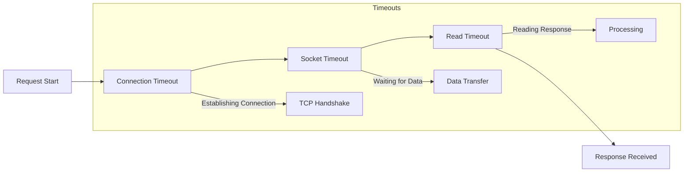

# How to Configure Connection Timeout in Spring Boot

Author: [nawazdhandala](https://www.github.com/nawazdhandala)

Tags: Java, Spring Boot, Timeout, HTTP Client, RestTemplate, WebClient, Performance

Description: Learn how to configure connection timeouts in Spring Boot for HTTP clients, database connections, and external services. This guide covers RestTemplate, WebClient, connection pools, and best practices for timeout management.

---

> Proper timeout configuration is crucial for building resilient applications. Without timeouts, your application can hang indefinitely waiting for unresponsive services. This guide covers comprehensive timeout configuration for Spring Boot applications.

Timeouts protect your application from cascading failures and resource exhaustion. Let's explore how to configure them properly across different components.

---

## Timeout Types



| Timeout Type | Description | Typical Value |
|-------------|-------------|---------------|
| Connection Timeout | Time to establish TCP connection | 5-10 seconds |
| Socket Timeout | Time between data packets | 30-60 seconds |
| Read Timeout | Total time to read response | 30-60 seconds |
| Write Timeout | Total time to send request | 30-60 seconds |

---

## RestTemplate Configuration

### Basic RestTemplate with Timeouts

```java
package com.example.config;

import org.springframework.boot.web.client.RestTemplateBuilder;
import org.springframework.context.annotation.Bean;
import org.springframework.context.annotation.Configuration;
import org.springframework.web.client.RestTemplate;

import java.time.Duration;

@Configuration
public class RestTemplateConfig {

    @Bean
    public RestTemplate restTemplate(RestTemplateBuilder builder) {
        return builder
            .setConnectTimeout(Duration.ofSeconds(5))
            .setReadTimeout(Duration.ofSeconds(30))
            .build();
    }
}
```

### Advanced Configuration with HttpComponentsClientHttpRequestFactory

```java
package com.example.config;

import org.apache.hc.client5.http.config.RequestConfig;
import org.apache.hc.client5.http.impl.classic.CloseableHttpClient;
import org.apache.hc.client5.http.impl.classic.HttpClients;
import org.apache.hc.client5.http.impl.io.PoolingHttpClientConnectionManager;
import org.apache.hc.core5.util.Timeout;
import org.springframework.context.annotation.Bean;
import org.springframework.context.annotation.Configuration;
import org.springframework.http.client.HttpComponentsClientHttpRequestFactory;
import org.springframework.web.client.RestTemplate;

@Configuration
public class HttpClientConfig {

    @Bean
    public RestTemplate restTemplate() {
        // Connection pool configuration
        PoolingHttpClientConnectionManager connectionManager =
            new PoolingHttpClientConnectionManager();
        connectionManager.setMaxTotal(100);
        connectionManager.setDefaultMaxPerRoute(20);

        // Request configuration
        RequestConfig requestConfig = RequestConfig.custom()
            .setConnectionRequestTimeout(Timeout.ofSeconds(5))
            .setResponseTimeout(Timeout.ofSeconds(30))
            .build();

        // Build HTTP client
        CloseableHttpClient httpClient = HttpClients.custom()
            .setConnectionManager(connectionManager)
            .setDefaultRequestConfig(requestConfig)
            .build();

        HttpComponentsClientHttpRequestFactory factory =
            new HttpComponentsClientHttpRequestFactory(httpClient);

        return new RestTemplate(factory);
    }
}
```

---

## WebClient Configuration

### Basic WebClient with Timeouts

```java
package com.example.config;

import io.netty.channel.ChannelOption;
import io.netty.handler.timeout.ReadTimeoutHandler;
import io.netty.handler.timeout.WriteTimeoutHandler;
import org.springframework.context.annotation.Bean;
import org.springframework.context.annotation.Configuration;
import org.springframework.http.client.reactive.ReactorClientHttpConnector;
import org.springframework.web.reactive.function.client.WebClient;
import reactor.netty.http.client.HttpClient;

import java.time.Duration;
import java.util.concurrent.TimeUnit;

@Configuration
public class WebClientConfig {

    @Bean
    public WebClient webClient() {
        HttpClient httpClient = HttpClient.create()
            .option(ChannelOption.CONNECT_TIMEOUT_MILLIS, 5000)
            .responseTimeout(Duration.ofSeconds(30))
            .doOnConnected(conn -> conn
                .addHandlerLast(new ReadTimeoutHandler(30, TimeUnit.SECONDS))
                .addHandlerLast(new WriteTimeoutHandler(30, TimeUnit.SECONDS))
            );

        return WebClient.builder()
            .clientConnector(new ReactorClientHttpConnector(httpClient))
            .build();
    }
}
```

### WebClient with Connection Pool

```java
package com.example.config;

import io.netty.channel.ChannelOption;
import org.springframework.context.annotation.Bean;
import org.springframework.context.annotation.Configuration;
import org.springframework.http.client.reactive.ReactorClientHttpConnector;
import org.springframework.web.reactive.function.client.WebClient;
import reactor.netty.http.client.HttpClient;
import reactor.netty.resources.ConnectionProvider;

import java.time.Duration;

@Configuration
public class WebClientPoolConfig {

    @Bean
    public WebClient webClient() {
        ConnectionProvider provider = ConnectionProvider.builder("custom")
            .maxConnections(100)
            .maxIdleTime(Duration.ofSeconds(30))
            .maxLifeTime(Duration.ofMinutes(5))
            .pendingAcquireTimeout(Duration.ofSeconds(60))
            .evictInBackground(Duration.ofSeconds(120))
            .build();

        HttpClient httpClient = HttpClient.create(provider)
            .option(ChannelOption.CONNECT_TIMEOUT_MILLIS, 5000)
            .responseTimeout(Duration.ofSeconds(30));

        return WebClient.builder()
            .clientConnector(new ReactorClientHttpConnector(httpClient))
            .build();
    }
}
```

### Per-Request Timeout

```java
@Service
@RequiredArgsConstructor
public class ApiService {

    private final WebClient webClient;

    public Mono<String> fetchWithTimeout(String url) {
        return webClient.get()
            .uri(url)
            .retrieve()
            .bodyToMono(String.class)
            .timeout(Duration.ofSeconds(10))
            .onErrorResume(TimeoutException.class, e -> {
                log.error("Request timed out: {}", url);
                return Mono.just("Fallback response");
            });
    }
}
```

---

## Database Connection Timeouts

### HikariCP Configuration

```yaml
spring:
  datasource:
    hikari:
      connection-timeout: 30000       # 30 seconds to get connection from pool
      validation-timeout: 5000        # 5 seconds to validate connection
      idle-timeout: 600000            # 10 minutes idle before removal
      max-lifetime: 1800000           # 30 minutes max connection lifetime
      minimum-idle: 5
      maximum-pool-size: 20
      leak-detection-threshold: 60000 # Log warning if connection held > 1 minute

      # Database-specific settings
      data-source-properties:
        socketTimeout: 30000
        connectTimeout: 5000
```

### JPA/Hibernate Query Timeout

```yaml
spring:
  jpa:
    properties:
      hibernate:
        jdbc:
          # Default query timeout in seconds
          batch_size: 20
        query:
          timeout: 30
```

### Setting Query Timeout Programmatically

```java
@Repository
public interface UserRepository extends JpaRepository<User, Long> {

    @QueryHints(@QueryHint(name = "jakarta.persistence.query.timeout", value = "5000"))
    List<User> findByStatus(String status);
}

// Or in service layer
@Service
public class UserService {

    @PersistenceContext
    private EntityManager entityManager;

    public List<User> findUsersWithTimeout() {
        return entityManager.createQuery("SELECT u FROM User u", User.class)
            .setHint("jakarta.persistence.query.timeout", 5000)
            .getResultList();
    }
}
```

---

## Feign Client Timeouts

### Application Properties

```yaml
spring:
  cloud:
    openfeign:
      client:
        config:
          default:
            connectTimeout: 5000
            readTimeout: 30000
            loggerLevel: full
          # Service-specific configuration
          user-service:
            connectTimeout: 3000
            readTimeout: 10000
```

### Programmatic Configuration

```java
package com.example.config;

import feign.Request;
import org.springframework.context.annotation.Bean;
import org.springframework.context.annotation.Configuration;

import java.util.concurrent.TimeUnit;

@Configuration
public class FeignConfig {

    @Bean
    public Request.Options requestOptions() {
        return new Request.Options(
            5, TimeUnit.SECONDS,    // connectTimeout
            30, TimeUnit.SECONDS,   // readTimeout
            true                     // followRedirects
        );
    }
}
```

---

## Redis Connection Timeout

### Lettuce (Default) Configuration

```yaml
spring:
  data:
    redis:
      host: localhost
      port: 6379
      timeout: 5000ms
      connect-timeout: 5000ms
      lettuce:
        pool:
          max-active: 8
          max-idle: 8
          min-idle: 0
          max-wait: 5000ms
        shutdown-timeout: 100ms
```

### Programmatic Configuration

```java
package com.example.config;

import io.lettuce.core.ClientOptions;
import io.lettuce.core.SocketOptions;
import org.springframework.context.annotation.Bean;
import org.springframework.context.annotation.Configuration;
import org.springframework.data.redis.connection.RedisStandaloneConfiguration;
import org.springframework.data.redis.connection.lettuce.LettuceClientConfiguration;
import org.springframework.data.redis.connection.lettuce.LettuceConnectionFactory;

import java.time.Duration;

@Configuration
public class RedisConfig {

    @Bean
    public LettuceConnectionFactory redisConnectionFactory() {
        RedisStandaloneConfiguration serverConfig = new RedisStandaloneConfiguration();
        serverConfig.setHostName("localhost");
        serverConfig.setPort(6379);

        SocketOptions socketOptions = SocketOptions.builder()
            .connectTimeout(Duration.ofSeconds(5))
            .build();

        ClientOptions clientOptions = ClientOptions.builder()
            .socketOptions(socketOptions)
            .build();

        LettuceClientConfiguration clientConfig = LettuceClientConfiguration.builder()
            .commandTimeout(Duration.ofSeconds(5))
            .clientOptions(clientOptions)
            .build();

        return new LettuceConnectionFactory(serverConfig, clientConfig);
    }
}
```

---

## Embedded Server Timeouts

### Tomcat Configuration

```yaml
server:
  tomcat:
    connection-timeout: 20000      # Connection timeout in milliseconds
    keep-alive-timeout: 30000      # Keep-alive timeout
    max-connections: 8192
    threads:
      max: 200
      min-spare: 10
```

### Programmatic Configuration

```java
package com.example.config;

import org.springframework.boot.web.embedded.tomcat.TomcatServletWebServerFactory;
import org.springframework.boot.web.server.WebServerFactoryCustomizer;
import org.springframework.context.annotation.Bean;
import org.springframework.context.annotation.Configuration;

@Configuration
public class TomcatConfig {

    @Bean
    public WebServerFactoryCustomizer<TomcatServletWebServerFactory> tomcatCustomizer() {
        return factory -> {
            factory.addConnectorCustomizers(connector -> {
                connector.setProperty("connectionTimeout", "20000");
                connector.setProperty("keepAliveTimeout", "30000");
                connector.setProperty("maxKeepAliveRequests", "100");
            });
        };
    }
}
```

---

## Async Request Timeout

### Configure Async Support

```java
package com.example.config;

import org.springframework.context.annotation.Configuration;
import org.springframework.web.servlet.config.annotation.AsyncSupportConfigurer;
import org.springframework.web.servlet.config.annotation.WebMvcConfigurer;

@Configuration
public class AsyncConfig implements WebMvcConfigurer {

    @Override
    public void configureAsyncSupport(AsyncSupportConfigurer configurer) {
        configurer.setDefaultTimeout(30000); // 30 seconds
    }
}
```

### Controller with Timeout

```java
@RestController
public class AsyncController {

    @GetMapping("/async")
    public DeferredResult<String> asyncEndpoint() {
        DeferredResult<String> result = new DeferredResult<>(5000L, "Timeout!");

        result.onTimeout(() -> {
            log.warn("Request timed out");
        });

        CompletableFuture.supplyAsync(() -> {
            // Long running operation
            return "Result";
        }).thenAccept(result::setResult);

        return result;
    }
}
```

---

## Circuit Breaker with Timeout

### Resilience4j Configuration

```yaml
resilience4j:
  circuitbreaker:
    instances:
      externalService:
        register-health-indicator: true
        sliding-window-size: 10
        failure-rate-threshold: 50
        wait-duration-in-open-state: 10000
        permitted-number-of-calls-in-half-open-state: 3

  timelimiter:
    instances:
      externalService:
        timeout-duration: 5s
        cancel-running-future: true
```

### Using Circuit Breaker with Timeout

```java
@Service
@RequiredArgsConstructor
public class ExternalApiService {

    private final WebClient webClient;
    private final CircuitBreakerRegistry circuitBreakerRegistry;
    private final TimeLimiterRegistry timeLimiterRegistry;

    public Mono<String> callExternalService() {
        CircuitBreaker circuitBreaker = circuitBreakerRegistry
            .circuitBreaker("externalService");
        TimeLimiter timeLimiter = timeLimiterRegistry
            .timeLimiter("externalService");

        return webClient.get()
            .uri("https://external-api.com/data")
            .retrieve()
            .bodyToMono(String.class)
            .transformDeferred(CircuitBreakerOperator.of(circuitBreaker))
            .transformDeferred(TimeLimiterOperator.of(timeLimiter))
            .onErrorResume(TimeoutException.class, e -> {
                log.error("Timeout calling external service");
                return Mono.just("Fallback response");
            })
            .onErrorResume(CallNotPermittedException.class, e -> {
                log.error("Circuit breaker open");
                return Mono.just("Service unavailable");
            });
    }
}
```

---

## Custom Timeout Handling

### Timeout Exception Handler

```java
package com.example.exception;

import lombok.extern.slf4j.Slf4j;
import org.springframework.http.HttpStatus;
import org.springframework.http.ResponseEntity;
import org.springframework.web.bind.annotation.ExceptionHandler;
import org.springframework.web.bind.annotation.RestControllerAdvice;
import org.springframework.web.client.ResourceAccessException;
import org.springframework.web.reactive.function.client.WebClientRequestException;

import java.net.SocketTimeoutException;
import java.time.Instant;
import java.util.Map;
import java.util.concurrent.TimeoutException;

@RestControllerAdvice
@Slf4j
public class TimeoutExceptionHandler {

    @ExceptionHandler({SocketTimeoutException.class, TimeoutException.class})
    public ResponseEntity<Map<String, Object>> handleTimeout(Exception ex) {
        log.error("Timeout occurred", ex);
        return ResponseEntity.status(HttpStatus.GATEWAY_TIMEOUT).body(Map.of(
            "timestamp", Instant.now(),
            "status", 504,
            "error", "Gateway Timeout",
            "message", "The upstream server did not respond in time"
        ));
    }

    @ExceptionHandler(ResourceAccessException.class)
    public ResponseEntity<Map<String, Object>> handleResourceAccess(ResourceAccessException ex) {
        log.error("Resource access error", ex);
        if (ex.getCause() instanceof SocketTimeoutException) {
            return ResponseEntity.status(HttpStatus.GATEWAY_TIMEOUT).body(Map.of(
                "timestamp", Instant.now(),
                "status", 504,
                "error", "Gateway Timeout",
                "message", "Connection to external service timed out"
            ));
        }
        return ResponseEntity.status(HttpStatus.SERVICE_UNAVAILABLE).body(Map.of(
            "timestamp", Instant.now(),
            "status", 503,
            "error", "Service Unavailable",
            "message", "External service is not available"
        ));
    }
}
```

---

## Best Practices

| Component | Connection Timeout | Read Timeout | Notes |
|-----------|-------------------|--------------|-------|
| RestTemplate | 5s | 30s | Increase for slow endpoints |
| WebClient | 5s | 30s | Use per-request for specific needs |
| Database | 30s | 30s | Match with query complexity |
| Redis | 5s | 5s | Should be fast |
| Feign | 5s | 30s | Consider service SLAs |

### Guidelines

1. **Set Timeouts for Everything** - Never rely on defaults
2. **Connection < Read** - Connection should be faster
3. **Monitor Timeouts** - Track and alert on timeout rates
4. **Use Circuit Breakers** - Prevent cascading failures
5. **Document SLAs** - Know expected response times

---

## Conclusion

Proper timeout configuration is essential for resilient applications:

- Configure connection, read, and write timeouts for all HTTP clients
- Set database connection pool timeouts appropriately
- Use circuit breakers for external service calls
- Handle timeout exceptions gracefully
- Monitor and adjust based on actual performance

With these configurations, your Spring Boot application will be more resilient to slow or unresponsive dependencies.

---

*Need to monitor your application's timeout rates? [OneUptime](https://oneuptime.com) provides comprehensive monitoring with timeout tracking and alerting.*
