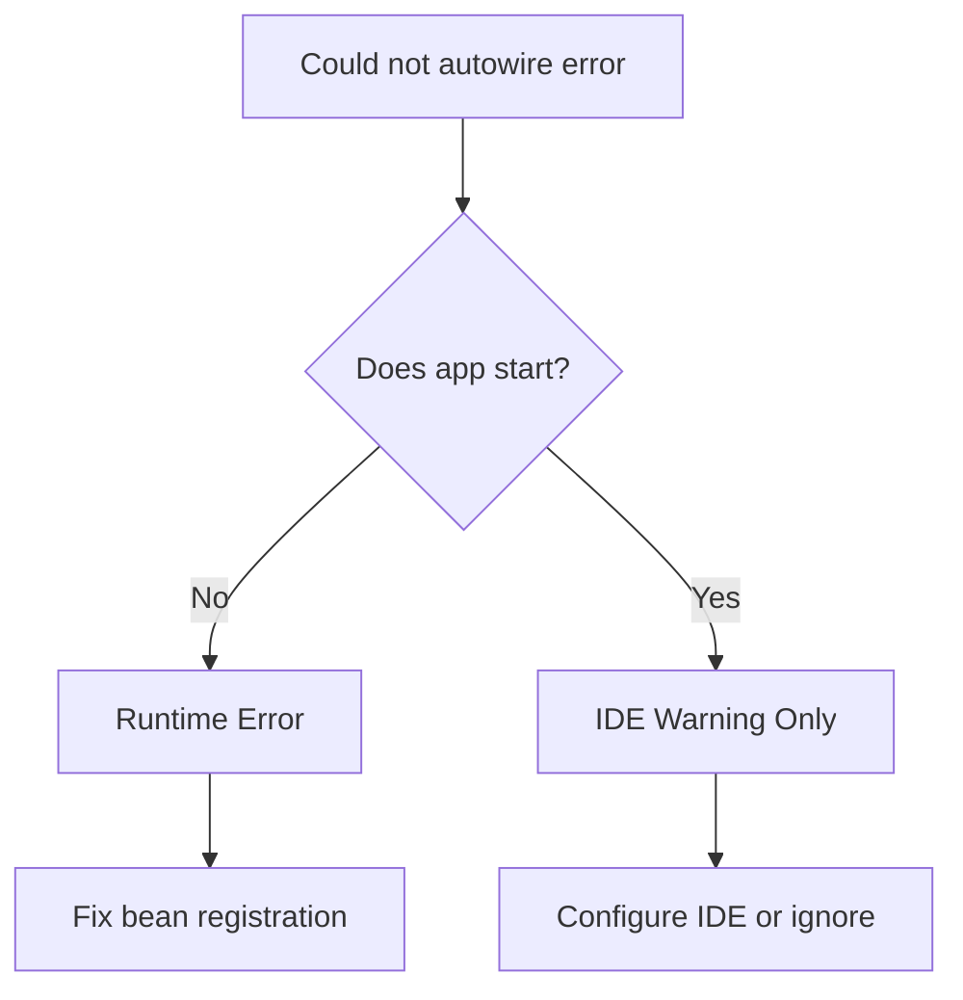

# How to Fix "Could not autowire" Errors in Spring Boot

Author: [nawazdhandala](https://github.com/nawazdhandala)

Tags: Java, Spring Boot, Dependency Injection, Debugging, IDE, Backend

Description: Learn how to diagnose and resolve "Could not autowire" errors in Spring Boot, covering both runtime and IDE-related issues with practical solutions.

---

"Could not autowire" errors come in two flavors: actual runtime errors where Spring cannot inject a dependency, and IDE warnings that appear even when the code works fine. This guide helps you distinguish between them and fix both types.

## Runtime vs IDE Errors



## Runtime "Could not autowire" Errors

When Spring actually cannot find a bean to inject, you'll see errors like:

```
***************************
APPLICATION FAILED TO START
***************************

Description:

Field userRepository in com.example.UserService required a bean of type
'com.example.UserRepository' that could not be found.

Action:

Consider defining a bean of type 'com.example.UserRepository' in your configuration.
```

### Cause 1: Missing Repository Interface Annotation

```java
// Problem: Interface not recognized as a repository
public interface UserRepository extends JpaRepository<User, Long> {
}

// Solution 1: Enable JPA repositories explicitly
@SpringBootApplication
@EnableJpaRepositories(basePackages = "com.example.repository")
public class Application {
    public static void main(String[] args) {
        SpringApplication.run(Application.class, args);
    }
}

// Solution 2: Ensure interface is in scanned package
// Move to package under @SpringBootApplication class
package com.example.app.repository;

public interface UserRepository extends JpaRepository<User, Long> {
}
```

### Cause 2: Missing @Service/@Component Annotation

```java
// Problem: Class not registered as bean
public class EmailService {
    public void sendEmail(String to, String subject, String body) {
        // implementation
    }
}

// Solution: Add appropriate stereotype annotation
@Service
public class EmailService {
    public void sendEmail(String to, String subject, String body) {
        // implementation
    }
}
```

### Cause 3: Component Not in Scan Path

```java
// Main application in com.example.app
@SpringBootApplication
public class MyApplication {
    public static void main(String[] args) {
        SpringApplication.run(MyApplication.class, args);
    }
}

// Problem: Service in different root package
package com.other.services;

@Service
public class ExternalService {
    // This won't be found!
}

// Solution: Add package to component scan
@SpringBootApplication
@ComponentScan(basePackages = {"com.example.app", "com.other.services"})
public class MyApplication {
}
```

### Cause 4: Conditional Bean Not Created

```java
// Problem: Bean depends on missing property
@Service
@ConditionalOnProperty(name = "features.email.enabled", havingValue = "true")
public class EmailService {
}

// Solution: Add the property or make it optional
@Service
@ConditionalOnProperty(name = "features.email.enabled",
                       havingValue = "true",
                       matchIfMissing = true)  // Default to enabled
public class EmailService {
}
```

### Cause 5: Missing Dependency in pom.xml

```xml
<!-- Problem: Using JPA without the starter -->
<dependency>
    <groupId>jakarta.persistence</groupId>
    <artifactId>jakarta.persistence-api</artifactId>
</dependency>

<!-- Solution: Include the full Spring Data JPA starter -->
<dependency>
    <groupId>org.springframework.boot</groupId>
    <artifactId>spring-boot-starter-data-jpa</artifactId>
</dependency>
```

### Cause 6: Interface Without Implementation

```java
// Problem: Interface with no concrete implementation
public interface PaymentGateway {
    void processPayment(Payment payment);
}

@Service
public class OrderService {
    @Autowired
    private PaymentGateway paymentGateway;  // No implementation exists!
}

// Solution: Create an implementation
@Service
public class StripePaymentGateway implements PaymentGateway {
    @Override
    public void processPayment(Payment payment) {
        // Stripe implementation
    }
}
```

## IDE "Could not autowire" Warnings

IntelliJ IDEA and other IDEs sometimes show autowiring warnings even when the code works.

### Common IDE False Positives

```java
// IDE might warn about these even though they work:

// 1. Spring Data repositories
@Autowired
private UserRepository userRepository;  // IDE: "Could not autowire"

// 2. MyBatis mappers
@Autowired
private UserMapper userMapper;  // IDE: "Could not autowire"

// 3. Beans from auto-configuration
@Autowired
private RestTemplate restTemplate;  // IDE: "Could not autowire"
```

### Solution 1: IntelliJ Configuration

Go to **Settings > Editor > Inspections > Spring > Spring Core > Code > Autowiring for Bean Class**

Set severity to "Warning" or disable it.

### Solution 2: Use Constructor Injection

```java
// Field injection - IDE has harder time resolving
@Service
public class UserService {
    @Autowired
    private UserRepository userRepository;  // IDE warning
}

// Constructor injection - IDE resolves better
@Service
public class UserService {
    private final UserRepository userRepository;

    public UserService(UserRepository userRepository) {
        this.userRepository = userRepository;
    }
}
```

### Solution 3: Add @Repository Annotation

```java
// Sometimes explicitly marking helps IDE
@Repository
public interface UserRepository extends JpaRepository<User, Long> {
}
```

### Solution 4: Suppress Warnings (Last Resort)

```java
@Service
public class UserService {

    @SuppressWarnings("SpringJavaInjectionPointsAutowiringInspection")
    @Autowired
    private UserRepository userRepository;
}
```

## Debugging Autowiring Issues

### Step 1: Check Bean Existence

```java
@Component
public class BeanDebugger implements CommandLineRunner {

    @Autowired
    private ApplicationContext context;

    @Override
    public void run(String... args) {
        // Check if specific bean exists
        boolean exists = context.containsBean("userRepository");
        System.out.println("userRepository exists: " + exists);

        // Find all beans of a type
        Map<String, UserRepository> repos =
            context.getBeansOfType(UserRepository.class);
        repos.forEach((name, bean) ->
            System.out.println("Found: " + name + " -> " + bean.getClass()));
    }
}
```

### Step 2: Enable Debug Logging

```properties
# application.properties
logging.level.org.springframework.beans=DEBUG
logging.level.org.springframework.context=DEBUG
```

### Step 3: Check Component Scanning

```java
@Component
public class ScanDebugger implements CommandLineRunner {

    @Autowired
    private ApplicationContext context;

    @Override
    public void run(String... args) {
        // List all bean names
        String[] beanNames = context.getBeanDefinitionNames();
        Arrays.sort(beanNames);

        System.out.println("=== All Beans ===");
        for (String name : beanNames) {
            Object bean = context.getBean(name);
            System.out.println(name + " -> " + bean.getClass().getName());
        }
    }
}
```

## Working with Multiple Implementations

When you have multiple beans of the same type:

```java
public interface NotificationService {
    void send(String message);
}

@Service("emailNotification")
public class EmailNotificationService implements NotificationService {
    public void send(String message) { /* email */ }
}

@Service("smsNotification")
public class SmsNotificationService implements NotificationService {
    public void send(String message) { /* sms */ }
}
```

### Use @Qualifier

```java
@Service
public class AlertService {

    @Autowired
    @Qualifier("emailNotification")
    private NotificationService notificationService;
}
```

### Use @Primary

```java
@Service
@Primary
public class EmailNotificationService implements NotificationService {
    // This will be injected by default
}
```

### Inject All Implementations

```java
@Service
public class AlertService {

    @Autowired
    private List<NotificationService> notificationServices;

    public void alertAll(String message) {
        notificationServices.forEach(service -> service.send(message));
    }
}
```

### Inject by Name

```java
@Service
public class AlertService {

    @Autowired
    private Map<String, NotificationService> notificationServices;

    public void send(String channel, String message) {
        NotificationService service = notificationServices.get(channel + "Notification");
        if (service != null) {
            service.send(message);
        }
    }
}
```

## Common Patterns and Solutions

| Error Pattern | Likely Cause | Solution |
|---------------|--------------|----------|
| Repository not found | Missing JPA starter | Add spring-boot-starter-data-jpa |
| Service not found | Missing annotation | Add @Service or @Component |
| Configuration bean not found | Package not scanned | Add to @ComponentScan |
| Conditional bean not found | Condition not met | Check properties/profiles |
| Test context error | Missing @MockBean | Add mock for dependency |

## Testing Context Issues

```java
// Problem: Service depends on repository not available in test
@SpringBootTest
class UserServiceTest {

    @Autowired
    private UserService userService;  // Fails if UserRepository not mocked

    @Test
    void testMethod() {
    }
}

// Solution: Mock the dependency
@SpringBootTest
class UserServiceTest {

    @MockBean
    private UserRepository userRepository;

    @Autowired
    private UserService userService;  // Now works

    @Test
    void testMethod() {
        when(userRepository.findById(1L))
            .thenReturn(Optional.of(new User()));
        // test
    }
}
```

## Checklist for "Could not autowire" Errors

1. Does the class have @Component, @Service, @Repository, or @Controller?
2. Is the class in a package under @SpringBootApplication?
3. Are all required dependencies in pom.xml/build.gradle?
4. Are conditional annotations (@ConditionalOn*) satisfied?
5. Is the correct profile active?
6. For repositories: Is @EnableJpaRepositories configured if needed?
7. For tests: Are dependencies mocked with @MockBean?

## Summary

"Could not autowire" errors are usually straightforward to fix once you understand Spring's component scanning and bean registration. Runtime errors require fixing bean definitions, while IDE warnings often just need configuration adjustments. When debugging, start by verifying the bean exists in the application context, then trace backward to understand why it wasn't registered.
