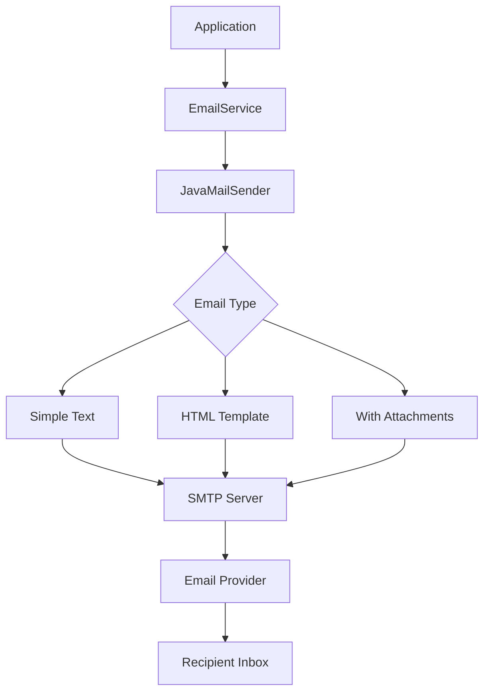

# How to Set Up Email Sending in Spring Boot

Author: [nawazdhandala](https://www.github.com/nawazdhandala)

Tags: Java, Spring Boot, Email, SMTP, JavaMail, Notifications

Description: Learn how to configure and send emails in Spring Boot applications. This guide covers SMTP configuration, HTML templates with Thymeleaf, attachments, async sending, and production best practices for reliable email delivery.

---

> Email communication is essential for user notifications, password resets, and transactional messages. Spring Boot's mail integration with JavaMail makes sending emails straightforward. This guide covers everything from basic setup to production-ready email systems.

Whether you need to send simple text emails or complex HTML newsletters with attachments, Spring Boot provides the tools to implement robust email functionality.

---

## Architecture Overview



---

## Dependencies Setup

Add the mail starter to your `pom.xml`:

```xml
<dependencies>
    <dependency>
        <groupId>org.springframework.boot</groupId>
        <artifactId>spring-boot-starter-mail</artifactId>
    </dependency>
    <!-- For HTML templates -->
    <dependency>
        <groupId>org.springframework.boot</groupId>
        <artifactId>spring-boot-starter-thymeleaf</artifactId>
    </dependency>
</dependencies>
```

---

## SMTP Configuration

### Gmail Configuration

```yaml
spring:
  mail:
    host: smtp.gmail.com
    port: 587
    username: ${GMAIL_USERNAME}
    password: ${GMAIL_APP_PASSWORD}
    properties:
      mail:
        smtp:
          auth: true
          starttls:
            enable: true
            required: true
          connectiontimeout: 5000
          timeout: 5000
          writetimeout: 5000
```

### AWS SES Configuration

```yaml
spring:
  mail:
    host: email-smtp.us-east-1.amazonaws.com
    port: 587
    username: ${AWS_SES_USERNAME}
    password: ${AWS_SES_PASSWORD}
    properties:
      mail:
        smtp:
          auth: true
          starttls:
            enable: true
```

### SendGrid Configuration

```yaml
spring:
  mail:
    host: smtp.sendgrid.net
    port: 587
    username: apikey
    password: ${SENDGRID_API_KEY}
    properties:
      mail:
        smtp:
          auth: true
          starttls:
            enable: true
```

---

## Basic Email Service

```java
package com.example.service;

import lombok.RequiredArgsConstructor;
import lombok.extern.slf4j.Slf4j;
import org.springframework.mail.SimpleMailMessage;
import org.springframework.mail.javamail.JavaMailSender;
import org.springframework.stereotype.Service;

@Service
@RequiredArgsConstructor
@Slf4j
public class EmailService {

    private final JavaMailSender mailSender;

    public void sendSimpleEmail(String to, String subject, String text) {
        SimpleMailMessage message = new SimpleMailMessage();
        message.setFrom("noreply@example.com");
        message.setTo(to);
        message.setSubject(subject);
        message.setText(text);

        try {
            mailSender.send(message);
            log.info("Simple email sent to: {}", to);
        } catch (Exception e) {
            log.error("Failed to send email to: {}", to, e);
            throw new EmailSendException("Failed to send email", e);
        }
    }

    public void sendSimpleEmailWithCc(String to, String[] cc, String subject, String text) {
        SimpleMailMessage message = new SimpleMailMessage();
        message.setFrom("noreply@example.com");
        message.setTo(to);
        message.setCc(cc);
        message.setSubject(subject);
        message.setText(text);

        mailSender.send(message);
        log.info("Email with CC sent to: {}", to);
    }
}
```

---

## HTML Email with Thymeleaf

### Email Template Service

```java
package com.example.service;

import com.example.dto.EmailContext;
import jakarta.mail.MessagingException;
import jakarta.mail.internet.MimeMessage;
import lombok.RequiredArgsConstructor;
import lombok.extern.slf4j.Slf4j;
import org.springframework.mail.javamail.JavaMailSender;
import org.springframework.mail.javamail.MimeMessageHelper;
import org.springframework.stereotype.Service;
import org.thymeleaf.TemplateEngine;
import org.thymeleaf.context.Context;

import java.nio.charset.StandardCharsets;

@Service
@RequiredArgsConstructor
@Slf4j
public class HtmlEmailService {

    private final JavaMailSender mailSender;
    private final TemplateEngine templateEngine;

    public void sendHtmlEmail(EmailContext emailContext) throws MessagingException {
        MimeMessage message = mailSender.createMimeMessage();
        MimeMessageHelper helper = new MimeMessageHelper(
            message,
            MimeMessageHelper.MULTIPART_MODE_MIXED_RELATED,
            StandardCharsets.UTF_8.name()
        );

        // Process template
        Context context = new Context();
        context.setVariables(emailContext.getVariables());
        String html = templateEngine.process(emailContext.getTemplateName(), context);

        helper.setFrom(emailContext.getFrom());
        helper.setTo(emailContext.getTo());
        helper.setSubject(emailContext.getSubject());
        helper.setText(html, true);

        mailSender.send(message);
        log.info("HTML email sent to: {}", emailContext.getTo());
    }
}
```

### Email Context DTO

```java
package com.example.dto;

import lombok.AllArgsConstructor;
import lombok.Builder;
import lombok.Data;
import lombok.NoArgsConstructor;

import java.util.Map;

@Data
@Builder
@NoArgsConstructor
@AllArgsConstructor
public class EmailContext {

    private String from;
    private String to;
    private String subject;
    private String templateName;
    private Map<String, Object> variables;
}
```

### Thymeleaf Email Template

Create `src/main/resources/templates/email/welcome.html`:

```html
<!DOCTYPE html>
<html xmlns:th="http://www.thymeleaf.org">
<head>
    <meta charset="UTF-8">
    <meta name="viewport" content="width=device-width, initial-scale=1.0">
    <title th:text="${subject}">Email</title>
    <style>
        body {
            font-family: Arial, sans-serif;
            line-height: 1.6;
            color: #333;
            max-width: 600px;
            margin: 0 auto;
            padding: 20px;
        }
        .header {
            background-color: #4CAF50;
            color: white;
            padding: 20px;
            text-align: center;
        }
        .content {
            padding: 20px;
            background-color: #f9f9f9;
        }
        .button {
            display: inline-block;
            padding: 12px 24px;
            background-color: #4CAF50;
            color: white;
            text-decoration: none;
            border-radius: 4px;
            margin: 20px 0;
        }
        .footer {
            text-align: center;
            padding: 20px;
            color: #666;
            font-size: 12px;
        }
    </style>
</head>
<body>
    <div class="header">
        <h1>Welcome to Our Platform!</h1>
    </div>
    <div class="content">
        <p>Hello <span th:text="${userName}">User</span>,</p>
        <p>Thank you for registering with us. We're excited to have you on board!</p>
        <p>To get started, please verify your email address by clicking the button below:</p>
        <a th:href="${verificationLink}" class="button">Verify Email</a>
        <p>If the button doesn't work, copy and paste this link into your browser:</p>
        <p th:text="${verificationLink}">https://example.com/verify</p>
        <p>This link will expire in 24 hours.</p>
    </div>
    <div class="footer">
        <p>If you didn't create an account, you can safely ignore this email.</p>
        <p>&copy; 2025 Your Company. All rights reserved.</p>
    </div>
</body>
</html>
```

---

## Email with Attachments

```java
package com.example.service;

import jakarta.mail.MessagingException;
import jakarta.mail.internet.MimeMessage;
import lombok.RequiredArgsConstructor;
import lombok.extern.slf4j.Slf4j;
import org.springframework.core.io.FileSystemResource;
import org.springframework.core.io.Resource;
import org.springframework.mail.javamail.JavaMailSender;
import org.springframework.mail.javamail.MimeMessageHelper;
import org.springframework.stereotype.Service;

import java.io.File;
import java.nio.charset.StandardCharsets;

@Service
@RequiredArgsConstructor
@Slf4j
public class AttachmentEmailService {

    private final JavaMailSender mailSender;

    public void sendEmailWithAttachment(
            String to,
            String subject,
            String text,
            String attachmentPath,
            String attachmentName) throws MessagingException {

        MimeMessage message = mailSender.createMimeMessage();
        MimeMessageHelper helper = new MimeMessageHelper(
            message, true, StandardCharsets.UTF_8.name());

        helper.setFrom("noreply@example.com");
        helper.setTo(to);
        helper.setSubject(subject);
        helper.setText(text);

        FileSystemResource file = new FileSystemResource(new File(attachmentPath));
        helper.addAttachment(attachmentName, file);

        mailSender.send(message);
        log.info("Email with attachment sent to: {}", to);
    }

    public void sendEmailWithMultipleAttachments(
            String to,
            String subject,
            String htmlContent,
            File[] attachments) throws MessagingException {

        MimeMessage message = mailSender.createMimeMessage();
        MimeMessageHelper helper = new MimeMessageHelper(
            message, true, StandardCharsets.UTF_8.name());

        helper.setFrom("noreply@example.com");
        helper.setTo(to);
        helper.setSubject(subject);
        helper.setText(htmlContent, true);

        for (File attachment : attachments) {
            FileSystemResource resource = new FileSystemResource(attachment);
            helper.addAttachment(attachment.getName(), resource);
        }

        mailSender.send(message);
        log.info("Email with {} attachments sent to: {}", attachments.length, to);
    }

    public void sendEmailWithInlineImage(
            String to,
            String subject,
            String htmlContent,
            Resource imageResource,
            String contentId) throws MessagingException {

        MimeMessage message = mailSender.createMimeMessage();
        MimeMessageHelper helper = new MimeMessageHelper(
            message, true, StandardCharsets.UTF_8.name());

        helper.setFrom("noreply@example.com");
        helper.setTo(to);
        helper.setSubject(subject);
        helper.setText(htmlContent, true);

        // Reference in HTML as 
        helper.addInline(contentId, imageResource);

        mailSender.send(message);
        log.info("Email with inline image sent to: {}", to);
    }
}
```

---

## Async Email Sending

### Enable Async Configuration

```java
package com.example.config;

import org.springframework.context.annotation.Bean;
import org.springframework.context.annotation.Configuration;
import org.springframework.scheduling.annotation.EnableAsync;
import org.springframework.scheduling.concurrent.ThreadPoolTaskExecutor;

import java.util.concurrent.Executor;

@Configuration
@EnableAsync
public class AsyncConfig {

    @Bean(name = "emailExecutor")
    public Executor emailExecutor() {
        ThreadPoolTaskExecutor executor = new ThreadPoolTaskExecutor();
        executor.setCorePoolSize(2);
        executor.setMaxPoolSize(5);
        executor.setQueueCapacity(100);
        executor.setThreadNamePrefix("email-");
        executor.initialize();
        return executor;
    }
}
```

### Async Email Service

```java
package com.example.service;

import lombok.RequiredArgsConstructor;
import lombok.extern.slf4j.Slf4j;
import org.springframework.mail.SimpleMailMessage;
import org.springframework.mail.javamail.JavaMailSender;
import org.springframework.scheduling.annotation.Async;
import org.springframework.stereotype.Service;

import java.util.concurrent.CompletableFuture;

@Service
@RequiredArgsConstructor
@Slf4j
public class AsyncEmailService {

    private final JavaMailSender mailSender;

    @Async("emailExecutor")
    public CompletableFuture<Boolean> sendEmailAsync(String to, String subject, String text) {
        try {
            SimpleMailMessage message = new SimpleMailMessage();
            message.setFrom("noreply@example.com");
            message.setTo(to);
            message.setSubject(subject);
            message.setText(text);

            mailSender.send(message);
            log.info("Async email sent to: {}", to);

            return CompletableFuture.completedFuture(true);
        } catch (Exception e) {
            log.error("Failed to send async email to: {}", to, e);
            return CompletableFuture.completedFuture(false);
        }
    }

    @Async("emailExecutor")
    public void sendBulkEmails(String[] recipients, String subject, String text) {
        for (String recipient : recipients) {
            try {
                SimpleMailMessage message = new SimpleMailMessage();
                message.setFrom("noreply@example.com");
                message.setTo(recipient);
                message.setSubject(subject);
                message.setText(text);

                mailSender.send(message);
                log.info("Bulk email sent to: {}", recipient);

                // Small delay to avoid rate limiting
                Thread.sleep(100);
            } catch (Exception e) {
                log.error("Failed to send email to: {}", recipient, e);
            }
        }
    }
}
```

---

## Email Queue with Retry

```java
package com.example.service;

import com.example.dto.EmailMessage;
import com.example.repository.EmailQueueRepository;
import lombok.RequiredArgsConstructor;
import lombok.extern.slf4j.Slf4j;
import org.springframework.mail.javamail.JavaMailSender;
import org.springframework.mail.javamail.MimeMessageHelper;
import org.springframework.scheduling.annotation.Scheduled;
import org.springframework.stereotype.Service;
import org.springframework.transaction.annotation.Transactional;

import jakarta.mail.internet.MimeMessage;
import java.time.Instant;
import java.util.List;

@Service
@RequiredArgsConstructor
@Slf4j
public class EmailQueueService {

    private final EmailQueueRepository emailQueueRepository;
    private final JavaMailSender mailSender;

    private static final int MAX_RETRIES = 3;

    @Transactional
    public void queueEmail(String to, String subject, String content, boolean isHtml) {
        EmailMessage email = EmailMessage.builder()
            .recipient(to)
            .subject(subject)
            .content(content)
            .htmlContent(isHtml)
            .status("PENDING")
            .retryCount(0)
            .createdAt(Instant.now())
            .build();

        emailQueueRepository.save(email);
        log.info("Email queued for: {}", to);
    }

    @Scheduled(fixedDelay = 30000) // Run every 30 seconds
    @Transactional
    public void processEmailQueue() {
        List<EmailMessage> pendingEmails = emailQueueRepository
            .findByStatusAndRetryCountLessThan("PENDING", MAX_RETRIES);

        for (EmailMessage email : pendingEmails) {
            try {
                sendEmail(email);
                email.setStatus("SENT");
                email.setSentAt(Instant.now());
                log.info("Email sent successfully to: {}", email.getRecipient());
            } catch (Exception e) {
                log.error("Failed to send email to: {}", email.getRecipient(), e);
                email.setRetryCount(email.getRetryCount() + 1);
                email.setLastError(e.getMessage());

                if (email.getRetryCount() >= MAX_RETRIES) {
                    email.setStatus("FAILED");
                }
            }
            emailQueueRepository.save(email);
        }
    }

    private void sendEmail(EmailMessage email) throws Exception {
        MimeMessage message = mailSender.createMimeMessage();
        MimeMessageHelper helper = new MimeMessageHelper(message, true);

        helper.setFrom("noreply@example.com");
        helper.setTo(email.getRecipient());
        helper.setSubject(email.getSubject());
        helper.setText(email.getContent(), email.isHtmlContent());

        mailSender.send(message);
    }
}
```

### Email Message Entity

```java
package com.example.entity;

import jakarta.persistence.*;
import lombok.AllArgsConstructor;
import lombok.Builder;
import lombok.Data;
import lombok.NoArgsConstructor;

import java.time.Instant;

@Entity
@Table(name = "email_queue")
@Data
@Builder
@NoArgsConstructor
@AllArgsConstructor
public class EmailMessage {

    @Id
    @GeneratedValue(strategy = GenerationType.IDENTITY)
    private Long id;

    @Column(nullable = false)
    private String recipient;

    @Column(nullable = false)
    private String subject;

    @Column(columnDefinition = "TEXT")
    private String content;

    private boolean htmlContent;

    @Column(nullable = false)
    private String status;

    private int retryCount;

    private String lastError;

    private Instant createdAt;

    private Instant sentAt;
}
```

---

## Common Email Use Cases

### Password Reset Email

```java
@Service
@RequiredArgsConstructor
public class PasswordResetService {

    private final HtmlEmailService emailService;

    public void sendPasswordResetEmail(String email, String resetToken) throws MessagingException {
        String resetLink = "https://example.com/reset-password?token=" + resetToken;

        EmailContext context = EmailContext.builder()
            .from("noreply@example.com")
            .to(email)
            .subject("Reset Your Password")
            .templateName("email/password-reset")
            .variables(Map.of(
                "resetLink", resetLink,
                "expirationHours", 24
            ))
            .build();

        emailService.sendHtmlEmail(context);
    }
}
```

### Order Confirmation Email

```java
@Service
@RequiredArgsConstructor
public class OrderNotificationService {

    private final HtmlEmailService emailService;

    public void sendOrderConfirmation(Order order) throws MessagingException {
        EmailContext context = EmailContext.builder()
            .from("orders@example.com")
            .to(order.getCustomerEmail())
            .subject("Order Confirmation - #" + order.getOrderNumber())
            .templateName("email/order-confirmation")
            .variables(Map.of(
                "orderNumber", order.getOrderNumber(),
                "customerName", order.getCustomerName(),
                "items", order.getItems(),
                "totalAmount", order.getTotalAmount(),
                "shippingAddress", order.getShippingAddress()
            ))
            .build();

        emailService.sendHtmlEmail(context);
    }
}
```

---

## Testing Email Service

```java
@SpringBootTest
@TestPropertySource(properties = {
    "spring.mail.host=localhost",
    "spring.mail.port=3025"
})
class EmailServiceTest {

    @Autowired
    private EmailService emailService;

    @RegisterExtension
    static GreenMailExtension greenMail = new GreenMailExtension(
        ServerSetupTest.SMTP);

    @Test
    void shouldSendSimpleEmail() {
        emailService.sendSimpleEmail(
            "test@example.com",
            "Test Subject",
            "Test body"
        );

        MimeMessage[] messages = greenMail.getReceivedMessages();
        assertThat(messages).hasSize(1);
        assertThat(messages[0].getSubject()).isEqualTo("Test Subject");
    }
}
```

---

## Best Practices

1. **Use Async Sending** - Don't block user requests for email delivery
2. **Implement Retry Logic** - Handle transient failures gracefully
3. **Use Templates** - Separate content from code
4. **Monitor Delivery** - Track sent, bounced, and failed emails
5. **Secure Credentials** - Use environment variables for SMTP credentials
6. **Rate Limiting** - Respect email provider limits

---

## Conclusion

Spring Boot's mail support makes email integration straightforward. Key takeaways:

- Configure SMTP settings for your email provider
- Use Thymeleaf for HTML email templates
- Implement async sending for better performance
- Add retry logic for reliability
- Queue emails for bulk sending

With these patterns, you can build robust email functionality in your Spring Boot applications.

---

*Need to monitor your email delivery rates? [OneUptime](https://oneuptime.com) provides comprehensive monitoring with alerting for email service health.*
