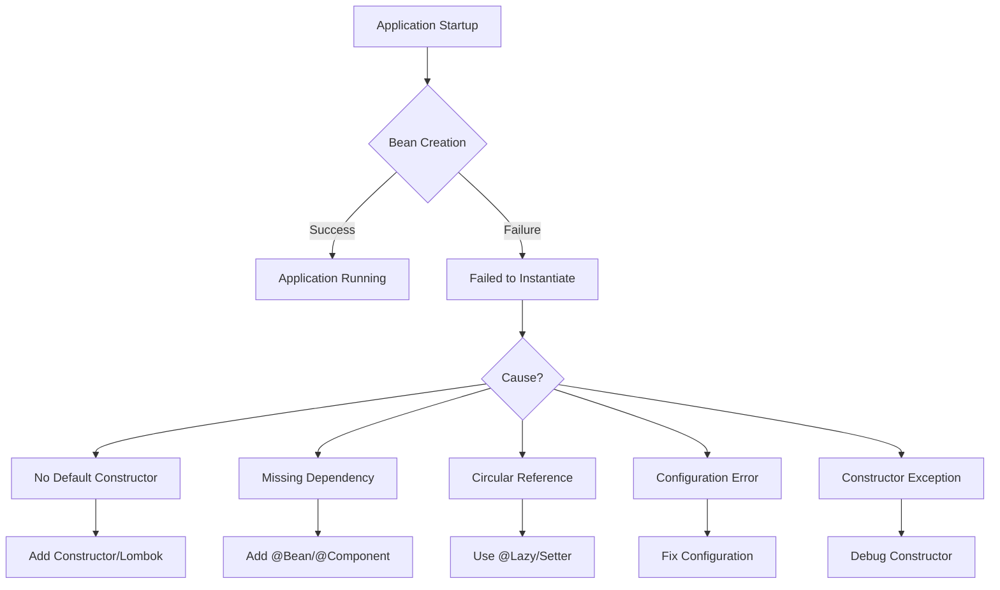

# How to Fix 'Failed to instantiate' Errors in Spring

Author: [nawazdhandala](https://www.github.com/nawazdhandala)

Tags: Java, Spring Boot, Dependency Injection, Bean Configuration, Troubleshooting, Error Handling

Description: Learn how to diagnose and fix the 'Failed to instantiate' errors in Spring Boot applications. This guide covers common causes including missing dependencies, circular references, constructor issues, and configuration problems with practical solutions.

---

> The "Failed to instantiate" error is one of the most common startup failures in Spring Boot applications. It occurs when Spring cannot create a bean instance due to various reasons. This guide helps you quickly identify and fix these issues.

Understanding why Spring fails to instantiate beans is crucial for efficient debugging. Let's explore the common causes and their solutions.

---

## Error Pattern Recognition



---

## Common Error Messages

```
BeanInstantiationException: Failed to instantiate [com.example.MyService]:
No default constructor found

BeanCreationException: Error creating bean with name 'myService':
Unsatisfied dependency expressed through constructor parameter 0

BeanCurrentlyInCreationException: Error creating bean with name 'serviceA':
Requested bean is currently in creation: Is there an unresolvable circular reference?

BeanInstantiationException: Failed to instantiate [com.example.MyService]:
Constructor threw exception; nested exception is java.lang.NullPointerException
```

---

## Cause 1: No Default Constructor

### Problem

```java
@Service
public class UserService {

    private final UserRepository userRepository;

    // Only parameterized constructor - needs @Autowired
    public UserService(UserRepository userRepository) {
        this.userRepository = userRepository;
    }
}
```

Error message:
```
BeanInstantiationException: Failed to instantiate [com.example.UserService]:
No default constructor found
```

### Solution 1: Single Constructor (Implicit Autowiring)

With a single constructor, Spring Boot automatically injects dependencies:

```java
@Service
public class UserService {

    private final UserRepository userRepository;

    // Single constructor - @Autowired is implicit
    public UserService(UserRepository userRepository) {
        this.userRepository = userRepository;
    }
}
```

### Solution 2: Use Lombok

```java
@Service
@RequiredArgsConstructor
public class UserService {

    private final UserRepository userRepository;
    private final EmailService emailService;

    // Lombok generates constructor for final fields
}
```

### Solution 3: Multiple Constructors with @Autowired

```java
@Service
public class UserService {

    private final UserRepository userRepository;
    private EmailService emailService;

    @Autowired // Required when multiple constructors exist
    public UserService(UserRepository userRepository) {
        this.userRepository = userRepository;
    }

    public UserService(UserRepository userRepository, EmailService emailService) {
        this.userRepository = userRepository;
        this.emailService = emailService;
    }
}
```

---

## Cause 2: Missing Dependency Bean

### Problem

```java
@Service
@RequiredArgsConstructor
public class OrderService {

    private final PaymentGateway paymentGateway; // Not a Spring bean!
}

// PaymentGateway is not annotated
public class PaymentGateway {
    // Implementation
}
```

Error message:
```
UnsatisfiedDependencyException: Error creating bean with name 'orderService':
Unsatisfied dependency expressed through constructor parameter 0;
nested exception is NoSuchBeanDefinitionException:
No qualifying bean of type 'com.example.PaymentGateway' available
```

### Solution 1: Add @Component Annotation

```java
@Component
public class PaymentGateway {
    // Implementation
}
```

### Solution 2: Create @Bean Configuration

```java
@Configuration
public class PaymentConfig {

    @Bean
    public PaymentGateway paymentGateway() {
        return new PaymentGateway();
    }
}
```

### Solution 3: Third-Party Classes

```java
@Configuration
public class ExternalConfig {

    @Bean
    public SomeExternalClient externalClient(
            @Value("${external.api.url}") String apiUrl,
            @Value("${external.api.key}") String apiKey) {
        return new SomeExternalClient(apiUrl, apiKey);
    }
}
```

---

## Cause 3: Circular Dependency

### Problem

```java
@Service
@RequiredArgsConstructor
public class ServiceA {
    private final ServiceB serviceB;
}

@Service
@RequiredArgsConstructor
public class ServiceB {
    private final ServiceA serviceA; // Circular reference!
}
```

Error message:
```
BeanCurrentlyInCreationException: Error creating bean with name 'serviceA':
Requested bean is currently in creation:
Is there an unresolvable circular reference?
```

### Solution 1: Use @Lazy

```java
@Service
public class ServiceA {

    private final ServiceB serviceB;

    public ServiceA(@Lazy ServiceB serviceB) {
        this.serviceB = serviceB;
    }
}
```

### Solution 2: Use Setter Injection

```java
@Service
public class ServiceA {

    private ServiceB serviceB;

    @Autowired
    public void setServiceB(ServiceB serviceB) {
        this.serviceB = serviceB;
    }
}
```

### Solution 3: Refactor to Break Cycle

```java
// Extract common functionality to a third service
@Service
@RequiredArgsConstructor
public class CommonService {
    // Shared logic
}

@Service
@RequiredArgsConstructor
public class ServiceA {
    private final CommonService commonService;
}

@Service
@RequiredArgsConstructor
public class ServiceB {
    private final CommonService commonService;
}
```

### Solution 4: Use ApplicationContext

```java
@Service
public class ServiceA {

    private final ApplicationContext context;

    @Autowired
    public ServiceA(ApplicationContext context) {
        this.context = context;
    }

    public void doSomething() {
        // Get bean lazily when needed
        ServiceB serviceB = context.getBean(ServiceB.class);
        serviceB.process();
    }
}
```

---

## Cause 4: Constructor Exception

### Problem

```java
@Service
public class ConfigService {

    private final Properties config;

    public ConfigService() {
        // This might throw IOException
        this.config = loadConfigFromFile();
    }

    private Properties loadConfigFromFile() {
        Properties props = new Properties();
        props.load(new FileInputStream("config.properties")); // Throws!
        return props;
    }
}
```

Error message:
```
BeanInstantiationException: Failed to instantiate [com.example.ConfigService]:
Constructor threw exception; nested exception is java.io.FileNotFoundException
```

### Solution: Handle Exceptions Properly

```java
@Service
@Slf4j
public class ConfigService {

    private final Properties config;

    public ConfigService() {
        this.config = loadConfigSafely();
    }

    private Properties loadConfigSafely() {
        Properties props = new Properties();
        try {
            props.load(new FileInputStream("config.properties"));
        } catch (IOException e) {
            log.warn("Could not load config file, using defaults", e);
            props.setProperty("default.key", "default.value");
        }
        return props;
    }
}

// Or better - use Spring's configuration
@Service
@RequiredArgsConstructor
public class ConfigService {

    @Value("${config.key:default}")
    private String configValue;
}
```

---

## Cause 5: Interface Without Implementation

### Problem

```java
public interface NotificationService {
    void sendNotification(String message);
}

@Service
@RequiredArgsConstructor
public class OrderService {
    private final NotificationService notificationService; // No implementation!
}
```

### Solution: Create Implementation

```java
public interface NotificationService {
    void sendNotification(String message);
}

@Service
@Primary // Use when multiple implementations exist
public class EmailNotificationService implements NotificationService {

    @Override
    public void sendNotification(String message) {
        // Send email
    }
}

@Service
public class SmsNotificationService implements NotificationService {

    @Override
    public void sendNotification(String message) {
        // Send SMS
    }
}

// Use @Qualifier for specific implementation
@Service
@RequiredArgsConstructor
public class OrderService {

    @Qualifier("smsNotificationService")
    private final NotificationService notificationService;
}
```

---

## Cause 6: Missing Configuration Properties

### Problem

```java
@Service
public class ExternalApiService {

    private final String apiUrl;
    private final String apiKey;

    public ExternalApiService(
            @Value("${external.api.url}") String apiUrl,
            @Value("${external.api.key}") String apiKey) {
        this.apiUrl = apiUrl;
        this.apiKey = apiKey;
    }
}
```

Error when properties are missing:
```
BeanCreationException: Error creating bean with name 'externalApiService':
Could not resolve placeholder 'external.api.url' in value "${external.api.url}"
```

### Solution: Provide Defaults or Validate

```java
@Service
public class ExternalApiService {

    private final String apiUrl;
    private final String apiKey;

    public ExternalApiService(
            @Value("${external.api.url:https://default.api.com}") String apiUrl,
            @Value("${external.api.key:}") String apiKey) {

        this.apiUrl = apiUrl;

        if (apiKey == null || apiKey.isBlank()) {
            throw new IllegalStateException("external.api.key must be configured");
        }
        this.apiKey = apiKey;
    }
}

// Or use @ConfigurationProperties with validation
@ConfigurationProperties(prefix = "external.api")
@Validated
@Data
public class ExternalApiProperties {

    @NotBlank
    private String url;

    @NotBlank
    private String key;
}
```

---

## Cause 7: Bean Scope Issues

### Problem

```java
@Service
@Scope("prototype")
public class PrototypeService {
    // New instance for each injection
}

@Service
@RequiredArgsConstructor
public class SingletonService {

    // Only injected once at startup!
    private final PrototypeService prototypeService;
}
```

### Solution: Use ObjectFactory or Provider

```java
@Service
public class SingletonService {

    private final ObjectFactory<PrototypeService> prototypeFactory;

    @Autowired
    public SingletonService(ObjectFactory<PrototypeService> prototypeFactory) {
        this.prototypeFactory = prototypeFactory;
    }

    public void doSomething() {
        // Get fresh instance each time
        PrototypeService prototype = prototypeFactory.getObject();
        prototype.process();
    }
}

// Or use Provider
@Service
public class SingletonService {

    private final Provider<PrototypeService> prototypeProvider;

    @Autowired
    public SingletonService(Provider<PrototypeService> prototypeProvider) {
        this.prototypeProvider = prototypeProvider;
    }

    public void doSomething() {
        PrototypeService prototype = prototypeProvider.get();
        prototype.process();
    }
}
```

---

## Debugging Tips

### Enable Debug Logging

```yaml
logging:
  level:
    org.springframework.beans: DEBUG
    org.springframework.context: DEBUG
```

### Check Bean Creation Order

```java
@Component
@Slf4j
public class BeanCreationLogger implements BeanPostProcessor {

    @Override
    public Object postProcessBeforeInitialization(Object bean, String beanName) {
        log.debug("Creating bean: {}", beanName);
        return bean;
    }
}
```

### List All Beans

```java
@Component
@RequiredArgsConstructor
public class BeanLister implements CommandLineRunner {

    private final ApplicationContext context;

    @Override
    public void run(String... args) {
        String[] beanNames = context.getBeanDefinitionNames();
        Arrays.sort(beanNames);
        for (String beanName : beanNames) {
            System.out.println(beanName);
        }
    }
}
```

---

## Diagnostic Checklist

| Check | Action |
|-------|--------|
| Missing annotation | Add @Component, @Service, or @Repository |
| Constructor issues | Use @RequiredArgsConstructor or explicit @Autowired |
| Circular dependency | Use @Lazy or refactor |
| Missing properties | Add defaults or configure in application.yml |
| Interface without impl | Create @Service implementation |
| Third-party class | Create @Bean in @Configuration |
| Exception in constructor | Add proper error handling |

---

## Conclusion

"Failed to instantiate" errors typically indicate configuration issues that are easy to fix once identified:

- Ensure all dependencies have corresponding beans
- Use Lombok's @RequiredArgsConstructor for cleaner code
- Break circular dependencies with @Lazy or refactoring
- Provide defaults for configuration properties
- Handle exceptions in constructors properly

With these patterns, you can quickly diagnose and resolve bean instantiation issues in Spring Boot.

---

*Need to monitor your Spring Boot application health? [OneUptime](https://oneuptime.com) provides comprehensive application monitoring with startup failure detection and alerting.*
