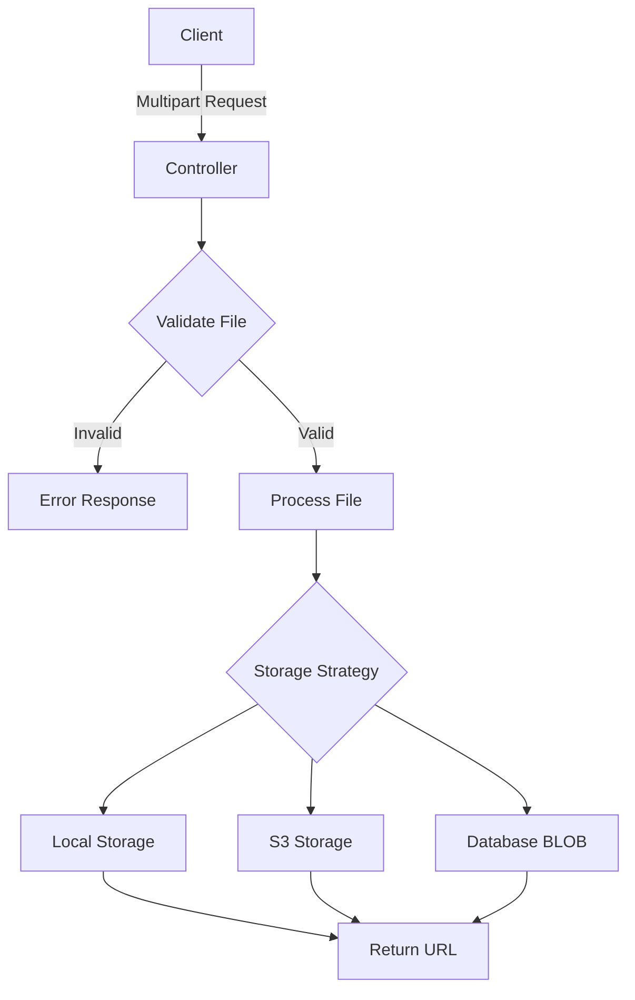

# How to Handle File Upload in Spring Boot

Author: [nawazdhandala](https://www.github.com/nawazdhandala)

Tags: Java, Spring Boot, File Upload, REST API, Multipart, Storage

Description: Learn how to handle file uploads in Spring Boot applications. This guide covers multipart configuration, validation, storage strategies, progress tracking, and security best practices for handling user-uploaded files.

---

> File uploads are a common requirement in web applications. Spring Boot provides excellent support for handling multipart file uploads. This guide covers everything from basic uploads to advanced features like validation, progress tracking, and cloud storage integration.

Proper file upload handling requires attention to security, performance, and user experience. Let's explore how to implement robust file upload functionality.

---

## Architecture Overview



---

## Configuration

### Application Properties

```yaml
spring:
  servlet:
    multipart:
      enabled: true
      max-file-size: 10MB
      max-request-size: 50MB
      file-size-threshold: 2KB

# Custom upload configuration
upload:
  directory: ${java.io.tmpdir}/uploads
  allowed-extensions: jpg,jpeg,png,gif,pdf,doc,docx,xls,xlsx
  max-file-size: 10485760 # 10MB in bytes
```

### Configuration Properties Class

```java
package com.example.config;

import lombok.Data;
import org.springframework.boot.context.properties.ConfigurationProperties;
import org.springframework.stereotype.Component;

import java.util.List;

@Data
@Component
@ConfigurationProperties(prefix = "upload")
public class UploadProperties {

    private String directory;
    private List<String> allowedExtensions;
    private long maxFileSize;
}
```

---

## Basic File Upload Controller

```java
package com.example.controller;

import com.example.dto.FileUploadResponse;
import com.example.service.FileStorageService;
import lombok.RequiredArgsConstructor;
import lombok.extern.slf4j.Slf4j;
import org.springframework.core.io.Resource;
import org.springframework.http.HttpHeaders;
import org.springframework.http.MediaType;
import org.springframework.http.ResponseEntity;
import org.springframework.web.bind.annotation.*;
import org.springframework.web.multipart.MultipartFile;
import org.springframework.web.servlet.support.ServletUriComponentsBuilder;

import jakarta.servlet.http.HttpServletRequest;
import java.io.IOException;
import java.util.Arrays;
import java.util.List;
import java.util.stream.Collectors;

@RestController
@RequestMapping("/api/files")
@RequiredArgsConstructor
@Slf4j
public class FileUploadController {

    private final FileStorageService fileStorageService;

    @PostMapping("/upload")
    public ResponseEntity<FileUploadResponse> uploadFile(
            @RequestParam("file") MultipartFile file) {

        String fileName = fileStorageService.storeFile(file);

        String fileDownloadUri = ServletUriComponentsBuilder.fromCurrentContextPath()
            .path("/api/files/download/")
            .path(fileName)
            .toUriString();

        FileUploadResponse response = FileUploadResponse.builder()
            .fileName(fileName)
            .fileDownloadUri(fileDownloadUri)
            .fileType(file.getContentType())
            .size(file.getSize())
            .build();

        return ResponseEntity.ok(response);
    }

    @PostMapping("/upload-multiple")
    public ResponseEntity<List<FileUploadResponse>> uploadMultipleFiles(
            @RequestParam("files") MultipartFile[] files) {

        List<FileUploadResponse> responses = Arrays.stream(files)
            .map(file -> {
                String fileName = fileStorageService.storeFile(file);
                String fileDownloadUri = ServletUriComponentsBuilder.fromCurrentContextPath()
                    .path("/api/files/download/")
                    .path(fileName)
                    .toUriString();

                return FileUploadResponse.builder()
                    .fileName(fileName)
                    .fileDownloadUri(fileDownloadUri)
                    .fileType(file.getContentType())
                    .size(file.getSize())
                    .build();
            })
            .collect(Collectors.toList());

        return ResponseEntity.ok(responses);
    }

    @GetMapping("/download/{fileName:.+}")
    public ResponseEntity<Resource> downloadFile(
            @PathVariable String fileName,
            HttpServletRequest request) {

        Resource resource = fileStorageService.loadFileAsResource(fileName);

        String contentType = null;
        try {
            contentType = request.getServletContext()
                .getMimeType(resource.getFile().getAbsolutePath());
        } catch (IOException ex) {
            log.info("Could not determine file type.");
        }

        if (contentType == null) {
            contentType = "application/octet-stream";
        }

        return ResponseEntity.ok()
            .contentType(MediaType.parseMediaType(contentType))
            .header(HttpHeaders.CONTENT_DISPOSITION,
                "attachment; filename=\"" + resource.getFilename() + "\"")
            .body(resource);
    }

    @DeleteMapping("/{fileName:.+}")
    public ResponseEntity<Void> deleteFile(@PathVariable String fileName) {
        fileStorageService.deleteFile(fileName);
        return ResponseEntity.noContent().build();
    }
}
```

---

## Response DTO

```java
package com.example.dto;

import lombok.AllArgsConstructor;
import lombok.Builder;
import lombok.Data;
import lombok.NoArgsConstructor;

@Data
@Builder
@NoArgsConstructor
@AllArgsConstructor
public class FileUploadResponse {

    private String fileName;
    private String fileDownloadUri;
    private String fileType;
    private long size;
}
```

---

## File Storage Service

### Local Storage Implementation

```java
package com.example.service;

import com.example.config.UploadProperties;
import com.example.exception.FileStorageException;
import com.example.exception.FileNotFoundException;
import lombok.extern.slf4j.Slf4j;
import org.springframework.core.io.Resource;
import org.springframework.core.io.UrlResource;
import org.springframework.stereotype.Service;
import org.springframework.util.StringUtils;
import org.springframework.web.multipart.MultipartFile;

import jakarta.annotation.PostConstruct;
import java.io.IOException;
import java.net.MalformedURLException;
import java.nio.file.Files;
import java.nio.file.Path;
import java.nio.file.Paths;
import java.nio.file.StandardCopyOption;
import java.util.UUID;

@Service
@Slf4j
public class FileStorageService {

    private final Path fileStorageLocation;
    private final UploadProperties uploadProperties;

    public FileStorageService(UploadProperties uploadProperties) {
        this.uploadProperties = uploadProperties;
        this.fileStorageLocation = Paths.get(uploadProperties.getDirectory())
            .toAbsolutePath().normalize();
    }

    @PostConstruct
    public void init() {
        try {
            Files.createDirectories(this.fileStorageLocation);
        } catch (IOException ex) {
            throw new FileStorageException(
                "Could not create upload directory", ex);
        }
    }

    public String storeFile(MultipartFile file) {
        // Validate file
        validateFile(file);

        // Generate unique filename
        String originalFileName = StringUtils.cleanPath(file.getOriginalFilename());
        String fileExtension = getFileExtension(originalFileName);
        String storedFileName = UUID.randomUUID().toString() + "." + fileExtension;

        try {
            // Check for path traversal attack
            if (originalFileName.contains("..")) {
                throw new FileStorageException(
                    "Filename contains invalid path sequence: " + originalFileName);
            }

            Path targetLocation = this.fileStorageLocation.resolve(storedFileName);
            Files.copy(file.getInputStream(), targetLocation, StandardCopyOption.REPLACE_EXISTING);

            log.info("Stored file: {} as {}", originalFileName, storedFileName);

            return storedFileName;

        } catch (IOException ex) {
            throw new FileStorageException(
                "Could not store file " + originalFileName, ex);
        }
    }

    public Resource loadFileAsResource(String fileName) {
        try {
            Path filePath = this.fileStorageLocation.resolve(fileName).normalize();
            Resource resource = new UrlResource(filePath.toUri());

            if (resource.exists()) {
                return resource;
            } else {
                throw new FileNotFoundException("File not found: " + fileName);
            }
        } catch (MalformedURLException ex) {
            throw new FileNotFoundException("File not found: " + fileName, ex);
        }
    }

    public void deleteFile(String fileName) {
        try {
            Path filePath = this.fileStorageLocation.resolve(fileName).normalize();
            Files.deleteIfExists(filePath);
            log.info("Deleted file: {}", fileName);
        } catch (IOException ex) {
            throw new FileStorageException("Could not delete file: " + fileName, ex);
        }
    }

    private void validateFile(MultipartFile file) {
        if (file.isEmpty()) {
            throw new FileStorageException("Cannot store empty file");
        }

        String originalFileName = StringUtils.cleanPath(file.getOriginalFilename());

        // Validate extension
        String extension = getFileExtension(originalFileName).toLowerCase();
        if (!uploadProperties.getAllowedExtensions().contains(extension)) {
            throw new FileStorageException(
                "File type not allowed: " + extension);
        }

        // Validate size
        if (file.getSize() > uploadProperties.getMaxFileSize()) {
            throw new FileStorageException(
                "File size exceeds maximum allowed size");
        }

        // Validate content type
        validateContentType(file, extension);
    }

    private void validateContentType(MultipartFile file, String extension) {
        String contentType = file.getContentType();
        if (contentType == null) {
            throw new FileStorageException("Could not determine content type");
        }

        // Map extensions to allowed content types
        boolean valid = switch (extension) {
            case "jpg", "jpeg" -> contentType.equals("image/jpeg");
            case "png" -> contentType.equals("image/png");
            case "gif" -> contentType.equals("image/gif");
            case "pdf" -> contentType.equals("application/pdf");
            case "doc" -> contentType.equals("application/msword");
            case "docx" -> contentType.equals(
                "application/vnd.openxmlformats-officedocument.wordprocessingml.document");
            default -> true;
        };

        if (!valid) {
            throw new FileStorageException(
                "Content type does not match file extension");
        }
    }

    private String getFileExtension(String fileName) {
        int dotIndex = fileName.lastIndexOf('.');
        if (dotIndex < 0) {
            return "";
        }
        return fileName.substring(dotIndex + 1);
    }
}
```

---

## Custom Exceptions

```java
package com.example.exception;

public class FileStorageException extends RuntimeException {

    public FileStorageException(String message) {
        super(message);
    }

    public FileStorageException(String message, Throwable cause) {
        super(message, cause);
    }
}

public class FileNotFoundException extends RuntimeException {

    public FileNotFoundException(String message) {
        super(message);
    }

    public FileNotFoundException(String message, Throwable cause) {
        super(message, cause);
    }
}
```

### Exception Handler

```java
package com.example.exception;

import lombok.extern.slf4j.Slf4j;
import org.springframework.http.HttpStatus;
import org.springframework.http.ResponseEntity;
import org.springframework.web.bind.annotation.ExceptionHandler;
import org.springframework.web.bind.annotation.RestControllerAdvice;
import org.springframework.web.multipart.MaxUploadSizeExceededException;

import java.time.Instant;
import java.util.Map;

@RestControllerAdvice
@Slf4j
public class FileExceptionHandler {

    @ExceptionHandler(FileStorageException.class)
    public ResponseEntity<Map<String, Object>> handleFileStorageException(
            FileStorageException ex) {
        log.error("File storage error", ex);
        return ResponseEntity.badRequest().body(Map.of(
            "timestamp", Instant.now(),
            "status", 400,
            "error", "File Storage Error",
            "message", ex.getMessage()
        ));
    }

    @ExceptionHandler(FileNotFoundException.class)
    public ResponseEntity<Map<String, Object>> handleFileNotFoundException(
            FileNotFoundException ex) {
        return ResponseEntity.status(HttpStatus.NOT_FOUND).body(Map.of(
            "timestamp", Instant.now(),
            "status", 404,
            "error", "File Not Found",
            "message", ex.getMessage()
        ));
    }

    @ExceptionHandler(MaxUploadSizeExceededException.class)
    public ResponseEntity<Map<String, Object>> handleMaxUploadSizeExceeded(
            MaxUploadSizeExceededException ex) {
        log.warn("Max upload size exceeded", ex);
        return ResponseEntity.status(HttpStatus.PAYLOAD_TOO_LARGE).body(Map.of(
            "timestamp", Instant.now(),
            "status", 413,
            "error", "File Too Large",
            "message", "Maximum upload size exceeded"
        ));
    }
}
```

---

## AWS S3 Storage Implementation

```java
package com.example.service;

import lombok.RequiredArgsConstructor;
import lombok.extern.slf4j.Slf4j;
import org.springframework.beans.factory.annotation.Value;
import org.springframework.stereotype.Service;
import org.springframework.web.multipart.MultipartFile;
import software.amazon.awssdk.core.sync.RequestBody;
import software.amazon.awssdk.services.s3.S3Client;
import software.amazon.awssdk.services.s3.model.*;

import java.io.IOException;
import java.util.UUID;

@Service
@RequiredArgsConstructor
@Slf4j
public class S3StorageService {

    private final S3Client s3Client;

    @Value("${aws.s3.bucket}")
    private String bucketName;

    public String uploadFile(MultipartFile file) {
        String key = UUID.randomUUID().toString() + "_" + file.getOriginalFilename();

        try {
            PutObjectRequest putObjectRequest = PutObjectRequest.builder()
                .bucket(bucketName)
                .key(key)
                .contentType(file.getContentType())
                .contentLength(file.getSize())
                .build();

            s3Client.putObject(putObjectRequest,
                RequestBody.fromInputStream(file.getInputStream(), file.getSize()));

            log.info("Uploaded file to S3: {}", key);

            return key;

        } catch (IOException e) {
            throw new FileStorageException("Failed to upload file to S3", e);
        }
    }

    public String getPresignedUrl(String key) {
        GetUrlRequest urlRequest = GetUrlRequest.builder()
            .bucket(bucketName)
            .key(key)
            .build();

        return s3Client.utilities().getUrl(urlRequest).toString();
    }

    public void deleteFile(String key) {
        DeleteObjectRequest deleteRequest = DeleteObjectRequest.builder()
            .bucket(bucketName)
            .key(key)
            .build();

        s3Client.deleteObject(deleteRequest);
        log.info("Deleted file from S3: {}", key);
    }
}
```

---

## Image Processing

```java
package com.example.service;

import lombok.extern.slf4j.Slf4j;
import org.springframework.stereotype.Service;
import org.springframework.web.multipart.MultipartFile;

import javax.imageio.ImageIO;
import java.awt.*;
import java.awt.image.BufferedImage;
import java.io.ByteArrayInputStream;
import java.io.ByteArrayOutputStream;
import java.io.IOException;

@Service
@Slf4j
public class ImageProcessingService {

    public byte[] resizeImage(MultipartFile file, int targetWidth, int targetHeight)
            throws IOException {

        BufferedImage originalImage = ImageIO.read(file.getInputStream());

        BufferedImage resizedImage = new BufferedImage(
            targetWidth, targetHeight, BufferedImage.TYPE_INT_RGB);

        Graphics2D graphics = resizedImage.createGraphics();
        graphics.setRenderingHint(
            RenderingHints.KEY_INTERPOLATION,
            RenderingHints.VALUE_INTERPOLATION_BILINEAR);
        graphics.drawImage(originalImage, 0, 0, targetWidth, targetHeight, null);
        graphics.dispose();

        ByteArrayOutputStream outputStream = new ByteArrayOutputStream();
        String formatName = getFormatName(file.getContentType());
        ImageIO.write(resizedImage, formatName, outputStream);

        return outputStream.toByteArray();
    }

    public byte[] createThumbnail(MultipartFile file, int maxSize) throws IOException {
        BufferedImage originalImage = ImageIO.read(file.getInputStream());

        int originalWidth = originalImage.getWidth();
        int originalHeight = originalImage.getHeight();

        int targetWidth;
        int targetHeight;

        if (originalWidth > originalHeight) {
            targetWidth = maxSize;
            targetHeight = (int) ((double) originalHeight / originalWidth * maxSize);
        } else {
            targetHeight = maxSize;
            targetWidth = (int) ((double) originalWidth / originalHeight * maxSize);
        }

        BufferedImage thumbnail = new BufferedImage(
            targetWidth, targetHeight, BufferedImage.TYPE_INT_RGB);

        Graphics2D graphics = thumbnail.createGraphics();
        graphics.setRenderingHint(
            RenderingHints.KEY_INTERPOLATION,
            RenderingHints.VALUE_INTERPOLATION_BILINEAR);
        graphics.drawImage(originalImage, 0, 0, targetWidth, targetHeight, null);
        graphics.dispose();

        ByteArrayOutputStream outputStream = new ByteArrayOutputStream();
        ImageIO.write(thumbnail, "jpg", outputStream);

        return outputStream.toByteArray();
    }

    private String getFormatName(String contentType) {
        return switch (contentType) {
            case "image/png" -> "png";
            case "image/gif" -> "gif";
            default -> "jpg";
        };
    }
}
```

---

## Controller with Validation DTO

```java
package com.example.controller;

import com.example.dto.FileUploadRequest;
import com.example.service.FileStorageService;
import jakarta.validation.Valid;
import lombok.RequiredArgsConstructor;
import org.springframework.http.ResponseEntity;
import org.springframework.web.bind.annotation.*;
import org.springframework.web.multipart.MultipartFile;

@RestController
@RequestMapping("/api/documents")
@RequiredArgsConstructor
public class DocumentController {

    private final FileStorageService fileStorageService;

    @PostMapping
    public ResponseEntity<?> uploadDocument(
            @RequestPart("file") MultipartFile file,
            @RequestPart("metadata") @Valid FileUploadRequest metadata) {

        // Validate and process file with metadata
        String fileName = fileStorageService.storeFile(file);

        return ResponseEntity.ok(Map.of(
            "fileName", fileName,
            "title", metadata.getTitle(),
            "description", metadata.getDescription()
        ));
    }
}

@Data
public class FileUploadRequest {

    @NotBlank(message = "Title is required")
    @Size(max = 255, message = "Title must not exceed 255 characters")
    private String title;

    @Size(max = 1000, message = "Description must not exceed 1000 characters")
    private String description;

    @NotEmpty(message = "At least one tag is required")
    private List<String> tags;
}
```

---

## Testing File Upload

```java
@SpringBootTest
@AutoConfigureMockMvc
class FileUploadControllerTest {

    @Autowired
    private MockMvc mockMvc;

    @Test
    void shouldUploadFile() throws Exception {
        MockMultipartFile file = new MockMultipartFile(
            "file",
            "test.txt",
            MediaType.TEXT_PLAIN_VALUE,
            "Hello, World!".getBytes()
        );

        mockMvc.perform(multipart("/api/files/upload")
                .file(file))
            .andExpect(status().isOk())
            .andExpect(jsonPath("$.fileName").exists())
            .andExpect(jsonPath("$.fileDownloadUri").exists())
            .andExpect(jsonPath("$.size").value(13));
    }

    @Test
    void shouldRejectEmptyFile() throws Exception {
        MockMultipartFile file = new MockMultipartFile(
            "file",
            "empty.txt",
            MediaType.TEXT_PLAIN_VALUE,
            new byte[0]
        );

        mockMvc.perform(multipart("/api/files/upload")
                .file(file))
            .andExpect(status().isBadRequest());
    }

    @Test
    void shouldRejectDisallowedFileType() throws Exception {
        MockMultipartFile file = new MockMultipartFile(
            "file",
            "malicious.exe",
            "application/octet-stream",
            "malicious content".getBytes()
        );

        mockMvc.perform(multipart("/api/files/upload")
                .file(file))
            .andExpect(status().isBadRequest());
    }
}
```

---

## Security Best Practices

1. **Validate File Extensions** - Only allow specific file types
2. **Validate Content Type** - Match content type to extension
3. **Generate New Filenames** - Prevent path traversal attacks
4. **Scan for Malware** - Integrate with antivirus solutions
5. **Limit File Size** - Set appropriate size limits
6. **Store Outside Web Root** - Prevent direct access

---

## Conclusion

Proper file upload handling requires attention to multiple concerns:

- Configure multipart settings appropriately
- Validate file type, size, and content
- Use secure filename generation
- Implement proper error handling
- Consider cloud storage for scalability

With these patterns, you can build secure and reliable file upload functionality in Spring Boot.

---

*Need to monitor your file upload endpoints? [OneUptime](https://oneuptime.com) provides API monitoring with error tracking and performance metrics.*
