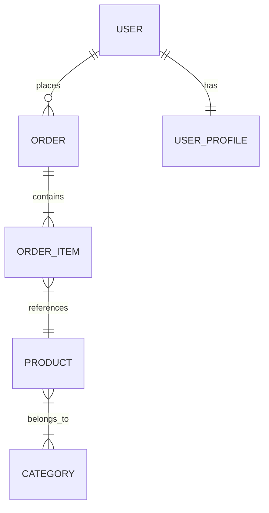

# How to Set Up JPA Entity Relationships in Spring Boot

Author: [nawazdhandala](https://github.com/nawazdhandala)

Tags: Java, Spring Boot, JPA, Hibernate, Database, Backend

Description: Learn how to properly configure JPA entity relationships in Spring Boot including OneToMany, ManyToOne, ManyToMany, and OneToOne with best practices for performance.

---

JPA entity relationships define how your database tables connect to each other. Getting these relationships right is crucial for application correctness and performance. This guide covers all relationship types with practical examples and common pitfalls to avoid.

## Relationship Types Overview



## One-to-Many / Many-to-One

The most common relationship type. One entity has many related entities.

### Basic Setup

```java
@Entity
@Table(name = "users")
public class User {

    @Id
    @GeneratedValue(strategy = GenerationType.IDENTITY)
    private Long id;

    private String name;

    private String email;

    @OneToMany(mappedBy = "user", cascade = CascadeType.ALL, orphanRemoval = true)
    private List<Order> orders = new ArrayList<>();

    // Helper methods to maintain bidirectional relationship
    public void addOrder(Order order) {
        orders.add(order);
        order.setUser(this);
    }

    public void removeOrder(Order order) {
        orders.remove(order);
        order.setUser(null);
    }

    // getters and setters
}

@Entity
@Table(name = "orders")
public class Order {

    @Id
    @GeneratedValue(strategy = GenerationType.IDENTITY)
    private Long id;

    private LocalDateTime orderDate;

    private BigDecimal totalAmount;

    @ManyToOne(fetch = FetchType.LAZY)
    @JoinColumn(name = "user_id", nullable = false)
    private User user;

    // getters and setters
}
```

### Key Annotations Explained

| Annotation | Purpose |
|------------|---------|
| `@OneToMany(mappedBy = "user")` | Indicates the inverse side; "user" is the field name in Order |
| `cascade = CascadeType.ALL` | Operations on User propagate to Orders |
| `orphanRemoval = true` | Remove Order from DB when removed from collection |
| `@ManyToOne(fetch = FetchType.LAZY)` | Don't load User when loading Order |
| `@JoinColumn(name = "user_id")` | Specifies the foreign key column |

### Fetching Strategies

```java
// LAZY (default for @OneToMany) - Load only when accessed
@OneToMany(mappedBy = "user", fetch = FetchType.LAZY)
private List<Order> orders;

// EAGER - Load immediately with parent (usually avoid)
@OneToMany(mappedBy = "user", fetch = FetchType.EAGER)
private List<Order> orders;
```

## One-to-One

One entity has exactly one related entity.

### Unidirectional One-to-One

```java
@Entity
@Table(name = "users")
public class User {

    @Id
    @GeneratedValue(strategy = GenerationType.IDENTITY)
    private Long id;

    private String name;

    @OneToOne(cascade = CascadeType.ALL, fetch = FetchType.LAZY)
    @JoinColumn(name = "profile_id", referencedColumnName = "id")
    private UserProfile profile;
}

@Entity
@Table(name = "user_profiles")
public class UserProfile {

    @Id
    @GeneratedValue(strategy = GenerationType.IDENTITY)
    private Long id;

    private String bio;

    private String avatarUrl;
}
```

### Bidirectional One-to-One

```java
@Entity
@Table(name = "users")
public class User {

    @Id
    @GeneratedValue(strategy = GenerationType.IDENTITY)
    private Long id;

    private String name;

    @OneToOne(mappedBy = "user", cascade = CascadeType.ALL,
              fetch = FetchType.LAZY, orphanRemoval = true)
    private UserProfile profile;

    public void setProfile(UserProfile profile) {
        if (profile == null) {
            if (this.profile != null) {
                this.profile.setUser(null);
            }
        } else {
            profile.setUser(this);
        }
        this.profile = profile;
    }
}

@Entity
@Table(name = "user_profiles")
public class UserProfile {

    @Id
    @GeneratedValue(strategy = GenerationType.IDENTITY)
    private Long id;

    private String bio;

    @OneToOne(fetch = FetchType.LAZY)
    @JoinColumn(name = "user_id")
    private User user;
}
```

### Shared Primary Key

```java
@Entity
@Table(name = "users")
public class User {

    @Id
    @GeneratedValue(strategy = GenerationType.IDENTITY)
    private Long id;

    @OneToOne(mappedBy = "user", cascade = CascadeType.ALL)
    @PrimaryKeyJoinColumn
    private UserProfile profile;
}

@Entity
@Table(name = "user_profiles")
public class UserProfile {

    @Id
    private Long id;  // Same as User's id

    @OneToOne
    @MapsId
    @JoinColumn(name = "id")
    private User user;

    private String bio;
}
```

## Many-to-Many

Both entities can have multiple related entities.

### Basic Many-to-Many

```java
@Entity
@Table(name = "products")
public class Product {

    @Id
    @GeneratedValue(strategy = GenerationType.IDENTITY)
    private Long id;

    private String name;

    private BigDecimal price;

    @ManyToMany(cascade = {CascadeType.PERSIST, CascadeType.MERGE})
    @JoinTable(
        name = "product_categories",
        joinColumns = @JoinColumn(name = "product_id"),
        inverseJoinColumns = @JoinColumn(name = "category_id")
    )
    private Set<Category> categories = new HashSet<>();

    public void addCategory(Category category) {
        categories.add(category);
        category.getProducts().add(this);
    }

    public void removeCategory(Category category) {
        categories.remove(category);
        category.getProducts().remove(this);
    }
}

@Entity
@Table(name = "categories")
public class Category {

    @Id
    @GeneratedValue(strategy = GenerationType.IDENTITY)
    private Long id;

    private String name;

    @ManyToMany(mappedBy = "categories")
    private Set<Product> products = new HashSet<>();
}
```

### Many-to-Many with Extra Columns

When the join table needs additional attributes, create an explicit entity:

```java
@Entity
@Table(name = "enrollments")
public class Enrollment {

    @EmbeddedId
    private EnrollmentId id;

    @ManyToOne(fetch = FetchType.LAZY)
    @MapsId("studentId")
    @JoinColumn(name = "student_id")
    private Student student;

    @ManyToOne(fetch = FetchType.LAZY)
    @MapsId("courseId")
    @JoinColumn(name = "course_id")
    private Course course;

    private LocalDate enrolledDate;

    private String grade;

    // constructors, getters, setters
}

@Embeddable
public class EnrollmentId implements Serializable {

    private Long studentId;
    private Long courseId;

    // equals, hashCode, getters, setters
}

@Entity
@Table(name = "students")
public class Student {

    @Id
    @GeneratedValue(strategy = GenerationType.IDENTITY)
    private Long id;

    private String name;

    @OneToMany(mappedBy = "student", cascade = CascadeType.ALL, orphanRemoval = true)
    private Set<Enrollment> enrollments = new HashSet<>();

    public void enrollIn(Course course, LocalDate date) {
        Enrollment enrollment = new Enrollment(this, course, date);
        enrollments.add(enrollment);
        course.getEnrollments().add(enrollment);
    }
}

@Entity
@Table(name = "courses")
public class Course {

    @Id
    @GeneratedValue(strategy = GenerationType.IDENTITY)
    private Long id;

    private String title;

    @OneToMany(mappedBy = "course", cascade = CascadeType.ALL, orphanRemoval = true)
    private Set<Enrollment> enrollments = new HashSet<>();
}
```

## Best Practices

### 1. Use Set Instead of List for Collections

```java
// Prefer Set - better performance for contains() and removal
@OneToMany(mappedBy = "user")
private Set<Order> orders = new HashSet<>();

// List can cause issues with bag semantics
@OneToMany(mappedBy = "user")
private List<Order> orders = new ArrayList<>();  // Use only if order matters
```

### 2. Implement equals() and hashCode() Properly

```java
@Entity
public class Order {

    @Id
    @GeneratedValue(strategy = GenerationType.IDENTITY)
    private Long id;

    @NaturalId
    private String orderNumber;

    @Override
    public boolean equals(Object o) {
        if (this == o) return true;
        if (!(o instanceof Order)) return false;
        Order order = (Order) o;
        return Objects.equals(orderNumber, order.orderNumber);
    }

    @Override
    public int hashCode() {
        return Objects.hash(orderNumber);
    }
}
```

### 3. Use FetchType.LAZY by Default

```java
// Always use LAZY for @ManyToOne
@ManyToOne(fetch = FetchType.LAZY)
@JoinColumn(name = "user_id")
private User user;

// Load eagerly only when needed via JOIN FETCH
@Query("SELECT o FROM Order o JOIN FETCH o.user WHERE o.id = :id")
Optional<Order> findByIdWithUser(@Param("id") Long id);
```

### 4. Avoid CascadeType.ALL When Not Needed

```java
// Only cascade what you need
@ManyToOne(fetch = FetchType.LAZY)
@JoinColumn(name = "category_id")
private Category category;  // No cascade - Category lifecycle is independent

@OneToMany(mappedBy = "order", cascade = CascadeType.ALL, orphanRemoval = true)
private List<OrderItem> items;  // Cascade - items depend on order
```

## Common Problems and Solutions

### N+1 Query Problem

```java
// Problem: This generates N+1 queries
List<User> users = userRepository.findAll();
users.forEach(user -> {
    System.out.println(user.getOrders().size());  // Each call hits DB
});

// Solution 1: Use JOIN FETCH
@Query("SELECT DISTINCT u FROM User u LEFT JOIN FETCH u.orders")
List<User> findAllWithOrders();

// Solution 2: Use EntityGraph
@EntityGraph(attributePaths = {"orders"})
List<User> findAll();
```

### Bidirectional Relationship Not Synced

```java
// Problem: Only setting one side
Order order = new Order();
order.setUser(user);
orderRepository.save(order);
// user.getOrders() won't contain this order!

// Solution: Use helper methods that sync both sides
public void addOrder(Order order) {
    orders.add(order);
    order.setUser(this);
}
```

### Infinite Recursion in JSON

```java
// Problem: Jackson tries to serialize both sides
@Entity
public class User {
    @OneToMany(mappedBy = "user")
    private List<Order> orders;  // Serializes orders, which serialize user...
}

// Solution 1: Use @JsonIgnore
@OneToMany(mappedBy = "user")
@JsonIgnore
private List<Order> orders;

// Solution 2: Use @JsonManagedReference/@JsonBackReference
@Entity
public class User {
    @OneToMany(mappedBy = "user")
    @JsonManagedReference
    private List<Order> orders;
}

@Entity
public class Order {
    @ManyToOne
    @JsonBackReference
    private User user;
}

// Solution 3: Use DTOs (recommended)
public record UserDTO(Long id, String name, List<OrderSummaryDTO> orders) {}
public record OrderSummaryDTO(Long id, LocalDateTime orderDate) {}
```

## Cascade Types Reference

| Type | Description |
|------|-------------|
| `PERSIST` | Save child when parent is saved |
| `MERGE` | Update child when parent is updated |
| `REMOVE` | Delete child when parent is deleted |
| `REFRESH` | Refresh child when parent is refreshed |
| `DETACH` | Detach child when parent is detached |
| `ALL` | All of the above |

## Summary

| Relationship | Owning Side | Inverse Side | Join Column |
|--------------|-------------|--------------|-------------|
| OneToMany/ManyToOne | ManyToOne | OneToMany (mappedBy) | On Many side |
| OneToOne | Either | Other (mappedBy) | On owning side |
| ManyToMany | Either | Other (mappedBy) | Join table |

Proper JPA relationships are foundational to a well-designed Spring Boot application. Always use lazy fetching by default, maintain bidirectional relationships with helper methods, and solve the N+1 problem with JOIN FETCH or EntityGraph. When in doubt, start simple and add complexity only when needed.
