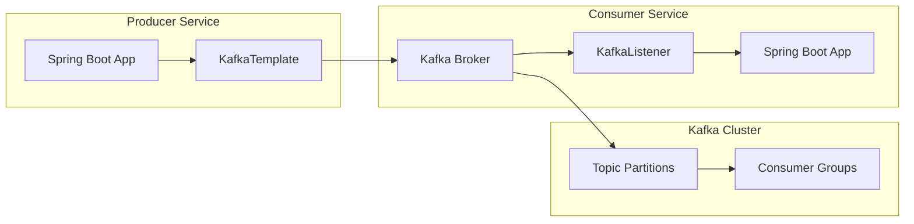

# How to Configure Spring Boot with Kafka

Author: [nawazdhandala](https://www.github.com/nawazdhandala)

Tags: Java, Spring Boot, Kafka, Messaging, Event-Driven Architecture, Microservices

Description: Learn how to configure Apache Kafka with Spring Boot for building event-driven applications. This guide covers producer and consumer setup, serialization, error handling, and best practices for production deployments.

---

> Apache Kafka is the backbone of modern event-driven architectures. Spring Boot's excellent Kafka integration makes it easy to build scalable, resilient messaging systems. This guide walks you through complete Kafka configuration with practical examples.

Kafka enables decoupled, asynchronous communication between services. Spring Boot's `spring-kafka` library provides auto-configuration and abstractions that simplify Kafka integration significantly.

---

## Architecture Overview



---

## Dependencies Setup

Add the Spring Kafka dependency to your `pom.xml`:

```xml
<dependencies>
    <dependency>
        <groupId>org.springframework.boot</groupId>
        <artifactId>spring-boot-starter</artifactId>
    </dependency>
    <dependency>
        <groupId>org.springframework.kafka</groupId>
        <artifactId>spring-kafka</artifactId>
    </dependency>
    <!-- For JSON serialization -->
    <dependency>
        <groupId>com.fasterxml.jackson.core</groupId>
        <artifactId>jackson-databind</artifactId>
    </dependency>
</dependencies>
```

For Gradle users:

```groovy
dependencies {
    implementation 'org.springframework.boot:spring-boot-starter'
    implementation 'org.springframework.kafka:spring-kafka'
    implementation 'com.fasterxml.jackson.core:jackson-databind'
}
```

---

## Basic Configuration

Configure Kafka in `application.yml`:

```yaml
spring:
  kafka:
    bootstrap-servers: localhost:9092
    consumer:
      group-id: my-application-group
      auto-offset-reset: earliest
      key-deserializer: org.apache.kafka.common.serialization.StringDeserializer
      value-deserializer: org.apache.kafka.common.serialization.StringDeserializer
    producer:
      key-serializer: org.apache.kafka.common.serialization.StringSerializer
      value-serializer: org.apache.kafka.common.serialization.StringSerializer
```

---

## Creating a Kafka Producer

### Simple String Producer

```java
package com.example.kafka;

import org.springframework.kafka.core.KafkaTemplate;
import org.springframework.stereotype.Service;
import lombok.RequiredArgsConstructor;
import lombok.extern.slf4j.Slf4j;

@Service
@RequiredArgsConstructor
@Slf4j
public class KafkaProducerService {

    private final KafkaTemplate<String, String> kafkaTemplate;

    public void sendMessage(String topic, String message) {
        kafkaTemplate.send(topic, message)
            .whenComplete((result, ex) -> {
                if (ex == null) {
                    log.info("Message sent successfully to topic: {} partition: {} offset: {}",
                        topic,
                        result.getRecordMetadata().partition(),
                        result.getRecordMetadata().offset());
                } else {
                    log.error("Failed to send message to topic: {}", topic, ex);
                }
            });
    }

    public void sendMessageWithKey(String topic, String key, String message) {
        kafkaTemplate.send(topic, key, message)
            .whenComplete((result, ex) -> {
                if (ex == null) {
                    log.info("Message with key {} sent successfully", key);
                } else {
                    log.error("Failed to send message with key: {}", key, ex);
                }
            });
    }
}
```

### JSON Object Producer

For sending complex objects, configure JSON serialization:

```java
package com.example.kafka.config;

import com.example.kafka.model.OrderEvent;
import org.apache.kafka.clients.producer.ProducerConfig;
import org.apache.kafka.common.serialization.StringSerializer;
import org.springframework.beans.factory.annotation.Value;
import org.springframework.context.annotation.Bean;
import org.springframework.context.annotation.Configuration;
import org.springframework.kafka.core.DefaultKafkaProducerFactory;
import org.springframework.kafka.core.KafkaTemplate;
import org.springframework.kafka.core.ProducerFactory;
import org.springframework.kafka.support.serializer.JsonSerializer;

import java.util.HashMap;
import java.util.Map;

@Configuration
public class KafkaProducerConfig {

    @Value("${spring.kafka.bootstrap-servers}")
    private String bootstrapServers;

    @Bean
    public ProducerFactory<String, OrderEvent> orderProducerFactory() {
        Map<String, Object> configProps = new HashMap<>();
        configProps.put(ProducerConfig.BOOTSTRAP_SERVERS_CONFIG, bootstrapServers);
        configProps.put(ProducerConfig.KEY_SERIALIZER_CLASS_CONFIG, StringSerializer.class);
        configProps.put(ProducerConfig.VALUE_SERIALIZER_CLASS_CONFIG, JsonSerializer.class);
        configProps.put(ProducerConfig.ACKS_CONFIG, "all");
        configProps.put(ProducerConfig.RETRIES_CONFIG, 3);
        configProps.put(ProducerConfig.ENABLE_IDEMPOTENCE_CONFIG, true);
        return new DefaultKafkaProducerFactory<>(configProps);
    }

    @Bean
    public KafkaTemplate<String, OrderEvent> orderKafkaTemplate() {
        return new KafkaTemplate<>(orderProducerFactory());
    }
}
```

Define the event model:

```java
package com.example.kafka.model;

import lombok.AllArgsConstructor;
import lombok.Builder;
import lombok.Data;
import lombok.NoArgsConstructor;
import java.time.Instant;

@Data
@Builder
@NoArgsConstructor
@AllArgsConstructor
public class OrderEvent {
    private String orderId;
    private String customerId;
    private String productId;
    private Integer quantity;
    private Double totalAmount;
    private String status;
    private Instant timestamp;
}
```

---

## Creating a Kafka Consumer

### Basic Consumer with @KafkaListener

```java
package com.example.kafka;

import org.springframework.kafka.annotation.KafkaListener;
import org.springframework.kafka.support.KafkaHeaders;
import org.springframework.messaging.handler.annotation.Header;
import org.springframework.messaging.handler.annotation.Payload;
import org.springframework.stereotype.Service;
import lombok.extern.slf4j.Slf4j;

@Service
@Slf4j
public class KafkaConsumerService {

    @KafkaListener(topics = "my-topic", groupId = "my-application-group")
    public void listen(@Payload String message,
                       @Header(KafkaHeaders.RECEIVED_PARTITION) int partition,
                       @Header(KafkaHeaders.OFFSET) long offset) {
        log.info("Received message: {} from partition: {} at offset: {}",
            message, partition, offset);
        // Process the message
        processMessage(message);
    }

    private void processMessage(String message) {
        // Business logic here
    }
}
```

### JSON Object Consumer

```java
package com.example.kafka.config;

import com.example.kafka.model.OrderEvent;
import org.apache.kafka.clients.consumer.ConsumerConfig;
import org.apache.kafka.common.serialization.StringDeserializer;
import org.springframework.beans.factory.annotation.Value;
import org.springframework.context.annotation.Bean;
import org.springframework.context.annotation.Configuration;
import org.springframework.kafka.config.ConcurrentKafkaListenerContainerFactory;
import org.springframework.kafka.core.ConsumerFactory;
import org.springframework.kafka.core.DefaultKafkaConsumerFactory;
import org.springframework.kafka.support.serializer.JsonDeserializer;

import java.util.HashMap;
import java.util.Map;

@Configuration
public class KafkaConsumerConfig {

    @Value("${spring.kafka.bootstrap-servers}")
    private String bootstrapServers;

    @Value("${spring.kafka.consumer.group-id}")
    private String groupId;

    @Bean
    public ConsumerFactory<String, OrderEvent> orderConsumerFactory() {
        Map<String, Object> props = new HashMap<>();
        props.put(ConsumerConfig.BOOTSTRAP_SERVERS_CONFIG, bootstrapServers);
        props.put(ConsumerConfig.GROUP_ID_CONFIG, groupId);
        props.put(ConsumerConfig.AUTO_OFFSET_RESET_CONFIG, "earliest");

        JsonDeserializer<OrderEvent> deserializer = new JsonDeserializer<>(OrderEvent.class);
        deserializer.setRemoveTypeHeaders(false);
        deserializer.addTrustedPackages("com.example.kafka.model");
        deserializer.setUseTypeMapperForKey(true);

        return new DefaultKafkaConsumerFactory<>(
            props,
            new StringDeserializer(),
            deserializer
        );
    }

    @Bean
    public ConcurrentKafkaListenerContainerFactory<String, OrderEvent> orderKafkaListenerContainerFactory() {
        ConcurrentKafkaListenerContainerFactory<String, OrderEvent> factory =
            new ConcurrentKafkaListenerContainerFactory<>();
        factory.setConsumerFactory(orderConsumerFactory());
        factory.setConcurrency(3); // Number of consumer threads
        return factory;
    }
}
```

---

## Error Handling

### Configure Error Handler

```java
package com.example.kafka.config;

import lombok.extern.slf4j.Slf4j;
import org.springframework.context.annotation.Bean;
import org.springframework.context.annotation.Configuration;
import org.springframework.kafka.listener.CommonErrorHandler;
import org.springframework.kafka.listener.DefaultErrorHandler;
import org.springframework.util.backoff.FixedBackOff;

@Configuration
@Slf4j
public class KafkaErrorConfig {

    @Bean
    public CommonErrorHandler errorHandler() {
        // Retry 3 times with 1 second interval
        DefaultErrorHandler errorHandler = new DefaultErrorHandler(
            (record, exception) -> {
                log.error("Error processing record: topic={}, partition={}, offset={}, value={}",
                    record.topic(),
                    record.partition(),
                    record.offset(),
                    record.value(),
                    exception);
                // Send to dead letter topic or alert
            },
            new FixedBackOff(1000L, 3L)
        );

        // Don't retry for specific exceptions
        errorHandler.addNotRetryableExceptions(
            IllegalArgumentException.class,
            NullPointerException.class
        );

        return errorHandler;
    }
}
```

### Dead Letter Topic Configuration

```java
@Bean
public ConcurrentKafkaListenerContainerFactory<String, String> kafkaListenerContainerFactory(
        ConsumerFactory<String, String> consumerFactory,
        KafkaTemplate<String, String> kafkaTemplate) {

    ConcurrentKafkaListenerContainerFactory<String, String> factory =
        new ConcurrentKafkaListenerContainerFactory<>();
    factory.setConsumerFactory(consumerFactory);

    // Configure dead letter publishing
    DeadLetterPublishingRecoverer recoverer =
        new DeadLetterPublishingRecoverer(kafkaTemplate,
            (record, ex) -> new TopicPartition(record.topic() + ".DLT", record.partition()));

    DefaultErrorHandler errorHandler = new DefaultErrorHandler(
        recoverer, new FixedBackOff(1000L, 3L));

    factory.setCommonErrorHandler(errorHandler);

    return factory;
}
```

---

## Production Configuration

For production environments, add these settings to `application.yml`:

```yaml
spring:
  kafka:
    bootstrap-servers: kafka-broker-1:9092,kafka-broker-2:9092,kafka-broker-3:9092

    producer:
      acks: all
      retries: 3
      properties:
        enable.idempotence: true
        max.in.flight.requests.per.connection: 5
        delivery.timeout.ms: 120000
        request.timeout.ms: 30000

    consumer:
      group-id: ${spring.application.name}
      auto-offset-reset: earliest
      enable-auto-commit: false
      properties:
        max.poll.records: 500
        max.poll.interval.ms: 300000
        session.timeout.ms: 45000
        heartbeat.interval.ms: 15000

    listener:
      ack-mode: manual
      concurrency: 3

    # SSL Configuration
    ssl:
      trust-store-location: classpath:kafka.truststore.jks
      trust-store-password: ${KAFKA_TRUSTSTORE_PASSWORD}
      key-store-location: classpath:kafka.keystore.jks
      key-store-password: ${KAFKA_KEYSTORE_PASSWORD}

    # SASL Authentication
    properties:
      security.protocol: SASL_SSL
      sasl.mechanism: PLAIN
      sasl.jaas.config: org.apache.kafka.common.security.plain.PlainLoginModule required username="${KAFKA_USERNAME}" password="${KAFKA_PASSWORD}";
```

---

## Testing Kafka Integration

```java
package com.example.kafka;

import org.junit.jupiter.api.Test;
import org.springframework.beans.factory.annotation.Autowired;
import org.springframework.boot.test.context.SpringBootTest;
import org.springframework.kafka.test.context.EmbeddedKafka;
import org.springframework.test.annotation.DirtiesContext;

import java.util.concurrent.TimeUnit;

import static org.assertj.core.api.Assertions.assertThat;

@SpringBootTest
@DirtiesContext
@EmbeddedKafka(partitions = 1, topics = {"test-topic"})
class KafkaIntegrationTest {

    @Autowired
    private KafkaProducerService producer;

    @Autowired
    private KafkaConsumerService consumer;

    @Test
    void testSendAndReceiveMessage() throws InterruptedException {
        String message = "Test message";

        producer.sendMessage("test-topic", message);

        // Wait for message to be consumed
        boolean messageReceived = consumer.getLatch().await(10, TimeUnit.SECONDS);

        assertThat(messageReceived).isTrue();
    }
}
```

---

## Best Practices

1. **Use Idempotent Producers** - Enable `enable.idempotence=true` to prevent duplicate messages
2. **Configure Proper Acks** - Use `acks=all` for critical data to ensure durability
3. **Handle Poison Pills** - Configure dead letter topics for messages that can't be processed
4. **Monitor Consumer Lag** - Track consumer group lag to detect processing issues
5. **Use Meaningful Keys** - Partition keys ensure related messages go to the same partition
6. **Set Appropriate Timeouts** - Configure session and heartbeat timeouts based on processing time

---

## Conclusion

Spring Boot's Kafka integration provides a powerful foundation for building event-driven applications. Key takeaways:

- Use `KafkaTemplate` for producing and `@KafkaListener` for consuming messages
- Configure JSON serialization for complex objects
- Implement proper error handling with dead letter topics
- Use idempotent producers and manual offset commits for reliability
- Test with `@EmbeddedKafka` for integration tests

With proper configuration, Kafka and Spring Boot enable scalable, resilient messaging systems.

---

*Need to monitor your Kafka consumers and producers? [OneUptime](https://oneuptime.com) provides comprehensive application monitoring with Kafka metrics and alerting.*
