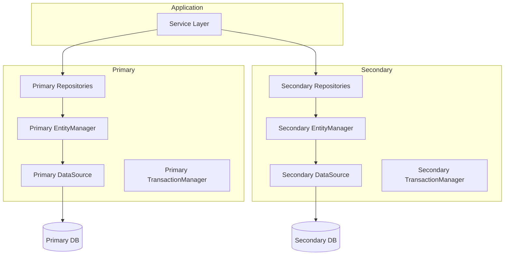

# How to Configure Multiple DataSources in Spring Boot

Author: [nawazdhandala](https://github.com/nawazdhandala)

Tags: Java, Spring Boot, Database, JPA, Configuration, Backend

Description: Learn how to configure multiple databases in Spring Boot with separate DataSources, EntityManagers, and TransactionManagers for each database.

---

Many applications need to connect to multiple databases - perhaps a primary database for application data and a secondary one for reporting, or separate databases for different bounded contexts. Spring Boot supports this, but it requires explicit configuration since auto-configuration assumes a single datasource.

## Architecture Overview



## Configuration Properties

```yaml
# application.yml
spring:
  datasource:
    primary:
      url: jdbc:postgresql://localhost:5432/primary_db
      username: primary_user
      password: primary_pass
      driver-class-name: org.postgresql.Driver
      hikari:
        pool-name: PrimaryPool
        maximum-pool-size: 10

    secondary:
      url: jdbc:mysql://localhost:3306/secondary_db
      username: secondary_user
      password: secondary_pass
      driver-class-name: com.mysql.cj.jdbc.Driver
      hikari:
        pool-name: SecondaryPool
        maximum-pool-size: 5

  jpa:
    primary:
      hibernate:
        ddl-auto: update
      show-sql: true
    secondary:
      hibernate:
        ddl-auto: validate
      show-sql: false
```

## Primary DataSource Configuration

```java
@Configuration
@EnableTransactionManagement
@EnableJpaRepositories(
    basePackages = "com.example.repository.primary",
    entityManagerFactoryRef = "primaryEntityManagerFactory",
    transactionManagerRef = "primaryTransactionManager"
)
public class PrimaryDataSourceConfig {

    @Primary
    @Bean(name = "primaryDataSourceProperties")
    @ConfigurationProperties("spring.datasource.primary")
    public DataSourceProperties primaryDataSourceProperties() {
        return new DataSourceProperties();
    }

    @Primary
    @Bean(name = "primaryDataSource")
    @ConfigurationProperties("spring.datasource.primary.hikari")
    public DataSource primaryDataSource(
            @Qualifier("primaryDataSourceProperties") DataSourceProperties properties) {
        return properties.initializeDataSourceBuilder()
            .type(HikariDataSource.class)
            .build();
    }

    @Primary
    @Bean(name = "primaryEntityManagerFactory")
    public LocalContainerEntityManagerFactoryBean primaryEntityManagerFactory(
            EntityManagerFactoryBuilder builder,
            @Qualifier("primaryDataSource") DataSource dataSource) {

        Map<String, Object> properties = new HashMap<>();
        properties.put("hibernate.hbm2ddl.auto", "update");
        properties.put("hibernate.dialect", "org.hibernate.dialect.PostgreSQLDialect");

        return builder
            .dataSource(dataSource)
            .packages("com.example.entity.primary")
            .persistenceUnit("primary")
            .properties(properties)
            .build();
    }

    @Primary
    @Bean(name = "primaryTransactionManager")
    public PlatformTransactionManager primaryTransactionManager(
            @Qualifier("primaryEntityManagerFactory") EntityManagerFactory entityManagerFactory) {
        return new JpaTransactionManager(entityManagerFactory);
    }
}
```

## Secondary DataSource Configuration

```java
@Configuration
@EnableTransactionManagement
@EnableJpaRepositories(
    basePackages = "com.example.repository.secondary",
    entityManagerFactoryRef = "secondaryEntityManagerFactory",
    transactionManagerRef = "secondaryTransactionManager"
)
public class SecondaryDataSourceConfig {

    @Bean(name = "secondaryDataSourceProperties")
    @ConfigurationProperties("spring.datasource.secondary")
    public DataSourceProperties secondaryDataSourceProperties() {
        return new DataSourceProperties();
    }

    @Bean(name = "secondaryDataSource")
    @ConfigurationProperties("spring.datasource.secondary.hikari")
    public DataSource secondaryDataSource(
            @Qualifier("secondaryDataSourceProperties") DataSourceProperties properties) {
        return properties.initializeDataSourceBuilder()
            .type(HikariDataSource.class)
            .build();
    }

    @Bean(name = "secondaryEntityManagerFactory")
    public LocalContainerEntityManagerFactoryBean secondaryEntityManagerFactory(
            EntityManagerFactoryBuilder builder,
            @Qualifier("secondaryDataSource") DataSource dataSource) {

        Map<String, Object> properties = new HashMap<>();
        properties.put("hibernate.hbm2ddl.auto", "validate");
        properties.put("hibernate.dialect", "org.hibernate.dialect.MySQLDialect");

        return builder
            .dataSource(dataSource)
            .packages("com.example.entity.secondary")
            .persistenceUnit("secondary")
            .properties(properties)
            .build();
    }

    @Bean(name = "secondaryTransactionManager")
    public PlatformTransactionManager secondaryTransactionManager(
            @Qualifier("secondaryEntityManagerFactory") EntityManagerFactory entityManagerFactory) {
        return new JpaTransactionManager(entityManagerFactory);
    }
}
```

## Project Structure

```
src/main/java/com/example/
├── config/
│   ├── PrimaryDataSourceConfig.java
│   └── SecondaryDataSourceConfig.java
├── entity/
│   ├── primary/
│   │   ├── User.java
│   │   └── Order.java
│   └── secondary/
│       ├── Report.java
│       └── Analytics.java
├── repository/
│   ├── primary/
│   │   ├── UserRepository.java
│   │   └── OrderRepository.java
│   └── secondary/
│       ├── ReportRepository.java
│       └── AnalyticsRepository.java
└── service/
    └── ReportingService.java
```

## Entity Classes

```java
// Primary database entity
package com.example.entity.primary;

@Entity
@Table(name = "users")
public class User {

    @Id
    @GeneratedValue(strategy = GenerationType.IDENTITY)
    private Long id;

    private String name;

    private String email;

    // getters and setters
}

// Secondary database entity
package com.example.entity.secondary;

@Entity
@Table(name = "reports")
public class Report {

    @Id
    @GeneratedValue(strategy = GenerationType.IDENTITY)
    private Long id;

    private String reportName;

    private LocalDateTime generatedAt;

    @Lob
    private byte[] data;

    // getters and setters
}
```

## Repository Interfaces

```java
// Primary repository
package com.example.repository.primary;

@Repository
public interface UserRepository extends JpaRepository<User, Long> {
    Optional<User> findByEmail(String email);
    List<User> findByNameContaining(String name);
}

// Secondary repository
package com.example.repository.secondary;

@Repository
public interface ReportRepository extends JpaRepository<Report, Long> {
    List<Report> findByGeneratedAtAfter(LocalDateTime date);
}
```

## Service Layer Usage

```java
@Service
public class ReportingService {

    private final UserRepository userRepository;
    private final ReportRepository reportRepository;

    public ReportingService(
            UserRepository userRepository,
            ReportRepository reportRepository) {
        this.userRepository = userRepository;
        this.reportRepository = reportRepository;
    }

    // Uses primary datasource (default)
    @Transactional
    public User createUser(String name, String email) {
        User user = new User();
        user.setName(name);
        user.setEmail(email);
        return userRepository.save(user);
    }

    // Uses secondary datasource
    @Transactional("secondaryTransactionManager")
    public Report generateReport(String name, byte[] data) {
        Report report = new Report();
        report.setReportName(name);
        report.setGeneratedAt(LocalDateTime.now());
        report.setData(data);
        return reportRepository.save(report);
    }

    // Cross-database operation (no single transaction)
    public void syncUserToReporting(Long userId) {
        // Read from primary
        User user = userRepository.findById(userId)
            .orElseThrow(() -> new EntityNotFoundException("User not found"));

        // Write to secondary
        Report report = new Report();
        report.setReportName("User Sync: " + user.getName());
        report.setGeneratedAt(LocalDateTime.now());
        reportRepository.save(report);
    }
}
```

## JdbcTemplate for Multiple DataSources

If you also need JdbcTemplate for each datasource:

```java
@Configuration
public class JdbcTemplateConfig {

    @Primary
    @Bean(name = "primaryJdbcTemplate")
    public JdbcTemplate primaryJdbcTemplate(
            @Qualifier("primaryDataSource") DataSource dataSource) {
        return new JdbcTemplate(dataSource);
    }

    @Bean(name = "secondaryJdbcTemplate")
    public JdbcTemplate secondaryJdbcTemplate(
            @Qualifier("secondaryDataSource") DataSource dataSource) {
        return new JdbcTemplate(dataSource);
    }
}

@Service
public class RawQueryService {

    @Autowired
    @Qualifier("primaryJdbcTemplate")
    private JdbcTemplate primaryJdbc;

    @Autowired
    @Qualifier("secondaryJdbcTemplate")
    private JdbcTemplate secondaryJdbc;

    public int countPrimaryUsers() {
        return primaryJdbc.queryForObject(
            "SELECT COUNT(*) FROM users", Integer.class);
    }

    public int countSecondaryReports() {
        return secondaryJdbc.queryForObject(
            "SELECT COUNT(*) FROM reports", Integer.class);
    }
}
```

## Health Checks for Multiple DataSources

```java
@Component
public class MultiDataSourceHealthIndicator implements HealthIndicator {

    @Autowired
    @Qualifier("primaryDataSource")
    private DataSource primaryDataSource;

    @Autowired
    @Qualifier("secondaryDataSource")
    private DataSource secondaryDataSource;

    @Override
    public Health health() {
        Map<String, Object> details = new HashMap<>();
        boolean allHealthy = true;

        // Check primary
        try (Connection conn = primaryDataSource.getConnection()) {
            details.put("primary", conn.isValid(5) ? "UP" : "DOWN");
        } catch (SQLException e) {
            details.put("primary", "DOWN: " + e.getMessage());
            allHealthy = false;
        }

        // Check secondary
        try (Connection conn = secondaryDataSource.getConnection()) {
            details.put("secondary", conn.isValid(5) ? "UP" : "DOWN");
        } catch (SQLException e) {
            details.put("secondary", "DOWN: " + e.getMessage());
            allHealthy = false;
        }

        return allHealthy
            ? Health.up().withDetails(details).build()
            : Health.down().withDetails(details).build();
    }
}
```

## Cross-Database Transactions

Spring cannot manage transactions across multiple datasources with standard JPA. Options:

### Option 1: Accept Eventual Consistency

```java
@Service
public class CrossDbService {

    @Transactional  // Primary only
    public void operationOnPrimary() {
        // Changes to primary DB
    }

    @Transactional("secondaryTransactionManager")  // Secondary only
    public void operationOnSecondary() {
        // Changes to secondary DB
    }

    // Not transactional - each operation has its own transaction
    public void crossDbOperation() {
        operationOnPrimary();
        operationOnSecondary();
        // If secondary fails, primary changes are already committed!
    }
}
```

### Option 2: Use JTA/XA Transactions

```xml
<dependency>
    <groupId>org.springframework.boot</groupId>
    <artifactId>spring-boot-starter-jta-atomikos</artifactId>
</dependency>
```

```java
@Configuration
public class JtaConfig {

    @Bean
    public UserTransactionManager userTransactionManager() throws Exception {
        UserTransactionManager manager = new UserTransactionManager();
        manager.setForceShutdown(false);
        return manager;
    }

    @Bean
    public JtaTransactionManager transactionManager(
            UserTransactionManager userTransactionManager) {
        return new JtaTransactionManager(
            userTransactionManager,
            userTransactionManager
        );
    }
}
```

### Option 3: Saga Pattern

```java
@Service
public class SagaOrchestrator {

    public void executeWithCompensation() {
        String primaryId = null;

        try {
            // Step 1: Primary operation
            primaryId = primaryService.create();

            // Step 2: Secondary operation
            secondaryService.create(primaryId);

        } catch (Exception e) {
            // Compensate: rollback primary
            if (primaryId != null) {
                primaryService.delete(primaryId);
            }
            throw e;
        }
    }
}
```

## Testing with Multiple DataSources

```java
@SpringBootTest
@AutoConfigureTestDatabase(replace = AutoConfigureTestDatabase.Replace.NONE)
class MultiDataSourceTest {

    @Autowired
    private UserRepository userRepository;

    @Autowired
    private ReportRepository reportRepository;

    @Test
    @Transactional  // Uses primary by default
    void testPrimaryDataSource() {
        User user = new User();
        user.setName("Test");
        user.setEmail("test@example.com");

        User saved = userRepository.save(user);
        assertThat(saved.getId()).isNotNull();
    }

    @Test
    @Transactional("secondaryTransactionManager")
    void testSecondaryDataSource() {
        Report report = new Report();
        report.setReportName("Test Report");
        report.setGeneratedAt(LocalDateTime.now());

        Report saved = reportRepository.save(report);
        assertThat(saved.getId()).isNotNull();
    }
}
```

## Summary

| Component | Primary | Secondary |
|-----------|---------|-----------|
| DataSource | @Primary, default | @Qualifier required |
| EntityManagerFactory | @Primary | Named bean |
| TransactionManager | @Primary | Named bean |
| @Transactional | Default | Specify explicitly |
| Repositories | Separate package | Separate package |
| Entities | Separate package | Separate package |

Configuring multiple datasources requires careful organization - separate packages for entities and repositories, explicit bean naming, and proper transaction manager selection. While cross-database transactions are complex, most applications can work with eventual consistency or compensating transactions.
