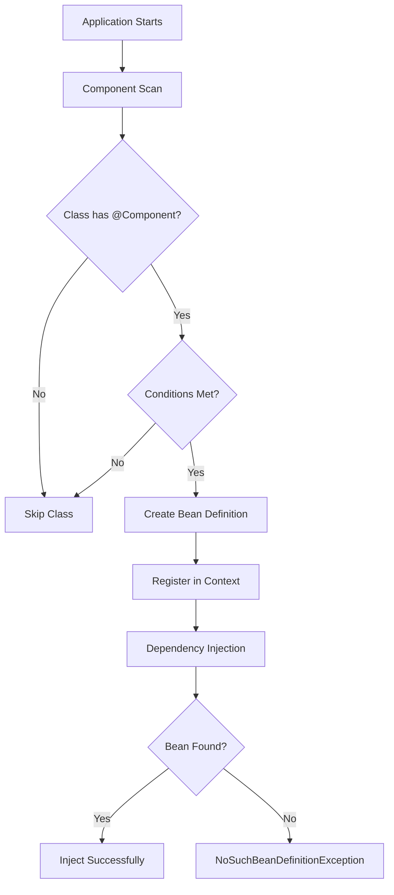

# How to Fix "No qualifying bean" Errors in Spring Boot

Author: [nawazdhandala](https://github.com/nawazdhandala)

Tags: Java, Spring Boot, Dependency Injection, Debugging, Backend

Description: Learn how to diagnose and fix "No qualifying bean of type" errors in Spring Boot applications with practical examples and solutions for common scenarios.

---

The "No qualifying bean of type" error is one of the most common issues Spring Boot developers encounter. This error occurs when Spring's dependency injection container cannot find a suitable bean to inject into your component. Understanding why this happens and how to fix it will save you hours of debugging time.

## Understanding the Error

When Spring Boot starts, it scans your application for components (classes annotated with `@Component`, `@Service`, `@Repository`, `@Controller`, etc.) and creates beans from them. When another component requests a dependency via `@Autowired`, Spring looks for a matching bean in its context.

The full error typically looks like this:

```
org.springframework.beans.factory.NoSuchBeanDefinitionException:
No qualifying bean of type 'com.example.MyService' available:
expected at least 1 bean which qualifies as autowire candidate.
```

## Common Causes and Solutions

### 1. Missing Component Annotation

The most frequent cause is forgetting to annotate your class.

```java
// Problem: Missing annotation
public class UserService {
    public User findById(Long id) {
        // implementation
    }
}

// Solution: Add @Service annotation
@Service
public class UserService {
    public User findById(Long id) {
        // implementation
    }
}
```

### 2. Class Outside Component Scan Path

Spring Boot only scans packages at or below your main application class by default.

```java
// Main application in com.example.app
@SpringBootApplication
public class MyApplication {
    public static void main(String[] args) {
        SpringApplication.run(MyApplication.class, args);
    }
}

// Problem: Service in com.other.services - won't be scanned
package com.other.services;

@Service
public class ExternalService {
    // This bean won't be found!
}
```

**Solution 1:** Move the class under the main package:

```java
package com.example.app.services;

@Service
public class ExternalService {
    // Now it will be scanned
}
```

**Solution 2:** Explicitly add packages to component scan:

```java
@SpringBootApplication
@ComponentScan(basePackages = {"com.example.app", "com.other.services"})
public class MyApplication {
    public static void main(String[] args) {
        SpringApplication.run(MyApplication.class, args);
    }
}
```

### 3. Multiple Beans of Same Type

When you have multiple implementations of an interface, Spring doesn't know which one to inject.

```java
public interface PaymentProcessor {
    void process(Payment payment);
}

@Service
public class StripePaymentProcessor implements PaymentProcessor {
    public void process(Payment payment) { /* Stripe implementation */ }
}

@Service
public class PayPalPaymentProcessor implements PaymentProcessor {
    public void process(Payment payment) { /* PayPal implementation */ }
}

// This will fail - which implementation should Spring use?
@Service
public class OrderService {
    @Autowired
    private PaymentProcessor paymentProcessor;  // Error!
}
```

**Solution 1:** Use `@Primary` to set a default:

```java
@Service
@Primary
public class StripePaymentProcessor implements PaymentProcessor {
    public void process(Payment payment) { /* Stripe implementation */ }
}
```

**Solution 2:** Use `@Qualifier` to specify which bean:

```java
@Service
public class OrderService {
    @Autowired
    @Qualifier("stripePaymentProcessor")
    private PaymentProcessor paymentProcessor;
}
```

**Solution 3:** Inject by field name matching bean name:

```java
@Service
public class OrderService {
    @Autowired
    private PaymentProcessor stripePaymentProcessor;  // Matches bean name
}
```

### 4. Conditional Bean Not Created

Beans with conditional annotations may not be created if conditions aren't met.

```java
@Service
@ConditionalOnProperty(name = "feature.email.enabled", havingValue = "true")
public class EmailService {
    public void sendEmail(String to, String subject, String body) {
        // implementation
    }
}
```

If `feature.email.enabled=true` is not in your `application.properties`, this bean won't exist.

**Solution:** Ensure the property is set:

```properties
# application.properties
feature.email.enabled=true
```

Or make the condition more flexible:

```java
@Service
@ConditionalOnProperty(name = "feature.email.enabled", havingValue = "true", matchIfMissing = true)
public class EmailService {
    // Now defaults to enabled if property is missing
}
```

### 5. Interface vs Implementation Mismatch

Sometimes you're injecting the wrong type.

```java
@Repository
public class JpaUserRepository implements UserRepository {
    // implementation
}

@Service
public class UserService {
    @Autowired
    private JpaUserRepository userRepository;  // Might work but not ideal
}
```

**Better approach:** Inject by interface:

```java
@Service
public class UserService {
    @Autowired
    private UserRepository userRepository;  // More flexible
}
```

## Diagnostic Techniques

### Enable Debug Logging

Add to `application.properties`:

```properties
logging.level.org.springframework.beans.factory=DEBUG
```

This shows detailed bean creation information.

### List All Beans

Create a diagnostic endpoint or startup runner:

```java
@Component
public class BeanLister implements CommandLineRunner {

    @Autowired
    private ApplicationContext applicationContext;

    @Override
    public void run(String... args) {
        String[] beanNames = applicationContext.getBeanDefinitionNames();
        Arrays.sort(beanNames);

        System.out.println("=== Registered Beans ===");
        for (String beanName : beanNames) {
            System.out.println(beanName);
        }
    }
}
```

### Check for Bean Existence Programmatically

```java
@Autowired
private ApplicationContext context;

public void checkBeans() {
    // Check if bean exists
    boolean exists = context.containsBean("userService");

    // Get all beans of a type
    Map<String, PaymentProcessor> processors =
        context.getBeansOfType(PaymentProcessor.class);

    processors.forEach((name, bean) ->
        System.out.println("Found: " + name + " -> " + bean.getClass()));
}
```

## Bean Registration Flow



## Using Optional Dependencies

When a bean might not exist, use `Optional` or `@Autowired(required = false)`:

```java
@Service
public class NotificationService {

    // Option 1: Optional injection
    @Autowired
    private Optional<EmailService> emailService;

    // Option 2: Non-required injection
    @Autowired(required = false)
    private SmsService smsService;

    public void notify(User user, String message) {
        emailService.ifPresent(service ->
            service.sendEmail(user.getEmail(), "Notification", message));

        if (smsService != null) {
            smsService.sendSms(user.getPhone(), message);
        }
    }
}
```

## Constructor Injection Best Practice

Constructor injection makes dependencies explicit and easier to test:

```java
@Service
public class OrderService {

    private final UserRepository userRepository;
    private final PaymentProcessor paymentProcessor;
    private final NotificationService notificationService;

    // Spring will automatically inject these - no @Autowired needed
    public OrderService(
            UserRepository userRepository,
            @Qualifier("stripePaymentProcessor") PaymentProcessor paymentProcessor,
            NotificationService notificationService) {
        this.userRepository = userRepository;
        this.paymentProcessor = paymentProcessor;
        this.notificationService = notificationService;
    }
}
```

## Common Mistakes Checklist

| Issue | Check |
|-------|-------|
| Missing annotation | Does class have `@Component`, `@Service`, `@Repository`, or `@Controller`? |
| Wrong package | Is class under main application package or explicitly scanned? |
| Multiple beans | Do you need `@Primary` or `@Qualifier`? |
| Conditional bean | Are all conditions in `@ConditionalOn*` met? |
| Profile mismatch | Is the correct `@Profile` active? |
| Test context | Is `@MockBean` or test configuration missing a bean? |

## Summary

The "No qualifying bean" error always comes down to Spring not being able to find or choose a bean. Start by verifying the component annotation exists, check that the package is being scanned, and ensure any conditions are met. When multiple implementations exist, use `@Primary` or `@Qualifier` to disambiguate. Enable debug logging to see exactly what Spring is doing during startup.

Remember: if Spring can't find your bean, it's either not registered, not in the right package, or there's ambiguity that needs resolving.
