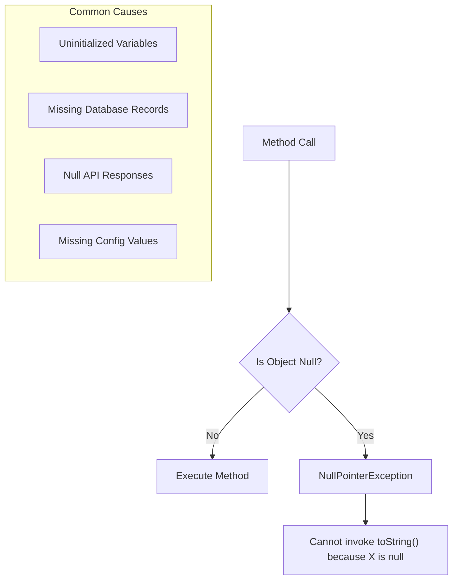

# How to Fix "Cannot invoke toString() on null" Errors

Author: [nawazdhandala](https://www.github.com/nawazdhandala)

Tags: Java, Spring Boot, NullPointerException, Debugging, Error Handling, Best Practices

Description: Learn how to diagnose and fix the common "Cannot invoke toString() on null" NullPointerException in Java and Spring Boot applications. This guide covers root causes, prevention strategies, and modern Java approaches to null safety.

---

> The infamous "Cannot invoke toString() because X is null" error is one of the most common NullPointerExceptions in Java. Spring Boot applications often encounter this when handling request data, database results, or configuration values. This guide shows you how to fix and prevent these errors.

NullPointerExceptions account for a significant portion of runtime errors in Java applications. Understanding why they occur and how to prevent them is essential for building robust applications.

---

## Understanding the Error



---

## Common Scenarios and Fixes

### Scenario 1: Null Object from Database Query

**Problem:**

```java
@Service
public class UserService {

    @Autowired
    private UserRepository userRepository;

    public String getUserDisplayName(Long userId) {
        User user = userRepository.findById(userId).orElse(null);
        // NullPointerException if user is null
        return user.getFirstName() + " " + user.getLastName();
    }
}
```

**Fix with Optional:**

```java
@Service
public class UserService {

    @Autowired
    private UserRepository userRepository;

    public String getUserDisplayName(Long userId) {
        return userRepository.findById(userId)
            .map(user -> user.getFirstName() + " " + user.getLastName())
            .orElse("Unknown User");
    }

    // Or throw a meaningful exception
    public String getUserDisplayNameOrThrow(Long userId) {
        return userRepository.findById(userId)
            .map(user -> user.getFirstName() + " " + user.getLastName())
            .orElseThrow(() -> new UserNotFoundException("User not found: " + userId));
    }
}
```

### Scenario 2: Null Fields in Entity

**Problem:**

```java
@Entity
public class Product {
    @Id
    private Long id;
    private String name;
    private String description; // Can be null
}

// In service
public String getProductInfo(Product product) {
    // NullPointerException if description is null
    return product.getName() + ": " + product.getDescription().toLowerCase();
}
```

**Fix with Null Checks:**

```java
public String getProductInfo(Product product) {
    String description = product.getDescription();
    String descriptionLower = (description != null) ? description.toLowerCase() : "No description";
    return product.getName() + ": " + descriptionLower;
}

// Or using Optional
public String getProductInfoSafe(Product product) {
    return product.getName() + ": " +
        Optional.ofNullable(product.getDescription())
            .map(String::toLowerCase)
            .orElse("No description");
}
```

### Scenario 3: Null Values in Request DTOs

**Problem:**

```java
@RestController
public class OrderController {

    @PostMapping("/orders")
    public ResponseEntity<Order> createOrder(@RequestBody OrderRequest request) {
        // NullPointerException if customerId is null
        log.info("Creating order for customer: " + request.getCustomerId().toString());
        return ResponseEntity.ok(orderService.create(request));
    }
}
```

**Fix with Validation:**

```java
@Data
public class OrderRequest {

    @NotNull(message = "Customer ID is required")
    private Long customerId;

    @NotEmpty(message = "Order items are required")
    private List<OrderItem> items;
}

@RestController
public class OrderController {

    @PostMapping("/orders")
    public ResponseEntity<Order> createOrder(@Valid @RequestBody OrderRequest request) {
        // customerId is guaranteed non-null after validation
        log.info("Creating order for customer: {}", request.getCustomerId());
        return ResponseEntity.ok(orderService.create(request));
    }
}
```

---

## Prevention Strategies

### Strategy 1: Use Objects.requireNonNull()

```java
public class OrderService {

    private final OrderRepository orderRepository;
    private final NotificationService notificationService;

    // Fail fast in constructor
    public OrderService(OrderRepository orderRepository,
                        NotificationService notificationService) {
        this.orderRepository = Objects.requireNonNull(orderRepository,
            "OrderRepository cannot be null");
        this.notificationService = Objects.requireNonNull(notificationService,
            "NotificationService cannot be null");
    }

    public void processOrder(Order order) {
        Objects.requireNonNull(order, "Order cannot be null");
        Objects.requireNonNull(order.getCustomerId(), "Customer ID cannot be null");

        // Safe to proceed
        orderRepository.save(order);
    }
}
```

### Strategy 2: Use Optional Properly

```java
public class CustomerService {

    @Autowired
    private CustomerRepository customerRepository;

    // Return Optional for methods that might not find a result
    public Optional<Customer> findByEmail(String email) {
        return customerRepository.findByEmail(email);
    }

    // Chain operations safely
    public String getCustomerCountry(String email) {
        return findByEmail(email)
            .map(Customer::getAddress)
            .map(Address::getCountry)
            .orElse("Unknown");
    }

    // Handle multiple optionals
    public Optional<String> getFormattedAddress(String email) {
        return findByEmail(email)
            .flatMap(customer -> Optional.ofNullable(customer.getAddress()))
            .map(address -> String.format("%s, %s, %s",
                Optional.ofNullable(address.getStreet()).orElse(""),
                Optional.ofNullable(address.getCity()).orElse(""),
                Optional.ofNullable(address.getCountry()).orElse("")
            ));
    }
}
```

### Strategy 3: Use String.valueOf() for Safe toString()

```java
public class LoggingService {

    // String.valueOf() handles null safely
    public void logObject(Object obj) {
        // Returns "null" string instead of throwing
        log.info("Object value: {}", String.valueOf(obj));
    }

    // Safe concatenation
    public String buildMessage(String prefix, Object value) {
        return prefix + ": " + String.valueOf(value);
    }
}
```

### Strategy 4: Use Apache Commons or Guava

```java
import org.apache.commons.lang3.StringUtils;
import com.google.common.base.Strings;

public class StringService {

    // Apache Commons StringUtils
    public String processString(String input) {
        // Returns empty string if null
        return StringUtils.defaultString(input);
    }

    public String processWithDefault(String input) {
        // Returns default if null or empty
        return StringUtils.defaultIfBlank(input, "default value");
    }

    // Guava Strings
    public String processWithGuava(String input) {
        // Returns empty string if null
        return Strings.nullToEmpty(input);
    }
}
```

---

## Using Lombok for Null Safety

### @NonNull Annotation

```java
import lombok.NonNull;
import lombok.RequiredArgsConstructor;

@Service
@RequiredArgsConstructor
public class PaymentService {

    @NonNull
    private final PaymentGateway paymentGateway;

    // Lombok generates null check
    public void processPayment(@NonNull PaymentRequest request) {
        // request is guaranteed non-null
        paymentGateway.process(request);
    }
}
```

### Safe Getters with Default Values

```java
import lombok.Data;
import lombok.Builder;

@Data
@Builder
public class UserProfile {

    private String firstName;
    private String lastName;
    private String bio;

    // Custom getter with null safety
    public String getBio() {
        return bio != null ? bio : "No bio available";
    }

    public String getFullName() {
        return String.format("%s %s",
            firstName != null ? firstName : "",
            lastName != null ? lastName : ""
        ).trim();
    }
}
```

---

## Spring-Specific Solutions

### Configure Default Values

```java
@Configuration
public class AppConfig {

    @Value("${app.default.message:Default Message}")
    private String defaultMessage;

    @Value("${app.timeout:30}")
    private int timeout;
}
```

### Use @ConfigurationProperties with Defaults

```java
@ConfigurationProperties(prefix = "app")
@Data
public class AppProperties {

    private String name = "Default App";
    private int maxRetries = 3;
    private Duration timeout = Duration.ofSeconds(30);

    private Database database = new Database();

    @Data
    public static class Database {
        private String host = "localhost";
        private int port = 5432;
    }
}
```

### Handle Null in REST Responses

```java
@RestController
@RequestMapping("/api/users")
public class UserController {

    @GetMapping("/{id}")
    public ResponseEntity<UserResponse> getUser(@PathVariable Long id) {
        return userService.findById(id)
            .map(ResponseEntity::ok)
            .orElse(ResponseEntity.notFound().build());
    }

    @GetMapping("/{id}/profile")
    public ResponseEntity<ProfileResponse> getProfile(@PathVariable Long id) {
        return userService.findById(id)
            .map(user -> {
                ProfileResponse response = new ProfileResponse();
                response.setName(Optional.ofNullable(user.getName()).orElse("Anonymous"));
                response.setBio(Optional.ofNullable(user.getBio()).orElse(""));
                return ResponseEntity.ok(response);
            })
            .orElse(ResponseEntity.notFound().build());
    }
}
```

---

## Debugging NullPointerException

### Enable Helpful NullPointerExceptions (Java 14+)

Add to your JVM arguments:

```bash
-XX:+ShowCodeDetailsInExceptionMessages
```

This produces more helpful messages:

```
// Before
java.lang.NullPointerException

// After
java.lang.NullPointerException: Cannot invoke "String.toLowerCase()"
because the return value of "User.getName()" is null
```

### Add Null Checks in Tests

```java
@Test
void shouldHandleNullGracefully() {
    UserService service = new UserService(mockRepository);

    when(mockRepository.findById(anyLong())).thenReturn(Optional.empty());

    // Should not throw NullPointerException
    String result = service.getUserDisplayName(999L);

    assertThat(result).isEqualTo("Unknown User");
}

@Test
void shouldHandleNullFieldsInEntity() {
    User user = new User();
    user.setFirstName("John");
    user.setLastName(null); // Intentionally null

    String displayName = service.formatUserName(user);

    assertThat(displayName).isEqualTo("John");
}
```

---

## Best Practices Summary

| Practice | When to Use |
|----------|-------------|
| `Optional<T>` | Return types for methods that might not find a result |
| `Objects.requireNonNull()` | Constructor and method parameter validation |
| `@NotNull` validation | Request DTOs and form inputs |
| `String.valueOf()` | Safe toString() conversion |
| Default values | Configuration properties |
| Null-safe operators | Stream operations and chains |

---

## Conclusion

Preventing "Cannot invoke toString() on null" errors requires a multi-layered approach:

- Use `Optional` for methods that might return null
- Validate inputs with Bean Validation annotations
- Use `Objects.requireNonNull()` for fail-fast validation
- Enable helpful NPE messages in Java 14+
- Write tests that specifically check null handling

By following these practices, you can significantly reduce NullPointerExceptions in your Spring Boot applications.

---

*Need to track NullPointerExceptions in production? [OneUptime](https://oneuptime.com) provides error tracking and alerting to help you catch and fix issues before they impact users.*
