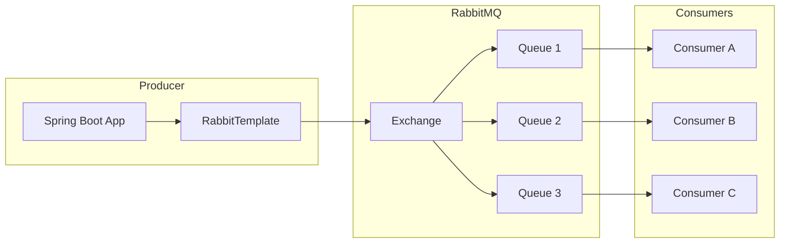

# How to Configure Spring Boot with RabbitMQ

Author: [nawazdhandala](https://www.github.com/nawazdhandala)

Tags: Java, Spring Boot, RabbitMQ, Messaging, AMQP, Microservices

Description: Learn how to configure RabbitMQ with Spring Boot for reliable message queuing. This guide covers exchange types, queue configuration, message publishing, consuming, error handling, and production best practices.

---

> RabbitMQ is a powerful message broker that enables reliable asynchronous communication between services. Spring Boot's AMQP integration makes it straightforward to implement messaging patterns. This guide walks you through complete RabbitMQ configuration.

Message queues decouple services, improve reliability, and enable asynchronous processing. RabbitMQ's flexibility with exchange types and routing makes it ideal for complex messaging scenarios.

---

## Architecture Overview



---

## Dependencies Setup

Add the Spring AMQP dependency to your `pom.xml`:

```xml
<dependencies>
    <dependency>
        <groupId>org.springframework.boot</groupId>
        <artifactId>spring-boot-starter-amqp</artifactId>
    </dependency>
    <dependency>
        <groupId>org.springframework.boot</groupId>
        <artifactId>spring-boot-starter-web</artifactId>
    </dependency>
    <!-- For JSON serialization -->
    <dependency>
        <groupId>com.fasterxml.jackson.core</groupId>
        <artifactId>jackson-databind</artifactId>
    </dependency>
</dependencies>
```

---

## Basic Configuration

Configure RabbitMQ in `application.yml`:

```yaml
spring:
  rabbitmq:
    host: localhost
    port: 5672
    username: guest
    password: guest
    virtual-host: /

    # Publisher confirms for reliability
    publisher-confirm-type: correlated
    publisher-returns: true

    # Listener configuration
    listener:
      simple:
        acknowledge-mode: manual
        prefetch: 10
        retry:
          enabled: true
          initial-interval: 1000
          max-attempts: 3
          max-interval: 10000
          multiplier: 2.0
```

---

## RabbitMQ Configuration Class

### Defining Exchanges, Queues, and Bindings

```java
package com.example.config;

import org.springframework.amqp.core.*;
import org.springframework.amqp.rabbit.connection.ConnectionFactory;
import org.springframework.amqp.rabbit.core.RabbitTemplate;
import org.springframework.amqp.support.converter.Jackson2JsonMessageConverter;
import org.springframework.amqp.support.converter.MessageConverter;
import org.springframework.context.annotation.Bean;
import org.springframework.context.annotation.Configuration;

@Configuration
public class RabbitMQConfig {

    // Queue names
    public static final String ORDER_QUEUE = "order.queue";
    public static final String NOTIFICATION_QUEUE = "notification.queue";
    public static final String DLQ_QUEUE = "order.dlq";

    // Exchange names
    public static final String ORDER_EXCHANGE = "order.exchange";
    public static final String DLQ_EXCHANGE = "dlq.exchange";

    // Routing keys
    public static final String ORDER_ROUTING_KEY = "order.created";
    public static final String NOTIFICATION_ROUTING_KEY = "order.notification";

    // Dead Letter Queue
    @Bean
    public Queue deadLetterQueue() {
        return QueueBuilder.durable(DLQ_QUEUE).build();
    }

    @Bean
    public DirectExchange deadLetterExchange() {
        return new DirectExchange(DLQ_EXCHANGE);
    }

    @Bean
    public Binding dlqBinding() {
        return BindingBuilder.bind(deadLetterQueue())
            .to(deadLetterExchange())
            .with("dlq.routing.key");
    }

    // Order Queue with DLQ
    @Bean
    public Queue orderQueue() {
        return QueueBuilder.durable(ORDER_QUEUE)
            .withArgument("x-dead-letter-exchange", DLQ_EXCHANGE)
            .withArgument("x-dead-letter-routing-key", "dlq.routing.key")
            .withArgument("x-message-ttl", 86400000) // 24 hours
            .build();
    }

    // Notification Queue
    @Bean
    public Queue notificationQueue() {
        return QueueBuilder.durable(NOTIFICATION_QUEUE)
            .build();
    }

    // Topic Exchange for flexible routing
    @Bean
    public TopicExchange orderExchange() {
        return new TopicExchange(ORDER_EXCHANGE);
    }

    // Bindings
    @Bean
    public Binding orderBinding(Queue orderQueue, TopicExchange orderExchange) {
        return BindingBuilder.bind(orderQueue)
            .to(orderExchange)
            .with(ORDER_ROUTING_KEY);
    }

    @Bean
    public Binding notificationBinding(Queue notificationQueue, TopicExchange orderExchange) {
        return BindingBuilder.bind(notificationQueue)
            .to(orderExchange)
            .with("order.*");
    }

    // JSON Message Converter
    @Bean
    public MessageConverter jsonMessageConverter() {
        return new Jackson2JsonMessageConverter();
    }

    // RabbitTemplate with confirms
    @Bean
    public RabbitTemplate rabbitTemplate(ConnectionFactory connectionFactory) {
        RabbitTemplate template = new RabbitTemplate(connectionFactory);
        template.setMessageConverter(jsonMessageConverter());
        template.setMandatory(true);

        template.setConfirmCallback((correlationData, ack, cause) -> {
            if (!ack) {
                System.err.println("Message not confirmed: " + cause);
            }
        });

        template.setReturnsCallback(returned -> {
            System.err.println("Message returned: " + returned.getMessage());
        });

        return template;
    }
}
```

---

## Message DTOs

```java
package com.example.dto;

import lombok.AllArgsConstructor;
import lombok.Builder;
import lombok.Data;
import lombok.NoArgsConstructor;

import java.io.Serializable;
import java.math.BigDecimal;
import java.time.Instant;
import java.util.List;

@Data
@Builder
@NoArgsConstructor
@AllArgsConstructor
public class OrderMessage implements Serializable {

    private String orderId;
    private String customerId;
    private List<OrderItem> items;
    private BigDecimal totalAmount;
    private String status;
    private Instant createdAt;

    @Data
    @Builder
    @NoArgsConstructor
    @AllArgsConstructor
    public static class OrderItem implements Serializable {
        private String productId;
        private String productName;
        private Integer quantity;
        private BigDecimal price;
    }
}
```

---

## Message Producer

```java
package com.example.service;

import com.example.config.RabbitMQConfig;
import com.example.dto.OrderMessage;
import lombok.RequiredArgsConstructor;
import lombok.extern.slf4j.Slf4j;
import org.springframework.amqp.core.MessagePostProcessor;
import org.springframework.amqp.rabbit.core.RabbitTemplate;
import org.springframework.stereotype.Service;

import java.util.UUID;

@Service
@RequiredArgsConstructor
@Slf4j
public class OrderMessageProducer {

    private final RabbitTemplate rabbitTemplate;

    public void sendOrderCreatedEvent(OrderMessage order) {
        log.info("Sending order created event: {}", order.getOrderId());

        // Add custom headers
        MessagePostProcessor messagePostProcessor = message -> {
            message.getMessageProperties().setCorrelationId(UUID.randomUUID().toString());
            message.getMessageProperties().setHeader("eventType", "ORDER_CREATED");
            return message;
        };

        rabbitTemplate.convertAndSend(
            RabbitMQConfig.ORDER_EXCHANGE,
            RabbitMQConfig.ORDER_ROUTING_KEY,
            order,
            messagePostProcessor
        );
    }

    public void sendOrderNotification(OrderMessage order) {
        log.info("Sending order notification: {}", order.getOrderId());

        rabbitTemplate.convertAndSend(
            RabbitMQConfig.ORDER_EXCHANGE,
            RabbitMQConfig.NOTIFICATION_ROUTING_KEY,
            order
        );
    }

    // Send with delay (requires delayed message plugin)
    public void sendDelayedMessage(OrderMessage order, long delayMillis) {
        MessagePostProcessor messagePostProcessor = message -> {
            message.getMessageProperties().setDelay((int) delayMillis);
            return message;
        };

        rabbitTemplate.convertAndSend(
            "delayed.exchange",
            "delayed.routing.key",
            order,
            messagePostProcessor
        );
    }
}
```

---

## Message Consumer

### Basic Consumer with Manual Acknowledgment

```java
package com.example.service;

import com.example.config.RabbitMQConfig;
import com.example.dto.OrderMessage;
import com.rabbitmq.client.Channel;
import lombok.RequiredArgsConstructor;
import lombok.extern.slf4j.Slf4j;
import org.springframework.amqp.rabbit.annotation.RabbitListener;
import org.springframework.amqp.support.AmqpHeaders;
import org.springframework.messaging.handler.annotation.Header;
import org.springframework.messaging.handler.annotation.Payload;
import org.springframework.stereotype.Service;

import java.io.IOException;

@Service
@RequiredArgsConstructor
@Slf4j
public class OrderMessageConsumer {

    private final OrderProcessingService orderProcessingService;

    @RabbitListener(queues = RabbitMQConfig.ORDER_QUEUE)
    public void handleOrderMessage(
            @Payload OrderMessage order,
            @Header(AmqpHeaders.DELIVERY_TAG) long deliveryTag,
            @Header(name = "eventType", required = false) String eventType,
            Channel channel) throws IOException {

        log.info("Received order message: {} with event type: {}", order.getOrderId(), eventType);

        try {
            // Process the order
            orderProcessingService.processOrder(order);

            // Acknowledge successful processing
            channel.basicAck(deliveryTag, false);
            log.info("Order processed successfully: {}", order.getOrderId());

        } catch (Exception e) {
            log.error("Error processing order: {}", order.getOrderId(), e);

            // Reject and requeue or send to DLQ
            boolean requeue = shouldRequeue(e);
            channel.basicNack(deliveryTag, false, requeue);
        }
    }

    private boolean shouldRequeue(Exception e) {
        // Don't requeue for business logic errors
        return !(e instanceof IllegalArgumentException ||
                 e instanceof IllegalStateException);
    }
}
```

### Consumer with Retry Configuration

```java
package com.example.config;

import org.springframework.amqp.rabbit.config.SimpleRabbitListenerContainerFactory;
import org.springframework.amqp.rabbit.connection.ConnectionFactory;
import org.springframework.amqp.rabbit.listener.RabbitListenerContainerFactory;
import org.springframework.amqp.rabbit.listener.SimpleMessageListenerContainer;
import org.springframework.amqp.support.converter.MessageConverter;
import org.springframework.context.annotation.Bean;
import org.springframework.context.annotation.Configuration;
import org.springframework.retry.backoff.ExponentialBackOffPolicy;
import org.springframework.retry.policy.SimpleRetryPolicy;
import org.springframework.retry.support.RetryTemplate;

@Configuration
public class RabbitListenerConfig {

    @Bean
    public RabbitListenerContainerFactory<SimpleMessageListenerContainer> rabbitListenerContainerFactory(
            ConnectionFactory connectionFactory,
            MessageConverter messageConverter) {

        SimpleRabbitListenerContainerFactory factory = new SimpleRabbitListenerContainerFactory();
        factory.setConnectionFactory(connectionFactory);
        factory.setMessageConverter(messageConverter);
        factory.setConcurrentConsumers(3);
        factory.setMaxConcurrentConsumers(10);
        factory.setPrefetchCount(10);

        // Configure retry
        factory.setRetryTemplate(retryTemplate());

        return factory;
    }

    @Bean
    public RetryTemplate retryTemplate() {
        RetryTemplate retryTemplate = new RetryTemplate();

        // Retry policy
        SimpleRetryPolicy retryPolicy = new SimpleRetryPolicy();
        retryPolicy.setMaxAttempts(3);
        retryTemplate.setRetryPolicy(retryPolicy);

        // Backoff policy
        ExponentialBackOffPolicy backOffPolicy = new ExponentialBackOffPolicy();
        backOffPolicy.setInitialInterval(1000);
        backOffPolicy.setMultiplier(2.0);
        backOffPolicy.setMaxInterval(10000);
        retryTemplate.setBackOffPolicy(backOffPolicy);

        return retryTemplate;
    }
}
```

---

## Exchange Types

### Direct Exchange

```java
@Bean
public DirectExchange directExchange() {
    return new DirectExchange("direct.exchange");
}

// Exact routing key match
@Bean
public Binding directBinding(Queue queue, DirectExchange exchange) {
    return BindingBuilder.bind(queue)
        .to(exchange)
        .with("exact.routing.key");
}
```

### Fanout Exchange (Broadcast)

```java
@Bean
public FanoutExchange fanoutExchange() {
    return new FanoutExchange("fanout.exchange");
}

// All bound queues receive the message
@Bean
public Binding fanoutBinding(Queue queue, FanoutExchange exchange) {
    return BindingBuilder.bind(queue)
        .to(exchange);
}
```

### Topic Exchange (Pattern Matching)

```java
@Bean
public TopicExchange topicExchange() {
    return new TopicExchange("topic.exchange");
}

// Pattern matching with * and #
@Bean
public Binding topicBinding(Queue queue, TopicExchange exchange) {
    // order.* matches order.created, order.shipped
    // order.# matches order.created, order.item.added
    return BindingBuilder.bind(queue)
        .to(exchange)
        .with("order.*");
}
```

### Headers Exchange

```java
@Bean
public HeadersExchange headersExchange() {
    return new HeadersExchange("headers.exchange");
}

@Bean
public Binding headersBinding(Queue queue, HeadersExchange exchange) {
    return BindingBuilder.bind(queue)
        .to(exchange)
        .where("x-match").matches("all")
        .and("type").exists()
        .and("priority").matches("high");
}
```

---

## Error Handling

### Dead Letter Queue Consumer

```java
@Service
@Slf4j
public class DeadLetterQueueConsumer {

    @RabbitListener(queues = RabbitMQConfig.DLQ_QUEUE)
    public void handleDeadLetter(
            @Payload OrderMessage order,
            @Header(name = "x-death", required = false) List<Map<String, Object>> xDeath,
            Channel channel,
            @Header(AmqpHeaders.DELIVERY_TAG) long deliveryTag) throws IOException {

        log.error("Received dead letter message: {}", order.getOrderId());

        if (xDeath != null && !xDeath.isEmpty()) {
            Map<String, Object> death = xDeath.get(0);
            log.error("Death reason: {}, queue: {}, count: {}",
                death.get("reason"),
                death.get("queue"),
                death.get("count"));
        }

        // Store for manual inspection or alert
        alertService.notifyDeadLetter(order);

        channel.basicAck(deliveryTag, false);
    }
}
```

### Global Error Handler

```java
@Configuration
public class RabbitErrorConfig {

    @Bean
    public ErrorHandler errorHandler() {
        return new ConditionalRejectingErrorHandler(
            new CustomFatalExceptionStrategy()
        );
    }

    public static class CustomFatalExceptionStrategy
            extends ConditionalRejectingErrorHandler.DefaultExceptionStrategy {

        @Override
        public boolean isFatal(Throwable t) {
            // Don't requeue for these exceptions
            return t instanceof MessageConversionException ||
                   t instanceof MethodArgumentNotValidException ||
                   super.isFatal(t);
        }
    }
}
```

---

## Production Configuration

```yaml
spring:
  rabbitmq:
    host: ${RABBITMQ_HOST:localhost}
    port: ${RABBITMQ_PORT:5672}
    username: ${RABBITMQ_USERNAME:guest}
    password: ${RABBITMQ_PASSWORD:guest}
    virtual-host: ${RABBITMQ_VHOST:/}

    # SSL Configuration
    ssl:
      enabled: true
      key-store: classpath:rabbitmq.keystore.p12
      key-store-password: ${RABBITMQ_KEYSTORE_PASSWORD}
      trust-store: classpath:rabbitmq.truststore.jks
      trust-store-password: ${RABBITMQ_TRUSTSTORE_PASSWORD}

    # Connection settings
    connection-timeout: 30000
    requested-heartbeat: 60

    # Publisher settings
    publisher-confirm-type: correlated
    publisher-returns: true
    template:
      mandatory: true
      receive-timeout: 30000
      reply-timeout: 30000

    # Listener settings
    listener:
      simple:
        acknowledge-mode: manual
        prefetch: 10
        concurrency: 3
        max-concurrency: 10
        missing-queues-fatal: false
        retry:
          enabled: true
          initial-interval: 1000
          max-attempts: 5
          max-interval: 30000
          multiplier: 2.0

    # Cache settings
    cache:
      channel:
        size: 25
        checkout-timeout: 1000
```

---

## Testing

```java
@SpringBootTest
@Testcontainers
class RabbitMQIntegrationTest {

    @Container
    static RabbitMQContainer rabbitMQ = new RabbitMQContainer("rabbitmq:3-management");

    @Autowired
    private OrderMessageProducer producer;

    @Autowired
    private RabbitTemplate rabbitTemplate;

    @DynamicPropertySource
    static void rabbitProperties(DynamicPropertyRegistry registry) {
        registry.add("spring.rabbitmq.host", rabbitMQ::getHost);
        registry.add("spring.rabbitmq.port", rabbitMQ::getAmqpPort);
    }

    @Test
    void shouldSendAndReceiveMessage() {
        OrderMessage order = OrderMessage.builder()
            .orderId("TEST-001")
            .customerId("CUST-001")
            .status("CREATED")
            .build();

        producer.sendOrderCreatedEvent(order);

        // Receive message
        OrderMessage received = (OrderMessage) rabbitTemplate.receiveAndConvert(
            RabbitMQConfig.ORDER_QUEUE, 5000);

        assertThat(received).isNotNull();
        assertThat(received.getOrderId()).isEqualTo("TEST-001");
    }
}
```

---

## Best Practices

1. **Use Manual Acknowledgment** - Control message processing confirmation
2. **Configure Dead Letter Queues** - Handle failed messages gracefully
3. **Enable Publisher Confirms** - Ensure message delivery
4. **Set Appropriate Prefetch** - Balance throughput and memory usage
5. **Use JSON Serialization** - For language-agnostic messaging
6. **Monitor Queue Depth** - Alert on message buildup

---

## Conclusion

Spring Boot's RabbitMQ integration provides a robust messaging foundation. Key takeaways:

- Use appropriate exchange types for your routing needs
- Configure dead letter queues for error handling
- Enable publisher confirms for reliability
- Use manual acknowledgment for controlled processing
- Implement proper retry and backoff strategies

With these patterns, you can build reliable asynchronous communication between services.

---

*Need to monitor your RabbitMQ queues? [OneUptime](https://oneuptime.com) provides comprehensive queue monitoring with depth tracking and alerting.*
