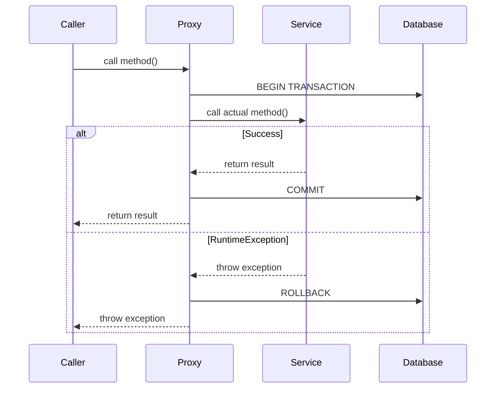

# How to Handle Transaction Management in Spring Boot

Author: [nawazdhandala](https://github.com/nawazdhandala)

Tags: Java, Spring Boot, Database, Transactions, JPA, Backend

Description: Learn how to properly manage database transactions in Spring Boot using @Transactional with practical examples covering propagation, isolation, rollback rules, and common pitfalls.

---

Transaction management ensures that a series of database operations either all succeed or all fail together. Spring Boot makes this easy with the `@Transactional` annotation, but understanding its nuances is crucial for avoiding subtle bugs that can corrupt your data.

## How @Transactional Works

When you annotate a method with `@Transactional`, Spring creates a proxy that:

1. Opens a transaction before the method executes
2. Commits if the method completes normally
3. Rolls back if a RuntimeException is thrown



## Basic Usage

```java
@Service
public class OrderService {

    @Autowired
    private OrderRepository orderRepository;

    @Autowired
    private InventoryService inventoryService;

    @Autowired
    private PaymentService paymentService;

    @Transactional
    public Order createOrder(OrderRequest request) {
        // All these operations are in one transaction

        // 1. Create order
        Order order = new Order();
        order.setCustomerId(request.getCustomerId());
        order.setItems(request.getItems());
        order = orderRepository.save(order);

        // 2. Reserve inventory
        inventoryService.reserveItems(order.getItems());

        // 3. Process payment
        paymentService.charge(order.getCustomerId(), order.getTotal());

        // If any step fails, everything rolls back
        return order;
    }
}
```

## Transaction Propagation

Propagation defines what happens when a transactional method calls another transactional method.

### REQUIRED (Default)

```java
@Service
public class OrderService {

    @Transactional  // Propagation.REQUIRED is default
    public void createOrder() {
        // Uses existing transaction or creates new one
        inventoryService.updateStock();  // Joins this transaction
    }
}

@Service
public class InventoryService {

    @Transactional  // Joins caller's transaction
    public void updateStock() {
        // Part of OrderService's transaction
    }
}
```

### REQUIRES_NEW

```java
@Service
public class AuditService {

    @Transactional(propagation = Propagation.REQUIRES_NEW)
    public void logAction(String action) {
        // Always creates a new transaction
        // Commits independently of the outer transaction
        auditRepository.save(new AuditLog(action));
    }
}

@Service
public class OrderService {

    @Autowired
    private AuditService auditService;

    @Transactional
    public void createOrder(OrderRequest request) {
        // Audit log is saved even if order creation fails
        auditService.logAction("Order attempt: " + request.getCustomerId());

        Order order = processOrder(request);

        // If this fails, audit log is still committed
        if (order.getTotal().compareTo(BigDecimal.ZERO) <= 0) {
            throw new InvalidOrderException("Invalid total");
        }
    }
}
```

### MANDATORY

```java
@Service
public class InventoryService {

    @Transactional(propagation = Propagation.MANDATORY)
    public void reserveItems(List<OrderItem> items) {
        // Throws exception if called without existing transaction
        // Use when method should never be called standalone
    }
}
```

### Propagation Types Reference

| Type | Behavior |
|------|----------|
| REQUIRED | Use existing or create new (default) |
| REQUIRES_NEW | Always create new, suspend existing |
| MANDATORY | Must have existing, throw if not |
| SUPPORTS | Use existing if present, else non-transactional |
| NOT_SUPPORTED | Execute non-transactionally, suspend existing |
| NEVER | Throw if transaction exists |
| NESTED | Nested transaction with savepoint |

## Isolation Levels

Isolation levels control how transactions interact with concurrent transactions.

```java
@Service
public class AccountService {

    // Prevent dirty reads, non-repeatable reads, and phantom reads
    @Transactional(isolation = Isolation.SERIALIZABLE)
    public void transferMoney(Long fromId, Long toId, BigDecimal amount) {
        Account from = accountRepository.findById(fromId).orElseThrow();
        Account to = accountRepository.findById(toId).orElseThrow();

        from.debit(amount);
        to.credit(amount);

        accountRepository.save(from);
        accountRepository.save(to);
    }

    // Default - prevents dirty reads only
    @Transactional(isolation = Isolation.READ_COMMITTED)
    public BigDecimal getBalance(Long accountId) {
        return accountRepository.findById(accountId)
            .map(Account::getBalance)
            .orElse(BigDecimal.ZERO);
    }
}
```

### Isolation Levels Reference

| Level | Dirty Reads | Non-Repeatable Reads | Phantom Reads |
|-------|-------------|---------------------|---------------|
| READ_UNCOMMITTED | Yes | Yes | Yes |
| READ_COMMITTED | No | Yes | Yes |
| REPEATABLE_READ | No | No | Yes |
| SERIALIZABLE | No | No | No |

## Rollback Rules

By default, Spring only rolls back on unchecked exceptions (RuntimeException).

```java
@Service
public class PaymentService {

    // Default: rolls back on RuntimeException
    @Transactional
    public void processPayment(Payment payment) {
        // Rolls back
        throw new RuntimeException("Something went wrong");
    }

    // Checked exceptions don't trigger rollback by default
    @Transactional
    public void processWithChecked(Payment payment) throws PaymentException {
        // Does NOT roll back!
        throw new PaymentException("Payment failed");
    }

    // Configure to rollback on checked exceptions
    @Transactional(rollbackFor = PaymentException.class)
    public void processWithRollback(Payment payment) throws PaymentException {
        // Now rolls back
        throw new PaymentException("Payment failed");
    }

    // Rollback on all exceptions
    @Transactional(rollbackFor = Exception.class)
    public void processWithAllRollback(Payment payment) throws Exception {
        // Rolls back on any exception
    }

    // Don't rollback on specific exception
    @Transactional(noRollbackFor = ItemOutOfStockException.class)
    public void processWithNoRollback(Order order) {
        // Continues even if ItemOutOfStockException is thrown
    }
}
```

## Common Pitfalls

### Pitfall 1: Self-Invocation

```java
@Service
public class UserService {

    public void processUsers(List<Long> userIds) {
        for (Long id : userIds) {
            // THIS DOESN'T WORK! Bypasses proxy
            processUser(id);
        }
    }

    @Transactional
    public void processUser(Long userId) {
        // Transaction not active when called from processUsers
    }
}
```

**Solutions:**

```java
// Solution 1: Inject self
@Service
public class UserService {

    @Autowired
    private UserService self;  // Inject proxy

    public void processUsers(List<Long> userIds) {
        for (Long id : userIds) {
            self.processUser(id);  // Goes through proxy
        }
    }

    @Transactional
    public void processUser(Long userId) {
        // Now transactional
    }
}

// Solution 2: Extract to separate service
@Service
public class UserBatchService {

    @Autowired
    private UserService userService;

    public void processUsers(List<Long> userIds) {
        for (Long id : userIds) {
            userService.processUser(id);
        }
    }
}
```

### Pitfall 2: Catching Exceptions

```java
@Service
public class OrderService {

    @Transactional
    public void createOrder(OrderRequest request) {
        try {
            orderRepository.save(new Order(request));
            inventoryService.reserve(request.getItems());  // Throws exception
        } catch (Exception e) {
            // Transaction is marked for rollback!
            // Even though we caught the exception, Spring saw it
            log.error("Error creating order", e);
        }
        // This save will fail because transaction is marked for rollback
        statusRepository.save(new Status("attempted"));
    }
}
```

**Solution:**

```java
@Service
public class OrderService {

    @Transactional
    public void createOrder(OrderRequest request) {
        orderRepository.save(new Order(request));

        try {
            inventoryService.reserve(request.getItems());
        } catch (Exception e) {
            // Handle without letting transaction see the exception
            log.warn("Inventory reservation failed, continuing anyway");
            // Note: only do this if you actually want to continue
        }

        statusRepository.save(new Status("attempted"));
    }
}
```

### Pitfall 3: Private Methods

```java
@Service
public class UserService {

    // This won't be transactional - Spring can't proxy private methods
    @Transactional
    private void processUser(Long userId) {
        // Not transactional!
    }
}
```

### Pitfall 4: Wrong Package for @Transactional

```java
// Wrong! Using javax instead of Spring
import javax.transaction.Transactional;

// Correct
import org.springframework.transaction.annotation.Transactional;
```

## Read-Only Transactions

```java
@Service
public class ReportService {

    @Transactional(readOnly = true)
    public Report generateReport(Long customerId) {
        // Hibernate optimizations:
        // - No dirty checking
        // - No flush at end
        // - Potential read replica routing

        Customer customer = customerRepository.findById(customerId).orElseThrow();
        List<Order> orders = orderRepository.findByCustomerId(customerId);

        return new Report(customer, orders);
    }
}
```

## Timeout Configuration

```java
@Service
public class DataProcessingService {

    @Transactional(timeout = 30)  // 30 seconds
    public void processLargeDataset(List<Data> data) {
        // Transaction will be rolled back if it takes longer than 30 seconds
        for (Data item : data) {
            processItem(item);
        }
    }
}
```

## Programmatic Transaction Management

For fine-grained control:

```java
@Service
public class FlexibleService {

    @Autowired
    private TransactionTemplate transactionTemplate;

    @Autowired
    private PlatformTransactionManager transactionManager;

    // Using TransactionTemplate
    public void processWithTemplate() {
        transactionTemplate.execute(status -> {
            // Transactional operations
            userRepository.save(new User());

            // Programmatic rollback
            if (someCondition) {
                status.setRollbackOnly();
            }

            return null;
        });
    }

    // Using TransactionManager directly
    public void processWithManager() {
        DefaultTransactionDefinition def = new DefaultTransactionDefinition();
        def.setPropagationBehavior(TransactionDefinition.PROPAGATION_REQUIRED);
        def.setIsolationLevel(TransactionDefinition.ISOLATION_READ_COMMITTED);

        TransactionStatus status = transactionManager.getTransaction(def);

        try {
            userRepository.save(new User());
            transactionManager.commit(status);
        } catch (Exception e) {
            transactionManager.rollback(status);
            throw e;
        }
    }
}
```

## Testing Transactions

```java
@SpringBootTest
@Transactional  // Each test runs in a transaction that's rolled back
class OrderServiceTest {

    @Autowired
    private OrderService orderService;

    @Autowired
    private OrderRepository orderRepository;

    @Test
    void createOrderSuccess() {
        OrderRequest request = new OrderRequest();
        request.setCustomerId(1L);

        Order order = orderService.createOrder(request);

        assertThat(order.getId()).isNotNull();
        assertThat(orderRepository.findById(order.getId())).isPresent();
        // Changes are rolled back after test
    }

    @Test
    @Commit  // Actually commit the transaction
    void createOrderAndCommit() {
        // This test commits its changes
    }
}
```

## Summary

| Aspect | Default | When to Change |
|--------|---------|----------------|
| Propagation | REQUIRED | REQUIRES_NEW for independent logging |
| Isolation | DEFAULT (DB-specific) | Higher for financial operations |
| Rollback | RuntimeException | Add checked exceptions as needed |
| Read-only | false | true for read-only operations |
| Timeout | -1 (none) | Set for long-running operations |

Proper transaction management is essential for data integrity. Remember that `@Transactional` only works through Spring proxies, so avoid self-invocation and keep methods public. Use appropriate propagation and isolation levels for your use case, and always test your transaction boundaries.
