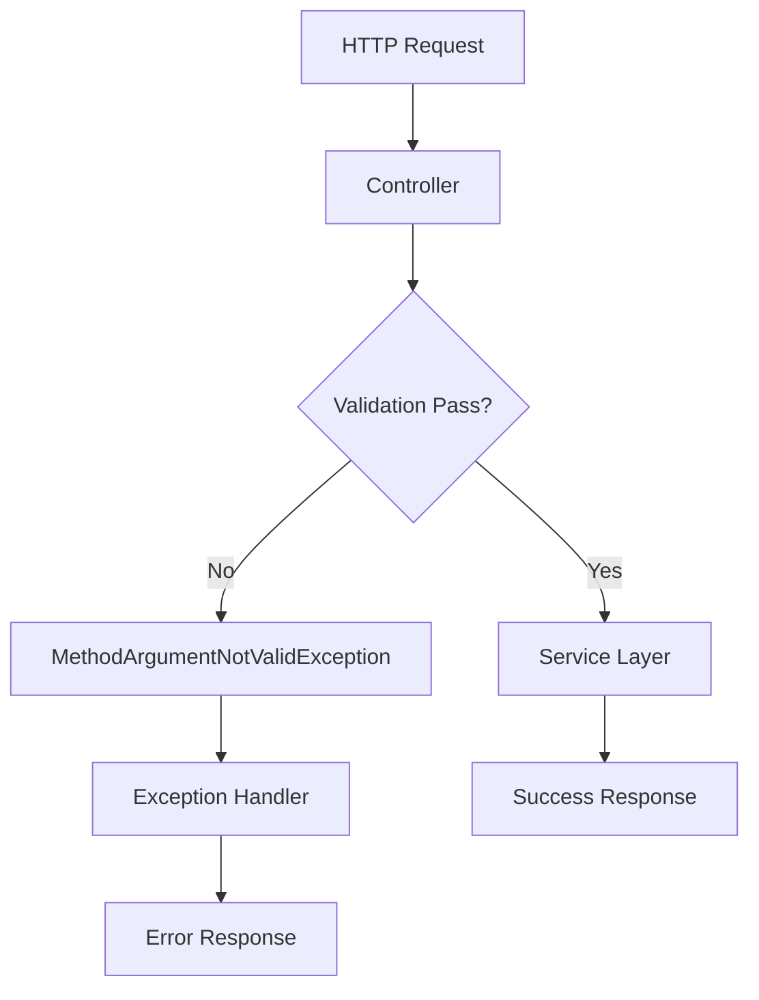

# How to Handle Validation Errors in Spring Boot

Author: [nawazdhandala](https://www.github.com/nawazdhandala)

Tags: Java, Spring Boot, Validation, Bean Validation, REST API, Error Handling

Description: Learn how to properly handle validation errors in Spring Boot applications. This guide covers Bean Validation annotations, custom validators, exception handling, and returning user-friendly error responses.

---

> Input validation is crucial for building secure and reliable APIs. Spring Boot integrates seamlessly with Bean Validation (JSR-380) to validate request data. This guide shows you how to implement comprehensive validation with proper error handling.

Proper validation prevents malformed data from entering your system and provides clear feedback to API consumers about what went wrong.

---

## Validation Flow



---

## Dependencies Setup

Add the validation starter to your `pom.xml`:

```xml
<dependencies>
    <dependency>
        <groupId>org.springframework.boot</groupId>
        <artifactId>spring-boot-starter-web</artifactId>
    </dependency>
    <dependency>
        <groupId>org.springframework.boot</groupId>
        <artifactId>spring-boot-starter-validation</artifactId>
    </dependency>
</dependencies>
```

---

## Basic Validation with Annotations

### Creating a Validated DTO

```java
package com.example.dto;

import jakarta.validation.constraints.*;
import lombok.Data;

@Data
public class CreateUserRequest {

    @NotBlank(message = "Username is required")
    @Size(min = 3, max = 50, message = "Username must be between 3 and 50 characters")
    @Pattern(regexp = "^[a-zA-Z0-9_]+$", message = "Username can only contain letters, numbers, and underscores")
    private String username;

    @NotBlank(message = "Email is required")
    @Email(message = "Email must be a valid email address")
    private String email;

    @NotBlank(message = "Password is required")
    @Size(min = 8, max = 100, message = "Password must be between 8 and 100 characters")
    @Pattern(
        regexp = "^(?=.*[a-z])(?=.*[A-Z])(?=.*\\d)(?=.*[@$!%*?&])[A-Za-z\\d@$!%*?&]+$",
        message = "Password must contain at least one uppercase, one lowercase, one digit, and one special character"
    )
    private String password;

    @NotNull(message = "Age is required")
    @Min(value = 18, message = "Age must be at least 18")
    @Max(value = 150, message = "Age must be at most 150")
    private Integer age;

    @NotBlank(message = "Phone number is required")
    @Pattern(regexp = "^\\+?[1-9]\\d{1,14}$", message = "Phone number must be in E.164 format")
    private String phoneNumber;
}
```

### Controller with Validation

```java
package com.example.controller;

import com.example.dto.CreateUserRequest;
import com.example.dto.UserResponse;
import com.example.service.UserService;
import jakarta.validation.Valid;
import lombok.RequiredArgsConstructor;
import org.springframework.http.HttpStatus;
import org.springframework.http.ResponseEntity;
import org.springframework.web.bind.annotation.*;

@RestController
@RequestMapping("/api/users")
@RequiredArgsConstructor
public class UserController {

    private final UserService userService;

    @PostMapping
    public ResponseEntity<UserResponse> createUser(@Valid @RequestBody CreateUserRequest request) {
        UserResponse response = userService.createUser(request);
        return ResponseEntity.status(HttpStatus.CREATED).body(response);
    }

    @PutMapping("/{id}")
    public ResponseEntity<UserResponse> updateUser(
            @PathVariable @Min(1) Long id,
            @Valid @RequestBody CreateUserRequest request) {
        UserResponse response = userService.updateUser(id, request);
        return ResponseEntity.ok(response);
    }
}
```

---

## Global Exception Handler for Validation Errors

Create a comprehensive exception handler to return user-friendly error responses:

```java
package com.example.exception;

import lombok.extern.slf4j.Slf4j;
import org.springframework.http.HttpStatus;
import org.springframework.http.ResponseEntity;
import org.springframework.validation.FieldError;
import org.springframework.web.bind.MethodArgumentNotValidException;
import org.springframework.web.bind.annotation.ExceptionHandler;
import org.springframework.web.bind.annotation.RestControllerAdvice;

import jakarta.validation.ConstraintViolationException;
import java.time.Instant;
import java.util.HashMap;
import java.util.List;
import java.util.Map;
import java.util.stream.Collectors;

@RestControllerAdvice
@Slf4j
public class GlobalExceptionHandler {

    @ExceptionHandler(MethodArgumentNotValidException.class)
    public ResponseEntity<ValidationErrorResponse> handleValidationErrors(
            MethodArgumentNotValidException ex) {

        List<FieldValidationError> fieldErrors = ex.getBindingResult()
            .getFieldErrors()
            .stream()
            .map(error -> new FieldValidationError(
                error.getField(),
                error.getDefaultMessage(),
                error.getRejectedValue()
            ))
            .collect(Collectors.toList());

        ValidationErrorResponse response = ValidationErrorResponse.builder()
            .timestamp(Instant.now())
            .status(HttpStatus.BAD_REQUEST.value())
            .error("Validation Failed")
            .message("One or more fields have validation errors")
            .fieldErrors(fieldErrors)
            .build();

        log.warn("Validation failed: {}", fieldErrors);

        return ResponseEntity.badRequest().body(response);
    }

    @ExceptionHandler(ConstraintViolationException.class)
    public ResponseEntity<ValidationErrorResponse> handleConstraintViolation(
            ConstraintViolationException ex) {

        List<FieldValidationError> fieldErrors = ex.getConstraintViolations()
            .stream()
            .map(violation -> new FieldValidationError(
                violation.getPropertyPath().toString(),
                violation.getMessage(),
                violation.getInvalidValue()
            ))
            .collect(Collectors.toList());

        ValidationErrorResponse response = ValidationErrorResponse.builder()
            .timestamp(Instant.now())
            .status(HttpStatus.BAD_REQUEST.value())
            .error("Constraint Violation")
            .message("One or more constraints were violated")
            .fieldErrors(fieldErrors)
            .build();

        return ResponseEntity.badRequest().body(response);
    }
}
```

### Error Response DTOs

```java
package com.example.exception;

import lombok.AllArgsConstructor;
import lombok.Builder;
import lombok.Data;
import lombok.NoArgsConstructor;

import java.time.Instant;
import java.util.List;

@Data
@Builder
@NoArgsConstructor
@AllArgsConstructor
public class ValidationErrorResponse {
    private Instant timestamp;
    private int status;
    private String error;
    private String message;
    private List<FieldValidationError> fieldErrors;
}

@Data
@AllArgsConstructor
@NoArgsConstructor
public class FieldValidationError {
    private String field;
    private String message;
    private Object rejectedValue;
}
```

---

## Custom Validators

### Creating a Custom Annotation

```java
package com.example.validation;

import jakarta.validation.Constraint;
import jakarta.validation.Payload;

import java.lang.annotation.*;

@Documented
@Constraint(validatedBy = UniqueEmailValidator.class)
@Target({ElementType.FIELD, ElementType.PARAMETER})
@Retention(RetentionPolicy.RUNTIME)
public @interface UniqueEmail {
    String message() default "Email already exists";
    Class<?>[] groups() default {};
    Class<? extends Payload>[] payload() default {};
}
```

### Implementing the Validator

```java
package com.example.validation;

import com.example.repository.UserRepository;
import jakarta.validation.ConstraintValidator;
import jakarta.validation.ConstraintValidatorContext;
import lombok.RequiredArgsConstructor;
import org.springframework.stereotype.Component;

@Component
@RequiredArgsConstructor
public class UniqueEmailValidator implements ConstraintValidator<UniqueEmail, String> {

    private final UserRepository userRepository;

    @Override
    public boolean isValid(String email, ConstraintValidatorContext context) {
        if (email == null || email.isBlank()) {
            return true; // Let @NotBlank handle null/blank validation
        }
        return !userRepository.existsByEmail(email);
    }
}
```

### Cross-Field Validation

```java
package com.example.validation;

import jakarta.validation.Constraint;
import jakarta.validation.Payload;

import java.lang.annotation.*;

@Documented
@Constraint(validatedBy = PasswordMatchValidator.class)
@Target(ElementType.TYPE)
@Retention(RetentionPolicy.RUNTIME)
public @interface PasswordMatch {
    String message() default "Passwords do not match";
    Class<?>[] groups() default {};
    Class<? extends Payload>[] payload() default {};
    String password();
    String confirmPassword();
}
```

```java
package com.example.validation;

import jakarta.validation.ConstraintValidator;
import jakarta.validation.ConstraintValidatorContext;
import org.springframework.beans.BeanWrapperImpl;

public class PasswordMatchValidator implements ConstraintValidator<PasswordMatch, Object> {

    private String passwordField;
    private String confirmPasswordField;

    @Override
    public void initialize(PasswordMatch constraintAnnotation) {
        this.passwordField = constraintAnnotation.password();
        this.confirmPasswordField = constraintAnnotation.confirmPassword();
    }

    @Override
    public boolean isValid(Object value, ConstraintValidatorContext context) {
        Object password = new BeanWrapperImpl(value).getPropertyValue(passwordField);
        Object confirmPassword = new BeanWrapperImpl(value).getPropertyValue(confirmPasswordField);

        boolean isValid = password != null && password.equals(confirmPassword);

        if (!isValid) {
            context.disableDefaultConstraintViolation();
            context.buildConstraintViolationWithTemplate(context.getDefaultConstraintMessageTemplate())
                .addPropertyNode(confirmPasswordField)
                .addConstraintViolation();
        }

        return isValid;
    }
}
```

### Using Cross-Field Validation

```java
package com.example.dto;

import com.example.validation.PasswordMatch;
import jakarta.validation.constraints.NotBlank;
import lombok.Data;

@Data
@PasswordMatch(password = "password", confirmPassword = "confirmPassword")
public class RegisterUserRequest {

    @NotBlank(message = "Username is required")
    private String username;

    @NotBlank(message = "Password is required")
    private String password;

    @NotBlank(message = "Confirm password is required")
    private String confirmPassword;
}
```

---

## Validation Groups

Use validation groups to apply different validations for different operations:

```java
package com.example.validation;

public interface ValidationGroups {
    interface Create {}
    interface Update {}
}
```

```java
package com.example.dto;

import com.example.validation.ValidationGroups;
import jakarta.validation.constraints.*;
import lombok.Data;

@Data
public class UserRequest {

    @Null(groups = ValidationGroups.Create.class, message = "ID must be null for creation")
    @NotNull(groups = ValidationGroups.Update.class, message = "ID is required for update")
    private Long id;

    @NotBlank(message = "Username is required")
    private String username;

    @NotBlank(groups = ValidationGroups.Create.class, message = "Password is required")
    @Null(groups = ValidationGroups.Update.class, message = "Password cannot be updated here")
    private String password;
}
```

```java
@PostMapping
public ResponseEntity<UserResponse> createUser(
        @Validated(ValidationGroups.Create.class) @RequestBody UserRequest request) {
    // Create logic
}

@PutMapping("/{id}")
public ResponseEntity<UserResponse> updateUser(
        @PathVariable Long id,
        @Validated(ValidationGroups.Update.class) @RequestBody UserRequest request) {
    // Update logic
}
```

---

## Nested Object Validation

```java
package com.example.dto;

import jakarta.validation.Valid;
import jakarta.validation.constraints.*;
import lombok.Data;
import java.util.List;

@Data
public class CreateOrderRequest {

    @NotNull(message = "Customer ID is required")
    private Long customerId;

    @NotEmpty(message = "Order must have at least one item")
    @Valid
    private List<OrderItemRequest> items;

    @Valid
    @NotNull(message = "Shipping address is required")
    private AddressRequest shippingAddress;
}

@Data
public class OrderItemRequest {

    @NotNull(message = "Product ID is required")
    private Long productId;

    @NotNull(message = "Quantity is required")
    @Min(value = 1, message = "Quantity must be at least 1")
    @Max(value = 100, message = "Quantity cannot exceed 100")
    private Integer quantity;
}

@Data
public class AddressRequest {

    @NotBlank(message = "Street is required")
    private String street;

    @NotBlank(message = "City is required")
    private String city;

    @NotBlank(message = "Postal code is required")
    @Pattern(regexp = "^\\d{5}(-\\d{4})?$", message = "Invalid postal code format")
    private String postalCode;
}
```

---

## Service Layer Validation

```java
package com.example.service;

import com.example.dto.CreateUserRequest;
import jakarta.validation.Valid;
import org.springframework.stereotype.Service;
import org.springframework.validation.annotation.Validated;

@Service
@Validated
public class UserService {

    public UserResponse createUser(@Valid CreateUserRequest request) {
        // Business logic
        // Validation is automatically applied
    }

    public void updateEmail(@NotNull Long userId, @Email String newEmail) {
        // Parameter-level validation
    }
}
```

---

## Error Response Example

When validation fails, the API returns a structured error response:

```json
{
  "timestamp": "2025-12-22T10:30:00Z",
  "status": 400,
  "error": "Validation Failed",
  "message": "One or more fields have validation errors",
  "fieldErrors": [
    {
      "field": "username",
      "message": "Username must be between 3 and 50 characters",
      "rejectedValue": "ab"
    },
    {
      "field": "email",
      "message": "Email must be a valid email address",
      "rejectedValue": "invalid-email"
    },
    {
      "field": "age",
      "message": "Age must be at least 18",
      "rejectedValue": 15
    }
  ]
}
```

---

## Best Practices

1. **Use Specific Annotations** - Choose the most specific validation annotation for each constraint
2. **Provide Clear Messages** - Always include meaningful error messages
3. **Validate at Multiple Layers** - Validate in controllers and services
4. **Use Validation Groups** - Apply different validations for different operations
5. **Handle Nested Objects** - Use `@Valid` for nested object validation
6. **Create Custom Validators** - Build reusable validators for business rules

---

## Conclusion

Proper validation error handling improves API usability and security. Key takeaways:

- Use Bean Validation annotations for declarative validation
- Create custom validators for complex business rules
- Implement global exception handlers for consistent error responses
- Use validation groups for operation-specific rules
- Always return structured, informative error responses

With these patterns, your Spring Boot APIs will provide clear feedback when validation fails.

---

*Need to monitor your API validation metrics? [OneUptime](https://oneuptime.com) provides comprehensive API monitoring with error tracking and alerting.*
