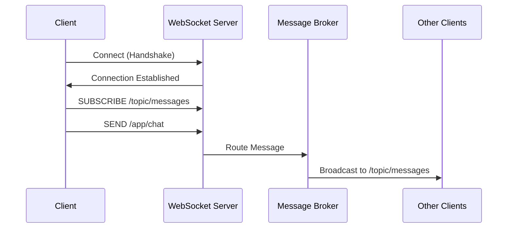

# How to Set Up WebSocket in Spring Boot

Author: [nawazdhandala](https://www.github.com/nawazdhandala)

Tags: Java, Spring Boot, WebSocket, STOMP, Real-time, Messaging

Description: Learn how to set up WebSocket connections in Spring Boot for real-time bidirectional communication. This guide covers STOMP messaging, SockJS fallback, authentication, and building a chat application example.

---

> WebSockets enable real-time bidirectional communication between clients and servers. Spring Boot provides excellent WebSocket support with STOMP messaging protocol. This guide walks you through setting up WebSocket from scratch.

Real-time features like chat, notifications, and live updates require persistent connections that HTTP alone cannot efficiently provide. WebSocket solves this problem elegantly.

---

## Architecture Overview



---

## Dependencies Setup

Add the WebSocket starter to your `pom.xml`:

```xml
<dependencies>
    <dependency>
        <groupId>org.springframework.boot</groupId>
        <artifactId>spring-boot-starter-websocket</artifactId>
    </dependency>
    <dependency>
        <groupId>org.springframework.boot</groupId>
        <artifactId>spring-boot-starter-web</artifactId>
    </dependency>
    <!-- For JSON serialization -->
    <dependency>
        <groupId>com.fasterxml.jackson.core</groupId>
        <artifactId>jackson-databind</artifactId>
    </dependency>
</dependencies>
```

---

## WebSocket Configuration

### Basic STOMP Configuration

```java
package com.example.config;

import org.springframework.context.annotation.Configuration;
import org.springframework.messaging.simp.config.MessageBrokerRegistry;
import org.springframework.web.socket.config.annotation.EnableWebSocketMessageBroker;
import org.springframework.web.socket.config.annotation.StompEndpointRegistry;
import org.springframework.web.socket.config.annotation.WebSocketMessageBrokerConfigurer;

@Configuration
@EnableWebSocketMessageBroker
public class WebSocketConfig implements WebSocketMessageBrokerConfigurer {

    @Override
    public void configureMessageBroker(MessageBrokerRegistry config) {
        // Enable a simple in-memory message broker
        // Messages with destination prefix /topic or /queue are routed to the broker
        config.enableSimpleBroker("/topic", "/queue");

        // Messages with destination prefix /app are routed to @MessageMapping methods
        config.setApplicationDestinationPrefixes("/app");

        // Prefix for user-specific messages
        config.setUserDestinationPrefix("/user");
    }

    @Override
    public void registerStompEndpoints(StompEndpointRegistry registry) {
        // Register the /ws endpoint for WebSocket connections
        // SockJS is used as a fallback for browsers that don't support WebSocket
        registry.addEndpoint("/ws")
            .setAllowedOriginPatterns("*")
            .withSockJS();

        // Also register a raw WebSocket endpoint (without SockJS)
        registry.addEndpoint("/ws-raw")
            .setAllowedOriginPatterns("*");
    }
}
```

---

## Message DTOs

```java
package com.example.dto;

import lombok.AllArgsConstructor;
import lombok.Builder;
import lombok.Data;
import lombok.NoArgsConstructor;

import java.time.Instant;

@Data
@Builder
@NoArgsConstructor
@AllArgsConstructor
public class ChatMessage {
    private String id;
    private String content;
    private String sender;
    private String recipient;
    private MessageType type;
    private Instant timestamp;

    public enum MessageType {
        CHAT,
        JOIN,
        LEAVE,
        TYPING
    }
}

@Data
@Builder
@NoArgsConstructor
@AllArgsConstructor
public class ChatNotification {
    private String id;
    private String senderId;
    private String senderName;
    private String content;
}
```

---

## WebSocket Controller

```java
package com.example.controller;

import com.example.dto.ChatMessage;
import com.example.dto.ChatNotification;
import lombok.RequiredArgsConstructor;
import lombok.extern.slf4j.Slf4j;
import org.springframework.messaging.handler.annotation.*;
import org.springframework.messaging.simp.SimpMessageHeaderAccessor;
import org.springframework.messaging.simp.SimpMessagingTemplate;
import org.springframework.stereotype.Controller;

import java.time.Instant;
import java.util.UUID;

@Controller
@RequiredArgsConstructor
@Slf4j
public class ChatController {

    private final SimpMessagingTemplate messagingTemplate;

    // Handle messages sent to /app/chat.sendMessage
    // Broadcast to all subscribers of /topic/public
    @MessageMapping("/chat.sendMessage")
    @SendTo("/topic/public")
    public ChatMessage sendMessage(@Payload ChatMessage chatMessage) {
        log.info("Received message from {}: {}", chatMessage.getSender(), chatMessage.getContent());

        chatMessage.setId(UUID.randomUUID().toString());
        chatMessage.setTimestamp(Instant.now());

        return chatMessage;
    }

    // Handle user joining the chat
    @MessageMapping("/chat.addUser")
    @SendTo("/topic/public")
    public ChatMessage addUser(@Payload ChatMessage chatMessage,
                               SimpMessageHeaderAccessor headerAccessor) {
        // Add username to WebSocket session
        headerAccessor.getSessionAttributes().put("username", chatMessage.getSender());

        chatMessage.setType(ChatMessage.MessageType.JOIN);
        chatMessage.setTimestamp(Instant.now());

        log.info("User {} joined the chat", chatMessage.getSender());

        return chatMessage;
    }

    // Handle private messages to specific users
    @MessageMapping("/chat.private")
    public void sendPrivateMessage(@Payload ChatMessage chatMessage) {
        log.info("Private message from {} to {}: {}",
            chatMessage.getSender(),
            chatMessage.getRecipient(),
            chatMessage.getContent());

        chatMessage.setId(UUID.randomUUID().toString());
        chatMessage.setTimestamp(Instant.now());

        // Send to specific user's queue
        messagingTemplate.convertAndSendToUser(
            chatMessage.getRecipient(),
            "/queue/private",
            chatMessage
        );
    }

    // Handle messages to specific chat rooms
    @MessageMapping("/chat.room.{roomId}")
    public void sendToRoom(@DestinationVariable String roomId,
                           @Payload ChatMessage chatMessage) {
        log.info("Message to room {}: {}", roomId, chatMessage.getContent());

        chatMessage.setId(UUID.randomUUID().toString());
        chatMessage.setTimestamp(Instant.now());

        messagingTemplate.convertAndSend("/topic/room." + roomId, chatMessage);
    }
}
```

---

## WebSocket Event Listeners

```java
package com.example.listener;

import com.example.dto.ChatMessage;
import lombok.RequiredArgsConstructor;
import lombok.extern.slf4j.Slf4j;
import org.springframework.context.event.EventListener;
import org.springframework.messaging.simp.SimpMessageSendingOperations;
import org.springframework.messaging.simp.stomp.StompHeaderAccessor;
import org.springframework.stereotype.Component;
import org.springframework.web.socket.messaging.SessionConnectedEvent;
import org.springframework.web.socket.messaging.SessionDisconnectEvent;

import java.time.Instant;

@Component
@RequiredArgsConstructor
@Slf4j
public class WebSocketEventListener {

    private final SimpMessageSendingOperations messagingTemplate;

    @EventListener
    public void handleWebSocketConnectListener(SessionConnectedEvent event) {
        log.info("New WebSocket connection established: {}", event.getMessage());
    }

    @EventListener
    public void handleWebSocketDisconnectListener(SessionDisconnectEvent event) {
        StompHeaderAccessor headerAccessor = StompHeaderAccessor.wrap(event.getMessage());

        String username = (String) headerAccessor.getSessionAttributes().get("username");

        if (username != null) {
            log.info("User {} disconnected", username);

            ChatMessage chatMessage = ChatMessage.builder()
                .type(ChatMessage.MessageType.LEAVE)
                .sender(username)
                .timestamp(Instant.now())
                .build();

            messagingTemplate.convertAndSend("/topic/public", chatMessage);
        }
    }
}
```

---

## Authentication and Security

### WebSocket Security Configuration

```java
package com.example.config;

import org.springframework.context.annotation.Configuration;
import org.springframework.messaging.simp.config.ChannelRegistration;
import org.springframework.web.socket.config.annotation.WebSocketMessageBrokerConfigurer;

@Configuration
public class WebSocketSecurityConfig implements WebSocketMessageBrokerConfigurer {

    private final AuthChannelInterceptor authChannelInterceptor;

    public WebSocketSecurityConfig(AuthChannelInterceptor authChannelInterceptor) {
        this.authChannelInterceptor = authChannelInterceptor;
    }

    @Override
    public void configureClientInboundChannel(ChannelRegistration registration) {
        registration.interceptors(authChannelInterceptor);
    }
}
```

### Authentication Interceptor

```java
package com.example.config;

import lombok.RequiredArgsConstructor;
import lombok.extern.slf4j.Slf4j;
import org.springframework.messaging.Message;
import org.springframework.messaging.MessageChannel;
import org.springframework.messaging.simp.stomp.StompCommand;
import org.springframework.messaging.simp.stomp.StompHeaderAccessor;
import org.springframework.messaging.support.ChannelInterceptor;
import org.springframework.messaging.support.MessageHeaderAccessor;
import org.springframework.security.authentication.UsernamePasswordAuthenticationToken;
import org.springframework.security.core.context.SecurityContextHolder;
import org.springframework.stereotype.Component;

import java.util.List;

@Component
@RequiredArgsConstructor
@Slf4j
public class AuthChannelInterceptor implements ChannelInterceptor {

    private final JwtTokenProvider jwtTokenProvider;

    @Override
    public Message<?> preSend(Message<?> message, MessageChannel channel) {
        StompHeaderAccessor accessor = MessageHeaderAccessor.getAccessor(
            message, StompHeaderAccessor.class);

        if (StompCommand.CONNECT.equals(accessor.getCommand())) {
            List<String> authHeaders = accessor.getNativeHeader("Authorization");

            if (authHeaders != null && !authHeaders.isEmpty()) {
                String token = authHeaders.get(0).replace("Bearer ", "");

                try {
                    if (jwtTokenProvider.validateToken(token)) {
                        String username = jwtTokenProvider.getUsernameFromToken(token);

                        UsernamePasswordAuthenticationToken auth =
                            new UsernamePasswordAuthenticationToken(username, null, List.of());

                        accessor.setUser(auth);

                        log.info("WebSocket authenticated for user: {}", username);
                    }
                } catch (Exception e) {
                    log.error("WebSocket authentication failed", e);
                    throw new IllegalArgumentException("Invalid token");
                }
            }
        }

        return message;
    }
}
```

---

## JavaScript Client

### Using SockJS and STOMP

```html
<!DOCTYPE html>
<html>
<head>
    <title>WebSocket Chat</title>
    <script src="https://cdn.jsdelivr.net/npm/sockjs-client@1/dist/sockjs.min.js"></script>
    <script src="https://cdn.jsdelivr.net/npm/stompjs@2/lib/stomp.min.js"></script>
</head>
<body>
    <div id="chat-page">
        <div id="messages"></div>
        <form id="message-form">
            <input type="text" id="message" placeholder="Type a message...">
            <button type="submit">Send</button>
        </form>
    </div>

    <script>
        let stompClient = null;
        const username = 'User' + Math.floor(Math.random() * 1000);

        function connect() {
            const socket = new SockJS('/ws');
            stompClient = Stomp.over(socket);

            stompClient.connect({}, function(frame) {
                console.log('Connected: ' + frame);

                // Subscribe to public messages
                stompClient.subscribe('/topic/public', function(message) {
                    showMessage(JSON.parse(message.body));
                });

                // Subscribe to private messages
                stompClient.subscribe('/user/queue/private', function(message) {
                    showMessage(JSON.parse(message.body));
                });

                // Announce joining
                stompClient.send('/app/chat.addUser', {},
                    JSON.stringify({
                        sender: username,
                        type: 'JOIN'
                    })
                );
            }, function(error) {
                console.error('Connection error: ' + error);
                setTimeout(connect, 5000); // Reconnect after 5 seconds
            });
        }

        function sendMessage(event) {
            event.preventDefault();
            const messageInput = document.getElementById('message');
            const content = messageInput.value.trim();

            if (content && stompClient) {
                const chatMessage = {
                    sender: username,
                    content: content,
                    type: 'CHAT'
                };

                stompClient.send('/app/chat.sendMessage', {},
                    JSON.stringify(chatMessage));

                messageInput.value = '';
            }
        }

        function showMessage(message) {
            const messagesDiv = document.getElementById('messages');
            const messageElement = document.createElement('div');

            if (message.type === 'JOIN') {
                messageElement.textContent = message.sender + ' joined the chat';
            } else if (message.type === 'LEAVE') {
                messageElement.textContent = message.sender + ' left the chat';
            } else {
                messageElement.textContent = message.sender + ': ' + message.content;
            }

            messagesDiv.appendChild(messageElement);
            messagesDiv.scrollTop = messagesDiv.scrollHeight;
        }

        document.getElementById('message-form')
            .addEventListener('submit', sendMessage);

        connect();
    </script>
</body>
</html>
```

---

## Service for Sending Messages

```java
package com.example.service;

import com.example.dto.ChatMessage;
import com.example.dto.ChatNotification;
import lombok.RequiredArgsConstructor;
import lombok.extern.slf4j.Slf4j;
import org.springframework.messaging.simp.SimpMessagingTemplate;
import org.springframework.stereotype.Service;

@Service
@RequiredArgsConstructor
@Slf4j
public class NotificationService {

    private final SimpMessagingTemplate messagingTemplate;

    public void sendNotificationToUser(String userId, ChatNotification notification) {
        log.info("Sending notification to user {}: {}", userId, notification);
        messagingTemplate.convertAndSendToUser(
            userId,
            "/queue/notifications",
            notification
        );
    }

    public void broadcastToTopic(String topic, ChatMessage message) {
        log.info("Broadcasting to topic {}: {}", topic, message);
        messagingTemplate.convertAndSend("/topic/" + topic, message);
    }

    public void sendToRoom(String roomId, ChatMessage message) {
        messagingTemplate.convertAndSend("/topic/room." + roomId, message);
    }
}
```

---

## Testing WebSocket

```java
package com.example;

import com.example.dto.ChatMessage;
import org.junit.jupiter.api.BeforeEach;
import org.junit.jupiter.api.Test;
import org.springframework.boot.test.context.SpringBootTest;
import org.springframework.boot.test.web.server.LocalServerPort;
import org.springframework.messaging.converter.MappingJackson2MessageConverter;
import org.springframework.messaging.simp.stomp.*;
import org.springframework.web.socket.client.standard.StandardWebSocketClient;
import org.springframework.web.socket.messaging.WebSocketStompClient;
import org.springframework.web.socket.sockjs.client.SockJsClient;
import org.springframework.web.socket.sockjs.client.WebSocketTransport;

import java.lang.reflect.Type;
import java.util.List;
import java.util.concurrent.CompletableFuture;
import java.util.concurrent.TimeUnit;

import static org.assertj.core.api.Assertions.assertThat;

@SpringBootTest(webEnvironment = SpringBootTest.WebEnvironment.RANDOM_PORT)
class WebSocketIntegrationTest {

    @LocalServerPort
    private int port;

    private WebSocketStompClient stompClient;

    @BeforeEach
    void setup() {
        stompClient = new WebSocketStompClient(
            new SockJsClient(List.of(
                new WebSocketTransport(new StandardWebSocketClient())
            ))
        );
        stompClient.setMessageConverter(new MappingJackson2MessageConverter());
    }

    @Test
    void testWebSocketConnection() throws Exception {
        CompletableFuture<ChatMessage> resultFuture = new CompletableFuture<>();

        StompSession session = stompClient.connectAsync(
            "ws://localhost:" + port + "/ws",
            new StompSessionHandlerAdapter() {}
        ).get(5, TimeUnit.SECONDS);

        session.subscribe("/topic/public", new StompFrameHandler() {
            @Override
            public Type getPayloadType(StompHeaders headers) {
                return ChatMessage.class;
            }

            @Override
            public void handleFrame(StompHeaders headers, Object payload) {
                resultFuture.complete((ChatMessage) payload);
            }
        });

        ChatMessage message = ChatMessage.builder()
            .sender("testUser")
            .content("Hello WebSocket!")
            .type(ChatMessage.MessageType.CHAT)
            .build();

        session.send("/app/chat.sendMessage", message);

        ChatMessage received = resultFuture.get(5, TimeUnit.SECONDS);
        assertThat(received.getContent()).isEqualTo("Hello WebSocket!");
    }
}
```

---

## Best Practices

1. **Use STOMP Protocol** - Provides message routing and subscription management
2. **Implement SockJS Fallback** - Ensures compatibility with older browsers
3. **Add Authentication** - Secure WebSocket connections with token validation
4. **Handle Disconnections** - Clean up resources when clients disconnect
5. **Use Message Queues** - Consider external brokers like RabbitMQ for scaling
6. **Monitor Connections** - Track active connections and message rates

---

## Conclusion

WebSocket with Spring Boot enables powerful real-time features. Key takeaways:

- Use STOMP over WebSocket for structured messaging
- Configure SockJS for browser compatibility
- Implement proper authentication for secure connections
- Handle connection lifecycle events
- Use `SimpMessagingTemplate` for programmatic message sending

With these patterns, you can build scalable real-time applications.

---

*Need to monitor your WebSocket connections? [OneUptime](https://oneuptime.com) provides real-time application monitoring with connection tracking and alerting.*
