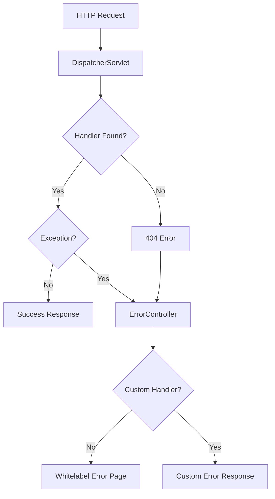

# How to Fix "Whitelabel Error Page" in Spring Boot

Author: [nawazdhandala](https://www.github.com/nawazdhandala)

Tags: Java, Spring Boot, Error Handling, Web Development, REST API, Troubleshooting

Description: Learn how to fix the Spring Boot Whitelabel Error Page and create custom error handling. This guide covers configuring error pages, REST API error responses, common causes of errors, and best practices for error handling.

---

> The infamous Spring Boot Whitelabel Error Page appears when an unhandled error occurs. While it's useful during development, it's not suitable for production applications. This guide shows you how to customize error handling and fix common issues that trigger this page.

The Whitelabel Error Page is Spring Boot's default error response. Let's learn how to replace it with proper error handling.

---

## Understanding the Whitelabel Error Page



The Whitelabel Error Page appears when:
- No handler is found for a URL (404)
- An exception is thrown and not handled
- A controller returns an error status

---

## Common Causes and Fixes

### Cause 1: Missing @RestController or @Controller

**Problem:**

```java
// Missing annotation!
public class UserController {

    @GetMapping("/users")
    public List<User> getUsers() {
        return userService.findAll();
    }
}
```

**Fix:**

```java
@RestController
@RequestMapping("/api")
public class UserController {

    @GetMapping("/users")
    public List<User> getUsers() {
        return userService.findAll();
    }
}
```

### Cause 2: Wrong Base Package for Component Scanning

**Problem:**

```java
// Main application in com.example.app
@SpringBootApplication
public class Application {
    public static void main(String[] args) {
        SpringApplication.run(Application.class, args);
    }
}

// Controller in com.different.package - NOT SCANNED!
@RestController
public class UserController {
    // ...
}
```

**Fix:**

```java
@SpringBootApplication(scanBasePackages = {"com.example.app", "com.different.package"})
public class Application {
    public static void main(String[] args) {
        SpringApplication.run(Application.class, args);
    }
}

// Or move controller to same package hierarchy
// com.example.app.controller.UserController
```

### Cause 3: Incorrect Request Mapping

**Problem:**

```java
@RestController
public class UserController {

    @GetMapping("/api/users")  // Expecting /api/users
    public List<User> getUsers() {
        return userService.findAll();
    }
}
// Requesting /users results in 404
```

**Fix:** Ensure the URL matches exactly:

```java
@RestController
@RequestMapping("/api")
public class UserController {

    @GetMapping("/users")  // Full path: /api/users
    public List<User> getUsers() {
        return userService.findAll();
    }
}
```

### Cause 4: Static Resources Not Found

**Problem:** Requesting `/index.html` when file doesn't exist.

**Fix:** Add static resources to correct location:

```
src/main/resources/
    static/
        index.html
        css/
        js/
    templates/     # For Thymeleaf
```

### Cause 5: Template Not Found

**Problem:**

```java
@Controller
public class PageController {

    @GetMapping("/home")
    public String home() {
        return "home";  // Looks for templates/home.html
    }
}
```

**Fix:** Create the template file:

```
src/main/resources/templates/home.html
```

---

## Disabling the Whitelabel Error Page

### Disable Completely

```yaml
server:
  error:
    whitelabel:
      enabled: false
```

This will show the container's default error page (e.g., Tomcat's error page).

### Show Nothing for 404

```yaml
spring:
  web:
    resources:
      add-mappings: false
  mvc:
    throw-exception-if-no-handler-found: true
```

---

## Custom Error Pages for Web Applications

### Static Error Pages

Create files in `src/main/resources/static/error/`:

```
static/
    error/
        404.html
        500.html
        error.html  # Fallback for all errors
```

### Thymeleaf Error Templates

Create `src/main/resources/templates/error/404.html`:

```html
<!DOCTYPE html>
<html xmlns:th="http://www.thymeleaf.org">
<head>
    <title>Page Not Found</title>
    <link rel="stylesheet" th:href="@{/css/style.css}">
</head>
<body>
    <div class="error-container">
        <h1>404 - Page Not Found</h1>
        <p>The page you're looking for doesn't exist.</p>
        <p>Error details: <span th:text="${message}">Unknown error</span></p>
        <p>Path: <span th:text="${path}">Unknown path</span></p>
        <a th:href="@{/}" class="btn">Go Home</a>
    </div>
</body>
</html>
```

Create `src/main/resources/templates/error/500.html`:

```html
<!DOCTYPE html>
<html xmlns:th="http://www.thymeleaf.org">
<head>
    <title>Internal Server Error</title>
</head>
<body>
    <div class="error-container">
        <h1>500 - Internal Server Error</h1>
        <p>Something went wrong on our end.</p>
        <p th:if="${#environment.acceptsProfiles('dev')}">
            Error: <span th:text="${exception}">Unknown</span>
        </p>
        <a th:href="@{/}">Go Home</a>
    </div>
</body>
</html>
```

---

## Custom Error Controller

### For REST APIs

```java
package com.example.controller;

import jakarta.servlet.RequestDispatcher;
import jakarta.servlet.http.HttpServletRequest;
import org.springframework.boot.web.servlet.error.ErrorController;
import org.springframework.http.HttpStatus;
import org.springframework.http.ResponseEntity;
import org.springframework.web.bind.annotation.RequestMapping;
import org.springframework.web.bind.annotation.RestController;

import java.time.Instant;
import java.util.HashMap;
import java.util.Map;

@RestController
public class CustomErrorController implements ErrorController {

    @RequestMapping("/error")
    public ResponseEntity<Map<String, Object>> handleError(HttpServletRequest request) {
        Object status = request.getAttribute(RequestDispatcher.ERROR_STATUS_CODE);
        Object message = request.getAttribute(RequestDispatcher.ERROR_MESSAGE);
        Object path = request.getAttribute(RequestDispatcher.ERROR_REQUEST_URI);

        HttpStatus httpStatus = HttpStatus.INTERNAL_SERVER_ERROR;
        if (status != null) {
            int statusCode = Integer.parseInt(status.toString());
            httpStatus = HttpStatus.valueOf(statusCode);
        }

        Map<String, Object> errorResponse = new HashMap<>();
        errorResponse.put("timestamp", Instant.now());
        errorResponse.put("status", httpStatus.value());
        errorResponse.put("error", httpStatus.getReasonPhrase());
        errorResponse.put("message", message != null ? message : "No message available");
        errorResponse.put("path", path);

        return new ResponseEntity<>(errorResponse, httpStatus);
    }
}
```

### For Web Applications (HTML)

```java
package com.example.controller;

import jakarta.servlet.RequestDispatcher;
import jakarta.servlet.http.HttpServletRequest;
import org.springframework.boot.web.servlet.error.ErrorController;
import org.springframework.http.HttpStatus;
import org.springframework.stereotype.Controller;
import org.springframework.ui.Model;
import org.springframework.web.bind.annotation.RequestMapping;

@Controller
public class CustomErrorController implements ErrorController {

    @RequestMapping("/error")
    public String handleError(HttpServletRequest request, Model model) {
        Object status = request.getAttribute(RequestDispatcher.ERROR_STATUS_CODE);
        Object message = request.getAttribute(RequestDispatcher.ERROR_MESSAGE);
        Object exception = request.getAttribute(RequestDispatcher.ERROR_EXCEPTION);
        Object path = request.getAttribute(RequestDispatcher.ERROR_REQUEST_URI);

        int statusCode = 500;
        if (status != null) {
            statusCode = Integer.parseInt(status.toString());
        }

        model.addAttribute("status", statusCode);
        model.addAttribute("message", message);
        model.addAttribute("path", path);
        model.addAttribute("exception", exception);

        // Return specific error page based on status
        if (statusCode == 404) {
            return "error/404";
        } else if (statusCode == 403) {
            return "error/403";
        } else if (statusCode == 500) {
            return "error/500";
        }

        return "error/generic";
    }
}
```

---

## Global Exception Handler for APIs

```java
package com.example.exception;

import jakarta.servlet.http.HttpServletRequest;
import lombok.extern.slf4j.Slf4j;
import org.springframework.http.HttpStatus;
import org.springframework.http.ResponseEntity;
import org.springframework.web.bind.annotation.ExceptionHandler;
import org.springframework.web.bind.annotation.RestControllerAdvice;
import org.springframework.web.servlet.NoHandlerFoundException;

import java.time.Instant;
import java.util.Map;

@RestControllerAdvice
@Slf4j
public class GlobalExceptionHandler {

    @ExceptionHandler(NoHandlerFoundException.class)
    public ResponseEntity<Map<String, Object>> handleNoHandlerFound(
            NoHandlerFoundException ex, HttpServletRequest request) {

        log.warn("No handler found for {} {}", ex.getHttpMethod(), ex.getRequestURL());

        return ResponseEntity.status(HttpStatus.NOT_FOUND).body(Map.of(
            "timestamp", Instant.now(),
            "status", 404,
            "error", "Not Found",
            "message", String.format("No endpoint %s %s", ex.getHttpMethod(), ex.getRequestURL()),
            "path", request.getRequestURI()
        ));
    }

    @ExceptionHandler(ResourceNotFoundException.class)
    public ResponseEntity<Map<String, Object>> handleResourceNotFound(
            ResourceNotFoundException ex, HttpServletRequest request) {

        return ResponseEntity.status(HttpStatus.NOT_FOUND).body(Map.of(
            "timestamp", Instant.now(),
            "status", 404,
            "error", "Not Found",
            "message", ex.getMessage(),
            "path", request.getRequestURI()
        ));
    }

    @ExceptionHandler(Exception.class)
    public ResponseEntity<Map<String, Object>> handleAllExceptions(
            Exception ex, HttpServletRequest request) {

        log.error("Unexpected error", ex);

        return ResponseEntity.status(HttpStatus.INTERNAL_SERVER_ERROR).body(Map.of(
            "timestamp", Instant.now(),
            "status", 500,
            "error", "Internal Server Error",
            "message", "An unexpected error occurred",
            "path", request.getRequestURI()
        ));
    }
}
```

---

## Configuration for 404 Handling

To properly catch 404 errors with `@ExceptionHandler`:

```yaml
spring:
  mvc:
    throw-exception-if-no-handler-found: true
  web:
    resources:
      add-mappings: false  # Disable default resource handling
```

Or keep resource mapping but handle NoHandlerFoundException:

```yaml
spring:
  mvc:
    throw-exception-if-no-handler-found: true
```

---

## SPA (Single Page Application) Support

For Angular, React, or Vue apps that use client-side routing:

```java
@Controller
public class SpaController {

    @RequestMapping(value = {
        "/",
        "/app/**",
        "/dashboard/**",
        "/settings/**"
    })
    public String forward() {
        return "forward:/index.html";
    }
}
```

Or using a more comprehensive approach:

```java
@Controller
public class SpaController implements ErrorController {

    @RequestMapping("/error")
    public String handleError(HttpServletRequest request) {
        Object status = request.getAttribute(RequestDispatcher.ERROR_STATUS_CODE);

        if (status != null && Integer.parseInt(status.toString()) == 404) {
            // Forward 404s to the SPA
            return "forward:/index.html";
        }

        return "error";
    }
}
```

---

## Customize Error Attributes

```java
package com.example.config;

import org.springframework.boot.web.error.ErrorAttributeOptions;
import org.springframework.boot.web.servlet.error.DefaultErrorAttributes;
import org.springframework.stereotype.Component;
import org.springframework.web.context.request.WebRequest;

import java.time.Instant;
import java.util.Map;

@Component
public class CustomErrorAttributes extends DefaultErrorAttributes {

    @Override
    public Map<String, Object> getErrorAttributes(
            WebRequest webRequest, ErrorAttributeOptions options) {

        Map<String, Object> errorAttributes = super.getErrorAttributes(webRequest, options);

        // Add custom attributes
        errorAttributes.put("timestamp", Instant.now());
        errorAttributes.put("application", "MyApp");
        errorAttributes.put("support", "support@example.com");

        // Remove sensitive information in production
        errorAttributes.remove("trace");

        return errorAttributes;
    }
}
```

---

## Error Response Configuration

```yaml
server:
  error:
    # Include exception message in response
    include-message: always
    # Include binding errors
    include-binding-errors: always
    # Include stack trace (never in production)
    include-stacktrace: never
    # Include exception class name
    include-exception: false
    # Path for error page
    path: /error
```

---

## Debugging Tips

### Enable Debug Logging

```yaml
logging:
  level:
    org.springframework.web: DEBUG
    org.springframework.boot.autoconfigure: DEBUG
```

### List All Registered Mappings

```java
@Component
public class MappingLogger implements CommandLineRunner {

    @Autowired
    private RequestMappingHandlerMapping requestMappingHandlerMapping;

    @Override
    public void run(String... args) {
        requestMappingHandlerMapping.getHandlerMethods().forEach((key, value) -> {
            System.out.println(key + " -> " + value);
        });
    }
}
```

### Check Component Scanning

```java
@Component
public class BeanLogger implements CommandLineRunner {

    @Autowired
    private ApplicationContext context;

    @Override
    public void run(String... args) {
        String[] controllerBeans = context.getBeanNamesForAnnotation(RestController.class);
        System.out.println("Controllers found: " + Arrays.toString(controllerBeans));
    }
}
```

---

## Checklist for Fixing Whitelabel Error

| Issue | Check |
|-------|-------|
| Controller not found | Verify @RestController or @Controller annotation |
| Wrong URL | Check @RequestMapping paths |
| Component not scanned | Verify package is under main application |
| Template not found | Check templates/ directory |
| Static file not found | Check static/ directory |
| Exception not handled | Add @ControllerAdvice |

---

## Best Practices

1. **Disable in Production** - Replace with custom error pages
2. **Log Errors** - Always log for debugging
3. **Return Appropriate Status** - Use correct HTTP status codes
4. **Hide Sensitive Info** - Don't expose stack traces in production
5. **Provide Helpful Messages** - Guide users on next steps
6. **Monitor Errors** - Track error rates and types

---

## Conclusion

The Whitelabel Error Page is Spring Boot's default fallback. To provide a better experience:

- Create custom error pages for web applications
- Implement custom error responses for APIs
- Use @ControllerAdvice for exception handling
- Configure appropriate error attributes
- Debug using logging and mapping inspection

With proper error handling, your application will provide clear, helpful feedback to users.

---

*Need to monitor your application's error rates? [OneUptime](https://oneuptime.com) provides comprehensive error tracking with alerting and trend analysis.*
