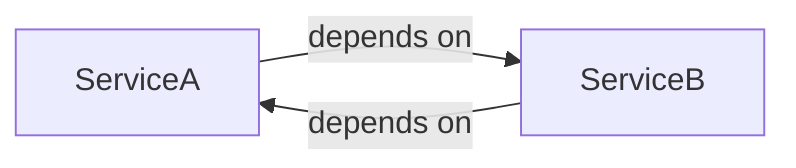
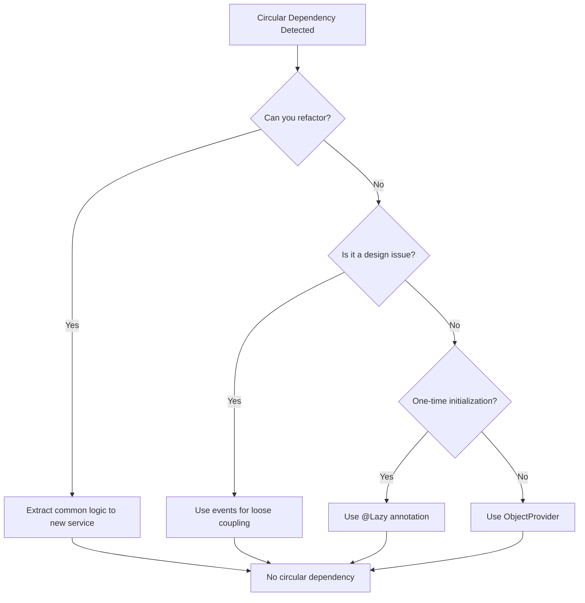

# How to Handle "Circular reference" Errors in Spring

Author: [nawazdhandala](https://github.com/nawazdhandala)

Tags: Java, Spring Boot, Dependency Injection, Architecture, Backend

Description: Learn how to identify, understand, and resolve circular dependency errors in Spring Boot applications with practical refactoring strategies.

---

Circular dependencies occur when two or more beans depend on each other, creating a cycle that Spring cannot resolve during startup. Starting with Spring Boot 2.6, circular dependencies are prohibited by default, causing your application to fail fast rather than silently creating potential issues.

## Understanding Circular Dependencies

A circular dependency happens when Bean A needs Bean B, and Bean B needs Bean A - either directly or through a chain of dependencies.



The error message looks like this:

```
***************************
APPLICATION FAILED TO START
***************************

Description:

The dependencies of some of the beans in the application context form a cycle:

┌─────┐
|  serviceA defined in file [ServiceA.class]
↑     ↓
|  serviceB defined in file [ServiceB.class]
└─────┘
```

## Common Circular Dependency Patterns

### Direct Circular Dependency

```java
@Service
public class OrderService {

    @Autowired
    private CustomerService customerService;  // Depends on CustomerService

    public void createOrder(Long customerId, List<Item> items) {
        Customer customer = customerService.getCustomer(customerId);
        // create order logic
    }
}

@Service
public class CustomerService {

    @Autowired
    private OrderService orderService;  // Depends on OrderService - CYCLE!

    public List<Order> getCustomerOrders(Long customerId) {
        return orderService.getOrdersByCustomer(customerId);
    }
}
```

### Indirect Circular Dependency

```java
@Service
public class ServiceA {
    @Autowired
    private ServiceB serviceB;
}

@Service
public class ServiceB {
    @Autowired
    private ServiceC serviceC;
}

@Service
public class ServiceC {
    @Autowired
    private ServiceA serviceA;  // Completes the cycle: A -> B -> C -> A
}
```

## Solutions to Circular Dependencies

### Solution 1: Restructure Your Code (Recommended)

The best solution is to refactor to eliminate the circular dependency. Often, circular dependencies indicate a design problem.

**Extract shared functionality into a separate service:**

```java
// Before: OrderService <-> CustomerService circular dependency

// After: Extract shared logic to a new service

@Service
public class OrderService {

    @Autowired
    private OrderRepository orderRepository;

    public Order createOrder(Customer customer, List<Item> items) {
        Order order = new Order(customer, items);
        return orderRepository.save(order);
    }

    public List<Order> getOrdersByCustomer(Long customerId) {
        return orderRepository.findByCustomerId(customerId);
    }
}

@Service
public class CustomerService {

    @Autowired
    private CustomerRepository customerRepository;

    public Customer getCustomer(Long id) {
        return customerRepository.findById(id).orElseThrow();
    }
}

// New service that depends on both - no cycle
@Service
public class CustomerOrderService {

    @Autowired
    private CustomerService customerService;

    @Autowired
    private OrderService orderService;

    public List<Order> getCustomerOrders(Long customerId) {
        Customer customer = customerService.getCustomer(customerId);
        return orderService.getOrdersByCustomer(customerId);
    }

    public Order createOrderForCustomer(Long customerId, List<Item> items) {
        Customer customer = customerService.getCustomer(customerId);
        return orderService.createOrder(customer, items);
    }
}
```

### Solution 2: Use @Lazy Annotation

The `@Lazy` annotation tells Spring to create a proxy and delay initialization until the bean is actually used.

```java
@Service
public class OrderService {

    private final CustomerService customerService;

    // @Lazy creates a proxy - CustomerService is initialized on first use
    public OrderService(@Lazy CustomerService customerService) {
        this.customerService = customerService;
    }
}

@Service
public class CustomerService {

    private final OrderService orderService;

    public CustomerService(OrderService orderService) {
        this.orderService = orderService;
    }
}
```

### Solution 3: Use Setter Injection

Setter injection allows the bean to be created first, then dependencies injected afterward.

```java
@Service
public class OrderService {

    private CustomerService customerService;

    @Autowired
    public void setCustomerService(CustomerService customerService) {
        this.customerService = customerService;
    }
}

@Service
public class CustomerService {

    private OrderService orderService;

    @Autowired
    public void setOrderService(OrderService orderService) {
        this.orderService = orderService;
    }
}
```

### Solution 4: Use ObjectProvider/ObjectFactory

For cases where you need lazy resolution, use Spring's `ObjectProvider`:

```java
@Service
public class OrderService {

    private final ObjectProvider<CustomerService> customerServiceProvider;

    public OrderService(ObjectProvider<CustomerService> customerServiceProvider) {
        this.customerServiceProvider = customerServiceProvider;
    }

    public void processOrder(Long customerId) {
        // Resolved only when needed
        CustomerService customerService = customerServiceProvider.getObject();
        Customer customer = customerService.getCustomer(customerId);
    }
}
```

### Solution 5: Use Events for Loose Coupling

Replace direct dependencies with event-based communication:

```java
// Event class
public class OrderCreatedEvent {
    private final Long orderId;
    private final Long customerId;

    public OrderCreatedEvent(Long orderId, Long customerId) {
        this.orderId = orderId;
        this.customerId = customerId;
    }

    // getters
}

@Service
public class OrderService {

    @Autowired
    private ApplicationEventPublisher eventPublisher;

    @Autowired
    private OrderRepository orderRepository;

    public Order createOrder(Long customerId, List<Item> items) {
        Order order = orderRepository.save(new Order(customerId, items));

        // Publish event instead of calling CustomerService directly
        eventPublisher.publishEvent(new OrderCreatedEvent(order.getId(), customerId));

        return order;
    }
}

@Service
public class CustomerService {

    @Autowired
    private CustomerRepository customerRepository;

    // No dependency on OrderService!

    @EventListener
    public void handleOrderCreated(OrderCreatedEvent event) {
        Customer customer = customerRepository.findById(event.getCustomerId())
            .orElseThrow();
        customer.incrementOrderCount();
        customerRepository.save(customer);
    }
}
```

## Detecting Circular Dependencies Early

### Enable Strict Mode (Default in Spring Boot 2.6+)

```properties
# application.properties
spring.main.allow-circular-references=false
```

### Use ArchUnit for Architecture Tests

```java
@AnalyzeClasses(packages = "com.example.app")
public class ArchitectureTest {

    @ArchTest
    static final ArchRule noCircularDependencies =
        slices().matching("com.example.app.(*)..")
            .should().beFreeOfCycles();
}
```

### Create Dependency Visualization

```java
@Component
public class DependencyAnalyzer implements ApplicationListener<ContextRefreshedEvent> {

    @Override
    public void onApplicationEvent(ContextRefreshedEvent event) {
        ApplicationContext context = event.getApplicationContext();
        ConfigurableListableBeanFactory factory =
            ((ConfigurableApplicationContext) context).getBeanFactory();

        for (String beanName : context.getBeanDefinitionNames()) {
            BeanDefinition bd = factory.getBeanDefinition(beanName);
            String[] dependencies = bd.getDependsOn();

            if (dependencies != null && dependencies.length > 0) {
                System.out.println(beanName + " depends on: " +
                    String.join(", ", dependencies));
            }
        }
    }
}
```

## Refactoring Strategies

### Strategy 1: Interface Segregation

```java
// Instead of one large service, split into focused interfaces

public interface OrderReader {
    List<Order> getOrdersByCustomer(Long customerId);
    Order getOrder(Long orderId);
}

public interface OrderWriter {
    Order createOrder(Customer customer, List<Item> items);
    void cancelOrder(Long orderId);
}

@Service
public class OrderServiceImpl implements OrderReader, OrderWriter {
    // Implementation
}

// Now CustomerService only depends on OrderReader
@Service
public class CustomerService {

    private final OrderReader orderReader;  // No cycle possible

    public CustomerService(OrderReader orderReader) {
        this.orderReader = orderReader;
    }
}
```

### Strategy 2: Mediator Pattern

```java
@Service
public class OrderCustomerMediator {

    private final OrderRepository orderRepository;
    private final CustomerRepository customerRepository;

    public OrderCustomerMediator(
            OrderRepository orderRepository,
            CustomerRepository customerRepository) {
        this.orderRepository = orderRepository;
        this.customerRepository = customerRepository;
    }

    public Order createOrderForCustomer(Long customerId, List<Item> items) {
        Customer customer = customerRepository.findById(customerId)
            .orElseThrow(() -> new CustomerNotFoundException(customerId));

        Order order = new Order(customer, items);
        order = orderRepository.save(order);

        customer.addOrder(order);
        customerRepository.save(customer);

        return order;
    }
}
```

## When to Allow Circular References

In rare cases, you might need to temporarily allow circular references:

```properties
# Not recommended for new applications
spring.main.allow-circular-references=true
```

This should only be used:
- During migration from older Spring versions
- As a temporary measure while refactoring
- When dealing with legacy code that can't be immediately changed

## Decision Flow for Resolving Circular Dependencies



## Summary

| Approach | When to Use | Pros | Cons |
|----------|-------------|------|------|
| Refactor | Always preferred | Clean architecture | Requires more effort |
| @Lazy | Quick fix, one direction | Simple | Hides design issue |
| Setter injection | Legacy code | Easy to apply | Less explicit dependencies |
| ObjectProvider | Dynamic resolution | Flexible | More verbose |
| Events | Loose coupling needed | Decoupled | Async complexity |

Circular dependencies are a code smell indicating that your components are too tightly coupled. While Spring provides ways to work around them, the best solution is usually to refactor your code for better separation of concerns. Take the time to design your dependencies properly - your future self will thank you.
