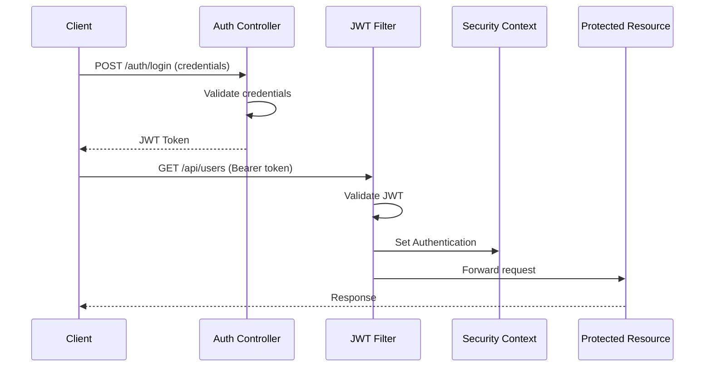

# How to Configure Spring Security with JWT

Author: [nawazdhandala](https://github.com/nawazdhandala)

Tags: Java, Spring Boot, Spring Security, JWT, Authentication, Backend

Description: Learn how to implement JWT authentication in Spring Boot with Spring Security, covering token generation, validation, refresh tokens, and security best practices.

---

JSON Web Tokens (JWT) provide a stateless authentication mechanism ideal for REST APIs and microservices. This guide shows you how to implement JWT authentication in Spring Boot with Spring Security, from token generation to protected endpoints.

## Architecture Overview



## Dependencies

```xml
<dependencies>
    <dependency>
        <groupId>org.springframework.boot</groupId>
        <artifactId>spring-boot-starter-security</artifactId>
    </dependency>
    <dependency>
        <groupId>org.springframework.boot</groupId>
        <artifactId>spring-boot-starter-web</artifactId>
    </dependency>
    <dependency>
        <groupId>io.jsonwebtoken</groupId>
        <artifactId>jjwt-api</artifactId>
        <version>0.12.3</version>
    </dependency>
    <dependency>
        <groupId>io.jsonwebtoken</groupId>
        <artifactId>jjwt-impl</artifactId>
        <version>0.12.3</version>
        <scope>runtime</scope>
    </dependency>
    <dependency>
        <groupId>io.jsonwebtoken</groupId>
        <artifactId>jjwt-jackson</artifactId>
        <version>0.12.3</version>
        <scope>runtime</scope>
    </dependency>
</dependencies>
```

## Configuration Properties

```yaml
# application.yml
jwt:
  secret: your-256-bit-secret-key-must-be-at-least-32-characters-long
  expiration: 86400000  # 24 hours in milliseconds
  refresh-expiration: 604800000  # 7 days
  issuer: your-app-name
```

## JWT Service

```java
@Service
public class JwtService {

    @Value("${jwt.secret}")
    private String secretKey;

    @Value("${jwt.expiration}")
    private long jwtExpiration;

    @Value("${jwt.refresh-expiration}")
    private long refreshExpiration;

    @Value("${jwt.issuer}")
    private String issuer;

    private SecretKey getSigningKey() {
        byte[] keyBytes = Decoders.BASE64.decode(secretKey);
        return Keys.hmacShaKeyFor(keyBytes);
    }

    public String generateToken(UserDetails userDetails) {
        return generateToken(new HashMap<>(), userDetails);
    }

    public String generateToken(Map<String, Object> extraClaims, UserDetails userDetails) {
        return buildToken(extraClaims, userDetails, jwtExpiration);
    }

    public String generateRefreshToken(UserDetails userDetails) {
        return buildToken(new HashMap<>(), userDetails, refreshExpiration);
    }

    private String buildToken(
            Map<String, Object> extraClaims,
            UserDetails userDetails,
            long expiration) {

        return Jwts.builder()
            .claims(extraClaims)
            .subject(userDetails.getUsername())
            .issuer(issuer)
            .issuedAt(new Date(System.currentTimeMillis()))
            .expiration(new Date(System.currentTimeMillis() + expiration))
            .signWith(getSigningKey(), Jwts.SIG.HS256)
            .compact();
    }

    public String extractUsername(String token) {
        return extractClaim(token, Claims::getSubject);
    }

    public <T> T extractClaim(String token, Function<Claims, T> claimsResolver) {
        final Claims claims = extractAllClaims(token);
        return claimsResolver.apply(claims);
    }

    private Claims extractAllClaims(String token) {
        return Jwts.parser()
            .verifyWith(getSigningKey())
            .build()
            .parseSignedClaims(token)
            .getPayload();
    }

    public boolean isTokenValid(String token, UserDetails userDetails) {
        final String username = extractUsername(token);
        return (username.equals(userDetails.getUsername())) && !isTokenExpired(token);
    }

    private boolean isTokenExpired(String token) {
        return extractExpiration(token).before(new Date());
    }

    private Date extractExpiration(String token) {
        return extractClaim(token, Claims::getExpiration);
    }
}
```

## JWT Authentication Filter

```java
@Component
@RequiredArgsConstructor
public class JwtAuthenticationFilter extends OncePerRequestFilter {

    private final JwtService jwtService;
    private final UserDetailsService userDetailsService;

    @Override
    protected void doFilterInternal(
            HttpServletRequest request,
            HttpServletResponse response,
            FilterChain filterChain) throws ServletException, IOException {

        final String authHeader = request.getHeader("Authorization");

        if (authHeader == null || !authHeader.startsWith("Bearer ")) {
            filterChain.doFilter(request, response);
            return;
        }

        try {
            final String jwt = authHeader.substring(7);
            final String username = jwtService.extractUsername(jwt);

            if (username != null && SecurityContextHolder.getContext().getAuthentication() == null) {
                UserDetails userDetails = userDetailsService.loadUserByUsername(username);

                if (jwtService.isTokenValid(jwt, userDetails)) {
                    UsernamePasswordAuthenticationToken authToken =
                        new UsernamePasswordAuthenticationToken(
                            userDetails,
                            null,
                            userDetails.getAuthorities()
                        );

                    authToken.setDetails(
                        new WebAuthenticationDetailsSource().buildDetails(request)
                    );

                    SecurityContextHolder.getContext().setAuthentication(authToken);
                }
            }
        } catch (ExpiredJwtException e) {
            response.setStatus(HttpServletResponse.SC_UNAUTHORIZED);
            response.getWriter().write("Token expired");
            return;
        } catch (JwtException e) {
            response.setStatus(HttpServletResponse.SC_UNAUTHORIZED);
            response.getWriter().write("Invalid token");
            return;
        }

        filterChain.doFilter(request, response);
    }
}
```

## Security Configuration

```java
@Configuration
@EnableWebSecurity
@RequiredArgsConstructor
public class SecurityConfig {

    private final JwtAuthenticationFilter jwtAuthFilter;
    private final UserDetailsService userDetailsService;

    @Bean
    public SecurityFilterChain securityFilterChain(HttpSecurity http) throws Exception {
        http
            .csrf(csrf -> csrf.disable())
            .sessionManagement(session ->
                session.sessionCreationPolicy(SessionCreationPolicy.STATELESS))
            .authorizeHttpRequests(auth -> auth
                .requestMatchers("/auth/**").permitAll()
                .requestMatchers("/public/**").permitAll()
                .requestMatchers("/api/admin/**").hasRole("ADMIN")
                .requestMatchers("/api/**").authenticated()
                .anyRequest().authenticated()
            )
            .authenticationProvider(authenticationProvider())
            .addFilterBefore(jwtAuthFilter, UsernamePasswordAuthenticationFilter.class);

        return http.build();
    }

    @Bean
    public AuthenticationProvider authenticationProvider() {
        DaoAuthenticationProvider authProvider = new DaoAuthenticationProvider();
        authProvider.setUserDetailsService(userDetailsService);
        authProvider.setPasswordEncoder(passwordEncoder());
        return authProvider;
    }

    @Bean
    public AuthenticationManager authenticationManager(AuthenticationConfiguration config)
            throws Exception {
        return config.getAuthenticationManager();
    }

    @Bean
    public PasswordEncoder passwordEncoder() {
        return new BCryptPasswordEncoder();
    }
}
```

## User Details Implementation

```java
@Entity
@Table(name = "users")
@Data
@NoArgsConstructor
@AllArgsConstructor
@Builder
public class User implements UserDetails {

    @Id
    @GeneratedValue(strategy = GenerationType.IDENTITY)
    private Long id;

    @Column(unique = true, nullable = false)
    private String email;

    @Column(nullable = false)
    private String password;

    private String firstName;

    private String lastName;

    @Enumerated(EnumType.STRING)
    private Role role;

    @Override
    public Collection<? extends GrantedAuthority> getAuthorities() {
        return List.of(new SimpleGrantedAuthority("ROLE_" + role.name()));
    }

    @Override
    public String getUsername() {
        return email;
    }

    @Override
    public boolean isAccountNonExpired() {
        return true;
    }

    @Override
    public boolean isAccountNonLocked() {
        return true;
    }

    @Override
    public boolean isCredentialsNonExpired() {
        return true;
    }

    @Override
    public boolean isEnabled() {
        return true;
    }
}

public enum Role {
    USER,
    ADMIN
}
```

## Authentication Controller

```java
@RestController
@RequestMapping("/auth")
@RequiredArgsConstructor
public class AuthController {

    private final AuthenticationManager authenticationManager;
    private final UserService userService;
    private final JwtService jwtService;

    @PostMapping("/register")
    public ResponseEntity<AuthResponse> register(@RequestBody @Valid RegisterRequest request) {
        User user = userService.createUser(request);

        String accessToken = jwtService.generateToken(user);
        String refreshToken = jwtService.generateRefreshToken(user);

        return ResponseEntity.ok(new AuthResponse(accessToken, refreshToken));
    }

    @PostMapping("/login")
    public ResponseEntity<AuthResponse> login(@RequestBody @Valid LoginRequest request) {
        authenticationManager.authenticate(
            new UsernamePasswordAuthenticationToken(
                request.getEmail(),
                request.getPassword()
            )
        );

        User user = userService.findByEmail(request.getEmail())
            .orElseThrow(() -> new UsernameNotFoundException("User not found"));

        String accessToken = jwtService.generateToken(user);
        String refreshToken = jwtService.generateRefreshToken(user);

        return ResponseEntity.ok(new AuthResponse(accessToken, refreshToken));
    }

    @PostMapping("/refresh")
    public ResponseEntity<AuthResponse> refresh(@RequestBody RefreshRequest request) {
        String refreshToken = request.getRefreshToken();
        String username = jwtService.extractUsername(refreshToken);

        User user = userService.findByEmail(username)
            .orElseThrow(() -> new UsernameNotFoundException("User not found"));

        if (!jwtService.isTokenValid(refreshToken, user)) {
            throw new InvalidTokenException("Invalid refresh token");
        }

        String accessToken = jwtService.generateToken(user);

        return ResponseEntity.ok(new AuthResponse(accessToken, refreshToken));
    }
}

// DTOs
public record RegisterRequest(
    @NotBlank String email,
    @NotBlank @Size(min = 8) String password,
    String firstName,
    String lastName
) {}

public record LoginRequest(
    @NotBlank String email,
    @NotBlank String password
) {}

public record RefreshRequest(
    @NotBlank String refreshToken
) {}

public record AuthResponse(
    String accessToken,
    String refreshToken
) {}
```

## Storing Refresh Tokens

For production, store refresh tokens securely:

```java
@Entity
@Table(name = "refresh_tokens")
@Data
@NoArgsConstructor
@AllArgsConstructor
@Builder
public class RefreshToken {

    @Id
    @GeneratedValue(strategy = GenerationType.IDENTITY)
    private Long id;

    @Column(nullable = false, unique = true)
    private String token;

    @ManyToOne(fetch = FetchType.LAZY)
    @JoinColumn(name = "user_id", nullable = false)
    private User user;

    @Column(nullable = false)
    private Instant expiryDate;

    private boolean revoked;
}

@Repository
public interface RefreshTokenRepository extends JpaRepository<RefreshToken, Long> {
    Optional<RefreshToken> findByToken(String token);
    void deleteByUser(User user);
}

@Service
@RequiredArgsConstructor
public class RefreshTokenService {

    @Value("${jwt.refresh-expiration}")
    private long refreshExpiration;

    private final RefreshTokenRepository repository;

    public RefreshToken createRefreshToken(User user) {
        RefreshToken refreshToken = RefreshToken.builder()
            .user(user)
            .token(UUID.randomUUID().toString())
            .expiryDate(Instant.now().plusMillis(refreshExpiration))
            .revoked(false)
            .build();

        return repository.save(refreshToken);
    }

    public Optional<RefreshToken> findByToken(String token) {
        return repository.findByToken(token);
    }

    public RefreshToken verifyExpiration(RefreshToken token) {
        if (token.getExpiryDate().isBefore(Instant.now()) || token.isRevoked()) {
            repository.delete(token);
            throw new TokenExpiredException("Refresh token expired");
        }
        return token;
    }

    @Transactional
    public void revokeAllUserTokens(User user) {
        repository.deleteByUser(user);
    }
}
```

## Protected Endpoint Example

```java
@RestController
@RequestMapping("/api/users")
@RequiredArgsConstructor
public class UserController {

    private final UserService userService;

    @GetMapping("/me")
    public ResponseEntity<UserResponse> getCurrentUser(
            @AuthenticationPrincipal User user) {
        return ResponseEntity.ok(new UserResponse(user));
    }

    @GetMapping
    @PreAuthorize("hasRole('ADMIN')")
    public ResponseEntity<List<UserResponse>> getAllUsers() {
        return ResponseEntity.ok(
            userService.findAll().stream()
                .map(UserResponse::new)
                .toList()
        );
    }

    @PutMapping("/me")
    public ResponseEntity<UserResponse> updateCurrentUser(
            @AuthenticationPrincipal User user,
            @RequestBody @Valid UpdateUserRequest request) {
        User updated = userService.updateUser(user.getId(), request);
        return ResponseEntity.ok(new UserResponse(updated));
    }
}
```

## Security Best Practices

### 1. Use Strong Secret Keys

```java
// Generate a secure key
SecretKey key = Jwts.SIG.HS256.key().build();
String base64Key = Encoders.BASE64.encode(key.getEncoded());
// Use this in your configuration
```

### 2. Short Token Expiration

```yaml
jwt:
  expiration: 900000  # 15 minutes for access token
  refresh-expiration: 604800000  # 7 days for refresh token
```

### 3. Include Minimal Claims

```java
// Don't include sensitive data in JWT
public String generateToken(UserDetails userDetails) {
    Map<String, Object> claims = new HashMap<>();
    claims.put("roles", userDetails.getAuthorities().stream()
        .map(GrantedAuthority::getAuthority)
        .toList());
    // Don't add: password, SSN, credit card, etc.
    return buildToken(claims, userDetails, jwtExpiration);
}
```

### 4. Handle Token Errors Gracefully

```java
@RestControllerAdvice
public class SecurityExceptionHandler {

    @ExceptionHandler(ExpiredJwtException.class)
    public ResponseEntity<ErrorResponse> handleExpiredToken(ExpiredJwtException ex) {
        return ResponseEntity
            .status(HttpStatus.UNAUTHORIZED)
            .body(new ErrorResponse("TOKEN_EXPIRED", "Token has expired"));
    }

    @ExceptionHandler(JwtException.class)
    public ResponseEntity<ErrorResponse> handleInvalidToken(JwtException ex) {
        return ResponseEntity
            .status(HttpStatus.UNAUTHORIZED)
            .body(new ErrorResponse("INVALID_TOKEN", "Invalid token"));
    }
}
```

## Testing JWT Authentication

```java
@SpringBootTest
@AutoConfigureMockMvc
class AuthControllerTest {

    @Autowired
    private MockMvc mockMvc;

    @Autowired
    private JwtService jwtService;

    @Autowired
    private UserRepository userRepository;

    @Test
    void shouldLoginSuccessfully() throws Exception {
        mockMvc.perform(post("/auth/login")
                .contentType(MediaType.APPLICATION_JSON)
                .content("""
                    {
                        "email": "test@example.com",
                        "password": "password123"
                    }
                    """))
            .andExpect(status().isOk())
            .andExpect(jsonPath("$.accessToken").exists())
            .andExpect(jsonPath("$.refreshToken").exists());
    }

    @Test
    void shouldAccessProtectedEndpoint() throws Exception {
        User user = userRepository.findByEmail("test@example.com").orElseThrow();
        String token = jwtService.generateToken(user);

        mockMvc.perform(get("/api/users/me")
                .header("Authorization", "Bearer " + token))
            .andExpect(status().isOk())
            .andExpect(jsonPath("$.email").value("test@example.com"));
    }

    @Test
    void shouldRejectExpiredToken() throws Exception {
        mockMvc.perform(get("/api/users/me")
                .header("Authorization", "Bearer expired.token.here"))
            .andExpect(status().isUnauthorized());
    }
}
```

## Summary

| Component | Purpose |
|-----------|---------|
| JwtService | Token generation and validation |
| JwtAuthenticationFilter | Extract and validate token from requests |
| SecurityConfig | Configure endpoints and filter chain |
| AuthController | Login, register, refresh endpoints |
| RefreshTokenService | Manage refresh token lifecycle |

JWT authentication provides a stateless, scalable authentication mechanism for Spring Boot applications. Remember to use strong secrets, keep access tokens short-lived, implement refresh token rotation, and never store sensitive data in the token payload.
