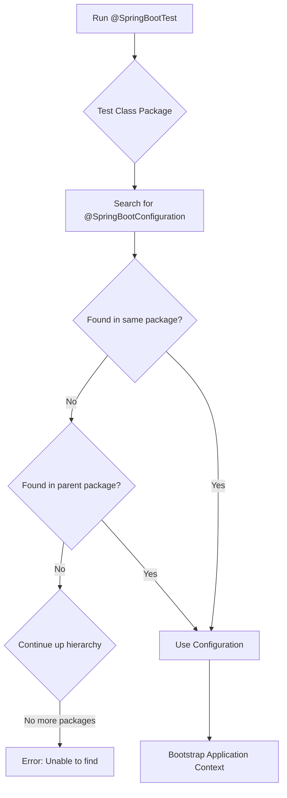

# How to Fix 'Unable to find a @SpringBootConfiguration' Errors

Author: [nawazdhandala](https://www.github.com/nawazdhandala)

Tags: Java, Spring Boot, Testing, Configuration, Troubleshooting, JUnit

Description: Learn how to diagnose and fix 'Unable to find a @SpringBootConfiguration' errors in Spring Boot tests. This guide covers package structure issues, test configuration, and proper test setup patterns.

---

> The "Unable to find a @SpringBootConfiguration" error occurs during testing when Spring cannot locate your main application class annotated with @SpringBootConfiguration (or @SpringBootApplication). This guide helps you understand and fix this common testing issue.

This error typically appears when running `@SpringBootTest` and Spring's test framework cannot find the configuration needed to bootstrap the application context.

---

## Understanding the Error

The full error message:

```
java.lang.IllegalStateException: Unable to find a @SpringBootConfiguration,
you need to use @ContextConfiguration or @SpringBootTest(classes=...)
with your test
```

---

## Configuration Discovery Flow



---

## Common Causes and Solutions

### 1. Test in Wrong Package

The most common cause - your test is not in a package that's a subpackage of your main application.

```
// Wrong package structure
src/main/java/com/example/myapp/
    MyApplication.java        // @SpringBootApplication

src/test/java/com/other/tests/
    MyServiceTest.java        // Can't find configuration!

// Correct package structure
src/main/java/com/example/myapp/
    MyApplication.java        // @SpringBootApplication

src/test/java/com/example/myapp/
    MyServiceTest.java        // Found! Same package tree
```

**Solution**: Move your test to a package that's the same or a subpackage of your main application:

```java
// src/test/java/com/example/myapp/service/UserServiceTest.java
package com.example.myapp.service;

@SpringBootTest
class UserServiceTest {
    // Spring finds @SpringBootApplication in com.example.myapp
}
```

### 2. Multiple @SpringBootApplication Classes

When you have multiple main classes, Spring may get confused.

```java
// Module A
@SpringBootApplication
public class ModuleAApplication { }

// Module B
@SpringBootApplication
public class ModuleBApplication { }

// Test - which configuration?
@SpringBootTest
class SomeTest { }  // Ambiguous!
```

**Solution**: Specify the configuration class explicitly:

```java
@SpringBootTest(classes = ModuleAApplication.class)
class ModuleATest {
    // Uses ModuleAApplication configuration
}
```

### 3. Missing @SpringBootApplication

Your main class might be missing the annotation.

```java
// Wrong - no annotation
public class MyApplication {
    public static void main(String[] args) {
        SpringApplication.run(MyApplication.class, args);
    }
}

// Correct - with annotation
@SpringBootApplication
public class MyApplication {
    public static void main(String[] args) {
        SpringApplication.run(MyApplication.class, args);
    }
}
```

### 4. Test-Only Module Without Main Application

For library or shared modules without a main application:

```java
// No main application exists in this module
// src/test/java/com/example/library/LibraryTest.java

@SpringBootTest  // Error - no @SpringBootConfiguration
class LibraryTest { }
```

**Solution 1**: Create a test configuration:

```java
// src/test/java/com/example/library/TestApplication.java
@SpringBootApplication
public class TestApplication {
    // Empty - just for test context
}

// src/test/java/com/example/library/LibraryTest.java
@SpringBootTest
class LibraryTest {
    // Now finds TestApplication
}
```

**Solution 2**: Use @SpringBootTest with classes:

```java
@SpringBootTest(classes = {
    TestConfiguration.class,
    MyService.class,
    MyRepository.class
})
class LibraryTest { }

@TestConfiguration
class TestConfiguration {
    // Define test beans
}
```

---

## Proper Test Configuration Patterns

### Using @SpringBootTest

```java
// Full application context test
@SpringBootTest
class FullIntegrationTest {

    @Autowired
    private UserService userService;

    @Test
    void testUserService() {
        // Test with full context
    }
}
```

### Using @SpringBootTest with Specific Classes

```java
// Minimal context test
@SpringBootTest(classes = {
    UserService.class,
    UserRepository.class,
    TestDatabaseConfig.class
})
class UserServiceTest {

    @Autowired
    private UserService userService;

    @Test
    void testUserService() {
        // Test with minimal context
    }
}
```

### Using Slice Tests

Slice tests automatically configure minimal context:

```java
// Web layer only
@WebMvcTest(UserController.class)
class UserControllerTest {

    @Autowired
    private MockMvc mockMvc;

    @MockBean
    private UserService userService;

    @Test
    void testGetUser() throws Exception {
        mockMvc.perform(get("/api/users/1"))
            .andExpect(status().isOk());
    }
}

// JPA layer only
@DataJpaTest
class UserRepositoryTest {

    @Autowired
    private TestEntityManager entityManager;

    @Autowired
    private UserRepository userRepository;

    @Test
    void testFindByEmail() {
        // Test repository
    }
}
```

### Using @ContextConfiguration

For non-Spring Boot tests or custom configuration:

```java
@ExtendWith(SpringExtension.class)
@ContextConfiguration(classes = {
    UserService.class,
    MockRepositoryConfig.class
})
class UserServiceUnitTest {

    @Autowired
    private UserService userService;

    @Test
    void testUserService() {
        // Test with specific configuration
    }
}

@TestConfiguration
class MockRepositoryConfig {

    @Bean
    public UserRepository userRepository() {
        return mock(UserRepository.class);
    }
}
```

---

## Test Configuration Class Placement

### Recommended Structure

```
src/
├── main/
│   └── java/
│       └── com/
│           └── example/
│               └── myapp/
│                   ├── MyApplication.java
│                   ├── controller/
│                   ├── service/
│                   └── repository/
└── test/
    └── java/
        └── com/
            └── example/
                └── myapp/
                    ├── TestApplication.java      # Optional test config
                    ├── config/
                    │   └── TestConfig.java       # Test configurations
                    ├── controller/
                    │   └── UserControllerTest.java
                    ├── service/
                    │   └── UserServiceTest.java
                    └── integration/
                        └── FullIntegrationTest.java
```

### Test Configuration Classes

```java
// src/test/java/com/example/myapp/config/TestConfig.java
@TestConfiguration
public class TestConfig {

    @Bean
    @Primary
    public EmailService mockEmailService() {
        return mock(EmailService.class);
    }

    @Bean
    @Primary
    public ExternalApiClient mockApiClient() {
        return mock(ExternalApiClient.class);
    }
}

// Usage in tests
@SpringBootTest
@Import(TestConfig.class)
class ServiceIntegrationTest {

    @Autowired
    private UserService userService;

    @Autowired
    private EmailService emailService;  // Gets mock

    @Test
    void testWithMockedDependencies() {
        // Test implementation
    }
}
```

---

## Multi-Module Project Setup

### Parent Module

```xml
<!-- parent/pom.xml -->
<modules>
    <module>common</module>
    <module>service</module>
    <module>web</module>
</modules>
```

### Common Module (No Main Class)

```java
// common/src/test/java/com/example/common/TestApplication.java
@SpringBootApplication
public class TestApplication {
}

// common/src/test/java/com/example/common/util/UtilityTest.java
@SpringBootTest
class UtilityTest {
    // Finds TestApplication
}
```

### Service Module

```java
// service/src/main/java/com/example/service/ServiceApplication.java
@SpringBootApplication
public class ServiceApplication {
}

// service/src/test/java/com/example/service/UserServiceTest.java
@SpringBootTest
class UserServiceTest {
    // Finds ServiceApplication
}
```

---

## Debugging Configuration Discovery

### Enable Debug Logging

```yaml
# src/test/resources/application-test.yml
logging:
  level:
    org.springframework.boot.test.context: DEBUG
    org.springframework.test.context: DEBUG
```

### Print Found Configurations

```java
@SpringBootTest
class DebugConfigTest {

    @Autowired
    private ApplicationContext context;

    @Test
    void printConfiguration() {
        System.out.println("=== Application Context ===");
        System.out.println("Display name: " + context.getDisplayName());
        System.out.println("Bean count: " + context.getBeanDefinitionCount());

        Arrays.stream(context.getBeanDefinitionNames())
            .filter(name -> name.contains("Application") || name.contains("Configuration"))
            .forEach(name -> System.out.println("  - " + name));
    }
}
```

---

## Quick Reference

| Problem | Solution |
|---------|----------|
| Test in wrong package | Move test to application's package tree |
| Multiple main classes | Specify `@SpringBootTest(classes = ...)` |
| Missing @SpringBootApplication | Add annotation to main class |
| Library module without main | Create TestApplication in test sources |
| Need minimal context | Use slice tests (@WebMvcTest, @DataJpaTest) |

---

## Common Mistakes

### 1. Wrong Test Annotation

```java
// Wrong - @SpringBootTest without proper context
@SpringBootTest
@ContextConfiguration(classes = MyConfig.class)
class MyTest { }

// Correct - either one or the other
@SpringBootTest(classes = MyConfig.class)
class MyTest { }

// Or
@ExtendWith(SpringExtension.class)
@ContextConfiguration(classes = MyConfig.class)
class MyTest { }
```

### 2. Nested Test Configuration Not Detected

```java
// Inner @TestConfiguration not automatically detected
@SpringBootTest
class MyTest {

    @TestConfiguration
    static class InnerConfig {
        @Bean
        public MyService myService() {
            return new MyService();
        }
    }

    // Need to import it explicitly
    @Test
    void test() { }
}

// Solution: Use @Import
@SpringBootTest
@Import(MyTest.InnerConfig.class)
class MyTest {

    @TestConfiguration
    static class InnerConfig {
        // ...
    }
}
```

---

## Conclusion

The "Unable to find a @SpringBootConfiguration" error stems from Spring's test framework not locating your configuration. Key solutions:

- **Match package structure** - tests should be in same or child packages
- **Specify classes explicitly** when needed
- **Use slice tests** for focused testing
- **Create test configuration** for modules without main class
- **Check for missing annotations** on main class

Understanding how Spring discovers configuration helps you structure tests correctly.

---

*Need to monitor your Spring Boot tests and CI/CD pipeline? [OneUptime](https://oneuptime.com) provides build monitoring, test tracking, and instant alerts for your development workflow.*

**Related Reading:**
- [How to Set Up Integration Testing in Spring Boot](/blog/post/2025-12-22-integration-testing-spring-boot/view)
