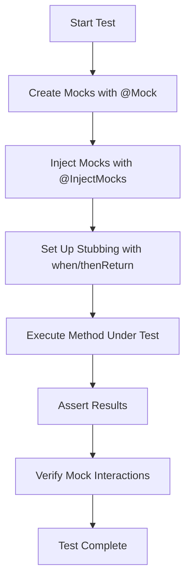

# How to Set Up Unit Testing with Mockito in Spring Boot

Author: [nawazdhandala](https://www.github.com/nawazdhandala)

Tags: Java, Spring Boot, Mockito, Unit Testing, JUnit, Testing

Description: Learn how to set up and write effective unit tests in Spring Boot using Mockito for mocking dependencies. This guide covers test configuration, common mocking patterns, and best practices for reliable tests.

---

> Unit testing is essential for building reliable Spring Boot applications. Mockito, combined with JUnit 5, provides a powerful framework for isolating components and testing them in isolation. This guide shows you how to set up and write effective unit tests.

Unit tests verify individual components work correctly in isolation. By mocking dependencies, you can focus on testing one class at a time without worrying about external systems like databases or APIs.

---

## Why Mockito for Spring Boot Testing

| Feature | Benefit |
|---------|---------|
| **Dependency Mocking** | Isolate components from external dependencies |
| **Behavior Verification** | Verify method calls and interactions |
| **Argument Capture** | Inspect arguments passed to mock methods |
| **Flexible Stubbing** | Return different values based on input |
| **Spring Integration** | Works seamlessly with @MockBean |

---

## Setting Up Dependencies

Add the required dependencies to your `pom.xml`:

```xml
<!-- pom.xml -->
<dependencies>
    <!-- Spring Boot Starter Test includes JUnit 5 and Mockito -->
    <dependency>
        <groupId>org.springframework.boot</groupId>
        <artifactId>spring-boot-starter-test</artifactId>
        <scope>test</scope>
    </dependency>
</dependencies>
```

For Gradle projects:

```groovy
// build.gradle
dependencies {
    testImplementation 'org.springframework.boot:spring-boot-starter-test'
}
```

The `spring-boot-starter-test` dependency includes JUnit 5, Mockito, AssertJ, and other testing utilities.

---

## Basic Unit Test Structure

Here's a typical service class and its corresponding test:

```java
// UserService.java
@Service
public class UserService {

    private final UserRepository userRepository;
    private final EmailService emailService;

    public UserService(UserRepository userRepository, EmailService emailService) {
        this.userRepository = userRepository;
        this.emailService = emailService;
    }

    public User createUser(String email, String name) {
        if (userRepository.existsByEmail(email)) {
            throw new UserAlreadyExistsException("Email already registered");
        }

        User user = new User();
        user.setEmail(email);
        user.setName(name);
        user.setCreatedAt(LocalDateTime.now());

        User savedUser = userRepository.save(user);
        emailService.sendWelcomeEmail(savedUser);

        return savedUser;
    }

    public Optional<User> findByEmail(String email) {
        return userRepository.findByEmail(email);
    }
}
```

```java
// UserServiceTest.java
@ExtendWith(MockitoExtension.class)
class UserServiceTest {

    @Mock
    private UserRepository userRepository;

    @Mock
    private EmailService emailService;

    @InjectMocks
    private UserService userService;

    @Test
    void createUser_ShouldSaveAndSendEmail_WhenEmailNotExists() {
        // Arrange
        String email = "test@example.com";
        String name = "Test User";
        User savedUser = new User();
        savedUser.setId(1L);
        savedUser.setEmail(email);
        savedUser.setName(name);

        when(userRepository.existsByEmail(email)).thenReturn(false);
        when(userRepository.save(any(User.class))).thenReturn(savedUser);

        // Act
        User result = userService.createUser(email, name);

        // Assert
        assertNotNull(result);
        assertEquals(email, result.getEmail());
        assertEquals(name, result.getName());

        verify(userRepository).existsByEmail(email);
        verify(userRepository).save(any(User.class));
        verify(emailService).sendWelcomeEmail(savedUser);
    }

    @Test
    void createUser_ShouldThrowException_WhenEmailExists() {
        // Arrange
        String email = "existing@example.com";
        when(userRepository.existsByEmail(email)).thenReturn(true);

        // Act & Assert
        assertThrows(UserAlreadyExistsException.class, () -> {
            userService.createUser(email, "Test User");
        });

        verify(userRepository).existsByEmail(email);
        verify(userRepository, never()).save(any());
        verify(emailService, never()).sendWelcomeEmail(any());
    }
}
```

---

## Mockito Test Flow



---

## Common Mocking Patterns

### Stubbing Return Values

```java
@Test
void testStubbing() {
    // Return single value
    when(userRepository.findById(1L)).thenReturn(Optional.of(user));

    // Return different values on consecutive calls
    when(userRepository.count())
        .thenReturn(0L)
        .thenReturn(1L)
        .thenReturn(2L);

    // Return based on argument
    when(userRepository.findByEmail(anyString()))
        .thenAnswer(invocation -> {
            String email = invocation.getArgument(0);
            if (email.contains("admin")) {
                return Optional.of(adminUser);
            }
            return Optional.empty();
        });
}
```

### Throwing Exceptions

```java
@Test
void testExceptionThrowing() {
    // Throw exception on method call
    when(userRepository.save(any()))
        .thenThrow(new DataAccessException("Database error") {});

    // Throw exception for void methods
    doThrow(new RuntimeException("Email failed"))
        .when(emailService).sendWelcomeEmail(any());

    assertThrows(DataAccessException.class, () -> {
        userService.createUser("test@example.com", "Test");
    });
}
```

### Argument Captor

```java
@Test
void testArgumentCaptor() {
    // Capture argument for inspection
    ArgumentCaptor<User> userCaptor = ArgumentCaptor.forClass(User.class);

    when(userRepository.existsByEmail(anyString())).thenReturn(false);
    when(userRepository.save(any(User.class))).thenReturn(new User());

    userService.createUser("test@example.com", "Test User");

    verify(userRepository).save(userCaptor.capture());

    User capturedUser = userCaptor.getValue();
    assertEquals("test@example.com", capturedUser.getEmail());
    assertEquals("Test User", capturedUser.getName());
    assertNotNull(capturedUser.getCreatedAt());
}
```

### Verifying Interactions

```java
@Test
void testVerification() {
    when(userRepository.existsByEmail(anyString())).thenReturn(false);
    when(userRepository.save(any())).thenReturn(new User());

    userService.createUser("test@example.com", "Test");

    // Verify method was called exactly once
    verify(userRepository, times(1)).save(any());

    // Verify method was never called
    verify(emailService, never()).sendErrorNotification(any());

    // Verify method was called at least once
    verify(userRepository, atLeastOnce()).existsByEmail(anyString());

    // Verify no more interactions
    verifyNoMoreInteractions(userRepository);
}
```

---

## Testing Spring Components with @MockBean

For integration-style tests that need Spring context:

```java
@SpringBootTest
class UserControllerIntegrationTest {

    @Autowired
    private MockMvc mockMvc;

    @MockBean
    private UserService userService;

    @Test
    void getUser_ShouldReturnUser_WhenExists() throws Exception {
        User user = new User();
        user.setId(1L);
        user.setEmail("test@example.com");
        user.setName("Test User");

        when(userService.findById(1L)).thenReturn(Optional.of(user));

        mockMvc.perform(get("/api/users/1"))
            .andExpect(status().isOk())
            .andExpect(jsonPath("$.id").value(1))
            .andExpect(jsonPath("$.email").value("test@example.com"))
            .andExpect(jsonPath("$.name").value("Test User"));
    }

    @Test
    void getUser_ShouldReturn404_WhenNotExists() throws Exception {
        when(userService.findById(anyLong())).thenReturn(Optional.empty());

        mockMvc.perform(get("/api/users/999"))
            .andExpect(status().isNotFound());
    }
}
```

---

## Testing Repository Layer

For repository tests, use `@DataJpaTest`:

```java
@DataJpaTest
class UserRepositoryTest {

    @Autowired
    private TestEntityManager entityManager;

    @Autowired
    private UserRepository userRepository;

    @Test
    void findByEmail_ShouldReturnUser_WhenExists() {
        // Arrange
        User user = new User();
        user.setEmail("test@example.com");
        user.setName("Test User");
        entityManager.persistAndFlush(user);

        // Act
        Optional<User> found = userRepository.findByEmail("test@example.com");

        // Assert
        assertTrue(found.isPresent());
        assertEquals("Test User", found.get().getName());
    }

    @Test
    void existsByEmail_ShouldReturnTrue_WhenExists() {
        User user = new User();
        user.setEmail("existing@example.com");
        user.setName("Existing User");
        entityManager.persistAndFlush(user);

        assertTrue(userRepository.existsByEmail("existing@example.com"));
        assertFalse(userRepository.existsByEmail("nonexistent@example.com"));
    }
}
```

---

## Best Practices

### 1. Use Meaningful Test Names

```java
// Good - describes what is being tested and expected outcome
@Test
void createUser_ShouldThrowException_WhenEmailAlreadyExists()

// Bad - too vague
@Test
void testCreateUser()
```

### 2. Follow Arrange-Act-Assert Pattern

```java
@Test
void updateUser_ShouldUpdateFields_WhenUserExists() {
    // Arrange - set up test data and mocks
    User existingUser = new User();
    existingUser.setId(1L);
    existingUser.setName("Old Name");
    when(userRepository.findById(1L)).thenReturn(Optional.of(existingUser));
    when(userRepository.save(any())).thenAnswer(i -> i.getArgument(0));

    // Act - execute the method under test
    User result = userService.updateName(1L, "New Name");

    // Assert - verify the results
    assertEquals("New Name", result.getName());
}
```

### 3. Test One Thing Per Test

```java
// Good - single responsibility
@Test
void createUser_ShouldSaveToRepository()

@Test
void createUser_ShouldSendWelcomeEmail()

@Test
void createUser_ShouldThrowExceptionForDuplicateEmail()
```

### 4. Use Strict Stubbing

```java
@ExtendWith(MockitoExtension.class)
@MockitoSettings(strictness = Strictness.STRICT_STUBS)
class UserServiceTest {
    // Fails if stubs are unused - helps catch test issues
}
```

---

## Common Pitfalls to Avoid

### 1. Mocking Final Classes

By default, Mockito cannot mock final classes. Add the configuration:

```
// src/test/resources/mockito-extensions/org.mockito.plugins.MockMaker
mock-maker-inline
```

### 2. Forgetting to Initialize Mocks

```java
// Wrong - mocks not initialized
class UserServiceTest {
    @Mock
    private UserRepository userRepository;

    @Test
    void test() {
        // userRepository is null!
    }
}

// Correct - add @ExtendWith
@ExtendWith(MockitoExtension.class)
class UserServiceTest {
    @Mock
    private UserRepository userRepository;
}
```

### 3. Over-Mocking

Test real behavior when possible. Only mock external dependencies and slow operations.

---

## Conclusion

Mockito provides a powerful toolkit for unit testing Spring Boot applications. Key takeaways:

- Use `@Mock` for creating mocks and `@InjectMocks` for the class under test
- Use `when().thenReturn()` for stubbing and `verify()` for interaction verification
- Use `@MockBean` for integration tests with Spring context
- Follow the Arrange-Act-Assert pattern for clear, readable tests
- Test one thing per test method

Effective unit tests give you confidence in your code and catch bugs early in development.

---

*Need to monitor your Spring Boot application in production? [OneUptime](https://oneuptime.com) provides comprehensive observability for Java applications with tracing, metrics, and alerting.*

**Related Reading:**
- [How to Set Up Integration Testing in Spring Boot](/blog/post/2025-12-22-integration-testing-spring-boot/view)
