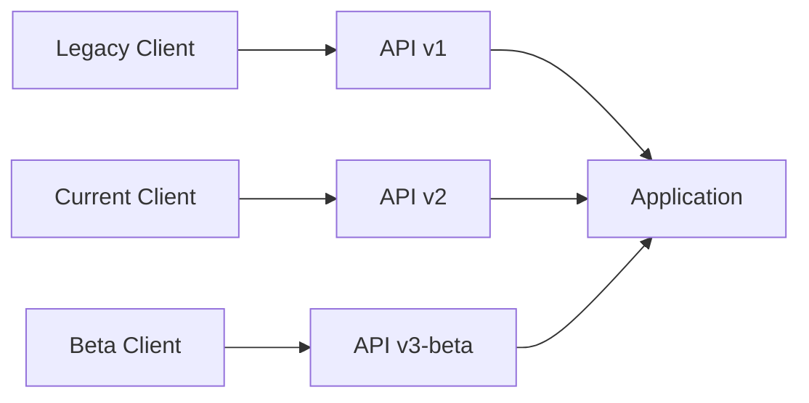

# How to Set Up API Versioning in ASP.NET Core

Author: [nawazdhandala](https://github.com/nawazdhandala)

Tags: .NET, C#, ASP.NET Core, API Versioning, REST API, Web Development

Description: Learn how to implement API versioning in ASP.NET Core to maintain backward compatibility while evolving your APIs. Covers URL path, query string, and header-based versioning strategies.

---

API versioning allows you to evolve your APIs without breaking existing clients. As your application grows and requirements change, versioning provides a clear contract between your API and its consumers.

## Why API Versioning Matters

Without versioning, every API change risks breaking existing clients. Versioning allows you to introduce new features, deprecate old ones, and maintain multiple versions simultaneously.



## Setting Up API Versioning

Install the required NuGet package:

```bash
dotnet add package Asp.Versioning.Mvc
dotnet add package Asp.Versioning.Mvc.ApiExplorer
```

Configure versioning in Program.cs:

```csharp
var builder = WebApplication.CreateBuilder(args);

builder.Services.AddControllers();

builder.Services.AddApiVersioning(options =>
{
    options.DefaultApiVersion = new ApiVersion(1, 0);
    options.AssumeDefaultVersionWhenUnspecified = true;
    options.ReportApiVersions = true;
})
.AddMvc()
.AddApiExplorer(options =>
{
    options.GroupNameFormat = "'v'VVV";
    options.SubstituteApiVersionInUrl = true;
});

var app = builder.Build();

app.MapControllers();
app.Run();
```

## URL Path Versioning

The most explicit versioning strategy uses URL paths:

```csharp
[ApiController]
[Route("api/v{version:apiVersion}/[controller]")]
[ApiVersion("1.0")]
public class ProductsV1Controller : ControllerBase
{
    [HttpGet]
    public IActionResult GetAll()
    {
        return Ok(new[]
        {
            new { Id = 1, Name = "Product 1" }
        });
    }
}

[ApiController]
[Route("api/v{version:apiVersion}/[controller]")]
[ApiVersion("2.0")]
public class ProductsV2Controller : ControllerBase
{
    [HttpGet]
    public IActionResult GetAll()
    {
        return Ok(new[]
        {
            new { Id = 1, Name = "Product 1", Description = "New field in v2" }
        });
    }
}
```

Requests:
- `GET /api/v1/products` - Returns v1 response
- `GET /api/v2/products` - Returns v2 response

## Single Controller with Multiple Versions

Handle multiple versions in one controller:

```csharp
[ApiController]
[Route("api/v{version:apiVersion}/products")]
[ApiVersion("1.0")]
[ApiVersion("2.0")]
public class ProductsController : ControllerBase
{
    [HttpGet]
    [MapToApiVersion("1.0")]
    public IActionResult GetAllV1()
    {
        return Ok(new[]
        {
            new ProductV1 { Id = 1, Name = "Product 1" }
        });
    }

    [HttpGet]
    [MapToApiVersion("2.0")]
    public IActionResult GetAllV2()
    {
        return Ok(new[]
        {
            new ProductV2 { Id = 1, Name = "Product 1", Category = "Electronics" }
        });
    }

    [HttpGet("{id}")]
    // Works for both versions
    public IActionResult GetById(int id)
    {
        return Ok(new { Id = id, Name = $"Product {id}" });
    }
}
```

## Query String Versioning

Version via query parameter:

```csharp
builder.Services.AddApiVersioning(options =>
{
    options.DefaultApiVersion = new ApiVersion(1, 0);
    options.AssumeDefaultVersionWhenUnspecified = true;
    options.ApiVersionReader = new QueryStringApiVersionReader("api-version");
});
```

Requests:
- `GET /api/products?api-version=1.0`
- `GET /api/products?api-version=2.0`

## Header Versioning

Version via custom header:

```csharp
builder.Services.AddApiVersioning(options =>
{
    options.DefaultApiVersion = new ApiVersion(1, 0);
    options.AssumeDefaultVersionWhenUnspecified = true;
    options.ApiVersionReader = new HeaderApiVersionReader("X-API-Version");
});
```

Requests include header:
```
GET /api/products
X-API-Version: 2.0
```

## Combined Version Readers

Support multiple versioning strategies:

```csharp
builder.Services.AddApiVersioning(options =>
{
    options.DefaultApiVersion = new ApiVersion(1, 0);
    options.AssumeDefaultVersionWhenUnspecified = true;
    options.ApiVersionReader = ApiVersionReader.Combine(
        new UrlSegmentApiVersionReader(),
        new QueryStringApiVersionReader("api-version"),
        new HeaderApiVersionReader("X-API-Version")
    );
});
```

## Deprecating API Versions

Mark versions as deprecated:

```csharp
[ApiController]
[Route("api/v{version:apiVersion}/orders")]
[ApiVersion("1.0", Deprecated = true)]
[ApiVersion("2.0")]
public class OrdersController : ControllerBase
{
    [HttpGet]
    [MapToApiVersion("1.0")]
    public IActionResult GetAllV1()
    {
        // Response includes header: api-deprecated-versions: 1.0
        return Ok(GetOrdersV1());
    }

    [HttpGet]
    [MapToApiVersion("2.0")]
    public IActionResult GetAllV2()
    {
        return Ok(GetOrdersV2());
    }
}
```

## Version-Specific Models

Use different models for different versions:

```csharp
// V1 Model
public class ProductV1
{
    public int Id { get; set; }
    public string Name { get; set; } = string.Empty;
    public decimal Price { get; set; }
}

// V2 Model - extended with new properties
public class ProductV2
{
    public int Id { get; set; }
    public string Name { get; set; } = string.Empty;
    public decimal Price { get; set; }
    public string Category { get; set; } = string.Empty;
    public List<string> Tags { get; set; } = new();
    public DateTime CreatedAt { get; set; }
}

// Controller with version-specific responses
[ApiController]
[Route("api/v{version:apiVersion}/products")]
[ApiVersion("1.0")]
[ApiVersion("2.0")]
public class ProductsController : ControllerBase
{
    private readonly IProductService _productService;

    public ProductsController(IProductService productService)
    {
        _productService = productService;
    }

    [HttpGet("{id}")]
    [MapToApiVersion("1.0")]
    public async Task<ActionResult<ProductV1>> GetByIdV1(int id)
    {
        var product = await _productService.GetByIdAsync(id);

        return new ProductV1
        {
            Id = product.Id,
            Name = product.Name,
            Price = product.Price
        };
    }

    [HttpGet("{id}")]
    [MapToApiVersion("2.0")]
    public async Task<ActionResult<ProductV2>> GetByIdV2(int id)
    {
        var product = await _productService.GetByIdAsync(id);

        return new ProductV2
        {
            Id = product.Id,
            Name = product.Name,
            Price = product.Price,
            Category = product.Category,
            Tags = product.Tags,
            CreatedAt = product.CreatedAt
        };
    }
}
```

## Swagger Integration

Configure Swagger to show all API versions:

```csharp
builder.Services.AddEndpointsApiExplorer();
builder.Services.AddSwaggerGen();

builder.Services.ConfigureOptions<ConfigureSwaggerOptions>();

public class ConfigureSwaggerOptions : IConfigureOptions<SwaggerGenOptions>
{
    private readonly IApiVersionDescriptionProvider _provider;

    public ConfigureSwaggerOptions(IApiVersionDescriptionProvider provider)
    {
        _provider = provider;
    }

    public void Configure(SwaggerGenOptions options)
    {
        foreach (var description in _provider.ApiVersionDescriptions)
        {
            options.SwaggerDoc(description.GroupName, new OpenApiInfo
            {
                Title = $"My API {description.ApiVersion}",
                Version = description.ApiVersion.ToString(),
                Description = description.IsDeprecated
                    ? "This API version has been deprecated."
                    : null
            });
        }
    }
}
```

Configure Swagger UI:

```csharp
var app = builder.Build();

app.UseSwagger();
app.UseSwaggerUI(options =>
{
    var descriptions = app.DescribeApiVersions();

    foreach (var description in descriptions)
    {
        var url = $"/swagger/{description.GroupName}/swagger.json";
        var name = description.GroupName.ToUpperInvariant();
        options.SwaggerEndpoint(url, name);
    }
});
```

## Version Conventions

Apply versioning conventions globally:

```csharp
builder.Services.AddApiVersioning(options =>
{
    options.DefaultApiVersion = new ApiVersion(1, 0);
    options.AssumeDefaultVersionWhenUnspecified = true;
})
.AddMvc(options =>
{
    options.Conventions.Controller<ProductsController>()
        .HasApiVersion(1, 0)
        .HasApiVersion(2, 0)
        .Action(c => c.Delete(default))
        .MapToApiVersion(2, 0);
});
```

## Minimal API Versioning

Version minimal APIs:

```csharp
var builder = WebApplication.CreateBuilder(args);

builder.Services.AddApiVersioning(options =>
{
    options.DefaultApiVersion = new ApiVersion(1, 0);
    options.ReportApiVersions = true;
})
.AddApiExplorer(options =>
{
    options.GroupNameFormat = "'v'VVV";
});

var app = builder.Build();

var versionSet = app.NewApiVersionSet()
    .HasApiVersion(1, 0)
    .HasApiVersion(2, 0)
    .ReportApiVersions()
    .Build();

app.MapGet("/api/products", () => Results.Ok(GetProductsV1()))
    .WithApiVersionSet(versionSet)
    .MapToApiVersion(1, 0);

app.MapGet("/api/products", () => Results.Ok(GetProductsV2()))
    .WithApiVersionSet(versionSet)
    .MapToApiVersion(2, 0);

app.Run();
```

## Version Negotiation Error Handling

Handle version errors gracefully:

```csharp
builder.Services.AddApiVersioning(options =>
{
    options.DefaultApiVersion = new ApiVersion(1, 0);
    options.AssumeDefaultVersionWhenUnspecified = true;
    options.ReportApiVersions = true;
})
.AddMvc();

// Custom error response
builder.Services.AddControllers(options =>
{
    options.Filters.Add<ApiVersionExceptionFilter>();
});

public class ApiVersionExceptionFilter : IExceptionFilter
{
    public void OnException(ExceptionContext context)
    {
        if (context.Exception is ApiVersionUnspecifiedException)
        {
            context.Result = new BadRequestObjectResult(new
            {
                error = "API version is required",
                supportedVersions = new[] { "1.0", "2.0" }
            });
            context.ExceptionHandled = true;
        }
    }
}
```

## Complete Example

Here is a production-ready versioning setup:

```csharp
var builder = WebApplication.CreateBuilder(args);

builder.Services.AddControllers();

builder.Services.AddApiVersioning(options =>
{
    options.DefaultApiVersion = new ApiVersion(1, 0);
    options.AssumeDefaultVersionWhenUnspecified = true;
    options.ReportApiVersions = true;
    options.ApiVersionReader = ApiVersionReader.Combine(
        new UrlSegmentApiVersionReader(),
        new HeaderApiVersionReader("X-API-Version")
    );
})
.AddMvc()
.AddApiExplorer(options =>
{
    options.GroupNameFormat = "'v'VVV";
    options.SubstituteApiVersionInUrl = true;
});

builder.Services.AddEndpointsApiExplorer();
builder.Services.AddSwaggerGen();
builder.Services.ConfigureOptions<ConfigureSwaggerOptions>();

var app = builder.Build();

app.UseSwagger();
app.UseSwaggerUI(options =>
{
    foreach (var description in app.DescribeApiVersions())
    {
        options.SwaggerEndpoint(
            $"/swagger/{description.GroupName}/swagger.json",
            description.GroupName);
    }
});

app.MapControllers();
app.Run();
```

## Summary

| Strategy | When to Use |
|----------|-------------|
| **URL Path** | Clear, explicit, REST-friendly |
| **Query String** | Easy to use in browsers |
| **Header** | Clean URLs, programmatic clients |
| **Combined** | Maximum flexibility |

API versioning is essential for maintaining backward compatibility while evolving your APIs. Choose a versioning strategy that fits your clients' needs and implement it consistently across your application.
