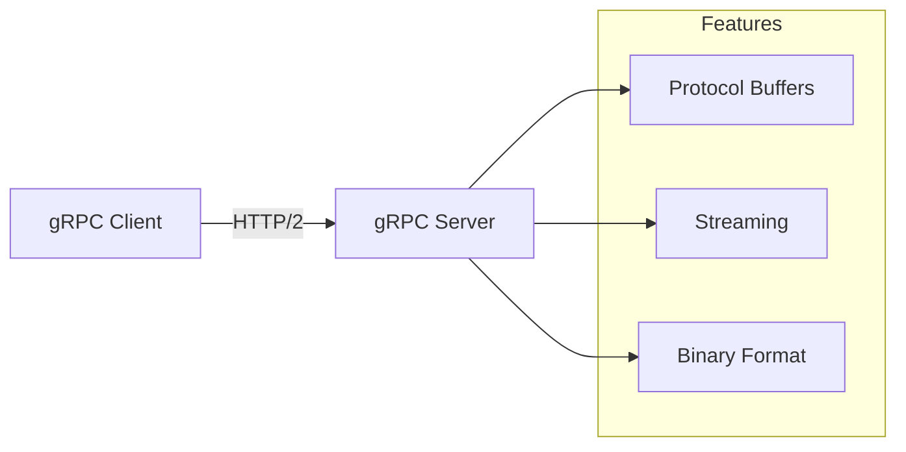

# How to Configure gRPC in ASP.NET Core

Author: [nawazdhandala](https://github.com/nawazdhandala)

Tags: .NET, C#, ASP.NET Core, gRPC, Microservices, API, Protocol Buffers

Description: Learn how to configure gRPC services in ASP.NET Core for high-performance communication between services. Covers service definition, server setup, client configuration, and streaming.

---

gRPC is a high-performance, cross-platform RPC framework that uses Protocol Buffers for serialization and HTTP/2 for transport. It is ideal for microservices communication where performance matters.

## Why gRPC

gRPC offers significant advantages over traditional REST APIs for service-to-service communication: smaller message sizes, bidirectional streaming, and strongly-typed contracts.



## Setting Up a gRPC Server

Create a new gRPC project or add gRPC to an existing ASP.NET Core application:

```bash
dotnet new grpc -n GrpcService
# Or add to existing project
dotnet add package Grpc.AspNetCore
```

## Defining the Service Contract

Create a `.proto` file defining your service:

```protobuf
// Protos/greeter.proto
syntax = "proto3";

option csharp_namespace = "GrpcService";

package greet;

service Greeter {
  rpc SayHello (HelloRequest) returns (HelloReply);
  rpc SayHelloStream (HelloRequest) returns (stream HelloReply);
}

message HelloRequest {
  string name = 1;
}

message HelloReply {
  string message = 1;
  int64 timestamp = 2;
}
```

Configure the proto file in your project:

```xml
<!-- GrpcService.csproj -->
<ItemGroup>
  <Protobuf Include="Protos\greeter.proto" GrpcServices="Server" />
</ItemGroup>
```

## Implementing the Service

Create the service implementation:

```csharp
public class GreeterService : Greeter.GreeterBase
{
    private readonly ILogger<GreeterService> _logger;

    public GreeterService(ILogger<GreeterService> logger)
    {
        _logger = logger;
    }

    public override Task<HelloReply> SayHello(HelloRequest request, ServerCallContext context)
    {
        _logger.LogInformation("Received greeting request for {Name}", request.Name);

        return Task.FromResult(new HelloReply
        {
            Message = $"Hello, {request.Name}!",
            Timestamp = DateTimeOffset.UtcNow.ToUnixTimeMilliseconds()
        });
    }

    public override async Task SayHelloStream(
        HelloRequest request,
        IServerStreamWriter<HelloReply> responseStream,
        ServerCallContext context)
    {
        for (int i = 0; i < 5; i++)
        {
            if (context.CancellationToken.IsCancellationRequested)
                break;

            await responseStream.WriteAsync(new HelloReply
            {
                Message = $"Hello {request.Name}, message {i + 1}",
                Timestamp = DateTimeOffset.UtcNow.ToUnixTimeMilliseconds()
            });

            await Task.Delay(1000, context.CancellationToken);
        }
    }
}
```

## Configuring the Server

Set up gRPC in Program.cs:

```csharp
var builder = WebApplication.CreateBuilder(args);

builder.Services.AddGrpc(options =>
{
    options.EnableDetailedErrors = builder.Environment.IsDevelopment();
    options.MaxReceiveMessageSize = 16 * 1024 * 1024; // 16 MB
    options.MaxSendMessageSize = 16 * 1024 * 1024;
});

var app = builder.Build();

app.MapGrpcService<GreeterService>();

app.Run();
```

## Creating a gRPC Client

Add the client package and proto reference:

```xml
<!-- Client.csproj -->
<ItemGroup>
  <PackageReference Include="Google.Protobuf" Version="3.25.1" />
  <PackageReference Include="Grpc.Net.Client" Version="2.59.0" />
  <PackageReference Include="Grpc.Tools" Version="2.59.0" PrivateAssets="All" />
</ItemGroup>

<ItemGroup>
  <Protobuf Include="Protos\greeter.proto" GrpcServices="Client" />
</ItemGroup>
```

Create and use the client:

```csharp
using var channel = GrpcChannel.ForAddress("https://localhost:5001");
var client = new Greeter.GreeterClient(channel);

// Unary call
var reply = await client.SayHelloAsync(new HelloRequest { Name = "World" });
Console.WriteLine($"Response: {reply.Message}");

// Server streaming
using var streamingCall = client.SayHelloStream(new HelloRequest { Name = "World" });
await foreach (var response in streamingCall.ResponseStream.ReadAllAsync())
{
    Console.WriteLine($"Stream response: {response.Message}");
}
```

## Client Factory Integration

Use `IHttpClientFactory` for managed clients:

```csharp
// Program.cs
builder.Services.AddGrpcClient<Greeter.GreeterClient>(options =>
{
    options.Address = new Uri("https://localhost:5001");
})
.ConfigurePrimaryHttpMessageHandler(() =>
{
    var handler = new HttpClientHandler();
    // For development with self-signed certs
    handler.ServerCertificateCustomValidationCallback =
        HttpClientHandler.DangerousAcceptAnyServerCertificateValidator;
    return handler;
});

// Using the client
public class GreetingService
{
    private readonly Greeter.GreeterClient _client;

    public GreetingService(Greeter.GreeterClient client)
    {
        _client = client;
    }

    public async Task<string> GetGreetingAsync(string name)
    {
        var reply = await _client.SayHelloAsync(new HelloRequest { Name = name });
        return reply.Message;
    }
}
```

## Bidirectional Streaming

Define a bidirectional streaming service:

```protobuf
service Chat {
  rpc ChatStream (stream ChatMessage) returns (stream ChatMessage);
}

message ChatMessage {
  string user = 1;
  string text = 2;
  int64 timestamp = 3;
}
```

Implement the service:

```csharp
public class ChatService : Chat.ChatBase
{
    public override async Task ChatStream(
        IAsyncStreamReader<ChatMessage> requestStream,
        IServerStreamWriter<ChatMessage> responseStream,
        ServerCallContext context)
    {
        var readTask = Task.Run(async () =>
        {
            await foreach (var message in requestStream.ReadAllAsync(context.CancellationToken))
            {
                Console.WriteLine($"Received: {message.User}: {message.Text}");

                // Echo back with server timestamp
                await responseStream.WriteAsync(new ChatMessage
                {
                    User = "Server",
                    Text = $"Received your message: {message.Text}",
                    Timestamp = DateTimeOffset.UtcNow.ToUnixTimeMilliseconds()
                });
            }
        });

        await readTask;
    }
}
```

## Error Handling

Return proper gRPC status codes:

```csharp
public class ProductService : Products.ProductsBase
{
    private readonly IProductRepository _repository;

    public ProductService(IProductRepository repository)
    {
        _repository = repository;
    }

    public override async Task<ProductReply> GetProduct(
        ProductRequest request,
        ServerCallContext context)
    {
        if (request.Id <= 0)
        {
            throw new RpcException(new Status(
                StatusCode.InvalidArgument,
                "Product ID must be greater than 0"));
        }

        var product = await _repository.GetByIdAsync(request.Id);

        if (product == null)
        {
            throw new RpcException(new Status(
                StatusCode.NotFound,
                $"Product with ID {request.Id} not found"));
        }

        return new ProductReply
        {
            Id = product.Id,
            Name = product.Name,
            Price = (double)product.Price
        };
    }
}
```

Handle errors on the client:

```csharp
try
{
    var product = await _client.GetProductAsync(new ProductRequest { Id = 123 });
}
catch (RpcException ex) when (ex.StatusCode == StatusCode.NotFound)
{
    Console.WriteLine($"Product not found: {ex.Status.Detail}");
}
catch (RpcException ex) when (ex.StatusCode == StatusCode.InvalidArgument)
{
    Console.WriteLine($"Invalid request: {ex.Status.Detail}");
}
catch (RpcException ex)
{
    Console.WriteLine($"gRPC error: {ex.StatusCode} - {ex.Status.Detail}");
}
```

## Interceptors

Add cross-cutting concerns with interceptors:

```csharp
public class LoggingInterceptor : Interceptor
{
    private readonly ILogger<LoggingInterceptor> _logger;

    public LoggingInterceptor(ILogger<LoggingInterceptor> logger)
    {
        _logger = logger;
    }

    public override async Task<TResponse> UnaryServerHandler<TRequest, TResponse>(
        TRequest request,
        ServerCallContext context,
        UnaryServerMethod<TRequest, TResponse> continuation)
    {
        var stopwatch = Stopwatch.StartNew();

        _logger.LogInformation(
            "Starting gRPC call: {Method}",
            context.Method);

        try
        {
            var response = await continuation(request, context);

            _logger.LogInformation(
                "Completed gRPC call: {Method} in {ElapsedMs}ms",
                context.Method,
                stopwatch.ElapsedMilliseconds);

            return response;
        }
        catch (Exception ex)
        {
            _logger.LogError(ex,
                "Error in gRPC call: {Method}",
                context.Method);
            throw;
        }
    }
}

// Register the interceptor
builder.Services.AddGrpc(options =>
{
    options.Interceptors.Add<LoggingInterceptor>();
});
```

## Authentication

Add authentication to gRPC services:

```csharp
// Server configuration
builder.Services.AddAuthentication(JwtBearerDefaults.AuthenticationScheme)
    .AddJwtBearer(options =>
    {
        options.Authority = "https://auth.example.com";
        options.TokenValidationParameters = new TokenValidationParameters
        {
            ValidateAudience = false
        };
    });

builder.Services.AddAuthorization();
builder.Services.AddGrpc();

var app = builder.Build();

app.UseAuthentication();
app.UseAuthorization();

app.MapGrpcService<SecureService>().RequireAuthorization();
```

Send credentials from the client:

```csharp
var headers = new Metadata
{
    { "Authorization", $"Bearer {accessToken}" }
};

var reply = await client.SecureMethodAsync(
    new SecureRequest(),
    headers: headers);

// Or configure channel-wide
var credentials = CallCredentials.FromInterceptor((context, metadata) =>
{
    metadata.Add("Authorization", $"Bearer {accessToken}");
    return Task.CompletedTask;
});

var channel = GrpcChannel.ForAddress("https://localhost:5001", new GrpcChannelOptions
{
    Credentials = ChannelCredentials.Create(new SslCredentials(), credentials)
});
```

## Health Checks

Add gRPC health checks:

```csharp
builder.Services.AddGrpcHealthChecks()
    .AddCheck("database", () => HealthCheckResult.Healthy());

var app = builder.Build();

app.MapGrpcService<GreeterService>();
app.MapGrpcHealthChecksService();
```

## gRPC-Web for Browser Clients

Enable gRPC-Web for browser support:

```csharp
builder.Services.AddGrpc();
builder.Services.AddGrpcWeb();

var app = builder.Build();

app.UseGrpcWeb(new GrpcWebOptions { DefaultEnabled = true });

app.MapGrpcService<GreeterService>().EnableGrpcWeb();
```

## Complete Server Configuration

```csharp
var builder = WebApplication.CreateBuilder(args);

builder.Services.AddGrpc(options =>
{
    options.EnableDetailedErrors = builder.Environment.IsDevelopment();
    options.MaxReceiveMessageSize = 16 * 1024 * 1024;
    options.MaxSendMessageSize = 16 * 1024 * 1024;
    options.Interceptors.Add<LoggingInterceptor>();
});

builder.Services.AddGrpcReflection();
builder.Services.AddGrpcHealthChecks();

builder.Services.AddAuthentication(JwtBearerDefaults.AuthenticationScheme)
    .AddJwtBearer();
builder.Services.AddAuthorization();

var app = builder.Build();

app.UseAuthentication();
app.UseAuthorization();

app.MapGrpcService<GreeterService>();
app.MapGrpcService<ProductService>();
app.MapGrpcHealthChecksService();

if (app.Environment.IsDevelopment())
{
    app.MapGrpcReflectionService();
}

app.Run();
```

## Summary

| Feature | Configuration |
|---------|---------------|
| **Server setup** | `AddGrpc()` and `MapGrpcService<>()` |
| **Client factory** | `AddGrpcClient<>()` |
| **Streaming** | Server, client, and bidirectional |
| **Error handling** | `RpcException` with status codes |
| **Interceptors** | Cross-cutting concerns |
| **Authentication** | JWT Bearer + metadata |
| **Health checks** | `AddGrpcHealthChecks()` |

gRPC provides excellent performance for service-to-service communication. Its strongly-typed contracts, efficient serialization, and streaming support make it ideal for microservices architectures.
