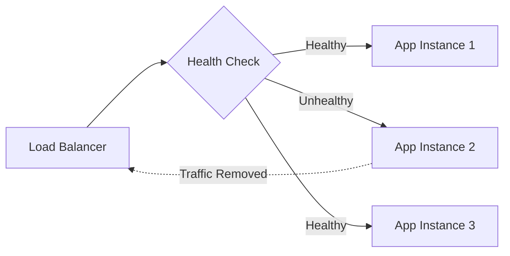

# How to Configure Health Checks in ASP.NET Core

Author: [nawazdhandala](https://github.com/nawazdhandala)

Tags: .NET, C#, ASP.NET Core, Health Checks, Kubernetes, Monitoring, DevOps

Description: Learn how to configure health checks in ASP.NET Core to monitor application health, database connectivity, and external service dependencies for production-ready deployments.

---

Health checks are essential for production applications. They allow orchestrators like Kubernetes, load balancers, and monitoring systems to determine if your application is running correctly and ready to serve traffic. ASP.NET Core provides a built-in health checks framework that is both flexible and extensible.

## Why Health Checks Matter

Without proper health checks, your infrastructure has no way to know if your application is actually working. A running process does not mean a healthy application - your database connection might be broken, a required external service might be down, or your application might be in a degraded state.



## Basic Health Check Setup

Start by adding the health checks services and endpoint in your `Program.cs`:

```csharp
var builder = WebApplication.CreateBuilder(args);

// Add health checks services
builder.Services.AddHealthChecks();

var app = builder.Build();

// Map the health endpoint
app.MapHealthChecks("/health");

app.Run();
```

This creates a basic endpoint at `/health` that returns a 200 status code with "Healthy" text when the application is running.

## Adding Database Health Checks

Most applications depend on databases. Add the appropriate NuGet package for your database:

```bash
# For SQL Server
dotnet add package AspNetCore.HealthChecks.SqlServer

# For PostgreSQL
dotnet add package AspNetCore.HealthChecks.Npgsql

# For Redis
dotnet add package AspNetCore.HealthChecks.Redis
```

Configure the database health check:

```csharp
var builder = WebApplication.CreateBuilder(args);

builder.Services.AddHealthChecks()
    .AddSqlServer(
        connectionString: builder.Configuration.GetConnectionString("DefaultConnection")!,
        name: "sqlserver",
        failureStatus: HealthStatus.Unhealthy,
        tags: new[] { "database", "sql" })
    .AddRedis(
        redisConnectionString: builder.Configuration.GetConnectionString("Redis")!,
        name: "redis",
        failureStatus: HealthStatus.Degraded,
        tags: new[] { "cache", "redis" });

var app = builder.Build();

app.MapHealthChecks("/health");
app.Run();
```

## Custom Health Checks

Create custom health checks for your specific needs by implementing `IHealthCheck`:

```csharp
public class ExternalApiHealthCheck : IHealthCheck
{
    private readonly HttpClient _httpClient;
    private readonly ILogger<ExternalApiHealthCheck> _logger;

    public ExternalApiHealthCheck(
        HttpClient httpClient,
        ILogger<ExternalApiHealthCheck> logger)
    {
        _httpClient = httpClient;
        _logger = logger;
    }

    public async Task<HealthCheckResult> CheckHealthAsync(
        HealthCheckContext context,
        CancellationToken cancellationToken = default)
    {
        try
        {
            var response = await _httpClient.GetAsync(
                "/api/status",
                cancellationToken);

            if (response.IsSuccessStatusCode)
            {
                return HealthCheckResult.Healthy("External API is reachable");
            }

            return HealthCheckResult.Degraded(
                $"External API returned {response.StatusCode}");
        }
        catch (HttpRequestException ex)
        {
            _logger.LogError(ex, "External API health check failed");

            return HealthCheckResult.Unhealthy(
                "External API is unreachable",
                ex);
        }
    }
}
```

Register the custom health check:

```csharp
builder.Services.AddHttpClient<ExternalApiHealthCheck>(client =>
{
    client.BaseAddress = new Uri("https://api.example.com");
    client.Timeout = TimeSpan.FromSeconds(5);
});

builder.Services.AddHealthChecks()
    .AddCheck<ExternalApiHealthCheck>(
        "external-api",
        failureStatus: HealthStatus.Degraded,
        tags: new[] { "external", "api" });
```

## Liveness vs Readiness Probes

Kubernetes distinguishes between liveness and readiness probes. Liveness checks determine if the app should be restarted. Readiness checks determine if the app should receive traffic.

```csharp
var builder = WebApplication.CreateBuilder(args);

builder.Services.AddHealthChecks()
    // Database - affects readiness only
    .AddSqlServer(
        connectionString: builder.Configuration.GetConnectionString("DefaultConnection")!,
        name: "database",
        tags: new[] { "ready" })
    // Memory check - affects liveness
    .AddCheck("memory", () =>
    {
        var allocated = GC.GetTotalMemory(false);
        var threshold = 1024L * 1024L * 1024L; // 1 GB

        return allocated < threshold
            ? HealthCheckResult.Healthy($"Memory: {allocated / 1024 / 1024} MB")
            : HealthCheckResult.Unhealthy($"Memory threshold exceeded: {allocated / 1024 / 1024} MB");
    }, tags: new[] { "live" });

var app = builder.Build();

// Liveness probe - basic app health
app.MapHealthChecks("/health/live", new HealthCheckOptions
{
    Predicate = check => check.Tags.Contains("live")
});

// Readiness probe - app can serve requests
app.MapHealthChecks("/health/ready", new HealthCheckOptions
{
    Predicate = check => check.Tags.Contains("ready")
});

app.Run();
```

Configure Kubernetes to use these endpoints:

```yaml
apiVersion: v1
kind: Pod
spec:
  containers:
  - name: myapp
    livenessProbe:
      httpGet:
        path: /health/live
        port: 80
      initialDelaySeconds: 10
      periodSeconds: 10
    readinessProbe:
      httpGet:
        path: /health/ready
        port: 80
      initialDelaySeconds: 5
      periodSeconds: 5
```

## Customizing Health Check Responses

Return detailed JSON responses for debugging:

```csharp
app.MapHealthChecks("/health", new HealthCheckOptions
{
    ResponseWriter = async (context, report) =>
    {
        context.Response.ContentType = "application/json";

        var response = new
        {
            status = report.Status.ToString(),
            totalDuration = report.TotalDuration.TotalMilliseconds,
            checks = report.Entries.Select(e => new
            {
                name = e.Key,
                status = e.Value.Status.ToString(),
                duration = e.Value.Duration.TotalMilliseconds,
                description = e.Value.Description,
                exception = e.Value.Exception?.Message,
                data = e.Value.Data
            })
        };

        await context.Response.WriteAsJsonAsync(response);
    }
});
```

This produces output like:

```json
{
  "status": "Healthy",
  "totalDuration": 125.5,
  "checks": [
    {
      "name": "database",
      "status": "Healthy",
      "duration": 45.2,
      "description": "SQL Server connection successful",
      "exception": null,
      "data": {}
    },
    {
      "name": "redis",
      "status": "Healthy",
      "duration": 12.8,
      "description": null,
      "exception": null,
      "data": {}
    }
  ]
}
```

## Health Check UI

For visual monitoring, add the Health Checks UI package:

```bash
dotnet add package AspNetCore.HealthChecks.UI
dotnet add package AspNetCore.HealthChecks.UI.InMemory.Storage
```

Configure the UI:

```csharp
var builder = WebApplication.CreateBuilder(args);

builder.Services.AddHealthChecks()
    .AddSqlServer(builder.Configuration.GetConnectionString("DefaultConnection")!);

builder.Services.AddHealthChecksUI(options =>
{
    options.SetEvaluationTimeInSeconds(30);
    options.MaximumHistoryEntriesPerEndpoint(50);
    options.AddHealthCheckEndpoint("API", "/health");
})
.AddInMemoryStorage();

var app = builder.Build();

app.MapHealthChecks("/health", new HealthCheckOptions
{
    ResponseWriter = UIResponseWriter.WriteHealthCheckUIResponse
});

app.MapHealthChecksUI(options =>
{
    options.UIPath = "/health-ui";
});

app.Run();
```

## Startup Health Checks

Some dependencies need time to become available. Use startup health checks to handle this:

```csharp
public class DatabaseStartupHealthCheck : IHealthCheck
{
    private volatile bool _isReady;
    private readonly IServiceProvider _serviceProvider;

    public DatabaseStartupHealthCheck(IServiceProvider serviceProvider)
    {
        _serviceProvider = serviceProvider;
    }

    public async Task<HealthCheckResult> CheckHealthAsync(
        HealthCheckContext context,
        CancellationToken cancellationToken = default)
    {
        if (_isReady)
        {
            return HealthCheckResult.Healthy("Database startup completed");
        }

        try
        {
            using var scope = _serviceProvider.CreateScope();
            var dbContext = scope.ServiceProvider.GetRequiredService<ApplicationDbContext>();

            // Run migrations or check schema
            await dbContext.Database.MigrateAsync(cancellationToken);

            _isReady = true;
            return HealthCheckResult.Healthy("Database startup completed");
        }
        catch (Exception ex)
        {
            return HealthCheckResult.Unhealthy("Database startup failed", ex);
        }
    }
}
```

## Health Check with Timeouts

Prevent slow health checks from blocking responses:

```csharp
builder.Services.AddHealthChecks()
    .AddAsyncCheck("slow-dependency", async cancellationToken =>
    {
        using var timeoutCts = new CancellationTokenSource(TimeSpan.FromSeconds(5));
        using var linkedCts = CancellationTokenSource.CreateLinkedTokenSource(
            cancellationToken, timeoutCts.Token);

        try
        {
            await CheckSlowDependency(linkedCts.Token);
            return HealthCheckResult.Healthy();
        }
        catch (OperationCanceledException) when (timeoutCts.IsCancellationRequested)
        {
            return HealthCheckResult.Degraded("Check timed out after 5 seconds");
        }
    });
```

## Complete Configuration Example

Here is a production-ready health check configuration:

```csharp
var builder = WebApplication.CreateBuilder(args);

builder.Services.AddHealthChecks()
    // Database checks
    .AddSqlServer(
        builder.Configuration.GetConnectionString("DefaultConnection")!,
        name: "sql-server",
        tags: new[] { "db", "ready" })

    // Cache checks
    .AddRedis(
        builder.Configuration.GetConnectionString("Redis")!,
        name: "redis",
        tags: new[] { "cache", "ready" })

    // External service checks
    .AddUrlGroup(
        new Uri("https://api.stripe.com/v1/health"),
        name: "stripe-api",
        failureStatus: HealthStatus.Degraded,
        tags: new[] { "external", "ready" })

    // Disk space check
    .AddDiskStorageHealthCheck(options =>
    {
        options.AddDrive("C:\\", 1024); // 1 GB minimum
    }, name: "disk-space", tags: new[] { "infrastructure", "live" })

    // Memory check
    .AddProcessAllocatedMemoryHealthCheck(
        maximumMegabytesAllocated: 500,
        name: "memory",
        tags: new[] { "infrastructure", "live" });

var app = builder.Build();

// Main health endpoint
app.MapHealthChecks("/health");

// Kubernetes probes
app.MapHealthChecks("/health/live", new HealthCheckOptions
{
    Predicate = check => check.Tags.Contains("live")
});

app.MapHealthChecks("/health/ready", new HealthCheckOptions
{
    Predicate = check => check.Tags.Contains("ready")
});

app.Run();
```

## Summary

| Aspect | Recommendation |
|--------|----------------|
| **Basic Setup** | Use `AddHealthChecks()` and `MapHealthChecks()` |
| **Database Checks** | Use NuGet packages for specific databases |
| **Custom Checks** | Implement `IHealthCheck` interface |
| **Kubernetes** | Separate liveness and readiness endpoints |
| **Response Format** | Return JSON for detailed diagnostics |
| **Timeouts** | Add timeouts to prevent blocking |

Health checks provide the visibility your infrastructure needs to route traffic correctly and restart failing instances automatically. Implementing them properly is a key step toward production-ready ASP.NET Core applications.
