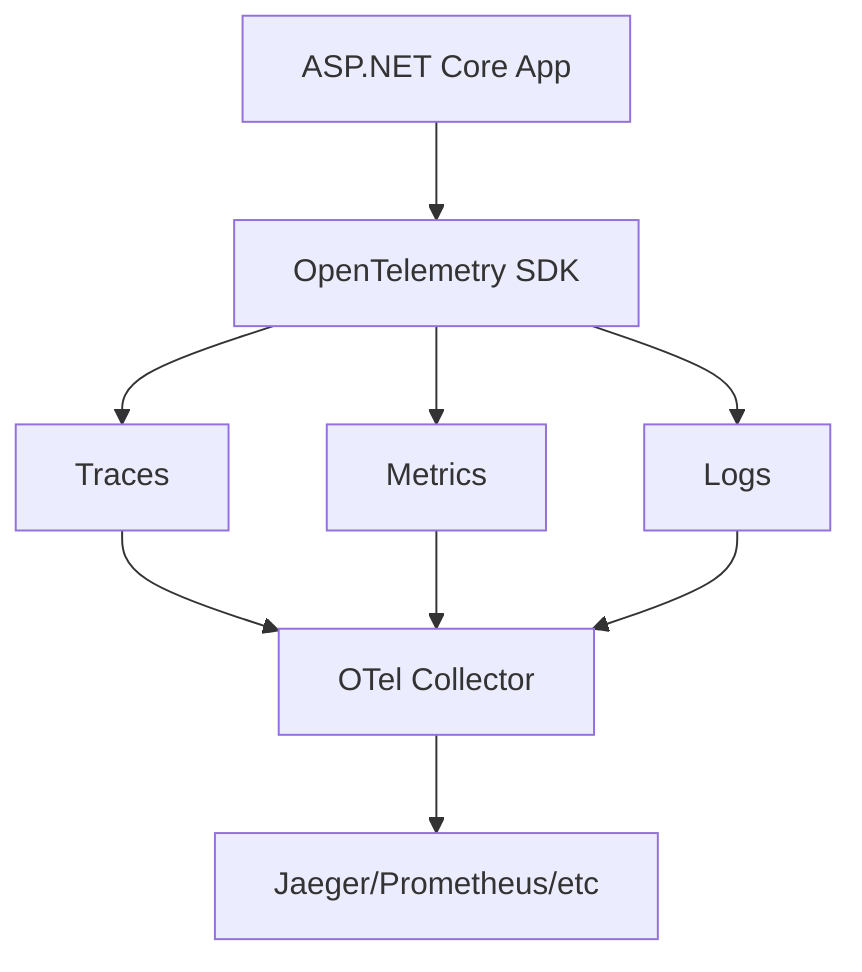

# How to Set Up OpenTelemetry in ASP.NET Core

Author: [nawazdhandala](https://github.com/nawazdhandala)

Tags: .NET, C#, ASP.NET Core, OpenTelemetry, Observability, Tracing, Metrics, Logging

Description: Learn how to set up OpenTelemetry in ASP.NET Core for comprehensive observability. Covers distributed tracing, metrics collection, and structured logging with practical examples.

---

OpenTelemetry provides vendor-neutral observability for your applications. By instrumenting your ASP.NET Core applications with OpenTelemetry, you gain insights into request flows, performance metrics, and application behavior across distributed systems.

## Why OpenTelemetry

OpenTelemetry is the industry standard for observability. It provides a single set of APIs, libraries, and agents to capture traces, metrics, and logs from your applications.



## Installing OpenTelemetry Packages

Add the required NuGet packages:

```bash
dotnet add package OpenTelemetry.Extensions.Hosting
dotnet add package OpenTelemetry.Instrumentation.AspNetCore
dotnet add package OpenTelemetry.Instrumentation.Http
dotnet add package OpenTelemetry.Instrumentation.SqlClient
dotnet add package OpenTelemetry.Exporter.OpenTelemetryProtocol
dotnet add package OpenTelemetry.Exporter.Console
```

## Basic Setup

Configure OpenTelemetry in Program.cs:

```csharp
using OpenTelemetry.Logs;
using OpenTelemetry.Metrics;
using OpenTelemetry.Resources;
using OpenTelemetry.Trace;

var builder = WebApplication.CreateBuilder(args);

// Define the resource (service identity)
var resourceBuilder = ResourceBuilder.CreateDefault()
    .AddService(
        serviceName: "MyApiService",
        serviceVersion: "1.0.0",
        serviceInstanceId: Environment.MachineName);

// Configure OpenTelemetry
builder.Services.AddOpenTelemetry()
    .ConfigureResource(resource => resource
        .AddService("MyApiService", "1.0.0"))
    .WithTracing(tracing => tracing
        .AddAspNetCoreInstrumentation()
        .AddHttpClientInstrumentation()
        .AddSqlClientInstrumentation()
        .AddConsoleExporter())
    .WithMetrics(metrics => metrics
        .AddAspNetCoreInstrumentation()
        .AddHttpClientInstrumentation()
        .AddConsoleExporter());

builder.Services.AddControllers();

var app = builder.Build();
app.MapControllers();
app.Run();
```

## Configuring the OTLP Exporter

Export telemetry to an OpenTelemetry collector:

```csharp
builder.Services.AddOpenTelemetry()
    .ConfigureResource(resource => resource
        .AddService(
            serviceName: builder.Configuration["ServiceName"] ?? "MyService",
            serviceVersion: typeof(Program).Assembly.GetName().Version?.ToString() ?? "1.0.0")
        .AddAttributes(new Dictionary<string, object>
        {
            ["deployment.environment"] = builder.Environment.EnvironmentName,
            ["host.name"] = Environment.MachineName
        }))
    .WithTracing(tracing => tracing
        .AddAspNetCoreInstrumentation(options =>
        {
            options.RecordException = true;
            options.Filter = httpContext =>
            {
                // Don't trace health checks
                return !httpContext.Request.Path.StartsWithSegments("/health");
            };
        })
        .AddHttpClientInstrumentation(options =>
        {
            options.RecordException = true;
        })
        .AddSqlClientInstrumentation(options =>
        {
            options.SetDbStatementForText = true;
            options.RecordException = true;
        })
        .AddOtlpExporter(options =>
        {
            options.Endpoint = new Uri(builder.Configuration["Otlp:Endpoint"]
                ?? "http://localhost:4317");
        }))
    .WithMetrics(metrics => metrics
        .AddAspNetCoreInstrumentation()
        .AddHttpClientInstrumentation()
        .AddRuntimeInstrumentation()
        .AddProcessInstrumentation()
        .AddOtlpExporter(options =>
        {
            options.Endpoint = new Uri(builder.Configuration["Otlp:Endpoint"]
                ?? "http://localhost:4317");
        }));
```

## Custom Tracing

Add custom spans for business logic:

```csharp
using System.Diagnostics;

public class OrderService
{
    private static readonly ActivitySource ActivitySource = new("MyApiService.Orders");
    private readonly ILogger<OrderService> _logger;

    public OrderService(ILogger<OrderService> logger)
    {
        _logger = logger;
    }

    public async Task<Order> CreateOrderAsync(CreateOrderRequest request)
    {
        using var activity = ActivitySource.StartActivity("CreateOrder");

        activity?.SetTag("order.customer_id", request.CustomerId);
        activity?.SetTag("order.items_count", request.Items.Count);

        try
        {
            // Validate order
            using (var validationActivity = ActivitySource.StartActivity("ValidateOrder"))
            {
                await ValidateOrderAsync(request);
                validationActivity?.SetTag("validation.passed", true);
            }

            // Process payment
            using (var paymentActivity = ActivitySource.StartActivity("ProcessPayment"))
            {
                paymentActivity?.SetTag("payment.method", request.PaymentMethod);
                await ProcessPaymentAsync(request);
                paymentActivity?.SetTag("payment.success", true);
            }

            // Create order
            var order = await SaveOrderAsync(request);

            activity?.SetTag("order.id", order.Id);
            activity?.SetTag("order.total", order.Total);
            activity?.SetStatus(ActivityStatusCode.Ok);

            return order;
        }
        catch (Exception ex)
        {
            activity?.SetStatus(ActivityStatusCode.Error, ex.Message);
            activity?.RecordException(ex);
            throw;
        }
    }
}
```

Register the ActivitySource:

```csharp
builder.Services.AddOpenTelemetry()
    .WithTracing(tracing => tracing
        .AddSource("MyApiService.Orders") // Add custom activity source
        .AddAspNetCoreInstrumentation()
        // ... other instrumentation
    );
```

## Custom Metrics

Create and record custom metrics:

```csharp
using System.Diagnostics.Metrics;

public class OrderMetrics
{
    private readonly Counter<long> _ordersCreated;
    private readonly Counter<long> _ordersFailed;
    private readonly Histogram<double> _orderValue;
    private readonly Histogram<double> _orderProcessingTime;
    private readonly ObservableGauge<int> _activeOrders;

    public OrderMetrics(IMeterFactory meterFactory)
    {
        var meter = meterFactory.Create("MyApiService.Orders");

        _ordersCreated = meter.CreateCounter<long>(
            "orders.created",
            unit: "{orders}",
            description: "Number of orders created");

        _ordersFailed = meter.CreateCounter<long>(
            "orders.failed",
            unit: "{orders}",
            description: "Number of failed orders");

        _orderValue = meter.CreateHistogram<double>(
            "orders.value",
            unit: "USD",
            description: "Order value distribution");

        _orderProcessingTime = meter.CreateHistogram<double>(
            "orders.processing_time",
            unit: "ms",
            description: "Order processing time");

        _activeOrders = meter.CreateObservableGauge(
            "orders.active",
            () => GetActiveOrderCount(),
            unit: "{orders}",
            description: "Number of active orders");
    }

    public void RecordOrderCreated(string region, string paymentMethod)
    {
        _ordersCreated.Add(1,
            new KeyValuePair<string, object?>("region", region),
            new KeyValuePair<string, object?>("payment_method", paymentMethod));
    }

    public void RecordOrderFailed(string region, string reason)
    {
        _ordersFailed.Add(1,
            new KeyValuePair<string, object?>("region", region),
            new KeyValuePair<string, object?>("reason", reason));
    }

    public void RecordOrderValue(double value, string currency)
    {
        _orderValue.Record(value,
            new KeyValuePair<string, object?>("currency", currency));
    }

    public void RecordProcessingTime(double milliseconds)
    {
        _orderProcessingTime.Record(milliseconds);
    }
}
```

Register and use metrics:

```csharp
// Registration
builder.Services.AddSingleton<OrderMetrics>();

builder.Services.AddOpenTelemetry()
    .WithMetrics(metrics => metrics
        .AddMeter("MyApiService.Orders") // Add custom meter
        // ... other configuration
    );

// Usage
public class OrderService
{
    private readonly OrderMetrics _metrics;

    public async Task<Order> CreateOrderAsync(CreateOrderRequest request)
    {
        var stopwatch = Stopwatch.StartNew();

        try
        {
            var order = await ProcessOrderAsync(request);

            _metrics.RecordOrderCreated(order.Region, order.PaymentMethod);
            _metrics.RecordOrderValue(order.Total, "USD");

            return order;
        }
        catch (Exception)
        {
            _metrics.RecordOrderFailed(request.Region, "ProcessingError");
            throw;
        }
        finally
        {
            _metrics.RecordProcessingTime(stopwatch.ElapsedMilliseconds);
        }
    }
}
```

## Logging Integration

Configure OpenTelemetry logging:

```csharp
builder.Logging.AddOpenTelemetry(options =>
{
    options.SetResourceBuilder(ResourceBuilder.CreateDefault()
        .AddService("MyApiService"));

    options.IncludeFormattedMessage = true;
    options.IncludeScopes = true;

    options.AddOtlpExporter(exporterOptions =>
    {
        exporterOptions.Endpoint = new Uri("http://localhost:4317");
    });
});
```

Logs automatically include trace context:

```csharp
public class OrderService
{
    private readonly ILogger<OrderService> _logger;

    public async Task<Order> CreateOrderAsync(CreateOrderRequest request)
    {
        // Log automatically includes TraceId and SpanId
        _logger.LogInformation(
            "Creating order for customer {CustomerId} with {ItemCount} items",
            request.CustomerId,
            request.Items.Count);

        var order = await ProcessOrderAsync(request);

        _logger.LogInformation(
            "Order {OrderId} created successfully. Total: {Total}",
            order.Id,
            order.Total);

        return order;
    }
}
```

## Propagating Context

Ensure trace context propagates across service boundaries:

```csharp
// Context is automatically propagated by HttpClient instrumentation
// But you can also access it manually

using System.Diagnostics;

public class ExternalApiClient
{
    private readonly HttpClient _httpClient;

    public async Task<T> GetAsync<T>(string url)
    {
        var activity = Activity.Current;

        if (activity != null)
        {
            _httpClient.DefaultRequestHeaders.Remove("traceparent");
            _httpClient.DefaultRequestHeaders.Add("traceparent",
                $"00-{activity.TraceId}-{activity.SpanId}-{(activity.Recorded ? "01" : "00")}");
        }

        var response = await _httpClient.GetFromJsonAsync<T>(url);
        return response!;
    }
}
```

## Sampling

Configure sampling to control telemetry volume:

```csharp
builder.Services.AddOpenTelemetry()
    .WithTracing(tracing => tracing
        // Sample 10% of traces in production
        .SetSampler(new TraceIdRatioBasedSampler(
            builder.Environment.IsDevelopment() ? 1.0 : 0.1))
        // ... other configuration
    );

// Or use parent-based sampling
builder.Services.AddOpenTelemetry()
    .WithTracing(tracing => tracing
        .SetSampler(new ParentBasedSampler(
            new TraceIdRatioBasedSampler(0.1)))
        // ... other configuration
    );
```

## Enriching Spans

Add enrichment to include additional context:

```csharp
builder.Services.AddOpenTelemetry()
    .WithTracing(tracing => tracing
        .AddAspNetCoreInstrumentation(options =>
        {
            options.EnrichWithHttpRequest = (activity, request) =>
            {
                activity.SetTag("http.request.header.user_agent",
                    request.Headers.UserAgent.ToString());

                if (request.Headers.TryGetValue("X-Correlation-Id", out var correlationId))
                {
                    activity.SetTag("correlation.id", correlationId.ToString());
                }
            };

            options.EnrichWithHttpResponse = (activity, response) =>
            {
                activity.SetTag("http.response.content_length",
                    response.ContentLength);
            };
        })
    );
```

## Complete Configuration

Here is a production-ready OpenTelemetry configuration:

```csharp
var builder = WebApplication.CreateBuilder(args);

var serviceName = builder.Configuration["ServiceName"] ?? "MyApiService";
var serviceVersion = typeof(Program).Assembly.GetName().Version?.ToString() ?? "1.0.0";
var otlpEndpoint = builder.Configuration["Otlp:Endpoint"] ?? "http://localhost:4317";

builder.Services.AddOpenTelemetry()
    .ConfigureResource(resource => resource
        .AddService(serviceName, serviceVersion)
        .AddAttributes(new Dictionary<string, object>
        {
            ["deployment.environment"] = builder.Environment.EnvironmentName,
            ["host.name"] = Environment.MachineName
        }))
    .WithTracing(tracing =>
    {
        tracing
            .SetSampler(builder.Environment.IsDevelopment()
                ? new AlwaysOnSampler()
                : new ParentBasedSampler(new TraceIdRatioBasedSampler(0.1)))
            .AddSource(serviceName)
            .AddAspNetCoreInstrumentation(options =>
            {
                options.RecordException = true;
                options.Filter = ctx => !ctx.Request.Path.StartsWithSegments("/health");
            })
            .AddHttpClientInstrumentation(options => options.RecordException = true)
            .AddSqlClientInstrumentation(options =>
            {
                options.SetDbStatementForText = true;
                options.RecordException = true;
            })
            .AddOtlpExporter(options => options.Endpoint = new Uri(otlpEndpoint));

        if (builder.Environment.IsDevelopment())
        {
            tracing.AddConsoleExporter();
        }
    })
    .WithMetrics(metrics => metrics
        .AddMeter(serviceName)
        .AddAspNetCoreInstrumentation()
        .AddHttpClientInstrumentation()
        .AddRuntimeInstrumentation()
        .AddProcessInstrumentation()
        .AddOtlpExporter(options => options.Endpoint = new Uri(otlpEndpoint)));

builder.Logging.AddOpenTelemetry(options =>
{
    options.SetResourceBuilder(ResourceBuilder.CreateDefault().AddService(serviceName));
    options.IncludeFormattedMessage = true;
    options.IncludeScopes = true;
    options.AddOtlpExporter(o => o.Endpoint = new Uri(otlpEndpoint));
});

builder.Services.AddControllers();

var app = builder.Build();
app.MapControllers();
app.Run();
```

## Summary

| Component | Purpose |
|-----------|---------|
| **Traces** | Track request flow across services |
| **Metrics** | Measure performance and business KPIs |
| **Logs** | Capture detailed application events |
| **ActivitySource** | Create custom spans |
| **Meter** | Create custom metrics |
| **OTLP Exporter** | Send data to collectors |

OpenTelemetry provides comprehensive observability for ASP.NET Core applications. By instrumenting traces, metrics, and logs, you gain the visibility needed to understand, debug, and optimize your distributed systems.
