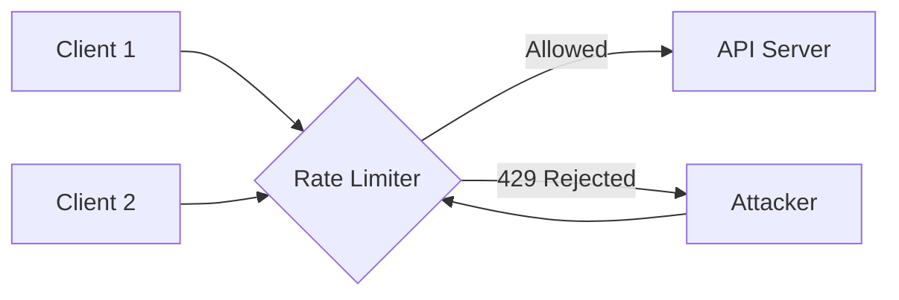

# How to Set Up Rate Limiting in ASP.NET Core

Author: [nawazdhandala](https://github.com/nawazdhandala)

Tags: .NET, C#, ASP.NET Core, Rate Limiting, API, Security, Performance

Description: Learn how to implement rate limiting in ASP.NET Core to protect your APIs from abuse, control resource usage, and ensure fair access for all clients.

---

Rate limiting is essential for protecting your APIs from abuse, preventing denial-of-service attacks, and ensuring fair resource distribution among clients. ASP.NET Core 7.0 introduced built-in rate limiting middleware that makes implementation straightforward.

## Why Rate Limiting Matters

Without rate limiting, a single client can overwhelm your API with requests, degrading service for everyone else. Rate limiting helps you control traffic flow and protect your infrastructure.



## Basic Rate Limiting Setup

Start by adding the rate limiting services and middleware:

```csharp
var builder = WebApplication.CreateBuilder(args);

builder.Services.AddRateLimiter(options =>
{
    options.GlobalLimiter = PartitionedRateLimiter.Create<HttpContext, string>(context =>
        RateLimitPartition.GetFixedWindowLimiter(
            partitionKey: context.User.Identity?.Name ?? context.Request.Headers.Host.ToString(),
            factory: partition => new FixedWindowRateLimiterOptions
            {
                AutoReplenishment = true,
                PermitLimit = 100,
                Window = TimeSpan.FromMinutes(1)
            }));

    options.RejectionStatusCode = StatusCodes.Status429TooManyRequests;
});

var app = builder.Build();

app.UseRateLimiter();

app.MapGet("/api/data", () => "Hello, World!");

app.Run();
```

## Rate Limiting Algorithms

ASP.NET Core supports four rate limiting algorithms, each suited for different scenarios.

### Fixed Window Limiter

Limits requests within fixed time windows:

```csharp
builder.Services.AddRateLimiter(options =>
{
    options.AddFixedWindowLimiter("fixed", config =>
    {
        config.PermitLimit = 10;
        config.Window = TimeSpan.FromSeconds(10);
        config.QueueProcessingOrder = QueueProcessingOrder.OldestFirst;
        config.QueueLimit = 5;
    });
});
```

### Sliding Window Limiter

Smooths traffic by dividing windows into segments:

```csharp
builder.Services.AddRateLimiter(options =>
{
    options.AddSlidingWindowLimiter("sliding", config =>
    {
        config.PermitLimit = 100;
        config.Window = TimeSpan.FromMinutes(1);
        config.SegmentsPerWindow = 6; // 10-second segments
        config.QueueProcessingOrder = QueueProcessingOrder.OldestFirst;
        config.QueueLimit = 10;
    });
});
```

### Token Bucket Limiter

Allows bursts while maintaining average rate:

```csharp
builder.Services.AddRateLimiter(options =>
{
    options.AddTokenBucketLimiter("token", config =>
    {
        config.TokenLimit = 100;
        config.QueueProcessingOrder = QueueProcessingOrder.OldestFirst;
        config.QueueLimit = 10;
        config.ReplenishmentPeriod = TimeSpan.FromSeconds(10);
        config.TokensPerPeriod = 20;
        config.AutoReplenishment = true;
    });
});
```

### Concurrency Limiter

Limits concurrent requests rather than rate:

```csharp
builder.Services.AddRateLimiter(options =>
{
    options.AddConcurrencyLimiter("concurrent", config =>
    {
        config.PermitLimit = 10;
        config.QueueProcessingOrder = QueueProcessingOrder.OldestFirst;
        config.QueueLimit = 5;
    });
});
```

## Applying Rate Limits to Endpoints

Apply different rate limits to specific endpoints:

```csharp
var builder = WebApplication.CreateBuilder(args);

builder.Services.AddRateLimiter(options =>
{
    // Standard API rate limit
    options.AddFixedWindowLimiter("standard", config =>
    {
        config.PermitLimit = 100;
        config.Window = TimeSpan.FromMinutes(1);
    });

    // Strict limit for expensive operations
    options.AddFixedWindowLimiter("strict", config =>
    {
        config.PermitLimit = 10;
        config.Window = TimeSpan.FromMinutes(1);
    });

    // Relaxed limit for read operations
    options.AddTokenBucketLimiter("relaxed", config =>
    {
        config.TokenLimit = 1000;
        config.ReplenishmentPeriod = TimeSpan.FromMinutes(1);
        config.TokensPerPeriod = 100;
    });
});

var app = builder.Build();

app.UseRateLimiter();

// Apply rate limits to endpoints
app.MapGet("/api/items", () => GetItems())
   .RequireRateLimiting("relaxed");

app.MapPost("/api/items", (Item item) => CreateItem(item))
   .RequireRateLimiting("standard");

app.MapPost("/api/reports/generate", () => GenerateReport())
   .RequireRateLimiting("strict");

app.Run();
```

## Rate Limiting with Controllers

Apply rate limits using attributes on controllers:

```csharp
[ApiController]
[Route("api/[controller]")]
[EnableRateLimiting("standard")]
public class ProductsController : ControllerBase
{
    [HttpGet]
    [EnableRateLimiting("relaxed")]
    public IActionResult GetAll()
    {
        return Ok(products);
    }

    [HttpGet("{id}")]
    public IActionResult GetById(int id)
    {
        // Uses "standard" from controller
        return Ok(products.Find(p => p.Id == id));
    }

    [HttpPost]
    [EnableRateLimiting("strict")]
    public IActionResult Create(Product product)
    {
        return Created($"/api/products/{product.Id}", product);
    }

    [HttpDelete("{id}")]
    [DisableRateLimiting]
    public IActionResult Delete(int id)
    {
        // No rate limiting for admin operations
        return NoContent();
    }
}
```

## Per-Client Rate Limiting

Implement rate limiting based on client identity:

```csharp
builder.Services.AddRateLimiter(options =>
{
    options.AddPolicy("per-client", context =>
    {
        // Get client identifier from API key or user ID
        var clientId = context.Request.Headers["X-API-Key"].FirstOrDefault()
            ?? context.User.Identity?.Name
            ?? context.Connection.RemoteIpAddress?.ToString()
            ?? "anonymous";

        return RateLimitPartition.GetFixedWindowLimiter(
            partitionKey: clientId,
            factory: _ => new FixedWindowRateLimiterOptions
            {
                PermitLimit = 100,
                Window = TimeSpan.FromMinutes(1)
            });
    });
});
```

## Tiered Rate Limiting

Different limits for different subscription tiers:

```csharp
builder.Services.AddRateLimiter(options =>
{
    options.AddPolicy("tiered", context =>
    {
        var user = context.User;
        var tier = user.FindFirst("subscription_tier")?.Value ?? "free";

        var (limit, window) = tier switch
        {
            "enterprise" => (10000, TimeSpan.FromMinutes(1)),
            "professional" => (1000, TimeSpan.FromMinutes(1)),
            "basic" => (100, TimeSpan.FromMinutes(1)),
            _ => (10, TimeSpan.FromMinutes(1)) // free tier
        };

        return RateLimitPartition.GetFixedWindowLimiter(
            partitionKey: user.Identity?.Name ?? "anonymous",
            factory: _ => new FixedWindowRateLimiterOptions
            {
                PermitLimit = limit,
                Window = window
            });
    });
});
```

## Custom Response for Rate Limited Requests

Provide informative responses when rate limits are exceeded:

```csharp
builder.Services.AddRateLimiter(options =>
{
    options.RejectionStatusCode = StatusCodes.Status429TooManyRequests;

    options.OnRejected = async (context, cancellationToken) =>
    {
        context.HttpContext.Response.StatusCode = StatusCodes.Status429TooManyRequests;
        context.HttpContext.Response.ContentType = "application/json";

        var retryAfter = context.Lease.TryGetMetadata(MetadataName.RetryAfter, out var retryAfterValue)
            ? retryAfterValue.TotalSeconds
            : 60;

        context.HttpContext.Response.Headers.RetryAfter = retryAfter.ToString();

        var response = new
        {
            error = "Rate limit exceeded",
            message = "You have exceeded the rate limit. Please try again later.",
            retryAfterSeconds = retryAfter
        };

        await context.HttpContext.Response.WriteAsJsonAsync(response, cancellationToken);

        // Log rate limit violations
        var logger = context.HttpContext.RequestServices.GetRequiredService<ILogger<Program>>();
        logger.LogWarning(
            "Rate limit exceeded for {ClientIp} on {Path}",
            context.HttpContext.Connection.RemoteIpAddress,
            context.HttpContext.Request.Path);
    };

    options.AddFixedWindowLimiter("standard", config =>
    {
        config.PermitLimit = 100;
        config.Window = TimeSpan.FromMinutes(1);
    });
});
```

## Distributed Rate Limiting with Redis

For multi-instance deployments, use Redis for distributed rate limiting:

```csharp
// Install: dotnet add package RedisRateLimiting

builder.Services.AddRateLimiter(options =>
{
    var redisConnection = ConnectionMultiplexer.Connect(
        builder.Configuration.GetConnectionString("Redis")!);

    options.AddRedisFixedWindowLimiter("distributed", config =>
    {
        config.ConnectionMultiplexerFactory = () => redisConnection;
        config.PermitLimit = 100;
        config.Window = TimeSpan.FromMinutes(1);
    });
});
```

## Rate Limiting Headers

Include rate limit information in response headers:

```csharp
public class RateLimitHeadersMiddleware
{
    private readonly RequestDelegate _next;

    public RateLimitHeadersMiddleware(RequestDelegate next)
    {
        _next = next;
    }

    public async Task InvokeAsync(HttpContext context)
    {
        await _next(context);

        // Add headers after response is prepared
        if (context.Features.Get<IRateLimiterFeature>() is { } feature)
        {
            var lease = feature.Lease;

            if (lease.TryGetMetadata(MetadataName.ReasonPhrase, out var reason))
            {
                context.Response.Headers["X-RateLimit-Reason"] = reason;
            }
        }
    }
}
```

## Complete Configuration Example

Here is a production-ready rate limiting setup:

```csharp
var builder = WebApplication.CreateBuilder(args);

builder.Services.AddRateLimiter(options =>
{
    options.RejectionStatusCode = StatusCodes.Status429TooManyRequests;

    options.OnRejected = async (context, token) =>
    {
        context.HttpContext.Response.ContentType = "application/json";

        var retryAfter = context.Lease.TryGetMetadata(MetadataName.RetryAfter, out var value)
            ? (int)value.TotalSeconds
            : 60;

        context.HttpContext.Response.Headers.RetryAfter = retryAfter.ToString();

        await context.HttpContext.Response.WriteAsJsonAsync(new
        {
            error = "TooManyRequests",
            message = "Rate limit exceeded",
            retryAfter
        }, token);
    };

    // Global rate limit
    options.GlobalLimiter = PartitionedRateLimiter.Create<HttpContext, string>(context =>
        RateLimitPartition.GetFixedWindowLimiter(
            partitionKey: context.Connection.RemoteIpAddress?.ToString() ?? "unknown",
            factory: _ => new FixedWindowRateLimiterOptions
            {
                PermitLimit = 1000,
                Window = TimeSpan.FromMinutes(1)
            }));

    // Named policies
    options.AddFixedWindowLimiter("api", config =>
    {
        config.PermitLimit = 100;
        config.Window = TimeSpan.FromMinutes(1);
        config.QueueLimit = 10;
    });

    options.AddTokenBucketLimiter("webhook", config =>
    {
        config.TokenLimit = 50;
        config.ReplenishmentPeriod = TimeSpan.FromSeconds(10);
        config.TokensPerPeriod = 5;
    });

    options.AddConcurrencyLimiter("export", config =>
    {
        config.PermitLimit = 5;
        config.QueueLimit = 10;
    });
});

var app = builder.Build();

app.UseRateLimiter();

app.MapGet("/api/items", GetItems).RequireRateLimiting("api");
app.MapPost("/webhooks", HandleWebhook).RequireRateLimiting("webhook");
app.MapPost("/export", ExportData).RequireRateLimiting("export");

app.Run();
```

## Summary

| Algorithm | Best For |
|-----------|----------|
| **Fixed Window** | Simple rate limiting with clear windows |
| **Sliding Window** | Smoother rate limiting without burst at window edges |
| **Token Bucket** | Allowing bursts while maintaining average rate |
| **Concurrency** | Limiting simultaneous requests |

Rate limiting protects your APIs and ensures fair access for all clients. The built-in ASP.NET Core rate limiting middleware provides flexible options for implementing the right strategy for your application.
