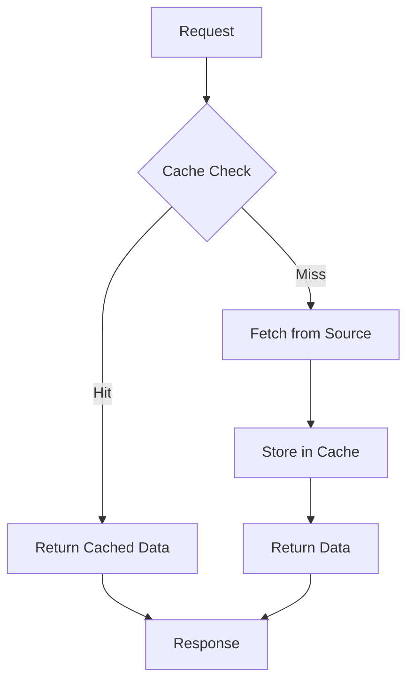

# How to Configure Caching in ASP.NET Core

Author: [nawazdhandala](https://www.github.com/nawazdhandala)

Tags: .NET, ASP.NET Core, C#, Caching, Redis, Performance, Memory Cache

Description: Learn how to implement effective caching strategies in ASP.NET Core applications. This guide covers in-memory caching, distributed caching with Redis, response caching, and best practices for cache invalidation.

Caching is one of the most effective ways to improve application performance. This guide covers all the caching options available in ASP.NET Core and shows you how to implement them effectively.

## Caching Overview



## In-Memory Caching

### Basic Setup

```csharp
// Program.cs
builder.Services.AddMemoryCache();

// Usage in a service
public class ProductService
{
    private readonly IMemoryCache _cache;
    private readonly IProductRepository _repository;

    public ProductService(IMemoryCache cache, IProductRepository repository)
    {
        _cache = cache;
        _repository = repository;
    }

    public async Task<Product?> GetProductAsync(int id)
    {
        var cacheKey = $"product:{id}";

        if (_cache.TryGetValue(cacheKey, out Product? product))
        {
            return product;
        }

        product = await _repository.GetByIdAsync(id);

        if (product != null)
        {
            var cacheOptions = new MemoryCacheEntryOptions()
                .SetAbsoluteExpiration(TimeSpan.FromMinutes(10))
                .SetSlidingExpiration(TimeSpan.FromMinutes(2))
                .SetPriority(CacheItemPriority.Normal)
                .SetSize(1);

            _cache.Set(cacheKey, product, cacheOptions);
        }

        return product;
    }
}
```

### GetOrCreate Pattern

```csharp
public class CatalogService
{
    private readonly IMemoryCache _cache;
    private readonly ICatalogRepository _repository;

    public CatalogService(IMemoryCache cache, ICatalogRepository repository)
    {
        _cache = cache;
        _repository = repository;
    }

    public async Task<IList<Category>> GetCategoriesAsync()
    {
        return await _cache.GetOrCreateAsync("categories", async entry =>
        {
            entry.AbsoluteExpirationRelativeToNow = TimeSpan.FromHours(1);
            entry.SlidingExpiration = TimeSpan.FromMinutes(15);

            return await _repository.GetAllCategoriesAsync();
        }) ?? new List<Category>();
    }

    public async Task<Product?> GetProductAsync(int id)
    {
        return await _cache.GetOrCreateAsync($"product:{id}", async entry =>
        {
            entry.AbsoluteExpirationRelativeToNow = TimeSpan.FromMinutes(30);

            // Register callback for eviction
            entry.RegisterPostEvictionCallback((key, value, reason, state) =>
            {
                Console.WriteLine($"Cache entry {key} evicted: {reason}");
            });

            return await _repository.GetByIdAsync(id);
        });
    }
}
```

### Cache Size Limits

```csharp
// Configure cache size limits
builder.Services.AddMemoryCache(options =>
{
    options.SizeLimit = 1024; // Maximum number of cache entries
    options.CompactionPercentage = 0.25; // Remove 25% when limit reached
    options.ExpirationScanFrequency = TimeSpan.FromMinutes(5);
});

// Set size when adding entries
var cacheOptions = new MemoryCacheEntryOptions()
    .SetSize(1) // Each entry counts as 1 toward the size limit
    .SetAbsoluteExpiration(TimeSpan.FromMinutes(10));

_cache.Set(key, value, cacheOptions);
```

## Distributed Caching

### Setting Up Redis Cache

```bash
dotnet add package Microsoft.Extensions.Caching.StackExchangeRedis
```

```csharp
// Program.cs
builder.Services.AddStackExchangeRedisCache(options =>
{
    options.Configuration = builder.Configuration.GetConnectionString("Redis");
    options.InstanceName = "MyApp:";
});
```

### Using IDistributedCache

```csharp
public class SessionService
{
    private readonly IDistributedCache _cache;
    private readonly ILogger<SessionService> _logger;

    public SessionService(IDistributedCache cache, ILogger<SessionService> logger)
    {
        _cache = cache;
        _logger = logger;
    }

    public async Task<UserSession?> GetSessionAsync(string sessionId)
    {
        var data = await _cache.GetAsync($"session:{sessionId}");

        if (data == null)
        {
            return null;
        }

        return JsonSerializer.Deserialize<UserSession>(data);
    }

    public async Task SetSessionAsync(string sessionId, UserSession session)
    {
        var options = new DistributedCacheEntryOptions
        {
            AbsoluteExpirationRelativeToNow = TimeSpan.FromHours(24),
            SlidingExpiration = TimeSpan.FromHours(1)
        };

        var data = JsonSerializer.SerializeToUtf8Bytes(session);
        await _cache.SetAsync($"session:{sessionId}", data, options);
    }

    public async Task RemoveSessionAsync(string sessionId)
    {
        await _cache.RemoveAsync($"session:{sessionId}");
    }

    public async Task RefreshSessionAsync(string sessionId)
    {
        // Resets the sliding expiration
        await _cache.RefreshAsync($"session:{sessionId}");
    }
}
```

### Distributed Cache Extension Methods

```csharp
public static class DistributedCacheExtensions
{
    public static async Task<T?> GetOrSetAsync<T>(
        this IDistributedCache cache,
        string key,
        Func<Task<T>> factory,
        DistributedCacheEntryOptions? options = null)
    {
        var data = await cache.GetAsync(key);

        if (data != null)
        {
            return JsonSerializer.Deserialize<T>(data);
        }

        var value = await factory();

        if (value != null)
        {
            options ??= new DistributedCacheEntryOptions
            {
                AbsoluteExpirationRelativeToNow = TimeSpan.FromMinutes(10)
            };

            var serialized = JsonSerializer.SerializeToUtf8Bytes(value);
            await cache.SetAsync(key, serialized, options);
        }

        return value;
    }

    public static async Task SetObjectAsync<T>(
        this IDistributedCache cache,
        string key,
        T value,
        TimeSpan? absoluteExpiration = null,
        TimeSpan? slidingExpiration = null)
    {
        var options = new DistributedCacheEntryOptions();

        if (absoluteExpiration.HasValue)
            options.AbsoluteExpirationRelativeToNow = absoluteExpiration;

        if (slidingExpiration.HasValue)
            options.SlidingExpiration = slidingExpiration;

        var data = JsonSerializer.SerializeToUtf8Bytes(value);
        await cache.SetAsync(key, data, options);
    }

    public static async Task<T?> GetObjectAsync<T>(
        this IDistributedCache cache,
        string key)
    {
        var data = await cache.GetAsync(key);
        return data == null ? default : JsonSerializer.Deserialize<T>(data);
    }
}

// Usage
var user = await _cache.GetOrSetAsync($"user:{userId}", async () =>
{
    return await _repository.GetUserAsync(userId);
}, new DistributedCacheEntryOptions
{
    AbsoluteExpirationRelativeToNow = TimeSpan.FromMinutes(30)
});
```

## Response Caching

### Server-Side Response Caching

```csharp
// Program.cs
builder.Services.AddResponseCaching();

var app = builder.Build();
app.UseResponseCaching();

// Controller
[ApiController]
[Route("api/[controller]")]
public class ProductsController : ControllerBase
{
    [HttpGet]
    [ResponseCache(Duration = 60, Location = ResponseCacheLocation.Any)]
    public async Task<IActionResult> GetProducts()
    {
        var products = await _repository.GetAllAsync();
        return Ok(products);
    }

    [HttpGet("{id}")]
    [ResponseCache(Duration = 30, VaryByQueryKeys = new[] { "includeDetails" })]
    public async Task<IActionResult> GetProduct(int id, bool includeDetails = false)
    {
        var product = await _repository.GetAsync(id, includeDetails);
        return Ok(product);
    }

    [HttpGet("user")]
    [ResponseCache(Duration = 0, Location = ResponseCacheLocation.None, NoStore = true)]
    public async Task<IActionResult> GetUserProducts()
    {
        // User-specific data - no caching
        return Ok();
    }
}
```

### Cache Profiles

```csharp
// Program.cs
builder.Services.AddControllersWithViews(options =>
{
    options.CacheProfiles.Add("Default", new CacheProfile
    {
        Duration = 60,
        Location = ResponseCacheLocation.Any
    });

    options.CacheProfiles.Add("Never", new CacheProfile
    {
        Duration = 0,
        Location = ResponseCacheLocation.None,
        NoStore = true
    });

    options.CacheProfiles.Add("LongCache", new CacheProfile
    {
        Duration = 3600,
        Location = ResponseCacheLocation.Client,
        VaryByHeader = "Accept-Encoding"
    });
});

// Usage
[ResponseCache(CacheProfileName = "Default")]
public async Task<IActionResult> GetData() { }

[ResponseCache(CacheProfileName = "Never")]
public async Task<IActionResult> GetSensitiveData() { }
```

## Output Caching (.NET 7+)

```csharp
// Program.cs
builder.Services.AddOutputCache(options =>
{
    // Default policy
    options.AddBasePolicy(builder => builder.Expire(TimeSpan.FromMinutes(5)));

    // Named policies
    options.AddPolicy("Products", builder =>
        builder.Expire(TimeSpan.FromMinutes(10))
               .Tag("products"));

    options.AddPolicy("UserSpecific", builder =>
        builder.Expire(TimeSpan.FromMinutes(1))
               .SetVaryByQuery("userId"));
});

var app = builder.Build();
app.UseOutputCache();

// Minimal API
app.MapGet("/products", async (IProductRepository repo) =>
{
    return await repo.GetAllAsync();
})
.CacheOutput("Products");

// Controller
[OutputCache(PolicyName = "Products")]
public async Task<IActionResult> GetProducts()
{
    return Ok(await _repository.GetAllAsync());
}

// Cache invalidation
[HttpPost]
public async Task<IActionResult> CreateProduct(
    Product product,
    IOutputCacheStore cacheStore)
{
    await _repository.CreateAsync(product);

    // Invalidate cache by tag
    await cacheStore.EvictByTagAsync("products", default);

    return Created();
}
```

## Cache Invalidation Strategies

### Event-Based Invalidation

```csharp
public interface ICacheInvalidator
{
    Task InvalidateAsync(string pattern);
    Task InvalidateByTagAsync(string tag);
}

public class RedisCacheInvalidator : ICacheInvalidator
{
    private readonly IConnectionMultiplexer _redis;
    private readonly IDistributedCache _cache;

    public RedisCacheInvalidator(
        IConnectionMultiplexer redis,
        IDistributedCache cache)
    {
        _redis = redis;
        _cache = cache;
    }

    public async Task InvalidateAsync(string pattern)
    {
        var server = _redis.GetServer(_redis.GetEndPoints().First());
        var keys = server.Keys(pattern: pattern).ToArray();

        foreach (var key in keys)
        {
            await _cache.RemoveAsync(key.ToString());
        }
    }

    public async Task InvalidateByTagAsync(string tag)
    {
        // Implementation depends on how you track tags
        await InvalidateAsync($"*:{tag}:*");
    }
}

// Usage with MediatR
public class ProductCreatedHandler : INotificationHandler<ProductCreatedEvent>
{
    private readonly ICacheInvalidator _cacheInvalidator;

    public ProductCreatedHandler(ICacheInvalidator cacheInvalidator)
    {
        _cacheInvalidator = cacheInvalidator;
    }

    public async Task Handle(ProductCreatedEvent notification, CancellationToken ct)
    {
        await _cacheInvalidator.InvalidateByTagAsync("products");
    }
}
```

### Time-Based Invalidation with Background Service

```csharp
public class CacheWarmingService : BackgroundService
{
    private readonly IServiceScopeFactory _scopeFactory;
    private readonly IDistributedCache _cache;

    protected override async Task ExecuteAsync(CancellationToken stoppingToken)
    {
        while (!stoppingToken.IsCancellationRequested)
        {
            using var scope = _scopeFactory.CreateScope();
            var repository = scope.ServiceProvider.GetRequiredService<IProductRepository>();

            // Pre-warm popular items
            var popularProducts = await repository.GetTopProductsAsync(100);
            foreach (var product in popularProducts)
            {
                var key = $"product:{product.Id}";
                var data = JsonSerializer.SerializeToUtf8Bytes(product);
                await _cache.SetAsync(key, data, new DistributedCacheEntryOptions
                {
                    AbsoluteExpirationRelativeToNow = TimeSpan.FromMinutes(30)
                }, stoppingToken);
            }

            await Task.Delay(TimeSpan.FromMinutes(15), stoppingToken);
        }
    }
}
```

## Hybrid Caching Pattern

Combine memory and distributed cache for best performance:

```csharp
public class HybridCache<T>
{
    private readonly IMemoryCache _memoryCache;
    private readonly IDistributedCache _distributedCache;
    private readonly TimeSpan _memoryExpiration = TimeSpan.FromMinutes(1);
    private readonly TimeSpan _distributedExpiration = TimeSpan.FromMinutes(10);

    public HybridCache(IMemoryCache memoryCache, IDistributedCache distributedCache)
    {
        _memoryCache = memoryCache;
        _distributedCache = distributedCache;
    }

    public async Task<T?> GetOrSetAsync(string key, Func<Task<T>> factory)
    {
        // Try memory cache first (fastest)
        if (_memoryCache.TryGetValue(key, out T? value))
        {
            return value;
        }

        // Try distributed cache
        var distributedData = await _distributedCache.GetAsync(key);
        if (distributedData != null)
        {
            value = JsonSerializer.Deserialize<T>(distributedData);

            // Populate memory cache
            _memoryCache.Set(key, value, _memoryExpiration);
            return value;
        }

        // Get from source
        value = await factory();

        if (value != null)
        {
            // Store in both caches
            _memoryCache.Set(key, value, _memoryExpiration);

            var serialized = JsonSerializer.SerializeToUtf8Bytes(value);
            await _distributedCache.SetAsync(key, serialized,
                new DistributedCacheEntryOptions
                {
                    AbsoluteExpirationRelativeToNow = _distributedExpiration
                });
        }

        return value;
    }

    public async Task InvalidateAsync(string key)
    {
        _memoryCache.Remove(key);
        await _distributedCache.RemoveAsync(key);
    }
}
```

## Cache Health Monitoring

```csharp
public class RedisCacheHealthCheck : IHealthCheck
{
    private readonly IConnectionMultiplexer _redis;

    public RedisCacheHealthCheck(IConnectionMultiplexer redis)
    {
        _redis = redis;
    }

    public async Task<HealthCheckResult> CheckHealthAsync(
        HealthCheckContext context,
        CancellationToken cancellationToken = default)
    {
        try
        {
            var db = _redis.GetDatabase();
            var latency = await db.PingAsync();

            var data = new Dictionary<string, object>
            {
                { "latency_ms", latency.TotalMilliseconds }
            };

            if (latency.TotalMilliseconds > 100)
            {
                return HealthCheckResult.Degraded(
                    $"Redis latency is {latency.TotalMilliseconds}ms",
                    data: data);
            }

            return HealthCheckResult.Healthy("Redis is responsive", data);
        }
        catch (Exception ex)
        {
            return HealthCheckResult.Unhealthy("Redis is unavailable", ex);
        }
    }
}

// Registration
builder.Services.AddHealthChecks()
    .AddCheck<RedisCacheHealthCheck>("redis", tags: new[] { "cache", "redis" });
```

## Best Practices

1. **Use appropriate cache levels**: Memory for hot data, distributed for shared state
2. **Set expiration times**: Always set TTL to prevent stale data
3. **Use cache tags**: Easier bulk invalidation
4. **Handle cache failures gracefully**: Application should work without cache
5. **Monitor cache metrics**: Hit rate, memory usage, latency
6. **Avoid caching user-specific data**: Unless properly isolated
7. **Use compression**: For large cached objects
8. **Warm the cache**: Pre-populate frequently accessed data

## Conclusion

Effective caching can dramatically improve your application's performance and reduce load on backend systems. Choose the right caching strategy based on your data characteristics - in-memory for single-instance applications, distributed for multi-instance deployments, and hybrid for the best of both worlds.
