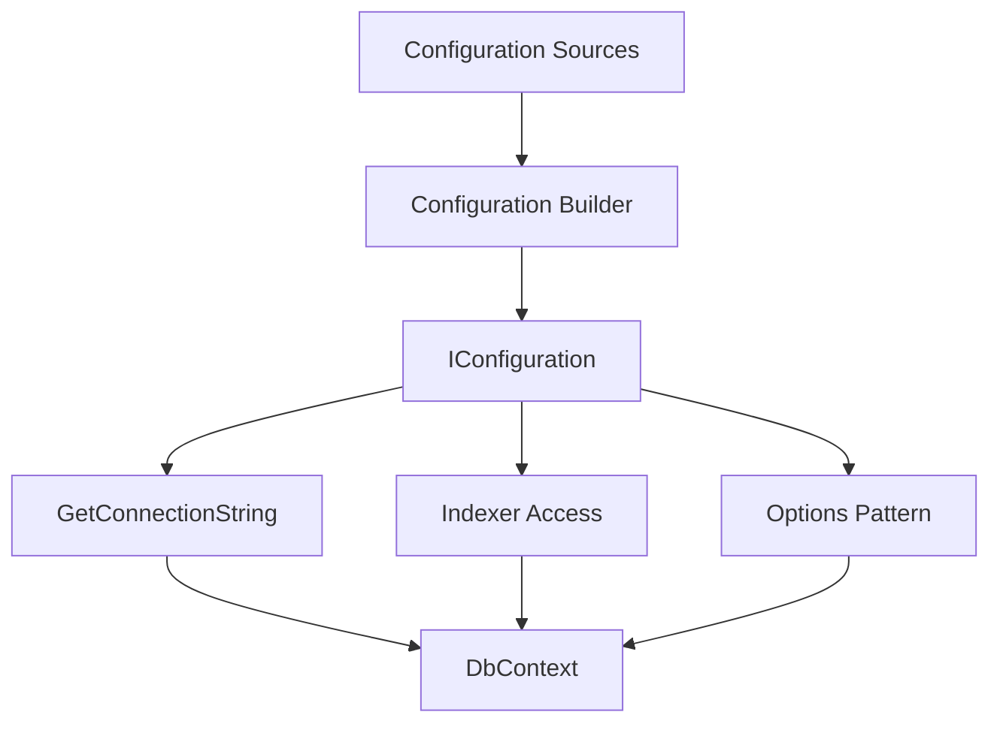

# How to Configure Connection Strings in ASP.NET Core

Author: [nawazdhandala](https://www.github.com/nawazdhandala)

Tags: .NET, ASP.NET Core, C#, Configuration, Database, Entity Framework, Best Practices

Description: Learn how to properly configure and manage connection strings in ASP.NET Core applications. This guide covers appsettings.json, environment variables, user secrets, Azure Key Vault, and best practices for secure connection string management.

Managing connection strings properly is crucial for ASP.NET Core applications. This guide covers everything from basic configuration to advanced patterns for secure, environment-specific connection string management.

## Basic Configuration

### Using appsettings.json

The most common approach is storing connection strings in `appsettings.json`:

```json
{
  "ConnectionStrings": {
    "DefaultConnection": "Server=localhost;Database=MyApp;User Id=sa;Password=YourPassword;TrustServerCertificate=True",
    "ReadOnlyConnection": "Server=readonly.server.com;Database=MyApp;User Id=reader;Password=ReadPassword;",
    "Redis": "localhost:6379,abortConnect=false"
  }
}
```

### Accessing Connection Strings

There are several ways to access connection strings in your application:

```csharp
var builder = WebApplication.CreateBuilder(args);

// Method 1: GetConnectionString extension method
var defaultConnection = builder.Configuration.GetConnectionString("DefaultConnection");

// Method 2: Direct configuration access
var redisConnection = builder.Configuration["ConnectionStrings:Redis"];

// Method 3: Strongly typed options
builder.Services.Configure<ConnectionStrings>(
    builder.Configuration.GetSection("ConnectionStrings"));
```



## Environment-Specific Configuration

### Using appsettings.{Environment}.json

Create environment-specific files that override base settings:

**appsettings.json** (base):
```json
{
  "ConnectionStrings": {
    "DefaultConnection": "Server=localhost;Database=MyApp_Dev;Integrated Security=true;"
  }
}
```

**appsettings.Development.json**:
```json
{
  "ConnectionStrings": {
    "DefaultConnection": "Server=localhost;Database=MyApp_Dev;Integrated Security=true;TrustServerCertificate=true;"
  }
}
```

**appsettings.Production.json**:
```json
{
  "ConnectionStrings": {
    "DefaultConnection": "Server=prod-server.database.windows.net;Database=MyApp;Authentication=Active Directory Managed Identity;"
  }
}
```

### Configuration Loading Order

ASP.NET Core loads configuration in a specific order, with later sources overriding earlier ones:

```csharp
var builder = WebApplication.CreateBuilder(args);

// Default loading order:
// 1. appsettings.json
// 2. appsettings.{Environment}.json
// 3. User Secrets (Development only)
// 4. Environment Variables
// 5. Command-line arguments

// You can customize this:
builder.Configuration
    .SetBasePath(Directory.GetCurrentDirectory())
    .AddJsonFile("appsettings.json", optional: false, reloadOnChange: true)
    .AddJsonFile($"appsettings.{builder.Environment.EnvironmentName}.json", optional: true)
    .AddEnvironmentVariables()
    .AddCommandLine(args);
```

## Secure Connection String Management

### User Secrets (Development)

Never store production credentials in source code. Use User Secrets for development:

```bash
# Initialize user secrets
dotnet user-secrets init

# Set a connection string
dotnet user-secrets set "ConnectionStrings:DefaultConnection" "Server=localhost;Database=MyApp;User Id=sa;Password=DevPassword123;"

# List secrets
dotnet user-secrets list

# Remove a secret
dotnet user-secrets remove "ConnectionStrings:DefaultConnection"
```

User secrets are stored outside your project:
- Windows: `%APPDATA%\Microsoft\UserSecrets\<user_secrets_id>\secrets.json`
- macOS/Linux: `~/.microsoft/usersecrets/<user_secrets_id>/secrets.json`

### Environment Variables

Use environment variables for production deployments:

```bash
# Linux/macOS
export ConnectionStrings__DefaultConnection="Server=prod;Database=MyApp;..."

# Windows PowerShell
$env:ConnectionStrings__DefaultConnection = "Server=prod;Database=MyApp;..."

# Docker
docker run -e ConnectionStrings__DefaultConnection="Server=prod;..." myapp
```

Note the double underscore (`__`) which represents the hierarchy separator.

### Azure Key Vault

For cloud deployments, use Azure Key Vault:

```csharp
var builder = WebApplication.CreateBuilder(args);

// Add Azure Key Vault configuration
if (!builder.Environment.IsDevelopment())
{
    var keyVaultEndpoint = builder.Configuration["KeyVault:Endpoint"];
    if (!string.IsNullOrEmpty(keyVaultEndpoint))
    {
        builder.Configuration.AddAzureKeyVault(
            new Uri(keyVaultEndpoint),
            new DefaultAzureCredential());
    }
}
```

Store the connection string in Key Vault:
```bash
az keyvault secret set \
    --vault-name MyKeyVault \
    --name "ConnectionStrings--DefaultConnection" \
    --value "Server=prod;Database=MyApp;..."
```

## Working with Entity Framework Core

### Configuring DbContext

Configure your DbContext with the connection string:

```csharp
// Program.cs
builder.Services.AddDbContext<ApplicationDbContext>(options =>
    options.UseSqlServer(
        builder.Configuration.GetConnectionString("DefaultConnection"),
        sqlOptions =>
        {
            sqlOptions.EnableRetryOnFailure(
                maxRetryCount: 5,
                maxRetryDelay: TimeSpan.FromSeconds(30),
                errorNumbersToAdd: null);
            sqlOptions.CommandTimeout(30);
        }));
```

### Using IDbContextFactory

For scenarios requiring multiple DbContext instances:

```csharp
builder.Services.AddDbContextFactory<ApplicationDbContext>(options =>
    options.UseSqlServer(builder.Configuration.GetConnectionString("DefaultConnection")));

// Usage
public class MyService
{
    private readonly IDbContextFactory<ApplicationDbContext> _contextFactory;

    public MyService(IDbContextFactory<ApplicationDbContext> contextFactory)
    {
        _contextFactory = contextFactory;
    }

    public async Task DoWorkAsync()
    {
        await using var context = await _contextFactory.CreateDbContextAsync();
        // Use context
    }
}
```

### Multiple Database Contexts

Configure different connections for different contexts:

```csharp
builder.Services.AddDbContext<ApplicationDbContext>(options =>
    options.UseSqlServer(builder.Configuration.GetConnectionString("DefaultConnection")));

builder.Services.AddDbContext<ReportingDbContext>(options =>
    options.UseSqlServer(builder.Configuration.GetConnectionString("ReadOnlyConnection")));

builder.Services.AddDbContext<AuditDbContext>(options =>
    options.UseNpgsql(builder.Configuration.GetConnectionString("AuditConnection")));
```

## Connection String Builders

### SqlConnectionStringBuilder

Build connection strings programmatically:

```csharp
public static class ConnectionStringHelper
{
    public static string BuildSqlServerConnectionString(
        string server,
        string database,
        string userId,
        string password)
    {
        var builder = new SqlConnectionStringBuilder
        {
            DataSource = server,
            InitialCatalog = database,
            UserID = userId,
            Password = password,
            Encrypt = true,
            TrustServerCertificate = false,
            MultipleActiveResultSets = true,
            ConnectTimeout = 30,
            ApplicationName = "MyApplication"
        };

        return builder.ConnectionString;
    }

    public static string BuildPostgreSqlConnectionString(
        string host,
        string database,
        string username,
        string password)
    {
        var builder = new NpgsqlConnectionStringBuilder
        {
            Host = host,
            Database = database,
            Username = username,
            Password = password,
            SslMode = SslMode.Require,
            Pooling = true,
            MaxPoolSize = 100,
            MinPoolSize = 10
        };

        return builder.ConnectionString;
    }
}
```

## Options Pattern for Connection Strings

### Strongly Typed Configuration

Create a strongly typed configuration class:

```csharp
public class DatabaseOptions
{
    public const string SectionName = "Database";

    public string DefaultConnection { get; set; } = string.Empty;
    public string ReadOnlyConnection { get; set; } = string.Empty;
    public int CommandTimeout { get; set; } = 30;
    public int MaxRetryCount { get; set; } = 3;
    public bool EnableDetailedErrors { get; set; }
}
```

**appsettings.json**:
```json
{
  "Database": {
    "DefaultConnection": "Server=localhost;Database=MyApp;...",
    "ReadOnlyConnection": "Server=readonly;Database=MyApp;...",
    "CommandTimeout": 60,
    "MaxRetryCount": 5,
    "EnableDetailedErrors": false
  }
}
```

**Registration**:
```csharp
builder.Services.Configure<DatabaseOptions>(
    builder.Configuration.GetSection(DatabaseOptions.SectionName));

builder.Services.AddDbContext<ApplicationDbContext>((provider, options) =>
{
    var dbOptions = provider.GetRequiredService<IOptions<DatabaseOptions>>().Value;
    options.UseSqlServer(dbOptions.DefaultConnection, sql =>
    {
        sql.CommandTimeout(dbOptions.CommandTimeout);
        sql.EnableRetryOnFailure(dbOptions.MaxRetryCount);
    });

    if (dbOptions.EnableDetailedErrors)
    {
        options.EnableDetailedErrors();
        options.EnableSensitiveDataLogging();
    }
});
```

## Health Checks for Database Connections

Implement health checks to monitor connection status:

```csharp
builder.Services.AddHealthChecks()
    .AddSqlServer(
        connectionString: builder.Configuration.GetConnectionString("DefaultConnection")!,
        healthQuery: "SELECT 1",
        name: "sql-server",
        failureStatus: HealthStatus.Unhealthy,
        tags: new[] { "db", "sql", "sqlserver" })
    .AddNpgSql(
        connectionString: builder.Configuration.GetConnectionString("PostgresConnection")!,
        name: "postgresql",
        tags: new[] { "db", "postgres" })
    .AddRedis(
        redisConnectionString: builder.Configuration.GetConnectionString("Redis")!,
        name: "redis",
        tags: new[] { "cache", "redis" });

var app = builder.Build();

app.MapHealthChecks("/health", new HealthCheckOptions
{
    ResponseWriter = UIResponseWriter.WriteHealthCheckUIResponse
});
```

## Common Connection String Formats

### SQL Server

```json
{
  "ConnectionStrings": {
    "SqlServer": "Server=myserver;Database=mydb;User Id=myuser;Password=mypass;TrustServerCertificate=True;",
    "SqlServerIntegrated": "Server=myserver;Database=mydb;Integrated Security=true;",
    "SqlServerAzure": "Server=myserver.database.windows.net;Database=mydb;Authentication=Active Directory Default;"
  }
}
```

### PostgreSQL

```json
{
  "ConnectionStrings": {
    "PostgreSQL": "Host=localhost;Database=mydb;Username=myuser;Password=mypass;",
    "PostgreSQLSsl": "Host=myserver;Database=mydb;Username=myuser;Password=mypass;SSL Mode=Require;"
  }
}
```

### MySQL

```json
{
  "ConnectionStrings": {
    "MySQL": "Server=localhost;Database=mydb;User=myuser;Password=mypass;",
    "MySQLSsl": "Server=myserver;Database=mydb;User=myuser;Password=mypass;SslMode=Required;"
  }
}
```

### SQLite

```json
{
  "ConnectionStrings": {
    "SQLite": "Data Source=app.db",
    "SQLiteInMemory": "Data Source=:memory:"
  }
}
```

## Best Practices

1. **Never commit secrets**: Use User Secrets for development, environment variables or Key Vault for production
2. **Use connection string builders**: Build strings programmatically to avoid syntax errors
3. **Enable retry logic**: Configure retry policies for transient failures
4. **Set appropriate timeouts**: Balance between reliability and resource usage
5. **Use connection pooling**: Configure pool sizes based on your application's needs
6. **Implement health checks**: Monitor connection health proactively
7. **Use read replicas**: Configure separate connections for read-heavy workloads
8. **Encrypt connections**: Always use encrypted connections in production

## Conclusion

Proper connection string management is essential for building secure, maintainable ASP.NET Core applications. By using environment-specific configuration, secure storage mechanisms, and the options pattern, you can manage database connections effectively across all environments.
