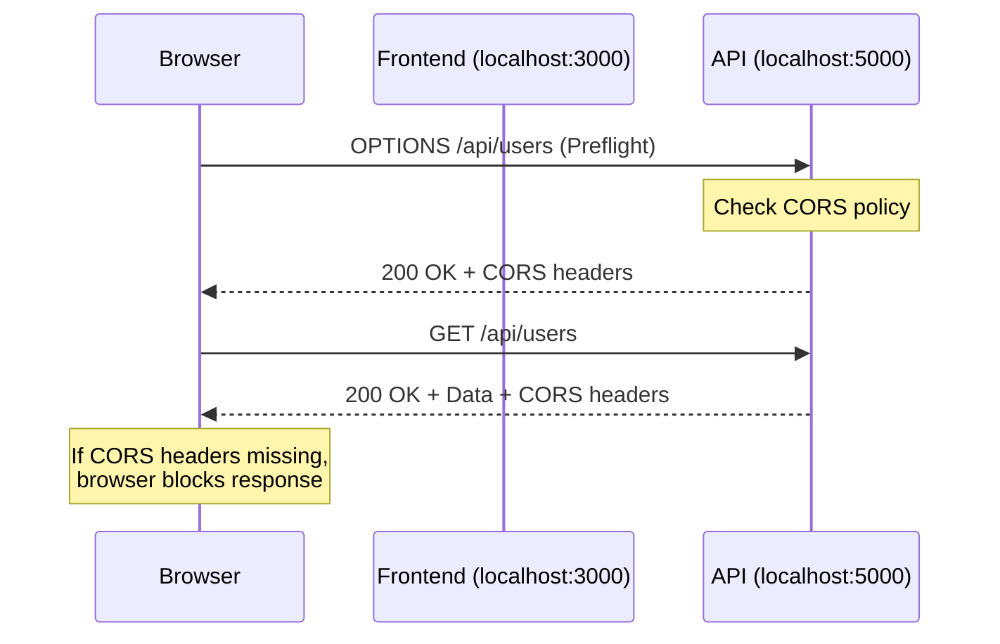
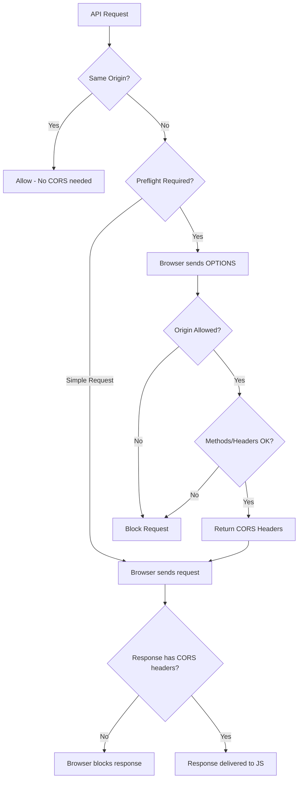

# How to Configure CORS in ASP.NET Core

Author: [nawazdhandala](https://github.com/nawazdhandala)

Tags: C#, ASP.NET Core, CORS, Security, API, Web Development

Description: Learn how to configure Cross-Origin Resource Sharing (CORS) in ASP.NET Core. This guide covers policy configuration, middleware setup, and security best practices for enabling cross-origin requests.

---

Cross-Origin Resource Sharing (CORS) is a security feature that allows or restricts resources on a web server to be requested from another domain. ASP.NET Core provides built-in CORS middleware that gives you fine-grained control over cross-origin requests.

## Understanding CORS



## Basic CORS Configuration

### Enable CORS with Default Policy

```csharp
var builder = WebApplication.CreateBuilder(args);

// Add CORS services
builder.Services.AddCors(options =>
{
    options.AddDefaultPolicy(policy =>
    {
        policy.WithOrigins("http://localhost:3000")
              .AllowAnyHeader()
              .AllowAnyMethod();
    });
});

var app = builder.Build();

// Use CORS middleware - must be before UseAuthorization
app.UseCors();

app.UseAuthorization();
app.MapControllers();
app.Run();
```

### Named Policies

```csharp
builder.Services.AddCors(options =>
{
    // Policy for public APIs
    options.AddPolicy("PublicApi", policy =>
    {
        policy.AllowAnyOrigin()
              .AllowAnyHeader()
              .AllowAnyMethod();
    });

    // Policy for trusted origins only
    options.AddPolicy("TrustedOrigins", policy =>
    {
        policy.WithOrigins(
                "https://app.example.com",
                "https://admin.example.com")
              .AllowAnyHeader()
              .AllowAnyMethod()
              .AllowCredentials();
    });

    // Restrictive policy for sensitive endpoints
    options.AddPolicy("Restrictive", policy =>
    {
        policy.WithOrigins("https://admin.example.com")
              .WithHeaders("Authorization", "Content-Type")
              .WithMethods("GET", "POST")
              .AllowCredentials();
    });
});
```

### Using Named Policies

```csharp
var app = builder.Build();

// Apply default policy globally
app.UseCors("TrustedOrigins");

// Or apply per-endpoint
app.MapGet("/api/public", () => "Public data")
   .RequireCors("PublicApi");

app.MapGet("/api/admin", () => "Admin data")
   .RequireCors("Restrictive");
```

## Controller-Level CORS

```csharp
// Apply to entire controller
[EnableCors("TrustedOrigins")]
[ApiController]
[Route("api/[controller]")]
public class UsersController : ControllerBase
{
    [HttpGet]
    public IActionResult GetUsers()
    {
        return Ok(new[] { "User1", "User2" });
    }

    // Override with different policy
    [EnableCors("PublicApi")]
    [HttpGet("public")]
    public IActionResult GetPublicUsers()
    {
        return Ok(new[] { "PublicUser1" });
    }

    // Disable CORS for specific action
    [DisableCors]
    [HttpGet("internal")]
    public IActionResult GetInternalData()
    {
        return Ok("Internal only");
    }
}
```

## Advanced Configuration

### Dynamic Origins

```csharp
builder.Services.AddCors(options =>
{
    options.AddPolicy("DynamicOrigins", policy =>
    {
        policy.SetIsOriginAllowed(origin =>
        {
            // Allow any subdomain of example.com
            var uri = new Uri(origin);
            return uri.Host.EndsWith(".example.com") ||
                   uri.Host == "example.com";
        })
        .AllowAnyHeader()
        .AllowAnyMethod()
        .AllowCredentials();
    });
});
```

### Configuration-Based Origins

```csharp
// appsettings.json
{
  "Cors": {
    "AllowedOrigins": [
      "https://app.example.com",
      "https://admin.example.com"
    ]
  }
}

// Program.cs
var allowedOrigins = builder.Configuration
    .GetSection("Cors:AllowedOrigins")
    .Get<string[]>() ?? Array.Empty<string>();

builder.Services.AddCors(options =>
{
    options.AddPolicy("ConfiguredOrigins", policy =>
    {
        policy.WithOrigins(allowedOrigins)
              .AllowAnyHeader()
              .AllowAnyMethod()
              .AllowCredentials();
    });
});
```

### Expose Custom Headers

```csharp
builder.Services.AddCors(options =>
{
    options.AddPolicy("WithExposedHeaders", policy =>
    {
        policy.WithOrigins("https://app.example.com")
              .AllowAnyHeader()
              .AllowAnyMethod()
              // Expose custom headers to JavaScript
              .WithExposedHeaders(
                  "X-Pagination-Total",
                  "X-Pagination-Page",
                  "X-Request-Id",
                  "Content-Disposition");
    });
});
```

### Preflight Cache Duration

```csharp
builder.Services.AddCors(options =>
{
    options.AddPolicy("WithPreflightCache", policy =>
    {
        policy.WithOrigins("https://app.example.com")
              .AllowAnyHeader()
              .AllowAnyMethod()
              // Cache preflight response for 1 hour
              .SetPreflightMaxAge(TimeSpan.FromHours(1));
    });
});
```

## Working with Credentials

When you need to send cookies or authentication headers:

```csharp
builder.Services.AddCors(options =>
{
    options.AddPolicy("WithCredentials", policy =>
    {
        // Cannot use AllowAnyOrigin with credentials
        policy.WithOrigins("https://app.example.com")
              .AllowAnyHeader()
              .AllowAnyMethod()
              .AllowCredentials(); // Enable cookies/auth headers
    });
});
```

**Important**: When using `AllowCredentials()`:
- Cannot use `AllowAnyOrigin()` - must specify exact origins
- Frontend must set `credentials: 'include'` in fetch requests

```javascript
// Frontend JavaScript
fetch('https://api.example.com/data', {
    method: 'GET',
    credentials: 'include', // Send cookies
    headers: {
        'Authorization': 'Bearer token'
    }
});
```

## Environment-Specific Configuration

```csharp
var builder = WebApplication.CreateBuilder(args);

builder.Services.AddCors(options =>
{
    if (builder.Environment.IsDevelopment())
    {
        options.AddDefaultPolicy(policy =>
        {
            policy.WithOrigins(
                    "http://localhost:3000",
                    "http://localhost:5173") // Vite
                  .AllowAnyHeader()
                  .AllowAnyMethod()
                  .AllowCredentials();
        });
    }
    else
    {
        options.AddDefaultPolicy(policy =>
        {
            policy.WithOrigins("https://app.example.com")
                  .WithHeaders("Authorization", "Content-Type", "Accept")
                  .WithMethods("GET", "POST", "PUT", "DELETE")
                  .AllowCredentials();
        });
    }
});
```

## Minimal API Configuration

```csharp
var builder = WebApplication.CreateBuilder(args);

builder.Services.AddCors(options =>
{
    options.AddPolicy("ApiPolicy", policy =>
    {
        policy.WithOrigins("https://app.example.com")
              .AllowAnyHeader()
              .AllowAnyMethod();
    });
});

var app = builder.Build();

app.UseCors("ApiPolicy");

// Group with CORS
var api = app.MapGroup("/api").RequireCors("ApiPolicy");

api.MapGet("/users", () => new[] { "User1", "User2" });
api.MapPost("/users", (User user) => Results.Created($"/users/{user.Id}", user));

// Different CORS for specific endpoint
app.MapGet("/public/health", () => "OK")
   .RequireCors(policy => policy.AllowAnyOrigin());

app.Run();
```

## Troubleshooting CORS Issues

### Common Problems

```csharp
// Problem 1: CORS middleware order
// WRONG - CORS after Authorization
app.UseAuthorization();
app.UseCors(); // Too late!

// CORRECT - CORS before Authorization
app.UseCors();
app.UseAuthorization();

// Problem 2: Missing credentials configuration
// Frontend sends credentials but backend doesn't allow
// Add .AllowCredentials() to policy

// Problem 3: AllowAnyOrigin with credentials
// WRONG - This will fail
policy.AllowAnyOrigin().AllowCredentials();

// CORRECT - Specify origins
policy.WithOrigins("https://app.example.com").AllowCredentials();
```

### Debug CORS Issues

```csharp
// Add logging to see CORS decisions
builder.Services.AddCors(options =>
{
    options.AddPolicy("Debug", policy =>
    {
        policy.SetIsOriginAllowed(origin =>
        {
            Console.WriteLine($"CORS check for origin: {origin}");
            return origin.StartsWith("https://");
        })
        .AllowAnyHeader()
        .AllowAnyMethod();
    });
});
```

### Check Response Headers

```bash
# Use curl to check CORS headers
curl -i -X OPTIONS https://api.example.com/api/users \
  -H "Origin: https://app.example.com" \
  -H "Access-Control-Request-Method: GET"

# Expected headers in response:
# Access-Control-Allow-Origin: https://app.example.com
# Access-Control-Allow-Methods: GET, POST, PUT, DELETE
# Access-Control-Allow-Headers: content-type, authorization
```

## Security Best Practices

| Practice | Description |
|----------|-------------|
| **Avoid AllowAnyOrigin** | Specify exact origins in production |
| **Limit methods** | Only allow needed HTTP methods |
| **Limit headers** | Only expose necessary headers |
| **Use HTTPS** | Always use HTTPS in production |
| **Environment config** | Different policies for dev/prod |
| **Audit regularly** | Review allowed origins periodically |

## CORS Policy Decision Tree



## Conclusion

CORS configuration in ASP.NET Core is straightforward but requires attention to security. Always specify exact origins in production, use named policies for different requirements, and ensure proper middleware ordering. Test your CORS configuration thoroughly to avoid runtime issues with cross-origin requests.
