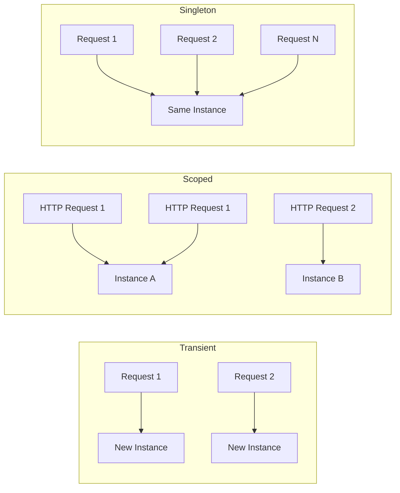

# How to Configure Dependency Injection in ASP.NET Core

Author: [nawazdhandala](https://github.com/nawazdhandala)

Tags: C#, ASP.NET Core, Dependency Injection, .NET, Architecture, IoC

Description: Learn how to configure dependency injection in ASP.NET Core with practical examples covering service lifetimes, registration patterns, and best practices for building maintainable applications.

---

Dependency Injection (DI) is a fundamental design pattern in ASP.NET Core that promotes loose coupling and testability. ASP.NET Core has a built-in IoC (Inversion of Control) container that makes it easy to register and resolve dependencies throughout your application.

## Understanding Service Lifetimes

ASP.NET Core supports three service lifetimes, and choosing the right one is critical for application behavior.



### Transient

A new instance is created every time the service is requested.

```csharp
builder.Services.AddTransient<IEmailSender, SmtpEmailSender>();

// Use for:
// - Lightweight, stateless services
// - Services that should not share state
```

### Scoped

One instance per HTTP request (or scope). The same instance is used throughout a single request.

```csharp
builder.Services.AddScoped<IOrderRepository, OrderRepository>();
builder.Services.AddScoped<IUnitOfWork, UnitOfWork>();

// Use for:
// - Database contexts (Entity Framework DbContext)
// - Per-request state
// - Services that should share data within a request
```

### Singleton

A single instance for the entire application lifetime.

```csharp
builder.Services.AddSingleton<ICacheService, MemoryCacheService>();
builder.Services.AddSingleton<IConfiguration>(configuration);

// Use for:
// - Caching services
// - Configuration
// - Services that are expensive to create and thread-safe
```

## Basic Registration Patterns

### Interface-to-Implementation

The most common pattern - register an interface with its concrete implementation.

```csharp
// Program.cs
var builder = WebApplication.CreateBuilder(args);

// Register services
builder.Services.AddScoped<IUserRepository, UserRepository>();
builder.Services.AddScoped<IUserService, UserService>();
builder.Services.AddTransient<IEmailService, SmtpEmailService>();
builder.Services.AddSingleton<ICacheService, RedisCacheService>();

var app = builder.Build();
```

### Concrete Type Registration

Register a concrete type directly without an interface.

```csharp
builder.Services.AddScoped<OrderProcessor>();
builder.Services.AddSingleton<MetricsCollector>();
```

### Factory Registration

Use factories for complex initialization logic.

```csharp
builder.Services.AddScoped<IPaymentGateway>(serviceProvider =>
{
    var configuration = serviceProvider.GetRequiredService<IConfiguration>();
    var logger = serviceProvider.GetRequiredService<ILogger<StripePaymentGateway>>();

    var apiKey = configuration["Stripe:ApiKey"];
    var environment = configuration["Stripe:Environment"];

    return environment == "production"
        ? new StripePaymentGateway(apiKey, logger)
        : new TestPaymentGateway(logger);
});
```

### Instance Registration

Register an already-created instance.

```csharp
var settings = new AppSettings
{
    ApplicationName = "MyApp",
    Version = "1.0.0"
};

builder.Services.AddSingleton(settings);

// Or with interface
builder.Services.AddSingleton<IAppSettings>(settings);
```

## Constructor Injection

The primary way to use DI is through constructor injection.

```csharp
public class OrderService : IOrderService
{
    private readonly IOrderRepository _orderRepository;
    private readonly IPaymentGateway _paymentGateway;
    private readonly ILogger<OrderService> _logger;

    public OrderService(
        IOrderRepository orderRepository,
        IPaymentGateway paymentGateway,
        ILogger<OrderService> logger)
    {
        _orderRepository = orderRepository;
        _paymentGateway = paymentGateway;
        _logger = logger;
    }

    public async Task<Order> CreateOrderAsync(OrderRequest request)
    {
        _logger.LogInformation("Creating order for customer {CustomerId}", request.CustomerId);

        var order = new Order(request);
        await _paymentGateway.ProcessPaymentAsync(order.Total);
        await _orderRepository.SaveAsync(order);

        return order;
    }
}
```

## Multiple Implementations

### Register Multiple Implementations

When you have multiple implementations of the same interface:

```csharp
// Register multiple implementations
builder.Services.AddTransient<INotificationSender, EmailNotificationSender>();
builder.Services.AddTransient<INotificationSender, SmsNotificationSender>();
builder.Services.AddTransient<INotificationSender, PushNotificationSender>();

// Inject all implementations
public class NotificationService
{
    private readonly IEnumerable<INotificationSender> _senders;

    public NotificationService(IEnumerable<INotificationSender> senders)
    {
        _senders = senders;
    }

    public async Task SendToAllChannelsAsync(Notification notification)
    {
        foreach (var sender in _senders)
        {
            await sender.SendAsync(notification);
        }
    }
}
```

### Keyed Services (.NET 8+)

Use keyed services to register and resolve specific implementations.

```csharp
// Registration
builder.Services.AddKeyedScoped<IPaymentProcessor, StripeProcessor>("stripe");
builder.Services.AddKeyedScoped<IPaymentProcessor, PayPalProcessor>("paypal");
builder.Services.AddKeyedScoped<IPaymentProcessor, SquareProcessor>("square");

// Injection using [FromKeyedServices]
public class PaymentController : ControllerBase
{
    private readonly IPaymentProcessor _stripeProcessor;

    public PaymentController(
        [FromKeyedServices("stripe")] IPaymentProcessor stripeProcessor)
    {
        _stripeProcessor = stripeProcessor;
    }
}

// Or resolve manually
public class PaymentService
{
    private readonly IServiceProvider _serviceProvider;

    public PaymentService(IServiceProvider serviceProvider)
    {
        _serviceProvider = serviceProvider;
    }

    public async Task ProcessPaymentAsync(string provider, PaymentRequest request)
    {
        var processor = _serviceProvider.GetRequiredKeyedService<IPaymentProcessor>(provider);
        await processor.ProcessAsync(request);
    }
}
```

## Options Pattern

Configure services using the Options pattern for type-safe configuration.

```csharp
// Define options class
public class EmailOptions
{
    public const string SectionName = "Email";

    public string SmtpServer { get; set; } = string.Empty;
    public int Port { get; set; } = 587;
    public string Username { get; set; } = string.Empty;
    public string Password { get; set; } = string.Empty;
    public bool UseSsl { get; set; } = true;
}

// Register options
builder.Services.Configure<EmailOptions>(
    builder.Configuration.GetSection(EmailOptions.SectionName));

// Use in service
public class EmailService : IEmailService
{
    private readonly EmailOptions _options;

    public EmailService(IOptions<EmailOptions> options)
    {
        _options = options.Value;
    }

    public async Task SendEmailAsync(string to, string subject, string body)
    {
        using var client = new SmtpClient(_options.SmtpServer, _options.Port);
        client.EnableSsl = _options.UseSsl;
        client.Credentials = new NetworkCredential(_options.Username, _options.Password);

        await client.SendMailAsync(new MailMessage("noreply@example.com", to, subject, body));
    }
}
```

## Extension Methods for Clean Registration

Organize service registration using extension methods.

```csharp
// ServiceCollectionExtensions.cs
public static class ServiceCollectionExtensions
{
    public static IServiceCollection AddApplicationServices(this IServiceCollection services)
    {
        services.AddScoped<IOrderService, OrderService>();
        services.AddScoped<ICustomerService, CustomerService>();
        services.AddScoped<IInventoryService, InventoryService>();

        return services;
    }

    public static IServiceCollection AddInfrastructureServices(
        this IServiceCollection services,
        IConfiguration configuration)
    {
        services.AddDbContext<ApplicationDbContext>(options =>
            options.UseSqlServer(configuration.GetConnectionString("DefaultConnection")));

        services.AddScoped<IUserRepository, UserRepository>();
        services.AddScoped<IOrderRepository, OrderRepository>();

        services.AddSingleton<ICacheService, RedisCacheService>();

        return services;
    }

    public static IServiceCollection AddEmailServices(
        this IServiceCollection services,
        IConfiguration configuration)
    {
        services.Configure<EmailOptions>(configuration.GetSection(EmailOptions.SectionName));
        services.AddTransient<IEmailService, SmtpEmailService>();

        return services;
    }
}

// Program.cs - Clean and organized
var builder = WebApplication.CreateBuilder(args);

builder.Services
    .AddApplicationServices()
    .AddInfrastructureServices(builder.Configuration)
    .AddEmailServices(builder.Configuration);

var app = builder.Build();
```

## Validation and Diagnostics

### Validate Scopes in Development

Enable scope validation to catch common DI mistakes.

```csharp
var builder = WebApplication.CreateBuilder(args);

if (builder.Environment.IsDevelopment())
{
    builder.Host.UseDefaultServiceProvider(options =>
    {
        options.ValidateScopes = true;
        options.ValidateOnBuild = true;
    });
}
```

### Common DI Mistakes

```csharp
// WRONG: Injecting scoped service into singleton
public class SingletonService
{
    private readonly IScopedService _scopedService; // This will fail!

    public SingletonService(IScopedService scopedService)
    {
        _scopedService = scopedService;
    }
}

// CORRECT: Use IServiceScopeFactory for scoped services in singletons
public class SingletonService
{
    private readonly IServiceScopeFactory _scopeFactory;

    public SingletonService(IServiceScopeFactory scopeFactory)
    {
        _scopeFactory = scopeFactory;
    }

    public async Task DoWorkAsync()
    {
        using var scope = _scopeFactory.CreateScope();
        var scopedService = scope.ServiceProvider.GetRequiredService<IScopedService>();
        await scopedService.ProcessAsync();
    }
}
```

## Testing with DI

DI makes testing easier by allowing mock injection.

```csharp
public class OrderServiceTests
{
    [Fact]
    public async Task CreateOrder_ValidRequest_ReturnsOrder()
    {
        // Arrange
        var mockRepository = new Mock<IOrderRepository>();
        var mockPaymentGateway = new Mock<IPaymentGateway>();
        var mockLogger = new Mock<ILogger<OrderService>>();

        mockPaymentGateway
            .Setup(x => x.ProcessPaymentAsync(It.IsAny<decimal>()))
            .ReturnsAsync(new PaymentResult { Success = true });

        var service = new OrderService(
            mockRepository.Object,
            mockPaymentGateway.Object,
            mockLogger.Object);

        var request = new OrderRequest { CustomerId = 1, Total = 100m };

        // Act
        var result = await service.CreateOrderAsync(request);

        // Assert
        Assert.NotNull(result);
        mockPaymentGateway.Verify(x => x.ProcessPaymentAsync(100m), Times.Once);
        mockRepository.Verify(x => x.SaveAsync(It.IsAny<Order>()), Times.Once);
    }
}
```

## Best Practices Summary

| Practice | Description |
|----------|-------------|
| **Use interfaces** | Register interfaces, not concrete types |
| **Choose correct lifetime** | Transient for stateless, Scoped for per-request, Singleton for shared |
| **Constructor injection** | Prefer over property or method injection |
| **Extension methods** | Organize registrations by feature |
| **Validate in development** | Enable scope validation |
| **Avoid Service Locator** | Don't inject IServiceProvider unless necessary |

## Conclusion

Dependency Injection is a core feature of ASP.NET Core that enables building maintainable, testable applications. Understanding service lifetimes, using proper registration patterns, and organizing your DI configuration with extension methods will help you build robust applications. Enable validation in development to catch common mistakes early.
