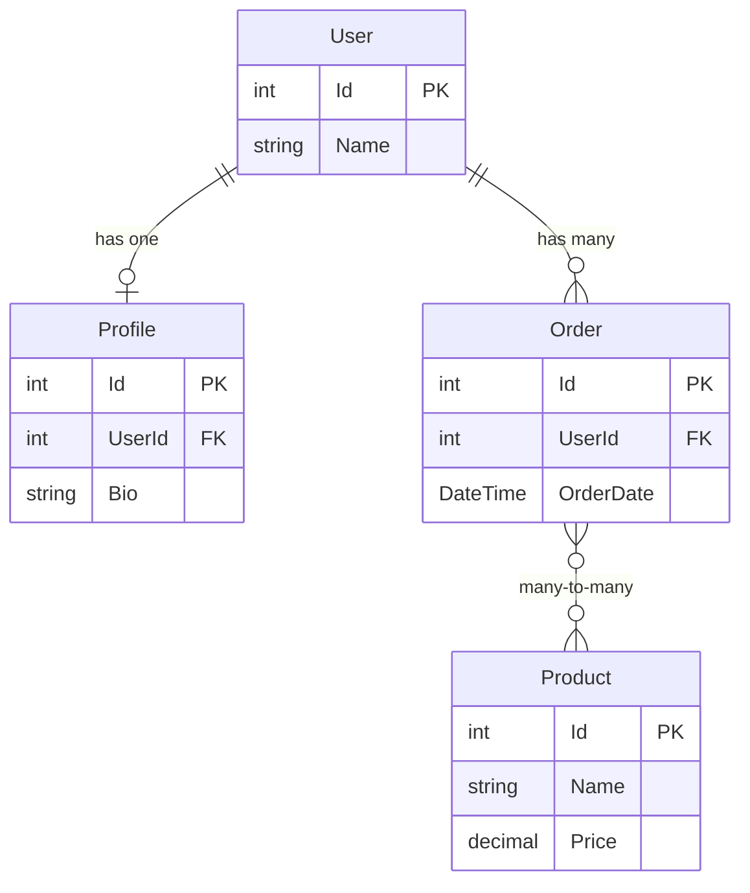

# How to Configure Entity Framework Core Relationships

Author: [nawazdhandala](https://github.com/nawazdhandala)

Tags: C#, Entity Framework Core, .NET, Database, ORM, Data Modeling

Description: Learn how to configure relationships in Entity Framework Core including one-to-one, one-to-many, and many-to-many relationships using conventions, data annotations, and Fluent API.

---

Entity Framework Core supports three types of relationships: one-to-one, one-to-many, and many-to-many. Proper relationship configuration is essential for data integrity and efficient querying. This guide covers all configuration approaches with practical examples.

## Relationship Types Overview



## One-to-Many Relationships

The most common relationship type. One entity has a collection of related entities.

### Convention-Based Configuration

```csharp
public class Author
{
    public int Id { get; set; }
    public string Name { get; set; } = string.Empty;

    // Navigation property - collection indicates "many" side
    public ICollection<Book> Books { get; set; } = new List<Book>();
}

public class Book
{
    public int Id { get; set; }
    public string Title { get; set; } = string.Empty;

    // Foreign key (convention: {NavigationProperty}Id)
    public int AuthorId { get; set; }

    // Navigation property - reference indicates "one" side
    public Author Author { get; set; } = null!;
}
```

### Fluent API Configuration

```csharp
public class ApplicationDbContext : DbContext
{
    public DbSet<Author> Authors => Set<Author>();
    public DbSet<Book> Books => Set<Book>();

    protected override void OnModelCreating(ModelBuilder modelBuilder)
    {
        modelBuilder.Entity<Author>()
            .HasMany(a => a.Books)
            .WithOne(b => b.Author)
            .HasForeignKey(b => b.AuthorId)
            .OnDelete(DeleteBehavior.Cascade);
    }
}
```

### Data Annotations

```csharp
public class Book
{
    public int Id { get; set; }
    public string Title { get; set; } = string.Empty;

    [ForeignKey(nameof(Author))]
    public int AuthorId { get; set; }

    [Required]
    public Author Author { get; set; } = null!;
}
```

## One-to-One Relationships

Each entity has exactly one related entity.

### Configuration

```csharp
public class User
{
    public int Id { get; set; }
    public string Username { get; set; } = string.Empty;

    // Navigation property
    public UserProfile? Profile { get; set; }
}

public class UserProfile
{
    public int Id { get; set; }
    public string Bio { get; set; } = string.Empty;
    public string AvatarUrl { get; set; } = string.Empty;

    // Foreign key
    public int UserId { get; set; }

    // Navigation property
    public User User { get; set; } = null!;
}
```

### Fluent API

```csharp
protected override void OnModelCreating(ModelBuilder modelBuilder)
{
    modelBuilder.Entity<User>()
        .HasOne(u => u.Profile)
        .WithOne(p => p.User)
        .HasForeignKey<UserProfile>(p => p.UserId)
        .OnDelete(DeleteBehavior.Cascade);

    // Add unique constraint on foreign key
    modelBuilder.Entity<UserProfile>()
        .HasIndex(p => p.UserId)
        .IsUnique();
}
```

### Shared Primary Key (Alternative)

```csharp
public class User
{
    public int Id { get; set; }
    public string Username { get; set; } = string.Empty;
    public UserProfile? Profile { get; set; }
}

public class UserProfile
{
    // Same ID as User - shared primary key
    public int Id { get; set; }
    public string Bio { get; set; } = string.Empty;
    public User User { get; set; } = null!;
}

// Fluent API
modelBuilder.Entity<User>()
    .HasOne(u => u.Profile)
    .WithOne(p => p.User)
    .HasForeignKey<UserProfile>(p => p.Id);
```

## Many-to-Many Relationships

### EF Core 5.0+ Simple Configuration

```csharp
public class Student
{
    public int Id { get; set; }
    public string Name { get; set; } = string.Empty;

    // Skip navigation - no join entity needed
    public ICollection<Course> Courses { get; set; } = new List<Course>();
}

public class Course
{
    public int Id { get; set; }
    public string Title { get; set; } = string.Empty;

    public ICollection<Student> Students { get; set; } = new List<Student>();
}

// EF Core automatically creates join table
protected override void OnModelCreating(ModelBuilder modelBuilder)
{
    modelBuilder.Entity<Student>()
        .HasMany(s => s.Courses)
        .WithMany(c => c.Students);
}
```

### With Join Entity (For Additional Data)

```csharp
public class Student
{
    public int Id { get; set; }
    public string Name { get; set; } = string.Empty;
    public ICollection<Enrollment> Enrollments { get; set; } = new List<Enrollment>();
}

public class Course
{
    public int Id { get; set; }
    public string Title { get; set; } = string.Empty;
    public ICollection<Enrollment> Enrollments { get; set; } = new List<Enrollment>();
}

// Join entity with additional properties
public class Enrollment
{
    public int StudentId { get; set; }
    public Student Student { get; set; } = null!;

    public int CourseId { get; set; }
    public Course Course { get; set; } = null!;

    // Additional data
    public DateTime EnrolledDate { get; set; }
    public Grade? Grade { get; set; }
}

// Fluent API
protected override void OnModelCreating(ModelBuilder modelBuilder)
{
    modelBuilder.Entity<Enrollment>()
        .HasKey(e => new { e.StudentId, e.CourseId });

    modelBuilder.Entity<Enrollment>()
        .HasOne(e => e.Student)
        .WithMany(s => s.Enrollments)
        .HasForeignKey(e => e.StudentId);

    modelBuilder.Entity<Enrollment>()
        .HasOne(e => e.Course)
        .WithMany(c => c.Enrollments)
        .HasForeignKey(e => e.CourseId);
}
```

## Self-Referencing Relationships

### Hierarchy (Parent-Child)

```csharp
public class Category
{
    public int Id { get; set; }
    public string Name { get; set; } = string.Empty;

    // Parent reference
    public int? ParentCategoryId { get; set; }
    public Category? ParentCategory { get; set; }

    // Children collection
    public ICollection<Category> SubCategories { get; set; } = new List<Category>();
}

// Fluent API
modelBuilder.Entity<Category>()
    .HasOne(c => c.ParentCategory)
    .WithMany(c => c.SubCategories)
    .HasForeignKey(c => c.ParentCategoryId)
    .OnDelete(DeleteBehavior.Restrict);
```

### Self Many-to-Many (Followers)

```csharp
public class User
{
    public int Id { get; set; }
    public string Username { get; set; } = string.Empty;

    public ICollection<User> Followers { get; set; } = new List<User>();
    public ICollection<User> Following { get; set; } = new List<User>();
}

// Fluent API
modelBuilder.Entity<User>()
    .HasMany(u => u.Followers)
    .WithMany(u => u.Following)
    .UsingEntity<Dictionary<string, object>>(
        "UserFollows",
        j => j.HasOne<User>().WithMany().HasForeignKey("FollowerId"),
        j => j.HasOne<User>().WithMany().HasForeignKey("FollowingId"));
```

## Delete Behaviors

```csharp
public enum DeleteBehavior
{
    Cascade,      // Delete dependent entities
    Restrict,     // Prevent deletion if dependents exist
    SetNull,      // Set foreign key to null
    NoAction,     // Database default behavior
    ClientSetNull // Client-side null setting
}

// Configure delete behavior
modelBuilder.Entity<Order>()
    .HasOne(o => o.Customer)
    .WithMany(c => c.Orders)
    .HasForeignKey(o => o.CustomerId)
    .OnDelete(DeleteBehavior.Restrict);
```

## Querying Relationships

### Eager Loading

```csharp
// Load related data in single query
var authorsWithBooks = await _context.Authors
    .Include(a => a.Books)
    .ToListAsync();

// Multiple levels
var orders = await _context.Orders
    .Include(o => o.Customer)
    .Include(o => o.Items)
        .ThenInclude(i => i.Product)
    .ToListAsync();

// Filtered include (EF Core 5.0+)
var authors = await _context.Authors
    .Include(a => a.Books.Where(b => b.PublishedYear > 2020))
    .ToListAsync();
```

### Explicit Loading

```csharp
var author = await _context.Authors.FindAsync(id);

// Load related data later
await _context.Entry(author)
    .Collection(a => a.Books)
    .LoadAsync();

// With filter
await _context.Entry(author)
    .Collection(a => a.Books)
    .Query()
    .Where(b => b.PublishedYear > 2020)
    .LoadAsync();
```

### Lazy Loading

```csharp
// Install Microsoft.EntityFrameworkCore.Proxies

// Enable in DbContext
protected override void OnConfiguring(DbContextOptionsBuilder optionsBuilder)
{
    optionsBuilder.UseLazyLoadingProxies();
}

// Make navigation properties virtual
public class Author
{
    public int Id { get; set; }
    public string Name { get; set; } = string.Empty;
    public virtual ICollection<Book> Books { get; set; } = new List<Book>();
}

// Warning: Can cause N+1 query problems!
```

## Common Issues and Solutions

### Circular Reference in JSON

```csharp
// Problem: Serializing entities with circular references

// Solution 1: Use DTOs
public class AuthorDto
{
    public int Id { get; set; }
    public string Name { get; set; } = string.Empty;
    public List<string> BookTitles { get; set; } = new();
}

// Solution 2: Configure JSON serializer
builder.Services.AddControllers()
    .AddJsonOptions(options =>
    {
        options.JsonSerializerOptions.ReferenceHandler = ReferenceHandler.IgnoreCycles;
    });
```

### Multiple Cascade Paths

```csharp
// Problem: SQL Server doesn't allow multiple cascade paths

// Solution: Use Restrict on one relationship
modelBuilder.Entity<Comment>()
    .HasOne(c => c.Author)
    .WithMany(u => u.Comments)
    .HasForeignKey(c => c.AuthorId)
    .OnDelete(DeleteBehavior.Cascade);

modelBuilder.Entity<Comment>()
    .HasOne(c => c.Post)
    .WithMany(p => p.Comments)
    .HasForeignKey(c => c.PostId)
    .OnDelete(DeleteBehavior.Restrict); // Prevent cascade
```

## Best Practices Summary

| Practice | Description |
|----------|-------------|
| **Use Fluent API** | More explicit and powerful than conventions |
| **Define foreign keys** | Makes relationships explicit |
| **Choose delete behavior** | Consider data integrity needs |
| **Use navigation properties** | Enable LINQ navigation |
| **Prefer eager loading** | Avoid N+1 query problems |
| **Consider DTOs** | Avoid circular reference issues |
| **Index foreign keys** | Improve query performance |

## Conclusion

Entity Framework Core provides flexible relationship configuration through conventions, data annotations, and Fluent API. Choose the approach that best fits your needs - conventions for simple cases, Fluent API for complex scenarios. Always consider delete behaviors, loading strategies, and potential circular reference issues when designing your data model.
