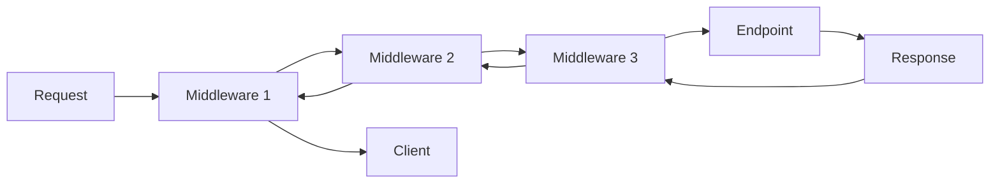

# How to Configure Middleware in ASP.NET Core

Author: [nawazdhandala](https://www.github.com/nawazdhandala)

Tags: .NET, ASP.NET Core, C#, Middleware, Request Pipeline, Web Development

Description: Learn how to configure and create middleware in ASP.NET Core applications. This guide covers built-in middleware, custom middleware development, middleware ordering, and common patterns for request/response processing.

Middleware is the foundation of request processing in ASP.NET Core. Each middleware component can inspect, modify, or short-circuit requests as they flow through the pipeline. Understanding how to configure and create middleware is essential for building robust web applications.

## Understanding the Middleware Pipeline

The middleware pipeline processes requests in order and responses in reverse order:



## Configuring Built-in Middleware

### Basic Pipeline Configuration

Here's a typical middleware configuration in `Program.cs`:

```csharp
var builder = WebApplication.CreateBuilder(args);

// Add services
builder.Services.AddControllers();
builder.Services.AddEndpointsApiExplorer();
builder.Services.AddSwaggerGen();

var app = builder.Build();

// Configure middleware pipeline (ORDER MATTERS!)

// 1. Exception handling - should be first to catch all exceptions
if (app.Environment.IsDevelopment())
{
    app.UseDeveloperExceptionPage();
    app.UseSwagger();
    app.UseSwaggerUI();
}
else
{
    app.UseExceptionHandler("/error");
    app.UseHsts();
}

// 2. HTTPS redirection
app.UseHttpsRedirection();

// 3. Static files (before routing)
app.UseStaticFiles();

// 4. Routing - determines which endpoint to execute
app.UseRouting();

// 5. CORS - must be between UseRouting and UseAuthorization
app.UseCors("AllowSpecificOrigins");

// 6. Authentication - identifies the user
app.UseAuthentication();

// 7. Authorization - checks permissions
app.UseAuthorization();

// 8. Custom middleware
app.UseRequestLogging();

// 9. Endpoints
app.MapControllers();

app.Run();
```

### Middleware Order Best Practices

The order of middleware is critical. Here's the recommended order:

```csharp
// 1. Exception/error handling
app.UseExceptionHandler();
app.UseHsts();

// 2. HTTPS enforcement
app.UseHttpsRedirection();

// 3. Static files
app.UseStaticFiles();
app.UseCookiePolicy();

// 4. Routing
app.UseRouting();

// 5. Rate limiting
app.UseRateLimiter();

// 6. Request localization
app.UseRequestLocalization();

// 7. CORS
app.UseCors();

// 8. Authentication
app.UseAuthentication();

// 9. Authorization
app.UseAuthorization();

// 10. Session
app.UseSession();

// 11. Response caching
app.UseResponseCaching();

// 12. Response compression
app.UseResponseCompression();

// 13. Custom middleware
app.UseCustomMiddleware();

// 14. Endpoint routing
app.MapControllers();
app.MapRazorPages();
```

## Creating Custom Middleware

### Inline Middleware with Use, Map, and Run

Quick middleware using lambda expressions:

```csharp
var app = builder.Build();

// Use - can call next middleware
app.Use(async (context, next) =>
{
    // Before the next middleware
    Console.WriteLine($"Request: {context.Request.Path}");
    var stopwatch = Stopwatch.StartNew();

    await next(context);

    // After the next middleware
    stopwatch.Stop();
    Console.WriteLine($"Response time: {stopwatch.ElapsedMilliseconds}ms");
});

// Map - branches the pipeline based on path
app.Map("/api", apiApp =>
{
    apiApp.Use(async (context, next) =>
    {
        context.Response.Headers.Add("X-API-Version", "1.0");
        await next();
    });

    apiApp.Run(async context =>
    {
        await context.Response.WriteAsync("API endpoint");
    });
});

// MapWhen - conditional branching
app.MapWhen(
    context => context.Request.Query.ContainsKey("debug"),
    debugApp =>
    {
        debugApp.Run(async context =>
        {
            await context.Response.WriteAsJsonAsync(new
            {
                Headers = context.Request.Headers.ToDictionary(h => h.Key, h => h.Value.ToString()),
                Query = context.Request.Query.ToDictionary(q => q.Key, q => q.Value.ToString())
            });
        });
    });

// Run - terminal middleware (doesn't call next)
app.Run(async context =>
{
    await context.Response.WriteAsync("Hello World!");
});
```

### Class-Based Middleware

For more complex middleware, use a class:

```csharp
public class RequestLoggingMiddleware
{
    private readonly RequestDelegate _next;
    private readonly ILogger<RequestLoggingMiddleware> _logger;

    public RequestLoggingMiddleware(
        RequestDelegate next,
        ILogger<RequestLoggingMiddleware> logger)
    {
        _next = next;
        _logger = logger;
    }

    public async Task InvokeAsync(HttpContext context)
    {
        // Generate correlation ID
        var correlationId = context.Request.Headers["X-Correlation-ID"].FirstOrDefault()
            ?? Guid.NewGuid().ToString();

        context.Items["CorrelationId"] = correlationId;
        context.Response.Headers.Add("X-Correlation-ID", correlationId);

        var stopwatch = Stopwatch.StartNew();

        _logger.LogInformation(
            "Request started: {Method} {Path} [CorrelationId: {CorrelationId}]",
            context.Request.Method,
            context.Request.Path,
            correlationId);

        try
        {
            await _next(context);
        }
        finally
        {
            stopwatch.Stop();

            _logger.LogInformation(
                "Request completed: {Method} {Path} - {StatusCode} in {ElapsedMs}ms [CorrelationId: {CorrelationId}]",
                context.Request.Method,
                context.Request.Path,
                context.Response.StatusCode,
                stopwatch.ElapsedMilliseconds,
                correlationId);
        }
    }
}

// Extension method for clean registration
public static class RequestLoggingMiddlewareExtensions
{
    public static IApplicationBuilder UseRequestLogging(this IApplicationBuilder builder)
    {
        return builder.UseMiddleware<RequestLoggingMiddleware>();
    }
}

// Usage
app.UseRequestLogging();
```

### Middleware with Options

Create configurable middleware:

```csharp
public class RateLimitOptions
{
    public int RequestsPerMinute { get; set; } = 60;
    public bool EnableBurstMode { get; set; } = false;
    public string[] WhitelistedIPs { get; set; } = Array.Empty<string>();
}

public class RateLimitMiddleware
{
    private readonly RequestDelegate _next;
    private readonly RateLimitOptions _options;
    private readonly IMemoryCache _cache;

    public RateLimitMiddleware(
        RequestDelegate next,
        IOptions<RateLimitOptions> options,
        IMemoryCache cache)
    {
        _next = next;
        _options = options.Value;
        _cache = cache;
    }

    public async Task InvokeAsync(HttpContext context)
    {
        var clientIp = context.Connection.RemoteIpAddress?.ToString() ?? "unknown";

        // Check whitelist
        if (_options.WhitelistedIPs.Contains(clientIp))
        {
            await _next(context);
            return;
        }

        var cacheKey = $"rate_limit_{clientIp}";
        var requestCount = _cache.GetOrCreate(cacheKey, entry =>
        {
            entry.AbsoluteExpirationRelativeToNow = TimeSpan.FromMinutes(1);
            return 0;
        });

        if (requestCount >= _options.RequestsPerMinute)
        {
            context.Response.StatusCode = StatusCodes.Status429TooManyRequests;
            context.Response.Headers.Add("Retry-After", "60");
            await context.Response.WriteAsJsonAsync(new
            {
                Error = "Rate limit exceeded",
                RetryAfter = 60
            });
            return;
        }

        _cache.Set(cacheKey, requestCount + 1, TimeSpan.FromMinutes(1));
        await _next(context);
    }
}

public static class RateLimitMiddlewareExtensions
{
    public static IApplicationBuilder UseRateLimit(
        this IApplicationBuilder builder,
        Action<RateLimitOptions>? configure = null)
    {
        var options = new RateLimitOptions();
        configure?.Invoke(options);

        return builder.UseMiddleware<RateLimitMiddleware>(Options.Create(options));
    }
}

// Usage
app.UseRateLimit(options =>
{
    options.RequestsPerMinute = 100;
    options.WhitelistedIPs = new[] { "127.0.0.1" };
});
```

## Common Middleware Patterns

### Exception Handling Middleware

```csharp
public class GlobalExceptionMiddleware
{
    private readonly RequestDelegate _next;
    private readonly ILogger<GlobalExceptionMiddleware> _logger;
    private readonly IHostEnvironment _env;

    public GlobalExceptionMiddleware(
        RequestDelegate next,
        ILogger<GlobalExceptionMiddleware> logger,
        IHostEnvironment env)
    {
        _next = next;
        _logger = logger;
        _env = env;
    }

    public async Task InvokeAsync(HttpContext context)
    {
        try
        {
            await _next(context);
        }
        catch (Exception ex)
        {
            await HandleExceptionAsync(context, ex);
        }
    }

    private async Task HandleExceptionAsync(HttpContext context, Exception exception)
    {
        var correlationId = context.Items["CorrelationId"]?.ToString() ?? "N/A";

        _logger.LogError(exception,
            "Unhandled exception [CorrelationId: {CorrelationId}]: {Message}",
            correlationId, exception.Message);

        var response = new
        {
            Error = GetErrorMessage(exception),
            CorrelationId = correlationId,
            Details = _env.IsDevelopment() ? exception.ToString() : null
        };

        context.Response.StatusCode = GetStatusCode(exception);
        context.Response.ContentType = "application/json";

        await context.Response.WriteAsJsonAsync(response);
    }

    private static string GetErrorMessage(Exception exception) => exception switch
    {
        ValidationException => "Validation failed",
        UnauthorizedAccessException => "Access denied",
        KeyNotFoundException => "Resource not found",
        _ => "An unexpected error occurred"
    };

    private static int GetStatusCode(Exception exception) => exception switch
    {
        ValidationException => StatusCodes.Status400BadRequest,
        UnauthorizedAccessException => StatusCodes.Status403Forbidden,
        KeyNotFoundException => StatusCodes.Status404NotFound,
        _ => StatusCodes.Status500InternalServerError
    };
}
```

### Request/Response Logging Middleware

```csharp
public class HttpLoggingMiddleware
{
    private readonly RequestDelegate _next;
    private readonly ILogger<HttpLoggingMiddleware> _logger;

    public HttpLoggingMiddleware(RequestDelegate next, ILogger<HttpLoggingMiddleware> logger)
    {
        _next = next;
        _logger = logger;
    }

    public async Task InvokeAsync(HttpContext context)
    {
        // Log request
        context.Request.EnableBuffering();
        var requestBody = await ReadRequestBodyAsync(context.Request);

        _logger.LogInformation(
            "HTTP Request: {Method} {Path} {Body}",
            context.Request.Method,
            context.Request.Path,
            requestBody);

        // Capture response
        var originalBodyStream = context.Response.Body;
        using var responseBody = new MemoryStream();
        context.Response.Body = responseBody;

        await _next(context);

        // Log response
        var response = await ReadResponseBodyAsync(context.Response);
        _logger.LogInformation(
            "HTTP Response: {StatusCode} {Body}",
            context.Response.StatusCode,
            response);

        // Copy response to original stream
        responseBody.Seek(0, SeekOrigin.Begin);
        await responseBody.CopyToAsync(originalBodyStream);
    }

    private static async Task<string> ReadRequestBodyAsync(HttpRequest request)
    {
        request.Body.Seek(0, SeekOrigin.Begin);
        using var reader = new StreamReader(request.Body, leaveOpen: true);
        var body = await reader.ReadToEndAsync();
        request.Body.Seek(0, SeekOrigin.Begin);
        return body;
    }

    private static async Task<string> ReadResponseBodyAsync(HttpResponse response)
    {
        response.Body.Seek(0, SeekOrigin.Begin);
        var body = await new StreamReader(response.Body).ReadToEndAsync();
        response.Body.Seek(0, SeekOrigin.Begin);
        return body;
    }
}
```

### Security Headers Middleware

```csharp
public class SecurityHeadersMiddleware
{
    private readonly RequestDelegate _next;

    public SecurityHeadersMiddleware(RequestDelegate next)
    {
        _next = next;
    }

    public async Task InvokeAsync(HttpContext context)
    {
        // Add security headers
        context.Response.Headers.Add("X-Content-Type-Options", "nosniff");
        context.Response.Headers.Add("X-Frame-Options", "DENY");
        context.Response.Headers.Add("X-XSS-Protection", "1; mode=block");
        context.Response.Headers.Add("Referrer-Policy", "strict-origin-when-cross-origin");
        context.Response.Headers.Add(
            "Content-Security-Policy",
            "default-src 'self'; script-src 'self'; style-src 'self' 'unsafe-inline';");
        context.Response.Headers.Add(
            "Permissions-Policy",
            "accelerometer=(), camera=(), geolocation=(), gyroscope=(), magnetometer=(), microphone=(), payment=(), usb=()");

        // Remove server header
        context.Response.Headers.Remove("Server");

        await _next(context);
    }
}
```

## Middleware with Dependency Injection

### Scoped Services in Middleware

Middleware is singleton by default. To use scoped services:

```csharp
public class TenantMiddleware
{
    private readonly RequestDelegate _next;

    public TenantMiddleware(RequestDelegate next)
    {
        _next = next;
    }

    // Inject scoped service in InvokeAsync, not constructor
    public async Task InvokeAsync(HttpContext context, ITenantService tenantService)
    {
        var tenantId = context.Request.Headers["X-Tenant-ID"].FirstOrDefault();

        if (string.IsNullOrEmpty(tenantId))
        {
            context.Response.StatusCode = StatusCodes.Status400BadRequest;
            await context.Response.WriteAsync("Tenant ID is required");
            return;
        }

        var tenant = await tenantService.GetTenantAsync(tenantId);
        if (tenant == null)
        {
            context.Response.StatusCode = StatusCodes.Status404NotFound;
            await context.Response.WriteAsync("Tenant not found");
            return;
        }

        context.Items["Tenant"] = tenant;
        await _next(context);
    }
}
```

## Testing Middleware

```csharp
public class MiddlewareTests
{
    [Fact]
    public async Task SecurityHeadersMiddleware_AddsExpectedHeaders()
    {
        // Arrange
        var context = new DefaultHttpContext();
        var middleware = new SecurityHeadersMiddleware(next: (ctx) => Task.CompletedTask);

        // Act
        await middleware.InvokeAsync(context);

        // Assert
        Assert.Equal("nosniff", context.Response.Headers["X-Content-Type-Options"]);
        Assert.Equal("DENY", context.Response.Headers["X-Frame-Options"]);
    }

    [Fact]
    public async Task RateLimitMiddleware_BlocksExcessiveRequests()
    {
        // Arrange
        var services = new ServiceCollection();
        services.AddMemoryCache();
        var provider = services.BuildServiceProvider();

        var options = Options.Create(new RateLimitOptions { RequestsPerMinute = 2 });
        var cache = provider.GetRequiredService<IMemoryCache>();

        var middleware = new RateLimitMiddleware(
            next: (ctx) => Task.CompletedTask,
            options: options,
            cache: cache);

        var context = new DefaultHttpContext();
        context.Connection.RemoteIpAddress = IPAddress.Parse("192.168.1.1");

        // Act - First two requests should succeed
        await middleware.InvokeAsync(context);
        await middleware.InvokeAsync(context);

        // Third request should be rate limited
        context = new DefaultHttpContext();
        context.Connection.RemoteIpAddress = IPAddress.Parse("192.168.1.1");
        await middleware.InvokeAsync(context);

        // Assert
        Assert.Equal(StatusCodes.Status429TooManyRequests, context.Response.StatusCode);
    }
}
```

## Conclusion

Middleware is a powerful mechanism for handling cross-cutting concerns in ASP.NET Core. Key takeaways:

1. **Order matters**: Configure middleware in the correct sequence
2. **Use class-based middleware**: For complex logic and testability
3. **Inject scoped services in InvokeAsync**: Not in the constructor
4. **Create extension methods**: For clean registration
5. **Handle exceptions early**: Exception middleware should be first
6. **Test your middleware**: Use DefaultHttpContext for unit tests

By mastering middleware, you can build clean, maintainable request processing pipelines that handle authentication, logging, error handling, and more.
