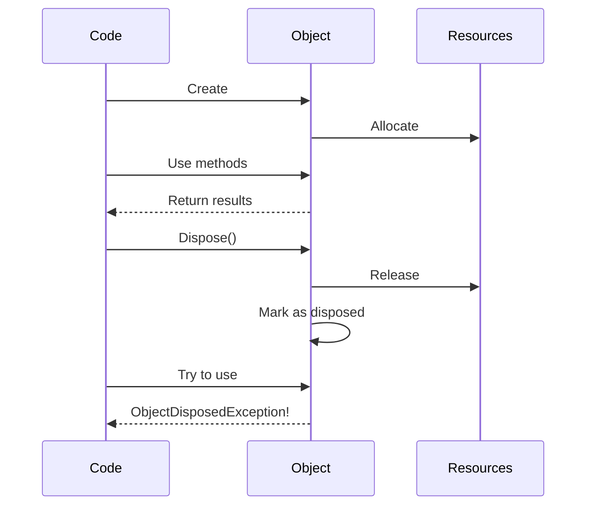

# How to Fix 'Cannot access a disposed object' Errors in C#

Author: [nawazdhandala](https://github.com/nawazdhandala)

Tags: C#, .NET, Disposal, Memory Management, Debugging, Async, IDisposable

Description: Learn how to diagnose and fix the ObjectDisposedException in C#. This guide covers common causes including async disposal issues, DI lifetime mismatches, and proper IDisposable patterns.

---

The `ObjectDisposedException` with the message "Cannot access a disposed object" occurs when you try to use an object after it has been disposed. This guide explains common causes and provides solutions for properly managing object lifetimes.

## Understanding the Error

When an object implementing `IDisposable` is disposed, its resources are released. Attempting to use it afterward throws `ObjectDisposedException`:

```csharp
using var stream = new FileStream("file.txt", FileMode.Open);
stream.Dispose();

// This throws ObjectDisposedException
var data = stream.ReadByte(); // Cannot access a disposed object: 'FileStream'
```

## Common Causes and Solutions

### 1. Using Statement Scope

The most common cause - the `using` statement disposes the object too early.

```csharp
// PROBLEM: Stream disposed before ReadToEndAsync completes
public async Task<string> GetDataBadAsync()
{
    using (var client = new HttpClient())
    using (var response = await client.GetAsync("https://api.example.com"))
    {
        // Response disposed when leaving this block
    }

    // Error: response is disposed!
    return await response.Content.ReadAsStringAsync();
}

// SOLUTION: Keep scope until done
public async Task<string> GetDataGoodAsync()
{
    using var client = new HttpClient();
    using var response = await client.GetAsync("https://api.example.com");

    // Read content before leaving scope
    return await response.Content.ReadAsStringAsync();
}
```

### 2. Async/Await with Disposal

Returning a stream or other disposable without awaiting the consumer:

```csharp
// PROBLEM: Stream disposed before caller can use it
public Stream GetStreamBad()
{
    using var memoryStream = new MemoryStream();
    WriteData(memoryStream);
    return memoryStream; // Disposed immediately after return!
}

// SOLUTION 1: Don't use 'using', transfer ownership
public Stream GetStreamGood()
{
    var memoryStream = new MemoryStream();
    WriteData(memoryStream);
    memoryStream.Position = 0;
    return memoryStream; // Caller responsible for disposal
}

// SOLUTION 2: Copy data before disposal
public byte[] GetDataGood()
{
    using var memoryStream = new MemoryStream();
    WriteData(memoryStream);
    return memoryStream.ToArray(); // Copy data out
}
```

### 3. Fire-and-Forget with Disposed Context

```csharp
// PROBLEM: DbContext disposed before background task completes
public void ProcessOrderBad(int orderId)
{
    using var context = new AppDbContext();

    // Fire and forget - context disposed before this completes!
    Task.Run(async () =>
    {
        var order = await context.Orders.FindAsync(orderId);
        await ProcessAsync(order);
    });
}

// SOLUTION: Await the task
public async Task ProcessOrderGoodAsync(int orderId)
{
    using var context = new AppDbContext();

    await Task.Run(async () =>
    {
        var order = await context.Orders.FindAsync(orderId);
        await ProcessAsync(order);
    });
}
```

## Disposal Flow



### 4. Dependency Injection Lifetime Mismatch

Injecting a scoped service into a singleton causes this error:

```csharp
// PROBLEM: Scoped DbContext in singleton service
public class SingletonServiceBad
{
    private readonly AppDbContext _context; // Scoped - will be disposed!

    public SingletonServiceBad(AppDbContext context)
    {
        _context = context; // Captured scoped context
    }

    public async Task DoWorkAsync()
    {
        // Error after first request: context disposed!
        await _context.SaveChangesAsync();
    }
}

// SOLUTION: Use IServiceScopeFactory
public class SingletonServiceGood
{
    private readonly IServiceScopeFactory _scopeFactory;

    public SingletonServiceGood(IServiceScopeFactory scopeFactory)
    {
        _scopeFactory = scopeFactory;
    }

    public async Task DoWorkAsync()
    {
        using var scope = _scopeFactory.CreateScope();
        var context = scope.ServiceProvider.GetRequiredService<AppDbContext>();
        await context.SaveChangesAsync();
    }
}
```

### 5. Background Services

```csharp
// PROBLEM: DbContext disposed in background service
public class BadBackgroundService : BackgroundService
{
    private readonly AppDbContext _context;

    public BadBackgroundService(AppDbContext context)
    {
        _context = context; // Scoped context - wrong!
    }

    protected override async Task ExecuteAsync(CancellationToken stoppingToken)
    {
        while (!stoppingToken.IsCancellationRequested)
        {
            // Error: context disposed after first iteration
            await _context.Users.ToListAsync();
            await Task.Delay(1000, stoppingToken);
        }
    }
}

// SOLUTION: Create scope per iteration
public class GoodBackgroundService : BackgroundService
{
    private readonly IServiceScopeFactory _scopeFactory;

    public GoodBackgroundService(IServiceScopeFactory scopeFactory)
    {
        _scopeFactory = scopeFactory;
    }

    protected override async Task ExecuteAsync(CancellationToken stoppingToken)
    {
        while (!stoppingToken.IsCancellationRequested)
        {
            using var scope = _scopeFactory.CreateScope();
            var context = scope.ServiceProvider.GetRequiredService<AppDbContext>();

            await context.Users.ToListAsync();
            await Task.Delay(1000, stoppingToken);
        }
    }
}
```

### 6. HttpClient in Using Block

```csharp
// PROBLEM: Creating HttpClient per request and disposing
public async Task<string> GetDataBad()
{
    using var client = new HttpClient(); // Wrong pattern!
    return await client.GetStringAsync("https://api.example.com");
}

// SOLUTION: Use IHttpClientFactory
public class ApiService
{
    private readonly HttpClient _client;

    public ApiService(HttpClient client) // Injected by IHttpClientFactory
    {
        _client = client;
    }

    public async Task<string> GetDataAsync()
    {
        return await _client.GetStringAsync("https://api.example.com");
    }
}

// Registration
services.AddHttpClient<ApiService>();
```

### 7. CancellationTokenSource Disposal

```csharp
// PROBLEM: Disposing CTS while operation in progress
public async Task ProcessWithTimeoutBad()
{
    using var cts = new CancellationTokenSource(TimeSpan.FromSeconds(30));

    // Don't await - returns immediately
    ProcessAsync(cts.Token); // CTS disposed while this runs!
}

// SOLUTION: Await the operation
public async Task ProcessWithTimeoutGood()
{
    using var cts = new CancellationTokenSource(TimeSpan.FromSeconds(30));

    await ProcessAsync(cts.Token); // Wait for completion
}
```

## Implementing IDisposable Correctly

### Standard Pattern

```csharp
public class ResourceHolder : IDisposable
{
    private Stream? _stream;
    private bool _disposed;

    public ResourceHolder(string path)
    {
        _stream = File.OpenRead(path);
    }

    public void DoWork()
    {
        ThrowIfDisposed();
        // Use _stream
    }

    private void ThrowIfDisposed()
    {
        if (_disposed)
        {
            throw new ObjectDisposedException(GetType().Name);
        }
    }

    public void Dispose()
    {
        Dispose(true);
        GC.SuppressFinalize(this);
    }

    protected virtual void Dispose(bool disposing)
    {
        if (_disposed) return;

        if (disposing)
        {
            _stream?.Dispose();
            _stream = null;
        }

        _disposed = true;
    }
}
```

### Async Disposal Pattern

```csharp
public class AsyncResourceHolder : IAsyncDisposable, IDisposable
{
    private Stream? _stream;
    private bool _disposed;

    public async ValueTask DisposeAsync()
    {
        if (_disposed) return;

        if (_stream != null)
        {
            await _stream.DisposeAsync();
            _stream = null;
        }

        _disposed = true;
        GC.SuppressFinalize(this);
    }

    public void Dispose()
    {
        if (_disposed) return;

        _stream?.Dispose();
        _stream = null;
        _disposed = true;

        GC.SuppressFinalize(this);
    }
}

// Usage
await using var holder = new AsyncResourceHolder();
```

## Debugging Tips

### Finding the Disposal Point

```csharp
public class DiagnosticDisposable : IDisposable
{
    private readonly string _creationStack;
    private string? _disposalStack;
    private bool _disposed;

    public DiagnosticDisposable()
    {
        _creationStack = Environment.StackTrace;
    }

    public void DoWork()
    {
        if (_disposed)
        {
            throw new ObjectDisposedException(
                GetType().Name,
                $"Created at:\n{_creationStack}\n\nDisposed at:\n{_disposalStack}");
        }
    }

    public void Dispose()
    {
        _disposalStack = Environment.StackTrace;
        _disposed = true;
    }
}
```

## Best Practices Summary

| Scenario | Solution |
|----------|----------|
| **Async operations** | Await before disposal |
| **Return disposable** | Transfer ownership, document disposal |
| **Background services** | Use IServiceScopeFactory |
| **Singleton + scoped** | Create scope, resolve service |
| **HttpClient** | Use IHttpClientFactory |
| **Stream from method** | Copy data or transfer ownership |

## Common Patterns

```csharp
// Pattern 1: Transfer ownership (caller disposes)
public Stream CreateStream() => new MemoryStream();

// Pattern 2: Scope-per-operation
public async Task DoWorkAsync()
{
    using var scope = _scopeFactory.CreateScope();
    var service = scope.ServiceProvider.GetRequiredService<IScopedService>();
    await service.ProcessAsync();
}

// Pattern 3: Factory pattern
public IDisposable CreateResource() => new Resource();

// Pattern 4: Async using
await using var resource = await CreateResourceAsync();
```

## Conclusion

ObjectDisposedException indicates a lifetime management issue. The key is ensuring objects aren't disposed before all operations complete. Use `IServiceScopeFactory` for scoped services in singletons, await async operations before disposal exits scope, and use `IHttpClientFactory` for HTTP clients. When designing APIs that return disposables, clearly document whether ownership is transferred to the caller.
