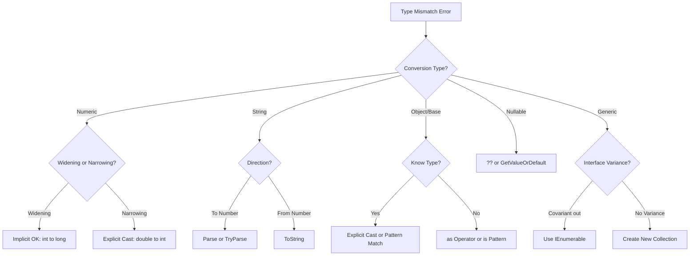

# How to Fix "Cannot implicitly convert type" Errors in C#

Author: [nawazdhandala](https://github.com/nawazdhandala)

Tags: C#, .NET, Type Safety, Debugging, Compiler Errors, Generics

Description: Learn how to diagnose and fix "Cannot implicitly convert type" errors in C#. This guide covers type conversion basics, common scenarios, and solutions using explicit casts, conversion methods, and proper type design.

---

The "Cannot implicitly convert type" error is one of the most common compiler errors in C#. It occurs when you try to assign a value of one type to a variable of another type without an explicit conversion. Understanding C#'s type system is key to resolving these errors.

## Understanding the Error

C# is a strongly-typed language, meaning the compiler enforces type safety. When types don't match, you get this error:

```csharp
// Error CS0029: Cannot implicitly convert type 'string' to 'int'
int number = "42";

// Error CS0029: Cannot implicitly convert type 'double' to 'int'
int count = 3.14;

// Error CS0029: Cannot implicitly convert type 'List<int>' to 'IEnumerable<object>'
IEnumerable<object> items = new List<int>();
```

## Common Scenarios and Solutions

### 1. Numeric Type Conversions

When converting between numeric types, data loss may occur.

```csharp
// PROBLEM: Implicit conversion loses precision
double price = 19.99;
int wholeDollars = price; // Error!

// SOLUTION 1: Explicit cast (truncates decimal)
int wholeDollars = (int)price; // Results in 19

// SOLUTION 2: Use Convert class (rounds)
int wholeDollars = Convert.ToInt32(price); // Results in 20

// SOLUTION 3: Use Math methods for explicit behavior
int wholeDollars = (int)Math.Floor(price);  // 19
int wholeDollars = (int)Math.Ceiling(price); // 20
int wholeDollars = (int)Math.Round(price);   // 20
```

### 2. String to Number Conversions

```csharp
// PROBLEM
string input = "42";
int number = input; // Error!

// SOLUTION 1: Parse (throws on invalid input)
int number = int.Parse(input);

// SOLUTION 2: TryParse (safe, returns bool)
if (int.TryParse(input, out int number))
{
    Console.WriteLine($"Parsed: {number}");
}
else
{
    Console.WriteLine("Invalid number format");
}

// SOLUTION 3: Convert class
int number = Convert.ToInt32(input);

// For decimal/double
decimal price = decimal.Parse("19.99");
double rate = double.Parse("3.14159");
```

### 3. Nullable Type Conversions

```csharp
// PROBLEM: Nullable to non-nullable
int? nullableValue = GetValue(); // Returns int?
int value = nullableValue; // Error!

// SOLUTION 1: Null-coalescing operator
int value = nullableValue ?? 0;

// SOLUTION 2: GetValueOrDefault
int value = nullableValue.GetValueOrDefault();
int value = nullableValue.GetValueOrDefault(defaultValue: -1);

// SOLUTION 3: Explicit check
if (nullableValue.HasValue)
{
    int value = nullableValue.Value;
}

// SOLUTION 4: Pattern matching
if (nullableValue is int value)
{
    ProcessValue(value);
}
```

### 4. Object and Dynamic Types

```csharp
// PROBLEM: Object to specific type
object data = GetData();
string text = data; // Error!

// SOLUTION 1: Explicit cast (throws if wrong type)
string text = (string)data;

// SOLUTION 2: as operator (returns null if wrong type)
string? text = data as string;
if (text != null)
{
    ProcessText(text);
}

// SOLUTION 3: Pattern matching (safest)
if (data is string text)
{
    ProcessText(text);
}

// SOLUTION 4: Use dynamic (no compile-time checking)
dynamic data = GetData();
string text = data; // No error, but may fail at runtime
```

### 5. Generic Type Variance

```csharp
// PROBLEM: Generic type variance
List<string> strings = new List<string>();
List<object> objects = strings; // Error!

// Why? List<T> is not covariant - you could add non-strings:
// objects.Add(123); // Would corrupt the string list!

// SOLUTION 1: Use covariant interface (IEnumerable<out T>)
IEnumerable<object> objects = strings; // Works!

// SOLUTION 2: Create new collection
List<object> objects = strings.Cast<object>().ToList();
List<object> objects = new List<object>(strings);

// SOLUTION 3: Use OfType for filtering
List<object> mixed = new List<object> { "hello", 42, "world" };
List<string> strings = mixed.OfType<string>().ToList();
```

## Type Conversion Diagram



### 6. Async Return Types

```csharp
// PROBLEM: Wrong async return type
public async Task<string> GetDataAsync()
{
    var result = await FetchDataAsync();
    return result.Id; // Error if Id is int!
}

// SOLUTION: Match return type
public async Task<int> GetIdAsync()
{
    var result = await FetchDataAsync();
    return result.Id; // Now matches Task<int>
}

// Or convert the value
public async Task<string> GetDataAsync()
{
    var result = await FetchDataAsync();
    return result.Id.ToString(); // Convert int to string
}
```

### 7. Interface and Inheritance Conversions

```csharp
// PROBLEM: Implementation to interface works, reverse doesn't
ILogger logger = new FileLogger(); // OK - implementation to interface
FileLogger fileLogger = logger; // Error!

// SOLUTION 1: Explicit cast (if you know the type)
FileLogger fileLogger = (FileLogger)logger;

// SOLUTION 2: Pattern matching (safe)
if (logger is FileLogger fileLogger)
{
    fileLogger.SetFilePath("/logs/app.log");
}

// SOLUTION 3: as operator
FileLogger? fileLogger = logger as FileLogger;
if (fileLogger != null)
{
    fileLogger.SetFilePath("/logs/app.log");
}
```

### 8. Enum Conversions

```csharp
public enum OrderStatus
{
    Pending = 0,
    Processing = 1,
    Completed = 2,
    Cancelled = 3
}

// PROBLEM: Int to Enum
int statusCode = 2;
OrderStatus status = statusCode; // Error!

// SOLUTION 1: Explicit cast
OrderStatus status = (OrderStatus)statusCode;

// SOLUTION 2: Enum.Parse (from string)
OrderStatus status = Enum.Parse<OrderStatus>("Completed");

// SOLUTION 3: Enum.TryParse (safe)
if (Enum.TryParse<OrderStatus>("Completed", out var status))
{
    ProcessStatus(status);
}

// Enum to Int
int code = (int)OrderStatus.Completed; // Returns 2
```

## Custom Type Conversions

### Implicit Conversion Operators

```csharp
public readonly struct Temperature
{
    public double Celsius { get; }

    public Temperature(double celsius)
    {
        Celsius = celsius;
    }

    // Implicit conversion from double
    public static implicit operator Temperature(double celsius)
    {
        return new Temperature(celsius);
    }

    // Implicit conversion to double
    public static implicit operator double(Temperature temp)
    {
        return temp.Celsius;
    }
}

// Usage - no explicit cast needed
Temperature temp = 25.5;
double value = temp;
```

### Explicit Conversion Operators

```csharp
public readonly struct Percentage
{
    public decimal Value { get; }

    public Percentage(decimal value)
    {
        if (value < 0 || value > 100)
            throw new ArgumentOutOfRangeException(nameof(value));
        Value = value;
    }

    // Explicit conversion - may fail
    public static explicit operator Percentage(decimal value)
    {
        return new Percentage(value);
    }
}

// Usage - must use explicit cast
Percentage p = (Percentage)75.5m; // OK
Percentage p = (Percentage)150m; // Throws at runtime
```

## Common Conversion Helpers

```csharp
public static class ConversionHelpers
{
    public static T? SafeCast<T>(object? value) where T : class
    {
        return value as T;
    }

    public static T ConvertTo<T>(object value)
    {
        return (T)Convert.ChangeType(value, typeof(T));
    }

    public static bool TryConvertTo<T>(object value, out T result)
    {
        try
        {
            result = (T)Convert.ChangeType(value, typeof(T));
            return true;
        }
        catch
        {
            result = default!;
            return false;
        }
    }
}
```

## Best Practices Summary

| Scenario | Recommended Solution |
|----------|---------------------|
| **Numeric narrowing** | Explicit cast with bounds checking |
| **String to number** | TryParse for safety |
| **Nullable to value** | Null-coalescing ?? |
| **Object to specific** | Pattern matching |
| **Generic variance** | Use covariant interfaces |
| **Enum conversion** | Enum.TryParse |
| **Custom types** | Define conversion operators |

## Conclusion

Type conversion errors protect you from data loss and runtime errors. When you encounter "Cannot implicitly convert type", identify whether you need explicit casting, parsing, or a different type design. Use pattern matching and TryParse methods for safe conversions, and consider defining custom conversion operators for your own types. Understanding when implicit conversions are safe versus when explicit conversions are required will help you write safer, more maintainable C# code.
