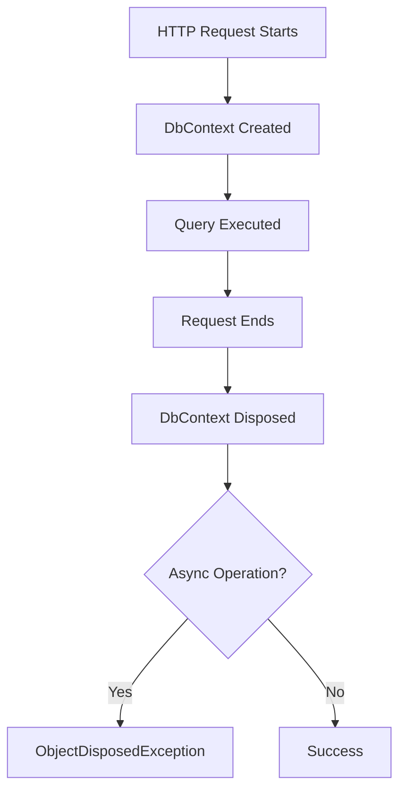

# How to Fix "DbContext disposed" Errors

Author: [nawazdhandala](https://www.github.com/nawazdhandala)

Tags: .NET, C#, Entity Framework, DbContext, ASP.NET Core, Troubleshooting

Description: Learn how to diagnose and fix "Cannot access a disposed context" errors in Entity Framework Core. This guide covers DbContext lifetime management, async pitfalls, and best practices for working with Entity Framework in ASP.NET Core applications.

The "Cannot access a disposed context" error is one of the most common issues when working with Entity Framework Core in ASP.NET Core applications. This guide will help you understand why this error occurs and how to fix it properly.

## Understanding the Error

When you see this error:

```
System.ObjectDisposedException: Cannot access a disposed context instance.
A common cause of this error is disposing a context instance that was resolved
from dependency injection and then later trying to use the same context instance
elsewhere in your application.
```

It means you're trying to use a DbContext that has already been disposed, typically because:

1. The HTTP request has ended
2. A `using` block has completed
3. The DI scope has been disposed
4. An async operation continued after the context was disposed



## Common Causes and Solutions

### 1. Async Void Methods

The most common cause - using `async void` instead of `async Task`:

```csharp
// WRONG - async void doesn't await properly
public class OrderService
{
    private readonly ApplicationDbContext _context;

    public async void ProcessOrderAsync(int orderId) // Bug: async void
    {
        var order = await _context.Orders.FindAsync(orderId);
        // Context might be disposed before this completes!
        await _context.SaveChangesAsync();
    }
}

// Called like this:
public async Task<IActionResult> CreateOrder(Order order)
{
    _orderService.ProcessOrderAsync(order.Id); // Fire and forget!
    return Ok(); // Request ends, context disposed
}
```

**Solution: Use async Task and await properly**

```csharp
// CORRECT - async Task
public class OrderService
{
    private readonly ApplicationDbContext _context;

    public async Task ProcessOrderAsync(int orderId)
    {
        var order = await _context.Orders.FindAsync(orderId);
        await _context.SaveChangesAsync();
    }
}

// Called properly with await
public async Task<IActionResult> CreateOrder(Order order)
{
    await _orderService.ProcessOrderAsync(order.Id);
    return Ok();
}
```

### 2. Lazy Loading After Request Ends

Navigation properties accessed after the context is disposed:

```csharp
// WRONG - Lazy loading after returning from action
[HttpGet("{id}")]
public async Task<Order> GetOrder(int id)
{
    var order = await _context.Orders.FindAsync(id);
    return order; // Returns, context disposed

    // Later, serialization tries to access order.Items
    // via lazy loading - BOOM!
}
```

**Solution: Eager load required data**

```csharp
// CORRECT - Eager loading
[HttpGet("{id}")]
public async Task<Order> GetOrder(int id)
{
    var order = await _context.Orders
        .Include(o => o.Items)
        .Include(o => o.Customer)
        .FirstOrDefaultAsync(o => o.Id == id);

    return order;
}

// BETTER - Use DTOs
[HttpGet("{id}")]
public async Task<OrderDto> GetOrder(int id)
{
    var order = await _context.Orders
        .Where(o => o.Id == id)
        .Select(o => new OrderDto
        {
            Id = o.Id,
            CustomerName = o.Customer.Name,
            Items = o.Items.Select(i => new OrderItemDto
            {
                ProductName = i.Product.Name,
                Quantity = i.Quantity
            }).ToList()
        })
        .FirstOrDefaultAsync();

    return order;
}
```

### 3. Background Processing with Scoped DbContext

Using a scoped DbContext in a background task:

```csharp
// WRONG - DbContext captured in background task
public class OrderController : ControllerBase
{
    private readonly ApplicationDbContext _context;

    public async Task<IActionResult> ProcessLargeOrder(int orderId)
    {
        // Start background task with scoped context
        _ = Task.Run(async () =>
        {
            // This runs after the request ends!
            var order = await _context.Orders.FindAsync(orderId); // BOOM!
            await ProcessAsync(order);
        });

        return Accepted();
    }
}
```

**Solution: Use IDbContextFactory or IServiceScopeFactory**

```csharp
// CORRECT - Using IDbContextFactory
public class OrderController : ControllerBase
{
    private readonly IDbContextFactory<ApplicationDbContext> _contextFactory;
    private readonly IBackgroundTaskQueue _queue;

    public OrderController(
        IDbContextFactory<ApplicationDbContext> contextFactory,
        IBackgroundTaskQueue queue)
    {
        _contextFactory = contextFactory;
        _queue = queue;
    }

    public async Task<IActionResult> ProcessLargeOrder(int orderId)
    {
        await _queue.QueueBackgroundWorkItemAsync(async token =>
        {
            // Create a new context for the background task
            await using var context = await _contextFactory.CreateDbContextAsync(token);

            var order = await context.Orders.FindAsync(orderId);
            await ProcessAsync(order);
        });

        return Accepted();
    }
}

// Registration
builder.Services.AddDbContextFactory<ApplicationDbContext>(options =>
    options.UseSqlServer(connectionString));
```

```csharp
// ALTERNATIVE - Using IServiceScopeFactory
public class BackgroundOrderProcessor : BackgroundService
{
    private readonly IServiceScopeFactory _scopeFactory;

    public BackgroundOrderProcessor(IServiceScopeFactory scopeFactory)
    {
        _scopeFactory = scopeFactory;
    }

    protected override async Task ExecuteAsync(CancellationToken stoppingToken)
    {
        while (!stoppingToken.IsCancellationRequested)
        {
            using var scope = _scopeFactory.CreateScope();
            var context = scope.ServiceProvider
                .GetRequiredService<ApplicationDbContext>();

            // Use context within this scope
            var orders = await context.Orders
                .Where(o => o.Status == OrderStatus.Pending)
                .ToListAsync(stoppingToken);

            foreach (var order in orders)
            {
                await ProcessOrderAsync(context, order);
            }

            await Task.Delay(TimeSpan.FromMinutes(1), stoppingToken);
        }
    }
}
```

### 4. Capturing DbContext in Closures

Closures capturing the context reference:

```csharp
// WRONG - Context captured in closure
public async Task<IActionResult> GetOrders()
{
    var orders = await _context.Orders.ToListAsync();

    // This captures _context in a closure
    var enrichedOrders = orders.Select(async o =>
    {
        var customer = await _context.Customers.FindAsync(o.CustomerId);
        return new { Order = o, Customer = customer };
    });

    // By the time these execute, context might be disposed
    var results = await Task.WhenAll(enrichedOrders);
    return Ok(results);
}
```

**Solution: Load all data before transforming**

```csharp
// CORRECT - Load data in single query
public async Task<IActionResult> GetOrders()
{
    var orders = await _context.Orders
        .Include(o => o.Customer)
        .Select(o => new
        {
            Order = o,
            Customer = o.Customer
        })
        .ToListAsync();

    return Ok(orders);
}
```

### 5. Singleton Services with Scoped DbContext

Injecting scoped DbContext into singleton service:

```csharp
// WRONG - This will cause issues
public class CacheService // Registered as Singleton
{
    private readonly ApplicationDbContext _context; // Scoped!

    public CacheService(ApplicationDbContext context)
    {
        _context = context; // Same context for all requests!
    }
}
```

**Solution: Use IDbContextFactory in singletons**

```csharp
// CORRECT - Factory in singleton
public class CacheService
{
    private readonly IDbContextFactory<ApplicationDbContext> _contextFactory;

    public CacheService(IDbContextFactory<ApplicationDbContext> contextFactory)
    {
        _contextFactory = contextFactory;
    }

    public async Task<Product?> GetProductAsync(int id)
    {
        await using var context = await _contextFactory.CreateDbContextAsync();
        return await context.Products.FindAsync(id);
    }
}
```

## DbContext Lifetime Options

### Scoped (Default)

```csharp
// Default - one context per HTTP request
builder.Services.AddDbContext<ApplicationDbContext>(options =>
    options.UseSqlServer(connectionString));
```

### Pooled (Recommended for Performance)

```csharp
// Pooled - reuses context instances
builder.Services.AddDbContextPool<ApplicationDbContext>(options =>
    options.UseSqlServer(connectionString),
    poolSize: 128);
```

### Factory (For Manual Control)

```csharp
// Factory - create contexts on demand
builder.Services.AddDbContextFactory<ApplicationDbContext>(options =>
    options.UseSqlServer(connectionString));

// Usage
public class MyService
{
    private readonly IDbContextFactory<ApplicationDbContext> _factory;

    public async Task DoWorkAsync()
    {
        await using var context = await _factory.CreateDbContextAsync();
        // Use context
    } // Context disposed here
}
```

## Debugging Disposed Context Issues

### Enable Sensitive Data Logging

```csharp
builder.Services.AddDbContext<ApplicationDbContext>(options =>
{
    options.UseSqlServer(connectionString);

    if (builder.Environment.IsDevelopment())
    {
        options.EnableSensitiveDataLogging();
        options.EnableDetailedErrors();
        options.LogTo(Console.WriteLine, LogLevel.Information);
    }
});
```

### Check Context State

```csharp
public static class DbContextExtensions
{
    public static void EnsureNotDisposed(this DbContext context, [CallerMemberName] string caller = "")
    {
        try
        {
            // This will throw if disposed
            _ = context.ChangeTracker.HasChanges();
        }
        catch (ObjectDisposedException)
        {
            throw new ObjectDisposedException(
                context.GetType().Name,
                $"DbContext was disposed before {caller} completed. " +
                "Ensure all async operations are awaited.");
        }
    }
}
```

## Best Practices

### Use IDbContextFactory for Complex Scenarios

```csharp
public class OrderProcessor
{
    private readonly IDbContextFactory<ApplicationDbContext> _contextFactory;
    private readonly ILogger<OrderProcessor> _logger;

    public OrderProcessor(
        IDbContextFactory<ApplicationDbContext> contextFactory,
        ILogger<OrderProcessor> logger)
    {
        _contextFactory = contextFactory;
        _logger = logger;
    }

    public async Task ProcessOrdersAsync(IEnumerable<int> orderIds, CancellationToken ct)
    {
        // Each batch gets its own context
        foreach (var batch in orderIds.Chunk(100))
        {
            await using var context = await _contextFactory.CreateDbContextAsync(ct);

            var orders = await context.Orders
                .Where(o => batch.Contains(o.Id))
                .ToListAsync(ct);

            foreach (var order in orders)
            {
                ProcessOrder(order);
            }

            await context.SaveChangesAsync(ct);
        }
    }
}
```

### Unit of Work Pattern

```csharp
public interface IUnitOfWork : IDisposable, IAsyncDisposable
{
    IOrderRepository Orders { get; }
    ICustomerRepository Customers { get; }
    Task<int> SaveChangesAsync(CancellationToken ct = default);
}

public class UnitOfWork : IUnitOfWork
{
    private readonly ApplicationDbContext _context;

    public UnitOfWork(ApplicationDbContext context)
    {
        _context = context;
        Orders = new OrderRepository(context);
        Customers = new CustomerRepository(context);
    }

    public IOrderRepository Orders { get; }
    public ICustomerRepository Customers { get; }

    public Task<int> SaveChangesAsync(CancellationToken ct = default)
        => _context.SaveChangesAsync(ct);

    public void Dispose() => _context.Dispose();
    public ValueTask DisposeAsync() => _context.DisposeAsync();
}
```

### Async Enumerable for Large Datasets

```csharp
public async IAsyncEnumerable<Order> GetOrdersStreamAsync(
    [EnumeratorCancellation] CancellationToken ct)
{
    await using var context = await _contextFactory.CreateDbContextAsync(ct);

    await foreach (var order in context.Orders.AsAsyncEnumerable().WithCancellation(ct))
    {
        yield return order;
    }
}
```

## Common Patterns Summary

| Scenario | Solution |
|----------|----------|
| Background task | Use `IDbContextFactory` or `IServiceScopeFactory` |
| Singleton service | Use `IDbContextFactory` |
| Lazy loading needed | Eager load with `Include()` or use DTOs |
| Fire-and-forget | Use `async Task` and proper queue |
| Long-running operation | Create new context per batch |
| Parallel processing | One context per task |

## Conclusion

The "DbContext disposed" error is almost always caused by lifetime mismanagement. Key takeaways:

1. **Never use async void**: Always use `async Task` and await properly
2. **Don't capture context in closures**: Load all data before async transformations
3. **Use IDbContextFactory**: For background tasks and singleton services
4. **Eager load data**: Avoid lazy loading navigation properties
5. **Create scopes for background work**: Use `IServiceScopeFactory`
6. **Understand DI lifetimes**: Scoped contexts die with the request

By following these patterns, you'll avoid disposed context errors and build more robust Entity Framework Core applications.
