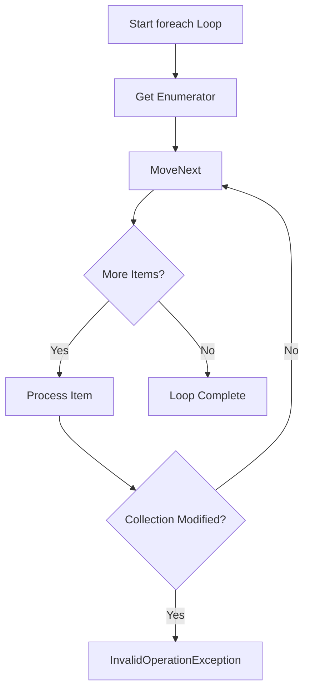

# How to Fix 'Invalid operation' Collection Errors

Author: [nawazdhandala](https://www.github.com/nawazdhandala)

Tags: .NET, C#, Collections, Troubleshooting, Common Issues, Threading

Description: Learn how to diagnose and fix 'Invalid operation' collection errors in C# applications. This guide covers collection modification during enumeration, thread-safety issues, and best practices for working with collections safely.

The "InvalidOperationException: Collection was modified" error is one of the most common issues developers encounter when working with collections in C#. This guide explains why this error occurs and provides practical solutions for various scenarios.

## Understanding the Error

This error typically appears as:

```
System.InvalidOperationException: Collection was modified; enumeration operation may not execute.
```

It occurs when you modify a collection while iterating over it with a `foreach` loop or an enumerator.



## Common Causes and Solutions

### 1. Modifying During foreach Enumeration

The classic mistake - modifying a collection while iterating:

```csharp
// WRONG - This throws InvalidOperationException
var numbers = new List<int> { 1, 2, 3, 4, 5 };

foreach (var number in numbers)
{
    if (number % 2 == 0)
    {
        numbers.Remove(number); // Throws!
    }
}
```

**Solution 1: Use a for loop with reverse iteration**

```csharp
var numbers = new List<int> { 1, 2, 3, 4, 5 };

// Iterate backwards to safely remove items
for (int i = numbers.Count - 1; i >= 0; i--)
{
    if (numbers[i] % 2 == 0)
    {
        numbers.RemoveAt(i);
    }
}
```

**Solution 2: Use RemoveAll with a predicate**

```csharp
var numbers = new List<int> { 1, 2, 3, 4, 5 };

// Most elegant solution for removing items
numbers.RemoveAll(n => n % 2 == 0);
```

**Solution 3: Create a copy to iterate**

```csharp
var numbers = new List<int> { 1, 2, 3, 4, 5 };

// ToList() creates a copy to iterate over
foreach (var number in numbers.ToList())
{
    if (number % 2 == 0)
    {
        numbers.Remove(number);
    }
}
```

**Solution 4: Collect items to remove, then remove**

```csharp
var numbers = new List<int> { 1, 2, 3, 4, 5 };
var toRemove = new List<int>();

foreach (var number in numbers)
{
    if (number % 2 == 0)
    {
        toRemove.Add(number);
    }
}

foreach (var number in toRemove)
{
    numbers.Remove(number);
}
```

### 2. Dictionary Modification During Iteration

Dictionaries have the same constraint:

```csharp
// WRONG - Throws InvalidOperationException
var cache = new Dictionary<string, DateTime>
{
    { "key1", DateTime.Now.AddHours(-2) },
    { "key2", DateTime.Now.AddHours(-1) },
    { "key3", DateTime.Now }
};

foreach (var kvp in cache)
{
    if (kvp.Value < DateTime.Now.AddHours(-1))
    {
        cache.Remove(kvp.Key); // Throws!
    }
}
```

**Solution: Collect keys first**

```csharp
var cache = new Dictionary<string, DateTime>
{
    { "key1", DateTime.Now.AddHours(-2) },
    { "key2", DateTime.Now.AddHours(-1) },
    { "key3", DateTime.Now }
};

var expiredKeys = cache
    .Where(kvp => kvp.Value < DateTime.Now.AddHours(-1))
    .Select(kvp => kvp.Key)
    .ToList();

foreach (var key in expiredKeys)
{
    cache.Remove(key);
}
```

### 3. LINQ Query Modification

LINQ queries with deferred execution can also cause issues:

```csharp
// DANGEROUS - Query is not executed until enumeration
var numbers = new List<int> { 1, 2, 3, 4, 5 };
var query = numbers.Where(n => n > 2); // Deferred execution

numbers.Add(6); // Modifying the source
numbers.Remove(3); // More modifications

// Query executes here - might get unexpected results
foreach (var n in query)
{
    Console.WriteLine(n); // Results depend on timing
}
```

**Solution: Materialize the query immediately**

```csharp
var numbers = new List<int> { 1, 2, 3, 4, 5 };
var query = numbers.Where(n => n > 2).ToList(); // Execute immediately

numbers.Add(6);
numbers.Remove(3);

// Query was already executed, safe to enumerate
foreach (var n in query)
{
    Console.WriteLine(n);
}
```

## Thread-Safety Issues

### 4. Concurrent Modification from Multiple Threads

Multiple threads accessing a collection can cause the error (or worse - data corruption):

```csharp
// DANGEROUS - Not thread-safe
public class UnsafeCache
{
    private readonly Dictionary<string, object> _cache = new();

    public void Add(string key, object value)
    {
        _cache[key] = value; // Not thread-safe!
    }

    public IEnumerable<string> GetKeys()
    {
        foreach (var key in _cache.Keys) // Can throw if Add is called
        {
            yield return key;
        }
    }
}
```

**Solution 1: Use ConcurrentDictionary**

```csharp
using System.Collections.Concurrent;

public class ThreadSafeCache
{
    private readonly ConcurrentDictionary<string, object> _cache = new();

    public void Add(string key, object value)
    {
        _cache[key] = value; // Thread-safe
    }

    public IEnumerable<string> GetKeys()
    {
        // ConcurrentDictionary provides a snapshot of keys
        return _cache.Keys.ToList();
    }

    public object GetOrAdd(string key, Func<string, object> valueFactory)
    {
        return _cache.GetOrAdd(key, valueFactory);
    }
}
```

**Solution 2: Use locking**

```csharp
public class LockedCache
{
    private readonly Dictionary<string, object> _cache = new();
    private readonly object _lock = new();

    public void Add(string key, object value)
    {
        lock (_lock)
        {
            _cache[key] = value;
        }
    }

    public List<string> GetKeys()
    {
        lock (_lock)
        {
            return _cache.Keys.ToList(); // Return a copy
        }
    }
}
```

**Solution 3: Use ReaderWriterLockSlim for read-heavy workloads**

```csharp
public class RWLockedCache
{
    private readonly Dictionary<string, object> _cache = new();
    private readonly ReaderWriterLockSlim _lock = new();

    public void Add(string key, object value)
    {
        _lock.EnterWriteLock();
        try
        {
            _cache[key] = value;
        }
        finally
        {
            _lock.ExitWriteLock();
        }
    }

    public object? Get(string key)
    {
        _lock.EnterReadLock();
        try
        {
            return _cache.TryGetValue(key, out var value) ? value : null;
        }
        finally
        {
            _lock.ExitReadLock();
        }
    }

    public List<string> GetKeys()
    {
        _lock.EnterReadLock();
        try
        {
            return _cache.Keys.ToList();
        }
        finally
        {
            _lock.ExitReadLock();
        }
    }
}
```

## Specialized Collection Types

### 5. Using Thread-Safe Collections

.NET provides several thread-safe collection types:

```csharp
using System.Collections.Concurrent;

// Thread-safe dictionary
var concurrentDict = new ConcurrentDictionary<string, int>();
concurrentDict.TryAdd("key", 1);
concurrentDict.AddOrUpdate("key", 1, (k, v) => v + 1);

// Thread-safe queue
var concurrentQueue = new ConcurrentQueue<int>();
concurrentQueue.Enqueue(1);
concurrentQueue.TryDequeue(out var item);

// Thread-safe bag (unordered)
var concurrentBag = new ConcurrentBag<int>();
concurrentBag.Add(1);
concurrentBag.TryTake(out var bagItem);

// Thread-safe stack
var concurrentStack = new ConcurrentStack<int>();
concurrentStack.Push(1);
concurrentStack.TryPop(out var stackItem);

// Blocking collection (producer-consumer)
var blockingCollection = new BlockingCollection<int>(boundedCapacity: 100);
blockingCollection.Add(1);
var consumed = blockingCollection.Take();
```

### 6. Observable Collections (WPF/MAUI)

For UI binding, use ObservableCollection carefully:

```csharp
public class ViewModel
{
    public ObservableCollection<Item> Items { get; } = new();

    // WRONG - Can cause issues from background thread
    public async Task LoadItemsAsync()
    {
        var items = await _service.GetItemsAsync();

        // This might throw or cause UI issues
        foreach (var item in items)
        {
            Items.Add(item);
        }
    }

    // CORRECT - Marshal to UI thread
    public async Task LoadItemsAsyncCorrect()
    {
        var items = await _service.GetItemsAsync();

        // Use dispatcher for WPF
        await Application.Current.Dispatcher.InvokeAsync(() =>
        {
            Items.Clear();
            foreach (var item in items)
            {
                Items.Add(item);
            }
        });
    }
}
```

## Immutable Collections

### 7. Using Immutable Collections for Safety

Immutable collections eliminate modification issues entirely:

```csharp
using System.Collections.Immutable;

public class ImmutableExample
{
    private ImmutableList<int> _numbers = ImmutableList<int>.Empty;

    public void AddNumber(int number)
    {
        // Creates a new list, doesn't modify the original
        _numbers = _numbers.Add(number);
    }

    public ImmutableList<int> GetNumbers()
    {
        // Safe to return - can't be modified
        return _numbers;
    }

    public void ProcessNumbers()
    {
        // Safe to iterate - collection is immutable
        foreach (var number in _numbers)
        {
            Console.WriteLine(number);
            // Can't accidentally modify _numbers here
        }
    }
}

// Immutable dictionary example
var dict = ImmutableDictionary<string, int>.Empty;
dict = dict.Add("one", 1);
dict = dict.Add("two", 2);
dict = dict.SetItem("one", 100); // Returns new dictionary

// Builder pattern for bulk modifications
var builder = ImmutableList.CreateBuilder<int>();
builder.Add(1);
builder.Add(2);
builder.Add(3);
var immutableList = builder.ToImmutable();
```

## Best Practices

### Safe Collection Patterns

```csharp
public class SafeCollectionPatterns
{
    // 1. Return copies or read-only views
    private readonly List<string> _items = new();

    public IReadOnlyList<string> Items => _items.AsReadOnly();

    // 2. Use LINQ for filtering instead of manual removal
    public IEnumerable<string> GetActiveItems()
    {
        return _items.Where(item => IsActive(item));
    }

    // 3. Use AddRange/RemoveAll for bulk operations
    public void UpdateItems(IEnumerable<string> newItems)
    {
        _items.Clear();
        _items.AddRange(newItems);
    }

    // 4. Defensive copying in multi-threaded scenarios
    public List<string> GetItemsCopy()
    {
        lock (_items)
        {
            return new List<string>(_items);
        }
    }

    private bool IsActive(string item) => !string.IsNullOrEmpty(item);
}
```

### Collection Modification Checklist

When working with collections, ask yourself:

1. **Am I iterating?** Don't modify during foreach
2. **Multiple threads?** Use concurrent collections or locking
3. **Need to remove items?** Use RemoveAll or reverse iteration
4. **Returning collections?** Return copies or read-only views
5. **LINQ queries?** Materialize with ToList() if source might change
6. **UI binding?** Marshal changes to UI thread

## Conclusion

The "Collection was modified" error is preventable once you understand when and why it occurs. Key strategies include:

1. **Avoid modifying during enumeration**: Use RemoveAll, reverse iteration, or collect-then-modify patterns
2. **Use thread-safe collections**: ConcurrentDictionary, ConcurrentQueue, etc. for multi-threaded scenarios
3. **Consider immutable collections**: For maximum safety in concurrent scenarios
4. **Materialize LINQ queries**: Use ToList() when the source might change
5. **Return defensive copies**: Protect internal collections from external modification

By applying these patterns consistently, you'll eliminate this common source of runtime errors in your C# applications.
