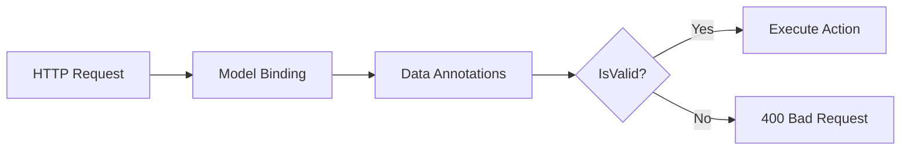

# How to Fix Model State is Invalid Errors in ASP.NET Core

Author: [nawazdhandala](https://github.com/nawazdhandala)

Tags: .NET, C#, ASP.NET Core, Validation, Model Binding, API, Web Development

Description: Learn how to diagnose and fix "Model state is invalid" errors in ASP.NET Core, understand model validation, and implement proper error handling for API responses.

---

The "Model state is invalid" error is one of the most common issues in ASP.NET Core applications. It occurs when incoming request data fails validation rules. Understanding why this happens and how to handle it properly leads to better user experiences and easier debugging.

## Understanding Model State Validation

Model state validation happens automatically when ASP.NET Core binds request data to action parameters. When validation fails, `ModelState.IsValid` returns false.



## Common Causes of Model State Errors

### 1. Missing Required Fields

```csharp
public class CreateUserRequest
{
    [Required(ErrorMessage = "Name is required")]
    public string Name { get; set; } = string.Empty;

    [Required(ErrorMessage = "Email is required")]
    [EmailAddress(ErrorMessage = "Invalid email format")]
    public string Email { get; set; } = string.Empty;
}

// This request body causes validation failure:
// { "name": "John" }  // Missing email
```

### 2. Type Conversion Failures

```csharp
public class OrderRequest
{
    public int Quantity { get; set; }  // Expects integer
    public decimal Price { get; set; } // Expects decimal
}

// This causes a type conversion error:
// { "quantity": "five", "price": 19.99 }
```

### 3. Null Reference on Non-Nullable Types

```csharp
// In .NET 6+ with nullable reference types enabled
public class ProductRequest
{
    public string Name { get; set; } = null!;  // Not nullable
    public string? Description { get; set; }    // Nullable
}

// { "description": "A great product" }  // Missing name causes error
```

## Viewing Validation Errors

To understand why model state is invalid, inspect the errors:

```csharp
[ApiController]
[Route("api/[controller]")]
public class UsersController : ControllerBase
{
    [HttpPost]
    public IActionResult Create(CreateUserRequest request)
    {
        if (!ModelState.IsValid)
        {
            // Log detailed errors
            var errors = ModelState
                .Where(x => x.Value?.Errors.Count > 0)
                .ToDictionary(
                    kvp => kvp.Key,
                    kvp => kvp.Value!.Errors.Select(e => e.ErrorMessage).ToArray()
                );

            return BadRequest(new { errors });
        }

        // Process valid request
        return Ok();
    }
}
```

## Automatic Validation with [ApiController]

The `[ApiController]` attribute automatically returns 400 responses for invalid models:

```csharp
[ApiController]
[Route("api/[controller]")]
public class ProductsController : ControllerBase
{
    [HttpPost]
    public IActionResult Create(ProductRequest request)
    {
        // With [ApiController], this code never runs if model is invalid
        // ASP.NET Core automatically returns 400 with validation errors
        return Created($"/api/products/{request.Id}", request);
    }
}
```

## Customizing Validation Error Responses

Override the default validation response format:

```csharp
builder.Services.AddControllers()
    .ConfigureApiBehaviorOptions(options =>
    {
        options.InvalidModelStateResponseFactory = context =>
        {
            var errors = context.ModelState
                .Where(e => e.Value?.Errors.Count > 0)
                .SelectMany(e => e.Value!.Errors.Select(error => new
                {
                    field = e.Key,
                    message = string.IsNullOrEmpty(error.ErrorMessage)
                        ? error.Exception?.Message
                        : error.ErrorMessage
                }))
                .ToList();

            var response = new
            {
                type = "ValidationError",
                title = "One or more validation errors occurred",
                status = 400,
                errors
            };

            return new BadRequestObjectResult(response);
        };
    });
```

## Data Annotation Validators

Use built-in validation attributes effectively:

```csharp
public class RegistrationRequest
{
    [Required(ErrorMessage = "Username is required")]
    [StringLength(50, MinimumLength = 3, ErrorMessage = "Username must be 3-50 characters")]
    [RegularExpression(@"^[a-zA-Z0-9_]+$", ErrorMessage = "Username can only contain letters, numbers, and underscores")]
    public string Username { get; set; } = string.Empty;

    [Required(ErrorMessage = "Email is required")]
    [EmailAddress(ErrorMessage = "Invalid email format")]
    public string Email { get; set; } = string.Empty;

    [Required(ErrorMessage = "Password is required")]
    [MinLength(8, ErrorMessage = "Password must be at least 8 characters")]
    [DataType(DataType.Password)]
    public string Password { get; set; } = string.Empty;

    [Compare(nameof(Password), ErrorMessage = "Passwords do not match")]
    public string ConfirmPassword { get; set; } = string.Empty;

    [Range(18, 120, ErrorMessage = "Age must be between 18 and 120")]
    public int Age { get; set; }

    [Url(ErrorMessage = "Invalid URL format")]
    public string? Website { get; set; }

    [Phone(ErrorMessage = "Invalid phone number")]
    public string? PhoneNumber { get; set; }
}
```

## Custom Validation Attributes

Create custom validators for complex rules:

```csharp
public class FutureDateAttribute : ValidationAttribute
{
    protected override ValidationResult? IsValid(object? value, ValidationContext validationContext)
    {
        if (value is DateTime dateTime)
        {
            if (dateTime <= DateTime.UtcNow)
            {
                return new ValidationResult(ErrorMessage ?? "Date must be in the future");
            }
        }

        return ValidationResult.Success;
    }
}

public class AllowedValuesAttribute : ValidationAttribute
{
    private readonly string[] _allowedValues;

    public AllowedValuesAttribute(params string[] allowedValues)
    {
        _allowedValues = allowedValues;
    }

    protected override ValidationResult? IsValid(object? value, ValidationContext validationContext)
    {
        if (value is string stringValue)
        {
            if (!_allowedValues.Contains(stringValue, StringComparer.OrdinalIgnoreCase))
            {
                return new ValidationResult(
                    ErrorMessage ?? $"Value must be one of: {string.Join(", ", _allowedValues)}");
            }
        }

        return ValidationResult.Success;
    }
}

// Usage
public class EventRequest
{
    [FutureDate(ErrorMessage = "Event date must be in the future")]
    public DateTime EventDate { get; set; }

    [AllowedValues("online", "in-person", "hybrid")]
    public string EventType { get; set; } = string.Empty;
}
```

## IValidatableObject for Complex Validation

Implement cross-property validation:

```csharp
public class DateRangeRequest : IValidatableObject
{
    [Required]
    public DateTime StartDate { get; set; }

    [Required]
    public DateTime EndDate { get; set; }

    public IEnumerable<ValidationResult> Validate(ValidationContext validationContext)
    {
        if (EndDate <= StartDate)
        {
            yield return new ValidationResult(
                "End date must be after start date",
                new[] { nameof(EndDate) });
        }

        if ((EndDate - StartDate).TotalDays > 365)
        {
            yield return new ValidationResult(
                "Date range cannot exceed 365 days",
                new[] { nameof(StartDate), nameof(EndDate) });
        }
    }
}
```

## FluentValidation for Complex Scenarios

For more complex validation, use FluentValidation:

```bash
dotnet add package FluentValidation.AspNetCore
```

```csharp
public class CreateOrderRequest
{
    public int CustomerId { get; set; }
    public List<OrderItemRequest> Items { get; set; } = new();
    public string ShippingAddress { get; set; } = string.Empty;
}

public class OrderItemRequest
{
    public int ProductId { get; set; }
    public int Quantity { get; set; }
}

public class CreateOrderRequestValidator : AbstractValidator<CreateOrderRequest>
{
    public CreateOrderRequestValidator()
    {
        RuleFor(x => x.CustomerId)
            .GreaterThan(0)
            .WithMessage("Valid customer ID is required");

        RuleFor(x => x.Items)
            .NotEmpty()
            .WithMessage("Order must contain at least one item");

        RuleForEach(x => x.Items).SetValidator(new OrderItemValidator());

        RuleFor(x => x.ShippingAddress)
            .NotEmpty()
            .MaximumLength(500);
    }
}

public class OrderItemValidator : AbstractValidator<OrderItemRequest>
{
    public OrderItemValidator()
    {
        RuleFor(x => x.ProductId)
            .GreaterThan(0);

        RuleFor(x => x.Quantity)
            .InclusiveBetween(1, 100)
            .WithMessage("Quantity must be between 1 and 100");
    }
}
```

Register FluentValidation:

```csharp
builder.Services.AddControllers();
builder.Services.AddValidatorsFromAssemblyContaining<CreateOrderRequestValidator>();
builder.Services.AddFluentValidationAutoValidation();
```

## Handling Null Models

Sometimes the entire model is null:

```csharp
[HttpPost]
public IActionResult Create([FromBody] CreateUserRequest? request)
{
    if (request == null)
    {
        return BadRequest(new { error = "Request body is required" });
    }

    if (!ModelState.IsValid)
    {
        return BadRequest(ModelState);
    }

    // Process request
    return Ok();
}
```

## Debugging Model Binding Issues

Add logging to understand binding problems:

```csharp
builder.Services.AddControllers(options =>
{
    options.ModelBindingMessageProvider.SetValueMustNotBeNullAccessor(
        _ => "The field is required.");

    options.ModelBindingMessageProvider.SetAttemptedValueIsInvalidAccessor(
        (value, fieldName) => $"The value '{value}' is not valid for {fieldName}.");

    options.ModelBindingMessageProvider.SetMissingKeyOrValueAccessor(
        () => "A value is required.");
});
```

## Testing Validation

Write tests to verify validation rules:

```csharp
public class CreateUserRequestTests
{
    [Fact]
    public void Should_Fail_When_Email_Missing()
    {
        var request = new CreateUserRequest
        {
            Name = "John Doe"
            // Email missing
        };

        var context = new ValidationContext(request);
        var results = new List<ValidationResult>();

        var isValid = Validator.TryValidateObject(request, context, results, true);

        Assert.False(isValid);
        Assert.Contains(results, r => r.MemberNames.Contains("Email"));
    }

    [Fact]
    public void Should_Fail_When_Email_Invalid()
    {
        var request = new CreateUserRequest
        {
            Name = "John Doe",
            Email = "not-an-email"
        };

        var context = new ValidationContext(request);
        var results = new List<ValidationResult>();

        var isValid = Validator.TryValidateObject(request, context, results, true);

        Assert.False(isValid);
        Assert.Contains(results, r => r.ErrorMessage!.Contains("Invalid email"));
    }
}
```

## Summary

| Issue | Solution |
|-------|----------|
| **Missing required fields** | Add `[Required]` attribute with clear messages |
| **Type conversion errors** | Use correct types or custom model binders |
| **Complex validation** | Implement `IValidatableObject` or use FluentValidation |
| **Custom error format** | Configure `InvalidModelStateResponseFactory` |
| **Debugging** | Log ModelState errors with field names |

Model state validation is your first line of defense against invalid data. Implementing it properly with clear error messages improves API usability and helps clients fix their requests quickly.
