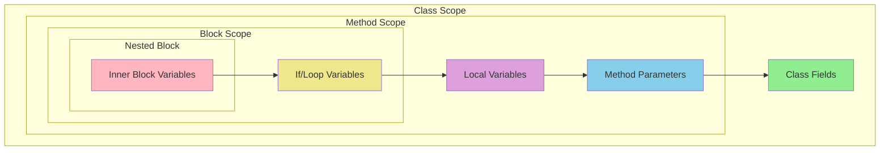

# How to Fix "The name does not exist in current context" in C#

Author: [nawazdhandala](https://github.com/nawazdhandala)

Tags: C#, .NET, Debugging, Compiler Errors, Scope, Namespaces

Description: Learn how to diagnose and fix the CS0103 "The name does not exist in the current context" error in C#. This guide covers common causes including scope issues, missing usings, and typos.

---

The "The name does not exist in the current context" error (CS0103) is a common compiler error in C#. It means the compiler cannot find a variable, method, type, or namespace that you are trying to use. This guide covers all common causes and their solutions.

## Understanding the Error

This error occurs when the compiler encounters an identifier it cannot resolve:

```csharp
// Error CS0103: The name 'userName' does not exist in the current context
Console.WriteLine(userName);
```

## Common Causes and Solutions

### 1. Missing Using Directives

The most common cause is a missing `using` statement for a namespace.

```csharp
// PROBLEM: Missing using directive
public class UserService
{
    public async Task<List<User>> GetUsersAsync()
    {
        // Error: 'List' does not exist in current context
        // Error: 'Task' does not exist in current context
        return new List<User>();
    }
}

// SOLUTION: Add required using directives
using System;
using System.Collections.Generic;
using System.Threading.Tasks;

public class UserService
{
    public async Task<List<User>> GetUsersAsync()
    {
        return new List<User>(); // Works now
    }
}
```

### 2. Variable Scope Issues

Variables are only accessible within their declaring scope.

```csharp
// PROBLEM: Variable declared in inner scope
public void ProcessOrder(Order order)
{
    if (order.IsValid)
    {
        var discount = CalculateDiscount(order);
    }

    // Error: 'discount' does not exist in current context
    order.Total -= discount;
}

// SOLUTION: Declare variable in appropriate scope
public void ProcessOrder(Order order)
{
    decimal discount = 0;

    if (order.IsValid)
    {
        discount = CalculateDiscount(order);
    }

    order.Total -= discount; // Works now
}
```

### 3. Variable Declaration Order

Variables must be declared before use.

```csharp
// PROBLEM: Using variable before declaration
public void ProcessData()
{
    Console.WriteLine(result); // Error: 'result' does not exist
    var result = CalculateResult();
}

// SOLUTION: Declare before use
public void ProcessData()
{
    var result = CalculateResult();
    Console.WriteLine(result); // Works now
}
```

### 4. Typos and Case Sensitivity

C# is case-sensitive - check spelling carefully.

```csharp
public class OrderService
{
    private readonly IOrderRepository _orderRepository;

    public void ProcessOrder(int orderId)
    {
        // Error: '_OrderRepository' - wrong case
        var order = _OrderRepository.GetById(orderId);

        // Error: 'orderrepository' - wrong case
        var order = orderrepository.GetById(orderId);

        // Correct: matches declaration exactly
        var order = _orderRepository.GetById(orderId);
    }
}
```

### 5. Missing Class Members

Trying to access a member that does not exist on the type.

```csharp
public class Order
{
    public int Id { get; set; }
    public decimal Total { get; set; }
}

public void ProcessOrder(Order order)
{
    // Error: 'Subtotal' does not exist - it's not defined on Order
    var subtotal = order.Subtotal;

    // Correct: use existing property
    var total = order.Total;
}
```

## Scope Visualization



### 6. Static vs Instance Context

Static methods cannot access instance members directly.

```csharp
public class Calculator
{
    private int _precision = 2;

    // Error in static method
    public static double Calculate(double value)
    {
        // Error: '_precision' - instance member in static context
        return Math.Round(value, _precision);
    }

    // SOLUTION 1: Make the field static
    private static int _precision = 2;

    // SOLUTION 2: Pass as parameter
    public static double Calculate(double value, int precision)
    {
        return Math.Round(value, precision);
    }

    // SOLUTION 3: Use instance method
    public double Calculate(double value)
    {
        return Math.Round(value, _precision);
    }
}
```

### 7. Lambda and Closure Scope

```csharp
public void ProcessItems(List<Item> items)
{
    // PROBLEM: Variable not in scope
    items.ForEach(item =>
    {
        var processed = Process(item);
    });

    // Error: 'processed' does not exist here
    Console.WriteLine(processed);

    // SOLUTION: Declare outside if needed
    var results = new List<Item>();
    items.ForEach(item =>
    {
        results.Add(Process(item));
    });

    // Or use LINQ
    var processed = items.Select(item => Process(item)).ToList();
}
```

### 8. Conditional Compilation

Code might be excluded by preprocessor directives.

```csharp
public void LogDebugInfo(string message)
{
    #if DEBUG
    var debugLogger = new DebugLogger();
    #endif

    // Error: 'debugLogger' might not exist (Release build)
    debugLogger.Log(message);

    // SOLUTION: Keep usage inside the same directive
    #if DEBUG
    var debugLogger = new DebugLogger();
    debugLogger.Log(message);
    #endif
}
```

### 9. Missing Project References

Types from other projects need proper references.

```csharp
// If 'UserDto' is in a different project
// PROBLEM: Missing project reference
public UserDto GetUser(int id) // Error: 'UserDto' does not exist
{
    return new UserDto();
}

// SOLUTION: Add project reference in .csproj
// <ProjectReference Include="..\Common\Common.csproj" />

// Then add using
using Common.Dtos;
```

### 10. Generic Type Parameters

```csharp
// PROBLEM: Using undeclared type parameter
public class Repository
{
    public T GetById(int id) // Error: 'T' does not exist
    {
        return default;
    }
}

// SOLUTION: Declare generic type parameter
public class Repository<T>
{
    public T GetById(int id)
    {
        return default;
    }
}

// Or on method
public class Repository
{
    public T GetById<T>(int id)
    {
        return default;
    }
}
```

## Quick Diagnostic Checklist

```csharp
// When you see "The name 'X' does not exist in the current context":

// 1. Check spelling and case
//    Is 'userName' spelled correctly? Should it be 'UserName'?

// 2. Check using directives
//    Do you have: using System.Collections.Generic;

// 3. Check scope
//    Is the variable declared in an accessible scope?

// 4. Check declaration order
//    Is the variable declared before this line?

// 5. Check static context
//    Are you in a static method trying to use instance members?

// 6. Check project references
//    Is the type in another project that needs to be referenced?

// 7. Check NuGet packages
//    Does the type come from a NuGet package that needs to be installed?

// 8. Check conditional compilation
//    Is the code inside #if directives?
```

## IDE Features That Help

### Visual Studio / Rider Quick Fixes

```csharp
// When you see the error, look for:
// - Light bulb icon (VS) or Alt+Enter (Rider)
// - "Add using directive" option
// - "Generate variable" option
// - "Generate method" option

// Ctrl+. in Visual Studio shows quick fixes
// Alt+Enter in Rider shows context actions
```

### Global Usings (C# 10+)

Reduce missing using errors with global usings:

```csharp
// GlobalUsings.cs
global using System;
global using System.Collections.Generic;
global using System.Linq;
global using System.Threading.Tasks;
global using Microsoft.Extensions.Logging;

// Or in .csproj
<ItemGroup>
  <Using Include="System.Collections.Generic" />
  <Using Include="System.Linq" />
</ItemGroup>
```

## Best Practices Summary

| Issue | Solution |
|-------|----------|
| **Missing using** | Add using directive or use fully qualified name |
| **Scope issue** | Move declaration to appropriate scope |
| **Typo** | Check spelling and case sensitivity |
| **Static context** | Use static members or change to instance method |
| **Missing reference** | Add project or NuGet reference |
| **Declaration order** | Declare before use |

## Conclusion

The "name does not exist in current context" error is usually straightforward to fix once you identify the cause. Check your using directives first, then verify variable scope and spelling. Use IDE quick fixes to automatically add missing usings and generate missing members. Global usings in C# 10+ can help reduce these errors for commonly used namespaces.
