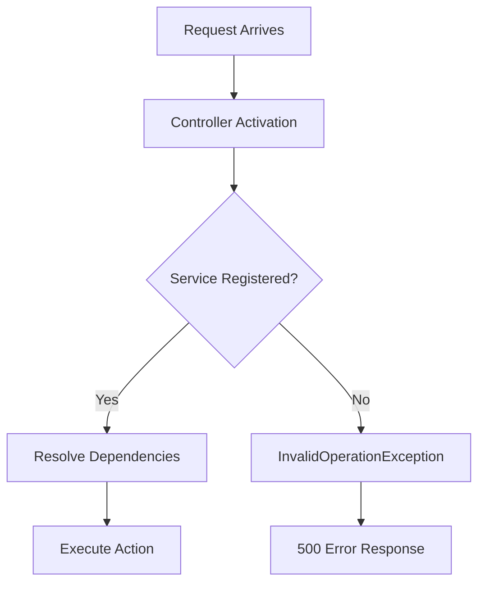

# How to Fix "No service for type" Dependency Injection Errors

Author: [nawazdhandala](https://www.github.com/nawazdhandala)

Tags: .NET, C#, Dependency Injection, ASP.NET Core, Troubleshooting, Common Issues

Description: Learn how to diagnose and fix the common "No service for type" dependency injection error in .NET applications. This guide covers registration patterns, common mistakes, and debugging techniques for DI container issues.

The "No service for type" error is one of the most common issues developers encounter when working with dependency injection in .NET. This error occurs when you try to resolve a service that hasn't been registered in the DI container. Let's explore the causes and solutions for this frustrating problem.

## Understanding the Error

When you see an error like this:

```
System.InvalidOperationException: No service for type 'MyApplication.Services.IUserService' has been registered.
```

It means the DI container cannot find a registration for the requested type. This typically happens during:

- Controller construction
- Service resolution via `IServiceProvider`
- Middleware activation
- Background service startup



## Common Causes and Solutions

### 1. Missing Service Registration

The most common cause is simply forgetting to register the service:

```csharp
// The interface
public interface IUserService
{
    Task<User> GetUserAsync(int id);
}

// The implementation
public class UserService : IUserService
{
    public async Task<User> GetUserAsync(int id)
    {
        // Implementation
    }
}
```

**Fix**: Register the service in `Program.cs`:

```csharp
var builder = WebApplication.CreateBuilder(args);

// Register the service
builder.Services.AddScoped<IUserService, UserService>();

var app = builder.Build();
```

### 2. Registering the Wrong Type

A subtle mistake is registering the concrete type instead of the interface:

```csharp
// WRONG - registers concrete type only
builder.Services.AddScoped<UserService>();

// Controller expects the interface
public class UsersController : ControllerBase
{
    // This will fail!
    public UsersController(IUserService userService) { }
}
```

**Fix**: Register with the interface:

```csharp
// CORRECT - registers interface with implementation
builder.Services.AddScoped<IUserService, UserService>();
```

### 3. Missing Dependency in the Chain

When a service has its own dependencies that aren't registered:

```csharp
public class UserService : IUserService
{
    private readonly IUserRepository _repository;
    private readonly IEmailService _emailService;

    public UserService(IUserRepository repository, IEmailService emailService)
    {
        _repository = repository;
        _emailService = emailService;
    }
}
```

**Fix**: Register all dependencies:

```csharp
// Register the entire dependency chain
builder.Services.AddScoped<IUserRepository, UserRepository>();
builder.Services.AddScoped<IEmailService, EmailService>();
builder.Services.AddScoped<IUserService, UserService>();
```

### 4. Generic Type Registration Issues

Generic interfaces require special registration:

```csharp
public interface IRepository<T> where T : class
{
    Task<T> GetByIdAsync(int id);
}

public class Repository<T> : IRepository<T> where T : class
{
    // Implementation
}
```

**Fix**: Use open generics:

```csharp
// Register open generic type
builder.Services.AddScoped(typeof(IRepository<>), typeof(Repository<>));

// Now you can inject IRepository<User>, IRepository<Order>, etc.
```

### 5. Wrong Lifetime Scope

Attempting to inject a scoped service into a singleton can cause issues:

```csharp
// Singleton service
public class CacheService : ICacheService
{
    private readonly IDbContext _context; // Scoped service

    public CacheService(IDbContext context) // This will fail!
    {
        _context = context;
    }
}
```

**Fix**: Match lifetimes or use `IServiceScopeFactory`:

```csharp
public class CacheService : ICacheService
{
    private readonly IServiceScopeFactory _scopeFactory;

    public CacheService(IServiceScopeFactory scopeFactory)
    {
        _scopeFactory = scopeFactory;
    }

    public async Task<Data> GetDataAsync()
    {
        using var scope = _scopeFactory.CreateScope();
        var context = scope.ServiceProvider.GetRequiredService<IDbContext>();
        return await context.Data.FirstOrDefaultAsync();
    }
}
```

### 6. Assembly Scanning Not Finding Types

When using automatic registration, types might not be discovered:

```csharp
// Using Scrutor for assembly scanning
builder.Services.Scan(scan => scan
    .FromAssemblyOf<IUserService>()
    .AddClasses(classes => classes.AssignableTo<IUserService>())
    .AsImplementedInterfaces()
    .WithScopedLifetime());
```

**Fix**: Ensure assemblies are correctly referenced and classes are public:

```csharp
// Make sure classes are public
public class UserService : IUserService { }

// Verify the assembly is being scanned
builder.Services.Scan(scan => scan
    .FromAssemblies(
        typeof(IUserService).Assembly,
        typeof(UserService).Assembly) // Explicitly include implementation assembly
    .AddClasses(classes => classes.AssignableTo<IUserService>())
    .AsImplementedInterfaces()
    .WithScopedLifetime());
```

## Debugging Techniques

### 1. List All Registered Services

Create a diagnostic endpoint to see what's registered:

```csharp
app.MapGet("/debug/services", (IServiceCollection services) =>
{
    var registeredServices = services
        .Where(s => s.ServiceType.Namespace?.StartsWith("MyApplication") == true)
        .Select(s => new
        {
            Service = s.ServiceType.FullName,
            Implementation = s.ImplementationType?.FullName,
            Lifetime = s.Lifetime.ToString()
        })
        .ToList();

    return Results.Ok(registeredServices);
});
```

### 2. Validate Services at Startup

Enable service validation to catch issues early:

```csharp
var builder = WebApplication.CreateBuilder(args);

// Enable scope validation in development
if (builder.Environment.IsDevelopment())
{
    builder.Host.UseDefaultServiceProvider(options =>
    {
        options.ValidateScopes = true;
        options.ValidateOnBuild = true;
    });
}
```

### 3. Use Extension Methods for Registration

Organize registrations with extension methods:

```csharp
public static class ServiceCollectionExtensions
{
    public static IServiceCollection AddApplicationServices(
        this IServiceCollection services)
    {
        services.AddScoped<IUserService, UserService>();
        services.AddScoped<IOrderService, OrderService>();
        services.AddScoped<IProductService, ProductService>();

        return services;
    }

    public static IServiceCollection AddRepositories(
        this IServiceCollection services)
    {
        services.AddScoped<IUserRepository, UserRepository>();
        services.AddScoped<IOrderRepository, OrderRepository>();
        services.AddScoped<IProductRepository, ProductRepository>();

        return services;
    }
}

// In Program.cs
builder.Services.AddApplicationServices();
builder.Services.AddRepositories();
```

### 4. Check for Typos in Namespaces

Ensure you're using the correct interface from the right namespace:

```csharp
// You might have multiple interfaces with the same name
using MyApplication.Services; // Correct namespace
// NOT: using MyApplication.Contracts; // Wrong namespace

public class UsersController : ControllerBase
{
    public UsersController(IUserService userService) { }
}
```

## Advanced Scenarios

### Keyed Services (.NET 8+)

.NET 8 introduced keyed services for registering multiple implementations:

```csharp
// Register with keys
builder.Services.AddKeyedScoped<IPaymentProcessor, StripeProcessor>("stripe");
builder.Services.AddKeyedScoped<IPaymentProcessor, PayPalProcessor>("paypal");

// Inject with key
public class PaymentService
{
    public PaymentService(
        [FromKeyedServices("stripe")] IPaymentProcessor stripeProcessor,
        [FromKeyedServices("paypal")] IPaymentProcessor paypalProcessor)
    {
    }
}
```

### Factory-Based Registration

For complex construction logic:

```csharp
builder.Services.AddScoped<IUserService>(provider =>
{
    var config = provider.GetRequiredService<IConfiguration>();
    var logger = provider.GetRequiredService<ILogger<UserService>>();
    var connectionString = config.GetConnectionString("Default");

    return new UserService(connectionString, logger);
});
```

### Conditional Registration

Register services based on configuration:

```csharp
if (builder.Configuration.GetValue<bool>("UseRedisCache"))
{
    builder.Services.AddSingleton<ICacheService, RedisCacheService>();
}
else
{
    builder.Services.AddSingleton<ICacheService, MemoryCacheService>();
}
```

### Decorator Pattern

Wrap services with decorators:

```csharp
// Register base service
builder.Services.AddScoped<IUserService, UserService>();

// Decorate with caching
builder.Services.Decorate<IUserService, CachedUserService>();

// Decorate with logging
builder.Services.Decorate<IUserService, LoggingUserService>();

// Resolution order: LoggingUserService -> CachedUserService -> UserService
```

## Prevention Checklist

Use this checklist to prevent DI errors:

```csharp
public static class StartupChecklist
{
    public static void ValidateServices(IServiceProvider services)
    {
        var requiredServices = new[]
        {
            typeof(IUserService),
            typeof(IOrderService),
            typeof(IProductService),
            typeof(IUserRepository),
            // Add all critical services
        };

        var missing = requiredServices
            .Where(type => services.GetService(type) == null)
            .ToList();

        if (missing.Any())
        {
            throw new InvalidOperationException(
                $"Missing service registrations: {string.Join(", ", missing.Select(t => t.Name))}");
        }
    }
}

// Call during startup
var app = builder.Build();
StartupChecklist.ValidateServices(app.Services);
```

## Common Framework Services

Don't forget to register framework services:

```csharp
// HTTP client
builder.Services.AddHttpClient();

// Memory cache
builder.Services.AddMemoryCache();

// DbContext
builder.Services.AddDbContext<ApplicationDbContext>(options =>
    options.UseSqlServer(connectionString));

// AutoMapper
builder.Services.AddAutoMapper(typeof(Program));

// MediatR
builder.Services.AddMediatR(cfg =>
    cfg.RegisterServicesFromAssembly(typeof(Program).Assembly));
```

## Conclusion

The "No service for type" error is almost always caused by a missing or incorrect service registration. By following these practices, you can quickly diagnose and fix these issues:

1. **Verify registration**: Ensure the service is registered with the correct interface
2. **Check the dependency chain**: All dependencies must also be registered
3. **Match lifetimes**: Scoped services cannot be injected into singletons directly
4. **Use validation**: Enable scope and build-time validation in development
5. **Organize registrations**: Use extension methods to keep registrations organized
6. **Test early**: Validate critical services at application startup

With proper service registration practices and debugging techniques, you'll spend less time fighting DI container issues and more time building features.
