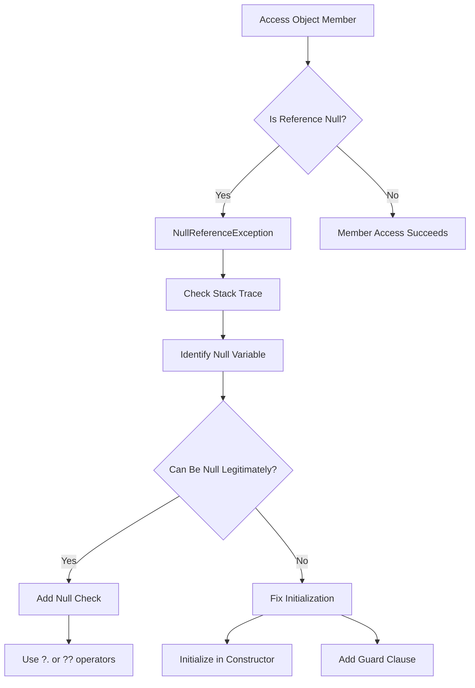

# How to Fix 'Object reference not set to an instance' in C#

Author: [nawazdhandala](https://github.com/nawazdhandala)

Tags: C#, .NET, Debugging, NullReferenceException, Error Handling

Description: Learn how to diagnose, fix, and prevent the infamous NullReferenceException in C#. This guide covers common causes, debugging techniques, and modern C# features like nullable reference types.

---

The "Object reference not set to an instance of an object" error, also known as `NullReferenceException`, is one of the most common errors in C# development. This exception occurs when you try to use a reference variable that points to null - essentially trying to access something that does not exist.

## Understanding NullReferenceException

When you declare a reference type variable in C#, it does not automatically point to an object. Until you assign it a value, it contains `null`. Attempting to access any member of a null reference throws this exception.

```csharp
// This will throw NullReferenceException
string name = null;
int length = name.Length; // Boom! NullReferenceException
```

## Common Causes and Solutions

### 1. Uninitialized Variables

The most straightforward cause is forgetting to initialize a variable.

```csharp
// Problem
public class UserService
{
    private IUserRepository _repository; // Not initialized!

    public User GetUser(int id)
    {
        return _repository.FindById(id); // NullReferenceException
    }
}

// Solution: Initialize in constructor
public class UserService
{
    private readonly IUserRepository _repository;

    public UserService(IUserRepository repository)
    {
        _repository = repository ?? throw new ArgumentNullException(nameof(repository));
    }

    public User GetUser(int id)
    {
        return _repository.FindById(id); // Safe now
    }
}
```

### 2. Method Return Values

Methods may return null, and you need to handle this possibility.

```csharp
// Problem
public void ProcessOrder(int orderId)
{
    var order = _orderRepository.FindById(orderId);
    var customerName = order.Customer.Name; // Could be null at multiple points!
}

// Solution: Check for null at each level
public void ProcessOrder(int orderId)
{
    var order = _orderRepository.FindById(orderId);

    if (order == null)
    {
        throw new OrderNotFoundException(orderId);
    }

    if (order.Customer == null)
    {
        throw new InvalidOperationException("Order has no associated customer");
    }

    var customerName = order.Customer.Name;
}
```

### 3. Collection Elements

Accessing elements in collections can return null.

```csharp
// Problem
var users = await _context.Users.ToListAsync();
var firstUser = users.FirstOrDefault();
var email = firstUser.Email; // firstUser might be null!

// Solution: Use null-conditional operator or explicit check
var email = firstUser?.Email; // Returns null if firstUser is null

// Or with explicit check
var firstUser = users.FirstOrDefault();
if (firstUser != null)
{
    var email = firstUser.Email;
}
```

### 4. Event Handlers

Events are null until someone subscribes.

```csharp
// Problem
public event EventHandler<OrderEventArgs> OrderCreated;

public void CreateOrder(Order order)
{
    // Process order...
    OrderCreated.Invoke(this, new OrderEventArgs(order)); // Could be null!
}

// Solution: Use null-conditional operator
public void CreateOrder(Order order)
{
    // Process order...
    OrderCreated?.Invoke(this, new OrderEventArgs(order)); // Safe
}
```

## Modern C# Solutions

### Nullable Reference Types (C# 8.0+)

Enable nullable reference types to get compiler warnings about potential null references.

```csharp
// Enable in project file
// <Nullable>enable</Nullable>

public class OrderService
{
    // Compiler warns if you don't initialize this
    private readonly IOrderRepository _repository;

    // The ? indicates this can be null
    public Order? GetOrder(int id)
    {
        return _repository.FindById(id);
    }

    public void ProcessOrder(int id)
    {
        Order? order = GetOrder(id);

        // Compiler warns here - order might be null
        // var name = order.Name; // Warning CS8602

        // Must handle the null case
        if (order != null)
        {
            var name = order.Name; // Safe
        }
    }
}
```

### Null-Coalescing Operators

Use `??` and `??=` for cleaner null handling.

```csharp
// Provide default value if null
string name = user?.Name ?? "Unknown";

// Assign only if null
private List<Order>? _cachedOrders;

public List<Order> GetOrders()
{
    _cachedOrders ??= _repository.GetAllOrders().ToList();
    return _cachedOrders;
}
```

### Pattern Matching

C# pattern matching provides elegant null checking.

```csharp
public decimal CalculateDiscount(Customer? customer)
{
    return customer switch
    {
        null => 0m,
        { IsPremium: true } => 0.2m,
        { OrderCount: > 10 } => 0.1m,
        _ => 0.05m
    };
}

// Or with is pattern
if (order?.Customer is Customer customer)
{
    // customer is guaranteed non-null here
    ProcessCustomer(customer);
}
```

## Debugging Techniques

### 1. Stack Trace Analysis

The stack trace tells you exactly where the exception occurred.

```
System.NullReferenceException: Object reference not set to an instance of an object.
   at OrderService.ProcessOrder(Int32 orderId) in OrderService.cs:line 45
   at OrderController.Create(OrderRequest request) in OrderController.cs:line 23
```

Look at line 45 in OrderService.cs and examine what could be null on that line.

### 2. Use Debugger Watches

Set breakpoints and inspect variables before the exception occurs. Check each part of a chain:

```csharp
// If this line throws:
var city = order.Customer.Address.City;

// Check each part:
// - Is order null?
// - Is order.Customer null?
// - Is order.Customer.Address null?
```

### 3. Add Logging

Add defensive logging to help diagnose issues in production.

```csharp
public void ProcessOrder(int orderId)
{
    _logger.LogDebug("Processing order {OrderId}", orderId);

    var order = _orderRepository.FindById(orderId);

    if (order == null)
    {
        _logger.LogWarning("Order {OrderId} not found", orderId);
        throw new OrderNotFoundException(orderId);
    }

    _logger.LogDebug("Found order {OrderId} with {ItemCount} items",
        orderId, order.Items?.Count ?? 0);
}
```

## Prevention Strategies

### Guard Clauses

Validate inputs at the beginning of methods.

```csharp
public class OrderProcessor
{
    public void Process(Order order, Customer customer)
    {
        ArgumentNullException.ThrowIfNull(order);
        ArgumentNullException.ThrowIfNull(customer);

        // Now safe to use order and customer
    }
}
```

### Required Properties (C# 11+)

Use the `required` modifier to ensure properties are initialized.

```csharp
public class Order
{
    public required int Id { get; init; }
    public required string CustomerName { get; init; }
    public required List<OrderItem> Items { get; init; }
}

// Compiler error if you don't set required properties
var order = new Order
{
    Id = 1,
    CustomerName = "John",
    Items = new List<OrderItem>()
};
```

### Initialize Collections

Always initialize collection properties to avoid null.

```csharp
public class Order
{
    public int Id { get; set; }
    public List<OrderItem> Items { get; set; } = new(); // Never null
    public Dictionary<string, string> Metadata { get; set; } = new();
}
```

## Diagram: Null Reference Flow



## Best Practices Summary

| Practice | Description |
|----------|-------------|
| **Enable Nullable Reference Types** | Get compile-time warnings |
| **Use Guard Clauses** | Validate inputs early |
| **Initialize Collections** | Use `= new()` for collections |
| **Prefer ?. and ??** | Cleaner null handling |
| **Required Properties** | Force initialization |
| **Defensive Logging** | Help diagnose production issues |

## Conclusion

NullReferenceException is preventable with proper coding practices. Enable nullable reference types in your projects, use guard clauses, and leverage modern C# features like null-conditional operators and pattern matching. These practices will significantly reduce null-related bugs and make your code more robust and maintainable.
