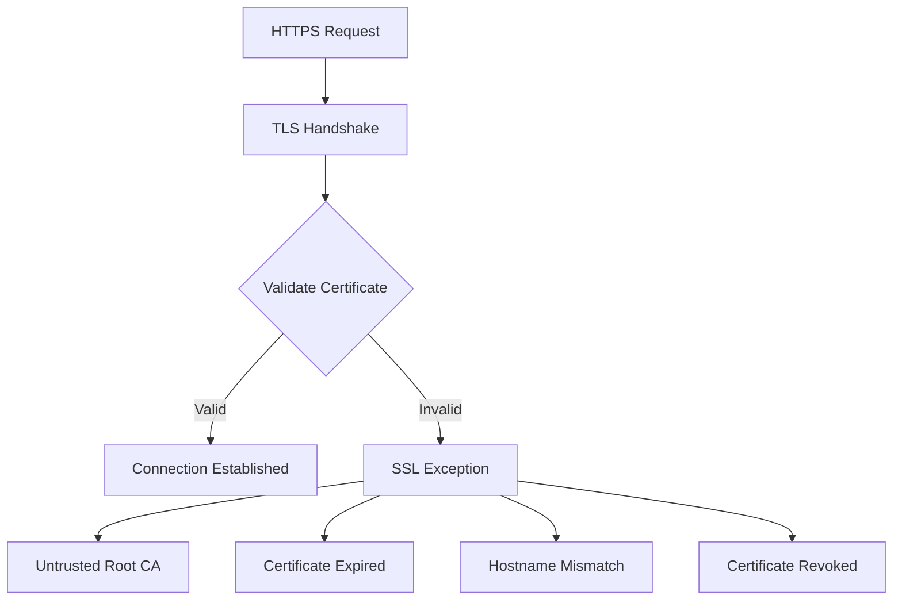

# How to Fix SSL Certificate Problem Errors in .NET

Author: [nawazdhandala](https://github.com/nawazdhandala)

Tags: .NET, C#, SSL, TLS, Security, HttpClient, Certificates

Description: Learn how to diagnose and fix SSL certificate errors in .NET applications. Covers certificate validation, trust issues, and proper configuration for secure HTTPS communication.

---

SSL certificate errors are common when making HTTPS requests in .NET applications. These errors occur when the certificate chain cannot be validated, the certificate has expired, or the hostname does not match. Understanding how to properly handle these issues is crucial for secure applications.

## Understanding SSL Certificate Errors

SSL/TLS errors occur during the certificate validation process. The most common errors include untrusted certificates, expired certificates, and hostname mismatches.



## Common Error Messages

Typical SSL certificate error messages in .NET:

```
System.Net.Http.HttpRequestException: The SSL connection could not be established, see inner exception.
---> System.Security.Authentication.AuthenticationException: The remote certificate is invalid according to the validation procedure.
```

```
The remote certificate is invalid because of errors in the certificate chain: UntrustedRoot
```

```
The remote certificate is invalid because of errors in the certificate chain: NotTimeValid
```

## Cause 1: Self-Signed Certificates in Development

In development, you often encounter self-signed certificates. For development only, you can bypass validation:

```csharp
// WARNING: Only for development - never use in production!
var handler = new HttpClientHandler
{
    ServerCertificateCustomValidationCallback =
        HttpClientHandler.DangerousAcceptAnyServerCertificateValidator
};

var httpClient = new HttpClient(handler);
```

Better approach - trust specific certificates:

```csharp
var handler = new HttpClientHandler
{
    ServerCertificateCustomValidationCallback = (message, cert, chain, sslPolicyErrors) =>
    {
        // In development, accept the dev certificate
        if (cert != null && cert.Thumbprint == "YOUR_DEV_CERT_THUMBPRINT")
        {
            return true;
        }

        // Otherwise, use default validation
        return sslPolicyErrors == SslPolicyErrors.None;
    }
};
```

## Cause 2: Missing Intermediate Certificates

If the server does not send the full certificate chain, add the intermediate certificates:

```csharp
var handler = new HttpClientHandler
{
    ServerCertificateCustomValidationCallback = (message, cert, chain, sslPolicyErrors) =>
    {
        if (sslPolicyErrors == SslPolicyErrors.None)
            return true;

        // Check if it is just a chain issue
        if (sslPolicyErrors == SslPolicyErrors.RemoteCertificateChainErrors)
        {
            // Add intermediate certificate
            var intermediateCert = new X509Certificate2("path/to/intermediate.crt");
            chain!.ChainPolicy.ExtraStore.Add(intermediateCert);

            // Rebuild and verify chain
            return chain.Build(cert!);
        }

        return false;
    }
};
```

## Cause 3: Expired Certificates

Handle expired certificates appropriately:

```csharp
var handler = new HttpClientHandler
{
    ServerCertificateCustomValidationCallback = (message, cert, chain, sslPolicyErrors) =>
    {
        if (sslPolicyErrors == SslPolicyErrors.None)
            return true;

        if (cert != null)
        {
            // Log certificate details for debugging
            Console.WriteLine($"Subject: {cert.Subject}");
            Console.WriteLine($"Issuer: {cert.Issuer}");
            Console.WriteLine($"Valid From: {cert.NotBefore}");
            Console.WriteLine($"Valid To: {cert.NotAfter}");
            Console.WriteLine($"Thumbprint: {cert.Thumbprint}");

            // Check specific errors
            foreach (var status in chain?.ChainStatus ?? Array.Empty<X509ChainStatus>())
            {
                Console.WriteLine($"Chain Status: {status.Status} - {status.StatusInformation}");
            }
        }

        return false;
    }
};
```

## Cause 4: Hostname Mismatch

When the certificate does not match the hostname:

```csharp
var handler = new HttpClientHandler
{
    ServerCertificateCustomValidationCallback = (message, cert, chain, sslPolicyErrors) =>
    {
        if (sslPolicyErrors == SslPolicyErrors.None)
            return true;

        if (sslPolicyErrors == SslPolicyErrors.RemoteCertificateNameMismatch)
        {
            // For internal services with known hostnames
            var allowedHosts = new[] { "internal-api.local", "service.internal" };
            var requestHost = message.RequestUri?.Host;

            if (requestHost != null && allowedHosts.Contains(requestHost))
            {
                // Verify the chain is otherwise valid
                return chain?.ChainStatus.All(s =>
                    s.Status == X509ChainStatusFlags.NoError) ?? false;
            }
        }

        return false;
    }
};
```

## Proper Certificate Validation

Implement secure custom validation:

```csharp
public class SecureCertificateValidator
{
    private readonly HashSet<string> _trustedThumbprints;
    private readonly ILogger<SecureCertificateValidator> _logger;

    public SecureCertificateValidator(
        IEnumerable<string> trustedThumbprints,
        ILogger<SecureCertificateValidator> logger)
    {
        _trustedThumbprints = new HashSet<string>(
            trustedThumbprints,
            StringComparer.OrdinalIgnoreCase);
        _logger = logger;
    }

    public bool ValidateCertificate(
        HttpRequestMessage request,
        X509Certificate2? cert,
        X509Chain? chain,
        SslPolicyErrors sslPolicyErrors)
    {
        // If no errors, accept
        if (sslPolicyErrors == SslPolicyErrors.None)
            return true;

        if (cert == null)
        {
            _logger.LogWarning("No certificate provided");
            return false;
        }

        // Check if certificate is in trusted list
        if (_trustedThumbprints.Contains(cert.Thumbprint))
        {
            _logger.LogDebug(
                "Certificate {Thumbprint} is explicitly trusted",
                cert.Thumbprint);
            return true;
        }

        // Log the error details
        _logger.LogWarning(
            "Certificate validation failed for {Host}. " +
            "Errors: {Errors}, Subject: {Subject}, Issuer: {Issuer}",
            request.RequestUri?.Host,
            sslPolicyErrors,
            cert.Subject,
            cert.Issuer);

        return false;
    }
}

// Usage with HttpClientFactory
builder.Services.AddHttpClient("secure-api")
    .ConfigurePrimaryHttpMessageHandler(sp =>
    {
        var validator = sp.GetRequiredService<SecureCertificateValidator>();
        return new HttpClientHandler
        {
            ServerCertificateCustomValidationCallback = validator.ValidateCertificate
        };
    });
```

## Adding Certificates to Trust Store

For trusted internal certificates, add them to the system trust store:

```csharp
// Add certificate to current user store
public void AddTrustedCertificate(string certificatePath)
{
    var cert = new X509Certificate2(certificatePath);

    using var store = new X509Store(StoreName.Root, StoreLocation.CurrentUser);
    store.Open(OpenFlags.ReadWrite);

    if (!store.Certificates.Contains(cert))
    {
        store.Add(cert);
        Console.WriteLine($"Added certificate: {cert.Subject}");
    }

    store.Close();
}
```

For Docker containers, add certificates at build time:

```dockerfile
FROM mcr.microsoft.com/dotnet/aspnet:8.0

# Copy and trust internal CA certificate
COPY certs/internal-ca.crt /usr/local/share/ca-certificates/
RUN update-ca-certificates

COPY --from=build /app/publish .
ENTRYPOINT ["dotnet", "MyApp.dll"]
```

## Client Certificate Authentication

Configure client certificates for mutual TLS:

```csharp
var clientCert = new X509Certificate2(
    "path/to/client.pfx",
    "certificate-password");

var handler = new HttpClientHandler();
handler.ClientCertificates.Add(clientCert);

var httpClient = new HttpClient(handler);
```

With HttpClientFactory:

```csharp
builder.Services.AddHttpClient("mtls-api")
    .ConfigurePrimaryHttpMessageHandler(() =>
    {
        var handler = new HttpClientHandler();

        var cert = new X509Certificate2(
            builder.Configuration["Certificates:ClientCertPath"]!,
            builder.Configuration["Certificates:ClientCertPassword"]);

        handler.ClientCertificates.Add(cert);
        return handler;
    });
```

## Debugging Certificate Issues

Create a diagnostic tool:

```csharp
public class CertificateDiagnostics
{
    public async Task<CertificateInfo> DiagnoseAsync(string url)
    {
        var uri = new Uri(url);
        var info = new CertificateInfo { Url = url };

        var handler = new HttpClientHandler
        {
            ServerCertificateCustomValidationCallback = (message, cert, chain, errors) =>
            {
                if (cert != null)
                {
                    info.Subject = cert.Subject;
                    info.Issuer = cert.Issuer;
                    info.Thumbprint = cert.Thumbprint;
                    info.NotBefore = cert.NotBefore;
                    info.NotAfter = cert.NotAfter;
                    info.IsExpired = DateTime.Now > cert.NotAfter;
                    info.IsNotYetValid = DateTime.Now < cert.NotBefore;
                }

                info.SslPolicyErrors = errors;

                if (chain != null)
                {
                    info.ChainStatus = chain.ChainStatus
                        .Select(s => new ChainStatusInfo
                        {
                            Status = s.Status.ToString(),
                            Information = s.StatusInformation
                        })
                        .ToList();
                }

                return true; // Allow connection for diagnostics
            }
        };

        try
        {
            using var client = new HttpClient(handler);
            client.Timeout = TimeSpan.FromSeconds(10);
            await client.GetAsync(url);
            info.ConnectionSuccessful = true;
        }
        catch (Exception ex)
        {
            info.ConnectionSuccessful = false;
            info.Error = ex.Message;
        }

        return info;
    }
}

public class CertificateInfo
{
    public string Url { get; set; } = string.Empty;
    public string? Subject { get; set; }
    public string? Issuer { get; set; }
    public string? Thumbprint { get; set; }
    public DateTime NotBefore { get; set; }
    public DateTime NotAfter { get; set; }
    public bool IsExpired { get; set; }
    public bool IsNotYetValid { get; set; }
    public SslPolicyErrors SslPolicyErrors { get; set; }
    public List<ChainStatusInfo> ChainStatus { get; set; } = new();
    public bool ConnectionSuccessful { get; set; }
    public string? Error { get; set; }
}
```

## TLS Version Configuration

Ensure proper TLS version is used:

```csharp
// Set minimum TLS version globally
AppContext.SetSwitch("System.Net.Http.UseSocketsHttpHandler", true);

// Or per handler
var handler = new HttpClientHandler
{
    SslProtocols = SslProtocols.Tls12 | SslProtocols.Tls13
};

// In .NET 6+, configure via SocketsHttpHandler for more control
var socketsHandler = new SocketsHttpHandler
{
    SslOptions = new SslClientAuthenticationOptions
    {
        EnabledSslProtocols = SslProtocols.Tls12 | SslProtocols.Tls13,
        CertificateRevocationCheckMode = X509RevocationMode.Online
    }
};
```

## Environment-Specific Configuration

Configure different certificate handling per environment:

```csharp
builder.Services.AddHttpClient("api", client =>
{
    client.BaseAddress = new Uri(builder.Configuration["ApiBaseUrl"]!);
})
.ConfigurePrimaryHttpMessageHandler(() =>
{
    var handler = new HttpClientHandler();

    if (builder.Environment.IsDevelopment())
    {
        // In development, accept dev certificates
        handler.ServerCertificateCustomValidationCallback =
            HttpClientHandler.DangerousAcceptAnyServerCertificateValidator;
    }
    else
    {
        // In production, use strict validation
        handler.ServerCertificateCustomValidationCallback = (msg, cert, chain, errors) =>
        {
            if (errors != SslPolicyErrors.None)
            {
                // Log and reject
                return false;
            }
            return true;
        };
    }

    return handler;
});
```

## Complete Secure Configuration

```csharp
var builder = WebApplication.CreateBuilder(args);

// Load trusted certificate thumbprints from configuration
var trustedThumbprints = builder.Configuration
    .GetSection("TrustedCertificates")
    .Get<string[]>() ?? Array.Empty<string>();

builder.Services.AddSingleton(new SecureCertificateValidator(
    trustedThumbprints,
    builder.Services.BuildServiceProvider().GetRequiredService<ILogger<SecureCertificateValidator>>()));

builder.Services.AddHttpClient("secure-api", client =>
{
    client.BaseAddress = new Uri(builder.Configuration["SecureApi:BaseUrl"]!);
    client.Timeout = TimeSpan.FromSeconds(30);
})
.ConfigurePrimaryHttpMessageHandler(sp =>
{
    var handler = new SocketsHttpHandler
    {
        SslOptions = new SslClientAuthenticationOptions
        {
            EnabledSslProtocols = SslProtocols.Tls12 | SslProtocols.Tls13,
            CertificateRevocationCheckMode = X509RevocationMode.Online
        }
    };

    if (!builder.Environment.IsDevelopment())
    {
        var validator = sp.GetRequiredService<SecureCertificateValidator>();
        handler.SslOptions.RemoteCertificateValidationCallback =
            (sender, cert, chain, errors) =>
                validator.ValidateCertificate(null!, cert as X509Certificate2, chain, errors);
    }

    return handler;
});

var app = builder.Build();
app.Run();
```

## Summary

| Issue | Solution |
|-------|----------|
| **Self-signed cert (dev)** | Trust specific thumbprint or use dev cert |
| **Missing intermediate** | Add to chain policy extra store |
| **Expired certificate** | Renew certificate or contact server admin |
| **Hostname mismatch** | Use correct hostname or configure allowed hosts |
| **Untrusted root CA** | Add CA to trust store |
| **TLS version** | Configure minimum TLS 1.2 |

SSL certificate errors indicate potential security issues. Never bypass validation in production. Instead, properly configure certificates, trust stores, and validation callbacks to maintain secure communication.
