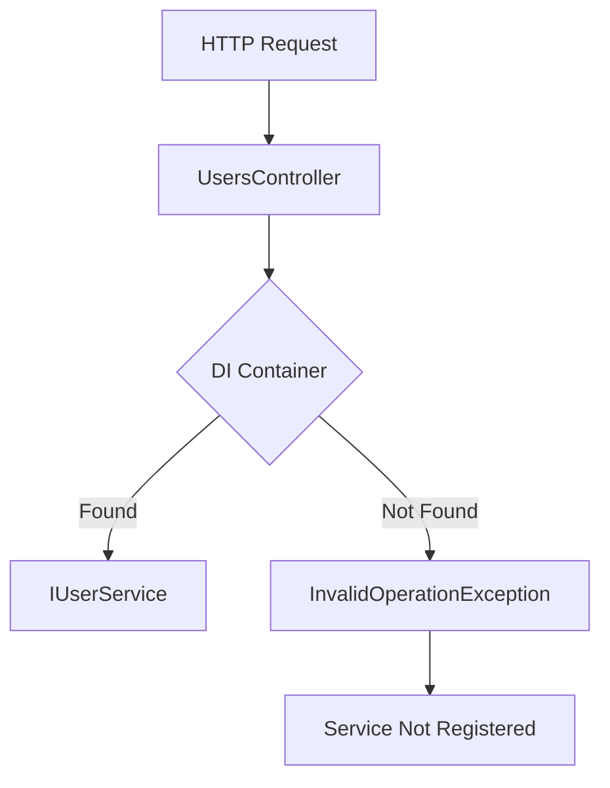

# How to Fix Unable to Resolve Service for Type in ASP.NET Core

Author: [nawazdhandala](https://github.com/nawazdhandala)

Tags: .NET, C#, ASP.NET Core, Dependency Injection, Debugging, Services

Description: Learn how to diagnose and fix the "Unable to resolve service for type" error in ASP.NET Core. Understand dependency injection registration, common causes, and debugging techniques.

---

The "Unable to resolve service for type" error is one of the most common issues when working with dependency injection in ASP.NET Core. This error occurs when the DI container cannot find a registration for a requested service.

## Understanding the Error

The full error message typically looks like this:

```
System.InvalidOperationException: Unable to resolve service for type 'MyApp.Services.IUserService'
while attempting to activate 'MyApp.Controllers.UsersController'.
```

This tells you exactly which service is missing and where it is being requested.



## Common Cause 1: Missing Service Registration

The most common cause is forgetting to register the service:

```csharp
// The service interface and implementation
public interface IUserService
{
    Task<User?> GetByIdAsync(int id);
}

public class UserService : IUserService
{
    public async Task<User?> GetByIdAsync(int id)
    {
        // Implementation
    }
}

// Controller requesting the service
public class UsersController : ControllerBase
{
    private readonly IUserService _userService;

    public UsersController(IUserService userService) // Error: Cannot resolve
    {
        _userService = userService;
    }
}
```

Solution - Register the service in Program.cs:

```csharp
var builder = WebApplication.CreateBuilder(args);

// Register the service
builder.Services.AddScoped<IUserService, UserService>();

builder.Services.AddControllers();

var app = builder.Build();
app.MapControllers();
app.Run();
```

## Common Cause 2: Wrong Lifetime Scope

Services with shorter lifetimes cannot be injected into services with longer lifetimes:

```csharp
// This will fail at runtime
builder.Services.AddSingleton<IUserService, UserService>(); // Singleton
builder.Services.AddScoped<IUserRepository, UserRepository>(); // Scoped

public class UserService : IUserService
{
    // Error: Cannot consume scoped service from singleton
    public UserService(IUserRepository repository) { }
}
```

Solution - Adjust lifetimes appropriately:

```csharp
// Option 1: Make both scoped
builder.Services.AddScoped<IUserService, UserService>();
builder.Services.AddScoped<IUserRepository, UserRepository>();

// Option 2: Use IServiceScopeFactory in singleton
builder.Services.AddSingleton<IUserService, UserService>();
builder.Services.AddScoped<IUserRepository, UserRepository>();

public class UserService : IUserService
{
    private readonly IServiceScopeFactory _scopeFactory;

    public UserService(IServiceScopeFactory scopeFactory)
    {
        _scopeFactory = scopeFactory;
    }

    public async Task<User?> GetByIdAsync(int id)
    {
        using var scope = _scopeFactory.CreateScope();
        var repository = scope.ServiceProvider.GetRequiredService<IUserRepository>();
        return await repository.GetByIdAsync(id);
    }
}
```

## Common Cause 3: Missing Dependency Chain

A service's dependencies also need to be registered:

```csharp
public class UserService : IUserService
{
    public UserService(
        IUserRepository repository,      // Needs registration
        IEmailService emailService,       // Needs registration
        ILogger<UserService> logger)      // Built-in, no registration needed
    {
    }
}
```

Solution - Register all dependencies:

```csharp
builder.Services.AddScoped<IUserService, UserService>();
builder.Services.AddScoped<IUserRepository, UserRepository>();
builder.Services.AddScoped<IEmailService, EmailService>();
// ILogger is automatically registered by the framework
```

## Common Cause 4: Registration Order

Some extension methods must be called in a specific order:

```csharp
// Wrong order - may cause issues
builder.Services.AddDbContext<AppDbContext>();
builder.Services.AddIdentity<User, Role>(); // Depends on DbContext

// Correct order
builder.Services.AddDbContext<AppDbContext>(options =>
    options.UseSqlServer(connectionString));

builder.Services.AddIdentity<User, Role>()
    .AddEntityFrameworkStores<AppDbContext>();
```

## Common Cause 5: Generic Type Registration

Generic services need special registration:

```csharp
// Generic interface and implementation
public interface IRepository<T> where T : class
{
    Task<T?> GetByIdAsync(int id);
}

public class Repository<T> : IRepository<T> where T : class
{
    private readonly AppDbContext _context;

    public Repository(AppDbContext context)
    {
        _context = context;
    }

    public async Task<T?> GetByIdAsync(int id)
    {
        return await _context.Set<T>().FindAsync(id);
    }
}
```

Registration:

```csharp
// Register open generic
builder.Services.AddScoped(typeof(IRepository<>), typeof(Repository<>));

// Now you can inject IRepository<User>, IRepository<Product>, etc.
```

## Debugging Techniques

### 1. Validate Services at Startup

```csharp
var builder = WebApplication.CreateBuilder(args);

// Enable validation
builder.Host.UseDefaultServiceProvider(options =>
{
    options.ValidateScopes = true;
    options.ValidateOnBuild = true; // Validates all registrations at startup
});
```

### 2. List All Registered Services

```csharp
var builder = WebApplication.CreateBuilder(args);

// Register services
builder.Services.AddScoped<IUserService, UserService>();

var app = builder.Build();

// List all services (for debugging)
if (app.Environment.IsDevelopment())
{
    foreach (var service in builder.Services)
    {
        Console.WriteLine($"{service.ServiceType.Name} -> {service.ImplementationType?.Name} ({service.Lifetime})");
    }
}
```

### 3. Try to Resolve Manually

```csharp
var app = builder.Build();

using (var scope = app.Services.CreateScope())
{
    try
    {
        var userService = scope.ServiceProvider.GetRequiredService<IUserService>();
        Console.WriteLine("IUserService resolved successfully");
    }
    catch (Exception ex)
    {
        Console.WriteLine($"Failed to resolve IUserService: {ex.Message}");
    }
}
```

## Common Cause 6: Interface vs Implementation Mismatch

Make sure you register against the correct interface:

```csharp
// Wrong - registering implementation directly
builder.Services.AddScoped<UserService>();

// Controller expects interface
public class UsersController : ControllerBase
{
    public UsersController(IUserService userService) // Error!
    {
    }
}

// Correct - register interface to implementation
builder.Services.AddScoped<IUserService, UserService>();
```

## Common Cause 7: Assembly Scanning Issues

When using assembly scanning, ensure types are discoverable:

```csharp
// This might miss services in other assemblies
builder.Services.Scan(scan => scan
    .FromAssemblyOf<Program>()  // Only scans Program's assembly
    .AddClasses(classes => classes.AssignableTo<IService>())
    .AsImplementedInterfaces()
    .WithScopedLifetime());

// Include all relevant assemblies
builder.Services.Scan(scan => scan
    .FromAssembliesOf(typeof(Program), typeof(IUserService))
    .AddClasses(classes => classes.AssignableTo<IService>())
    .AsImplementedInterfaces()
    .WithScopedLifetime());
```

## Common Cause 8: Conditional Registration

Services registered conditionally might not be available:

```csharp
if (builder.Environment.IsProduction())
{
    builder.Services.AddScoped<IEmailService, SmtpEmailService>();
}
else
{
    builder.Services.AddScoped<IEmailService, FakeEmailService>();
}

// Better approach - always register something
builder.Services.AddScoped<IEmailService>(sp =>
{
    var env = sp.GetRequiredService<IHostEnvironment>();
    return env.IsProduction()
        ? new SmtpEmailService(sp.GetRequiredService<IConfiguration>())
        : new FakeEmailService();
});
```

## Factory Registration

Use factory methods for complex construction:

```csharp
builder.Services.AddScoped<IUserService>(sp =>
{
    var repository = sp.GetRequiredService<IUserRepository>();
    var logger = sp.GetRequiredService<ILogger<UserService>>();
    var config = sp.GetRequiredService<IConfiguration>();

    var connectionString = config.GetConnectionString("Default");

    return new UserService(repository, logger, connectionString!);
});
```

## Multiple Implementations

Register and resolve multiple implementations:

```csharp
// Register multiple implementations
builder.Services.AddScoped<INotificationService, EmailNotificationService>();
builder.Services.AddScoped<INotificationService, SmsNotificationService>();
builder.Services.AddScoped<INotificationService, PushNotificationService>();

// Inject all implementations
public class NotificationManager
{
    private readonly IEnumerable<INotificationService> _notificationServices;

    public NotificationManager(IEnumerable<INotificationService> services)
    {
        _notificationServices = services;
    }

    public async Task NotifyAllAsync(string message)
    {
        foreach (var service in _notificationServices)
        {
            await service.SendAsync(message);
        }
    }
}
```

## Keyed Services in .NET 8

.NET 8 introduced keyed services for multiple implementations:

```csharp
builder.Services.AddKeyedScoped<INotificationService, EmailNotificationService>("email");
builder.Services.AddKeyedScoped<INotificationService, SmsNotificationService>("sms");

// Inject specific implementation
public class NotificationController : ControllerBase
{
    public NotificationController(
        [FromKeyedServices("email")] INotificationService emailService,
        [FromKeyedServices("sms")] INotificationService smsService)
    {
    }
}
```

## Complete Troubleshooting Checklist

```csharp
var builder = WebApplication.CreateBuilder(args);

// 1. Enable validation
builder.Host.UseDefaultServiceProvider(options =>
{
    options.ValidateScopes = true;
    options.ValidateOnBuild = builder.Environment.IsDevelopment();
});

// 2. Register all services explicitly
builder.Services.AddScoped<IUserRepository, UserRepository>();
builder.Services.AddScoped<IUserService, UserService>();
builder.Services.AddScoped<IEmailService, EmailService>();

// 3. Register DbContext
builder.Services.AddDbContext<AppDbContext>(options =>
    options.UseSqlServer(builder.Configuration.GetConnectionString("Default")));

// 4. Register HttpClient
builder.Services.AddHttpClient<IExternalApiClient, ExternalApiClient>();

// 5. Add framework services
builder.Services.AddControllers();

var app = builder.Build();

// 6. Verify critical services at startup
using (var scope = app.Services.CreateScope())
{
    var services = scope.ServiceProvider;

    // This will throw if any dependency is missing
    _ = services.GetRequiredService<IUserService>();
}

app.MapControllers();
app.Run();
```

## Summary

| Issue | Solution |
|-------|----------|
| **Service not registered** | Add `builder.Services.Add*<>()` |
| **Wrong lifetime** | Match lifetimes or use `IServiceScopeFactory` |
| **Missing dependency** | Register all dependencies in chain |
| **Interface mismatch** | Register `<Interface, Implementation>` |
| **Generic types** | Use `typeof()` for open generics |
| **Debugging** | Enable `ValidateOnBuild` in development |

The "Unable to resolve service" error always has a clear cause. Check your registrations, verify the dependency chain, and use validation options during development to catch issues early.
