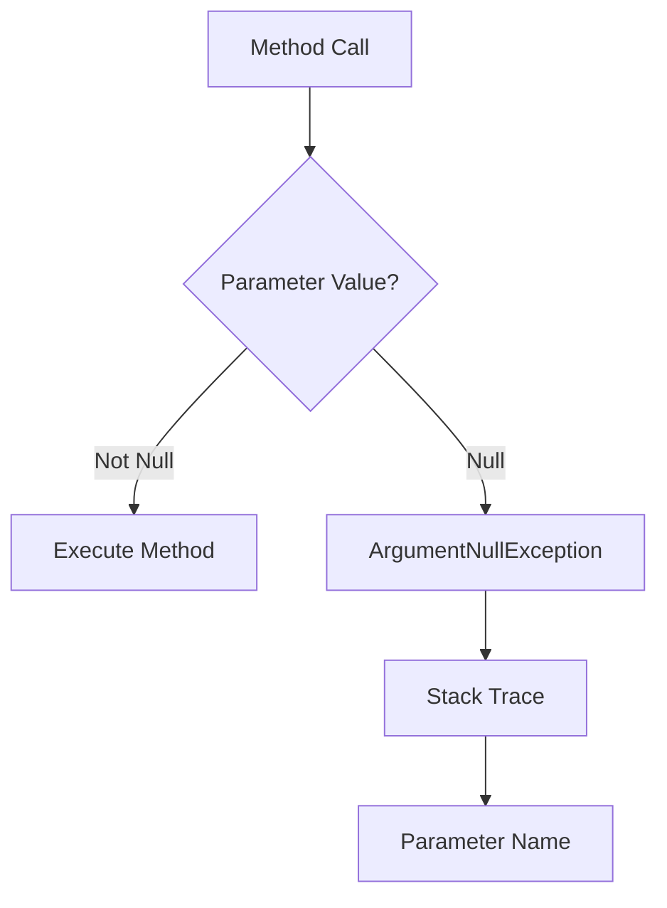

# How to Fix "Value cannot be null" ArgumentNullException

Author: [nawazdhandala](https://www.github.com/nawazdhandala)

Tags: .NET, C#, ArgumentNullException, Null Safety, Troubleshooting, Best Practices

Description: Learn how to diagnose and prevent ArgumentNullException errors in C# applications. This guide covers null checking patterns, nullable reference types, guard clauses, and best practices for building null-safe code.

The `ArgumentNullException` with the message "Value cannot be null" is one of the most common runtime errors in C# applications. This guide will help you understand why this error occurs and how to write null-safe code.

## Understanding the Error

```
System.ArgumentNullException: Value cannot be null. (Parameter 'connectionString')
   at Microsoft.Extensions.Configuration.ConfigurationExtensions.GetConnectionString(...)
   at MyApp.Startup.ConfigureServices(...)
```

This exception occurs when null is passed to a method that doesn't accept null values. The error message typically includes the parameter name that received null.



## Common Causes and Solutions

### 1. Null Method Parameters

The most direct cause - passing null to a method:

```csharp
// WRONG - Passing null directly
string? name = null;
Console.WriteLine(name.Length); // NullReferenceException
ProcessName(name); // May throw ArgumentNullException

public void ProcessName(string name)
{
    ArgumentNullException.ThrowIfNull(name);
    // Process name
}
```

**Solution: Add null checks and handle gracefully**

```csharp
// Option 1: Guard clause with ArgumentNullException
public void ProcessName(string name)
{
    ArgumentNullException.ThrowIfNull(name);
    // or in older .NET:
    // if (name == null) throw new ArgumentNullException(nameof(name));

    // Safe to use name here
}

// Option 2: Return early for nullable parameters
public void ProcessOptionalName(string? name)
{
    if (string.IsNullOrEmpty(name))
    {
        return; // Or use default behavior
    }

    // Process name
}

// Option 3: Provide default value
public void ProcessWithDefault(string? name)
{
    name ??= "Default Name";
    // Process name
}
```

### 2. Configuration Values

Missing or null configuration is a common source:

```csharp
// WRONG - Configuration value might be null
var connectionString = builder.Configuration.GetConnectionString("Default");
builder.Services.AddDbContext<AppDbContext>(options =>
    options.UseSqlServer(connectionString)); // Throws if null!
```

**Solution: Validate configuration at startup**

```csharp
// CORRECT - Validate and fail fast
var connectionString = builder.Configuration.GetConnectionString("Default")
    ?? throw new InvalidOperationException("Connection string 'Default' not found.");

builder.Services.AddDbContext<AppDbContext>(options =>
    options.UseSqlServer(connectionString));

// Better: Use options pattern with validation
public class DatabaseOptions
{
    public const string SectionName = "Database";

    [Required]
    public string ConnectionString { get; set; } = string.Empty;
}

builder.Services.AddOptions<DatabaseOptions>()
    .BindConfiguration(DatabaseOptions.SectionName)
    .ValidateDataAnnotations()
    .ValidateOnStart();
```

### 3. Dependency Injection Issues

Null services from DI container:

```csharp
// WRONG - Service might not be registered
public class MyController : ControllerBase
{
    private readonly IUserService _userService;

    public MyController(IUserService userService)
    {
        _userService = userService; // Could be null if not registered
    }
}
```

**Solution: Use required modifier and null checks**

```csharp
public class MyController : ControllerBase
{
    private readonly IUserService _userService;

    public MyController(IUserService userService)
    {
        _userService = userService ?? throw new ArgumentNullException(nameof(userService));
    }
}

// C# 11+ with required members
public class MyService
{
    public required ILogger<MyService> Logger { get; init; }
    public required IRepository Repository { get; init; }
}
```

### 4. LINQ Query Results

LINQ methods that can return null:

```csharp
// WRONG - FirstOrDefault returns null if not found
var user = users.FirstOrDefault(u => u.Id == userId);
var email = user.Email; // NullReferenceException if user is null!

// WRONG - SingleOrDefault has same issue
var config = configurations.SingleOrDefault(c => c.Key == "Setting");
```

**Solution: Handle null results properly**

```csharp
// Option 1: Check for null
var user = users.FirstOrDefault(u => u.Id == userId);
if (user == null)
{
    return NotFound();
}
var email = user.Email;

// Option 2: Use First when you expect a result
var user = users.First(u => u.Id == userId); // Throws if not found

// Option 3: Use null-conditional operator
var email = users.FirstOrDefault(u => u.Id == userId)?.Email;

// Option 4: Use pattern matching
if (users.FirstOrDefault(u => u.Id == userId) is { } user)
{
    // user is not null here
    ProcessUser(user);
}
```

### 5. Dictionary Access

Accessing non-existent dictionary keys:

```csharp
var settings = new Dictionary<string, string>
{
    { "Key1", "Value1" }
};

// WRONG - Throws KeyNotFoundException, not ArgumentNullException,
// but TryGetValue returns null for reference types in nullable context
var value = settings["NonExistentKey"]; // Throws!
```

**Solution: Use TryGetValue or GetValueOrDefault**

```csharp
// Option 1: TryGetValue
if (settings.TryGetValue("Key", out var value))
{
    // Use value
}

// Option 2: GetValueOrDefault (C# 7.1+)
var value = settings.GetValueOrDefault("Key", "DefaultValue");

// Option 3: Null-coalescing with indexer
var value = settings.TryGetValue("Key", out var v) ? v : "Default";

// Option 4: Collection expression (C# 12)
var settings = new Dictionary<string, string?>
{
    ["Key1"] = "Value1"
};
var value = settings.GetValueOrDefault("Key") ?? "Default";
```

## Enabling Nullable Reference Types

Enable nullable reference types for compile-time null safety:

```xml
<!-- In .csproj -->
<PropertyGroup>
    <Nullable>enable</Nullable>
</PropertyGroup>
```

```csharp
// With nullable enabled, the compiler warns about potential null
public class UserService
{
    private readonly IRepository _repository; // Warning if not initialized

    public User GetUser(int id)
    {
        return _repository.Find(id); // Warning: may return null
    }

    public User? GetUserOrNull(int id) // Explicit nullable return
    {
        return _repository.Find(id);
    }
}
```

## Guard Clauses and Validation

### Using ArgumentNullException.ThrowIfNull

```csharp
public class OrderService
{
    private readonly IOrderRepository _repository;
    private readonly ILogger<OrderService> _logger;

    public OrderService(IOrderRepository repository, ILogger<OrderService> logger)
    {
        // .NET 6+ - Clean and efficient
        ArgumentNullException.ThrowIfNull(repository);
        ArgumentNullException.ThrowIfNull(logger);

        _repository = repository;
        _logger = logger;
    }

    public async Task<Order> CreateOrderAsync(CreateOrderRequest request)
    {
        ArgumentNullException.ThrowIfNull(request);
        ArgumentException.ThrowIfNullOrEmpty(request.CustomerId);
        ArgumentOutOfRangeException.ThrowIfLessThanOrEqual(request.Items.Count, 0);

        // Proceed with validated parameters
        return await _repository.CreateAsync(request);
    }
}
```

### Creating a Guard Class

```csharp
public static class Guard
{
    public static T NotNull<T>(T? value, [CallerArgumentExpression(nameof(value))] string? paramName = null)
        where T : class
    {
        return value ?? throw new ArgumentNullException(paramName);
    }

    public static string NotNullOrEmpty(string? value, [CallerArgumentExpression(nameof(value))] string? paramName = null)
    {
        if (string.IsNullOrEmpty(value))
        {
            throw new ArgumentException("Value cannot be null or empty.", paramName);
        }
        return value;
    }

    public static T NotDefault<T>(T value, [CallerArgumentExpression(nameof(value))] string? paramName = null)
        where T : struct
    {
        if (EqualityComparer<T>.Default.Equals(value, default))
        {
            throw new ArgumentException("Value cannot be default.", paramName);
        }
        return value;
    }

    public static IEnumerable<T> NotNullOrEmpty<T>(
        IEnumerable<T>? value,
        [CallerArgumentExpression(nameof(value))] string? paramName = null)
    {
        if (value == null || !value.Any())
        {
            throw new ArgumentException("Collection cannot be null or empty.", paramName);
        }
        return value;
    }
}

// Usage
public void ProcessOrder(Order? order, string? customerId, IList<Item>? items)
{
    var validOrder = Guard.NotNull(order);
    var validCustomerId = Guard.NotNullOrEmpty(customerId);
    var validItems = Guard.NotNullOrEmpty(items);

    // Process validated values
}
```

## Null Object Pattern

Instead of returning null, return a null object:

```csharp
public interface ILogger
{
    void Log(string message);
}

public class ConsoleLogger : ILogger
{
    public void Log(string message) => Console.WriteLine(message);
}

// Null object - does nothing but prevents null checks
public class NullLogger : ILogger
{
    public static readonly NullLogger Instance = new();
    public void Log(string message) { } // No-op
}

public class Service
{
    private readonly ILogger _logger;

    public Service(ILogger? logger = null)
    {
        _logger = logger ?? NullLogger.Instance; // Never null
    }

    public void DoWork()
    {
        _logger.Log("Working..."); // Safe - no null check needed
    }
}
```

## Exception Handling Patterns

### Global Exception Handler for ArgumentNullException

```csharp
public class GlobalExceptionHandler : IExceptionHandler
{
    private readonly ILogger<GlobalExceptionHandler> _logger;

    public GlobalExceptionHandler(ILogger<GlobalExceptionHandler> logger)
    {
        _logger = logger;
    }

    public async ValueTask<bool> TryHandleAsync(
        HttpContext httpContext,
        Exception exception,
        CancellationToken cancellationToken)
    {
        if (exception is ArgumentNullException argNullEx)
        {
            _logger.LogWarning(argNullEx,
                "Null argument: {ParameterName}",
                argNullEx.ParamName);

            httpContext.Response.StatusCode = StatusCodes.Status400BadRequest;
            await httpContext.Response.WriteAsJsonAsync(new
            {
                Error = "A required value was not provided.",
                Parameter = argNullEx.ParamName
            }, cancellationToken);

            return true;
        }

        return false;
    }
}

// Registration
builder.Services.AddExceptionHandler<GlobalExceptionHandler>();
builder.Services.AddProblemDetails();
```

## Best Practices Summary

### Do's

```csharp
// DO: Use ArgumentNullException.ThrowIfNull
ArgumentNullException.ThrowIfNull(parameter);

// DO: Enable nullable reference types
#nullable enable

// DO: Use null-coalescing for defaults
var value = possibleNull ?? defaultValue;

// DO: Use pattern matching
if (result is { } value) { /* use value */ }

// DO: Validate at boundaries
public void PublicMethod(Request request)
{
    ArgumentNullException.ThrowIfNull(request);
    InternalMethod(request); // Trust internal calls
}
```

### Don'ts

```csharp
// DON'T: Silently swallow null
public void Process(string? data)
{
    if (data == null) return; // Hiding problems
}

// DON'T: Use null! to suppress warnings without validation
var user = GetUser()!; // Dangerous

// DON'T: Return null when you can throw
public User GetUser(int id)
{
    return _repository.Find(id); // Returns null - confusing API
}

// DO: Be explicit about null possibility
public User? GetUserOrNull(int id)
{
    return _repository.Find(id);
}
```

## Conclusion

ArgumentNullException helps you build robust applications by failing fast when invalid data is encountered. Key strategies:

1. **Enable nullable reference types**: Get compile-time warnings
2. **Use guard clauses**: Validate parameters at method entry
3. **ThrowIfNull**: Use the built-in .NET 6+ helper
4. **Validate configuration**: Fail fast at startup
5. **Handle LINQ results**: Check for null from FirstOrDefault
6. **Use null object pattern**: Avoid null checks with safe defaults

By consistently applying these patterns, you'll catch null-related bugs early and build more reliable applications.
