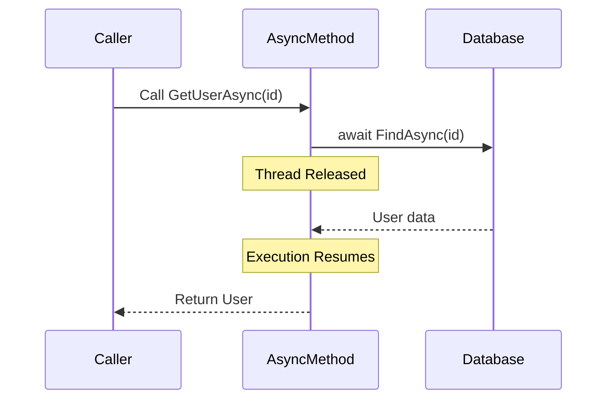

# How to Handle async/await Properly in C#

Author: [nawazdhandala](https://github.com/nawazdhandala)

Tags: C#, .NET, Async, Await, Concurrency, Performance, Best Practices

Description: Master async/await patterns in C# with practical examples covering common pitfalls, best practices, and performance optimization techniques for asynchronous programming.

---

Asynchronous programming with async/await is essential for building responsive and scalable .NET applications. However, improper use can lead to deadlocks, performance issues, and hard-to-debug problems. This guide covers proper async/await patterns and common mistakes to avoid.

## Understanding async/await Basics

The `async` keyword enables the `await` keyword in a method, and `await` pauses execution until the awaited task completes.

```csharp
public async Task<User> GetUserAsync(int id)
{
    // Thread is released while waiting for database
    var user = await _dbContext.Users.FindAsync(id);

    // Execution continues after await completes
    return user;
}
```

## Common Mistakes and Solutions

### 1. Async Void - The Cardinal Sin

Never use `async void` except for event handlers. Exceptions cannot be caught, and you cannot await completion.

```csharp
// WRONG - Exceptions are lost, cannot be awaited
public async void ProcessOrderAsync(Order order)
{
    await _repository.SaveAsync(order); // If this throws, application may crash
}

// CORRECT - Returns Task, exceptions propagate properly
public async Task ProcessOrderAsync(Order order)
{
    await _repository.SaveAsync(order);
}

// EXCEPTION - Event handlers must be async void
private async void Button_Click(object sender, EventArgs e)
{
    try
    {
        await ProcessDataAsync();
    }
    catch (Exception ex)
    {
        // Handle exception here since it won't propagate
        MessageBox.Show(ex.Message);
    }
}
```

### 2. Blocking on Async Code

Never use `.Result` or `.Wait()` on async code - this causes deadlocks.

```csharp
// WRONG - Causes deadlock in UI/ASP.NET contexts
public User GetUser(int id)
{
    var user = GetUserAsync(id).Result; // DEADLOCK!
    return user;
}

// WRONG - Same problem
public User GetUser(int id)
{
    GetUserAsync(id).Wait(); // DEADLOCK!
    return GetUserAsync(id).Result;
}

// CORRECT - Go async all the way
public async Task<User> GetUserAsync(int id)
{
    var user = await _repository.FindAsync(id);
    return user;
}

// If you absolutely must call async from sync (avoid if possible)
public User GetUser(int id)
{
    return Task.Run(async () => await GetUserAsync(id)).GetAwaiter().GetResult();
}
```

### 3. Forgetting to Await

Not awaiting a task means the operation runs in the background, and exceptions are swallowed.

```csharp
// WRONG - Fire and forget, exception lost
public async Task ProcessOrdersAsync(List<Order> orders)
{
    foreach (var order in orders)
    {
        ProcessSingleOrderAsync(order); // Not awaited!
    }
}

// CORRECT - Await each operation
public async Task ProcessOrdersAsync(List<Order> orders)
{
    foreach (var order in orders)
    {
        await ProcessSingleOrderAsync(order);
    }
}

// BETTER - Process in parallel if independent
public async Task ProcessOrdersAsync(List<Order> orders)
{
    var tasks = orders.Select(order => ProcessSingleOrderAsync(order));
    await Task.WhenAll(tasks);
}
```

## Async Flow Visualization



## Parallel vs Sequential Execution

### Sequential (When order matters)

```csharp
public async Task<OrderResult> ProcessOrderAsync(Order order)
{
    // These must run in sequence
    await ValidateOrderAsync(order);
    await ReserveInventoryAsync(order);
    await ProcessPaymentAsync(order);
    await SendConfirmationAsync(order);

    return new OrderResult { Success = true };
}
```

### Parallel (When operations are independent)

```csharp
public async Task<DashboardData> GetDashboardAsync(int userId)
{
    // Start all tasks
    var userTask = _userService.GetUserAsync(userId);
    var ordersTask = _orderService.GetRecentOrdersAsync(userId);
    var notificationsTask = _notificationService.GetUnreadAsync(userId);
    var statsTask = _analyticsService.GetUserStatsAsync(userId);

    // Wait for all to complete
    await Task.WhenAll(userTask, ordersTask, notificationsTask, statsTask);

    return new DashboardData
    {
        User = userTask.Result,
        RecentOrders = ordersTask.Result,
        Notifications = notificationsTask.Result,
        Stats = statsTask.Result
    };
}
```

## ConfigureAwait Usage

### Library Code - Use ConfigureAwait(false)

```csharp
// In library code, avoid capturing the synchronization context
public async Task<string> FetchDataAsync(string url)
{
    using var client = new HttpClient();
    var response = await client.GetStringAsync(url).ConfigureAwait(false);
    var processed = await ProcessDataAsync(response).ConfigureAwait(false);
    return processed;
}
```

### Application Code - Usually Not Needed

```csharp
// In ASP.NET Core, there's no synchronization context
// ConfigureAwait(false) has no effect but doesn't hurt
public async Task<IActionResult> GetUsers()
{
    var users = await _userService.GetAllUsersAsync();
    return Ok(users);
}
```

## Cancellation Token Patterns

Always support cancellation for long-running operations.

```csharp
public async Task<List<Report>> GenerateReportsAsync(
    ReportRequest request,
    CancellationToken cancellationToken = default)
{
    var reports = new List<Report>();

    foreach (var config in request.Configurations)
    {
        // Check for cancellation
        cancellationToken.ThrowIfCancellationRequested();

        // Pass token to async operations
        var report = await GenerateSingleReportAsync(config, cancellationToken);
        reports.Add(report);
    }

    return reports;
}

// In ASP.NET Core controller
[HttpGet("reports")]
public async Task<IActionResult> GetReports(CancellationToken cancellationToken)
{
    try
    {
        var reports = await _reportService.GenerateReportsAsync(request, cancellationToken);
        return Ok(reports);
    }
    catch (OperationCanceledException)
    {
        // Client disconnected
        return StatusCode(499, "Client closed request");
    }
}
```

## Exception Handling

### Single Task

```csharp
public async Task<User> GetUserAsync(int id)
{
    try
    {
        return await _repository.FindAsync(id);
    }
    catch (DbException ex)
    {
        _logger.LogError(ex, "Database error fetching user {UserId}", id);
        throw new UserServiceException("Failed to fetch user", ex);
    }
}
```

### Multiple Tasks with WhenAll

```csharp
public async Task ProcessBatchAsync(List<int> ids)
{
    var tasks = ids.Select(id => ProcessItemAsync(id)).ToList();

    try
    {
        await Task.WhenAll(tasks);
    }
    catch (Exception)
    {
        // WhenAll throws only the first exception
        // Check all tasks for their exceptions
        var exceptions = tasks
            .Where(t => t.IsFaulted)
            .SelectMany(t => t.Exception?.InnerExceptions ?? Enumerable.Empty<Exception>())
            .ToList();

        _logger.LogError("Batch processing failed with {Count} errors", exceptions.Count);

        foreach (var ex in exceptions)
        {
            _logger.LogError(ex, "Individual task error");
        }

        throw new AggregateException(exceptions);
    }
}
```

## ValueTask for Performance

Use `ValueTask<T>` when results are often available synchronously.

```csharp
public class CachedUserService
{
    private readonly ConcurrentDictionary<int, User> _cache = new();
    private readonly IUserRepository _repository;

    // ValueTask avoids allocation when cache hit
    public ValueTask<User?> GetUserAsync(int id)
    {
        if (_cache.TryGetValue(id, out var user))
        {
            // No allocation - returns synchronously
            return ValueTask.FromResult<User?>(user);
        }

        // Only allocate Task when cache miss
        return new ValueTask<User?>(FetchAndCacheUserAsync(id));
    }

    private async Task<User?> FetchAndCacheUserAsync(int id)
    {
        var user = await _repository.FindAsync(id);
        if (user != null)
        {
            _cache.TryAdd(id, user);
        }
        return user;
    }
}
```

## Async Streams (IAsyncEnumerable)

Process large datasets without loading everything into memory.

```csharp
public async IAsyncEnumerable<Order> GetOrdersAsync(
    [EnumeratorCancellation] CancellationToken cancellationToken = default)
{
    var page = 0;
    const int pageSize = 100;

    while (true)
    {
        var orders = await _repository.GetPageAsync(page, pageSize, cancellationToken);

        if (!orders.Any())
            yield break;

        foreach (var order in orders)
        {
            yield return order;
        }

        page++;
    }
}

// Usage
await foreach (var order in _orderService.GetOrdersAsync(cancellationToken))
{
    await ProcessOrderAsync(order, cancellationToken);
}
```

## Async Initialization Pattern

```csharp
public class DatabaseService : IAsyncDisposable
{
    private SqlConnection? _connection;
    private readonly SemaphoreSlim _initLock = new(1, 1);
    private bool _initialized;

    public async Task<SqlConnection> GetConnectionAsync()
    {
        if (_initialized)
            return _connection!;

        await _initLock.WaitAsync();
        try
        {
            if (_initialized)
                return _connection!;

            _connection = new SqlConnection(_connectionString);
            await _connection.OpenAsync();
            _initialized = true;

            return _connection;
        }
        finally
        {
            _initLock.Release();
        }
    }

    public async ValueTask DisposeAsync()
    {
        if (_connection != null)
        {
            await _connection.DisposeAsync();
        }
        _initLock.Dispose();
    }
}
```

## Best Practices Summary

| Practice | Description |
|----------|-------------|
| **Async all the way** | Don't mix sync and async |
| **Avoid async void** | Use Task return type |
| **Never block** | Don't use .Result or .Wait() |
| **Always await** | Don't fire-and-forget |
| **Support cancellation** | Accept CancellationToken |
| **ConfigureAwait(false)** | In library code only |
| **Use ValueTask** | For frequently synchronous results |
| **Handle all exceptions** | Check all tasks in WhenAll |

## Conclusion

Proper async/await usage is crucial for building performant and reliable .NET applications. Avoid blocking calls, always await your tasks, support cancellation, and handle exceptions properly. Following these patterns will help you avoid common pitfalls like deadlocks and lost exceptions while maximizing the benefits of asynchronous programming.
