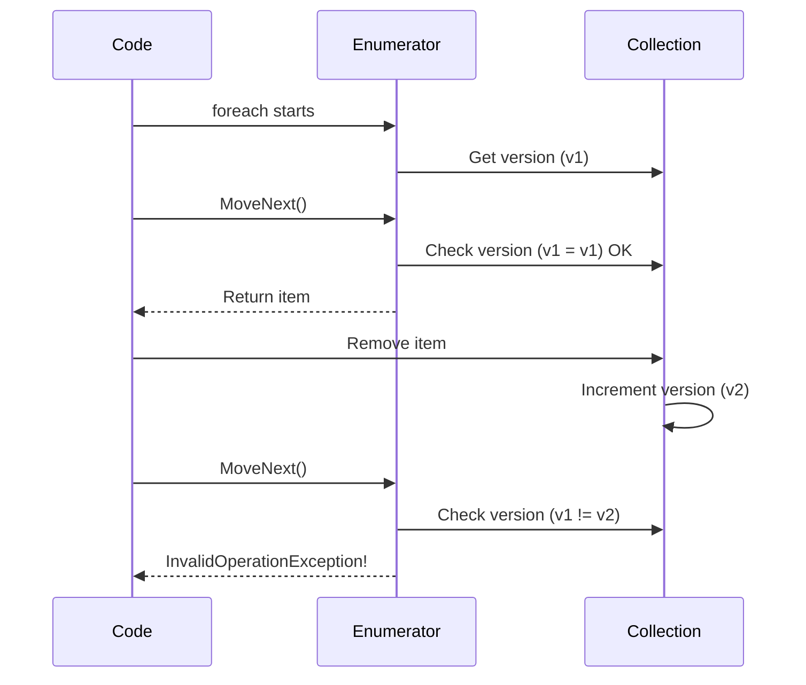

# How to Handle 'Collection was modified' Errors in C#

Author: [nawazdhandala](https://github.com/nawazdhandala)

Tags: C#, .NET, Collections, Threading, Error Handling, Concurrency

Description: Learn how to diagnose and fix the 'Collection was modified; enumeration operation may not execute' error in C#. This guide covers safe iteration patterns, concurrent collections, and best practices.

---

The "Collection was modified; enumeration operation may not execute" error occurs when you modify a collection while iterating over it with `foreach`. This guide explains why it happens and provides multiple solutions for different scenarios.

## Understanding the Error

When you use `foreach`, the collection's enumerator tracks the collection state. Modifying the collection invalidates the enumerator:

```csharp
var numbers = new List<int> { 1, 2, 3, 4, 5 };

// This throws InvalidOperationException
foreach (var number in numbers)
{
    if (number % 2 == 0)
    {
        numbers.Remove(number); // Modifies collection during iteration!
    }
}
```

## Why This Happens



## Solutions

### 1. Iterate Over a Copy

The simplest solution - create a copy of the collection before iterating:

```csharp
var numbers = new List<int> { 1, 2, 3, 4, 5 };

// Create copy with ToList()
foreach (var number in numbers.ToList())
{
    if (number % 2 == 0)
    {
        numbers.Remove(number); // Safe - iterating over copy
    }
}
// Result: [1, 3, 5]
```

### 2. Use RemoveAll for Lists

For `List<T>`, use the built-in `RemoveAll` method:

```csharp
var orders = new List<Order>
{
    new Order { Id = 1, Status = "Pending" },
    new Order { Id = 2, Status = "Cancelled" },
    new Order { Id = 3, Status = "Completed" }
};

// Remove all cancelled orders
int removedCount = orders.RemoveAll(o => o.Status == "Cancelled");

Console.WriteLine($"Removed {removedCount} orders");
```

### 3. Reverse For Loop

When removing items, iterate backwards with a `for` loop:

```csharp
var items = new List<string> { "keep", "remove", "keep", "remove" };

// Iterate backwards to avoid index shifting issues
for (int i = items.Count - 1; i >= 0; i--)
{
    if (items[i] == "remove")
    {
        items.RemoveAt(i);
    }
}
```

### 4. Collect Items to Remove

Build a list of items to remove, then remove them:

```csharp
var users = new List<User> { /* ... */ };

// Collect items to remove
var usersToRemove = new List<User>();

foreach (var user in users)
{
    if (user.IsInactive && user.LastLoginDays > 365)
    {
        usersToRemove.Add(user);
    }
}

// Remove after iteration completes
foreach (var user in usersToRemove)
{
    users.Remove(user);
}
```

### 5. Use LINQ Where (for new collection)

If you want a filtered collection (not modifying original):

```csharp
var numbers = new List<int> { 1, 2, 3, 4, 5 };

// Create new filtered list
var oddNumbers = numbers.Where(n => n % 2 != 0).ToList();

// Or replace the original
numbers = numbers.Where(n => n % 2 != 0).ToList();
```

### 6. Use HashSet for Efficient Removal

```csharp
var items = new HashSet<string> { "a", "b", "c", "d" };
var itemsToRemove = new[] { "b", "d" };

// HashSet.ExceptWith modifies in place
items.ExceptWith(itemsToRemove);
// Result: ["a", "c"]

// Or RemoveWhere for predicate-based removal
items.RemoveWhere(item => item.StartsWith("a"));
```

## Dictionary Modifications

Dictionaries have the same issue:

```csharp
var cache = new Dictionary<string, DateTime>
{
    ["key1"] = DateTime.Now.AddHours(-2),
    ["key2"] = DateTime.Now,
    ["key3"] = DateTime.Now.AddHours(-1)
};

// WRONG - throws exception
foreach (var kvp in cache)
{
    if (kvp.Value < DateTime.Now.AddHours(-1))
    {
        cache.Remove(kvp.Key);
    }
}

// SOLUTION 1: Iterate over keys copy
foreach (var key in cache.Keys.ToList())
{
    if (cache[key] < DateTime.Now.AddHours(-1))
    {
        cache.Remove(key);
    }
}

// SOLUTION 2: LINQ to find keys, then remove
var expiredKeys = cache
    .Where(kvp => kvp.Value < DateTime.Now.AddHours(-1))
    .Select(kvp => kvp.Key)
    .ToList();

foreach (var key in expiredKeys)
{
    cache.Remove(key);
}
```

## Concurrent Collections

For multi-threaded scenarios, use concurrent collections:

### ConcurrentDictionary

```csharp
using System.Collections.Concurrent;

var cache = new ConcurrentDictionary<string, CacheEntry>();

// Safe concurrent operations
cache.TryAdd("key", new CacheEntry());
cache.TryRemove("key", out _);

// Atomic update
cache.AddOrUpdate("key",
    addValueFactory: key => new CacheEntry(),
    updateValueFactory: (key, existing) => existing.Refresh());
```

### ConcurrentBag and ConcurrentQueue

```csharp
var bag = new ConcurrentBag<WorkItem>();

// Add from multiple threads
Parallel.For(0, 100, i =>
{
    bag.Add(new WorkItem { Id = i });
});

// Safe iteration - takes snapshot
foreach (var item in bag)
{
    Console.WriteLine(item.Id);
}

// Remove items
while (bag.TryTake(out var item))
{
    ProcessItem(item);
}
```

### BlockingCollection

```csharp
using var collection = new BlockingCollection<Message>(boundedCapacity: 100);

// Producer thread
Task.Run(() =>
{
    for (int i = 0; i < 50; i++)
    {
        collection.Add(new Message { Id = i });
    }
    collection.CompleteAdding();
});

// Consumer thread - blocks until item available
foreach (var message in collection.GetConsumingEnumerable())
{
    ProcessMessage(message);
}
```

## Real-World Examples

### Event Handler Cleanup

```csharp
public class EventManager
{
    private readonly List<IEventHandler> _handlers = new();

    public void ProcessEvents(Event evt)
    {
        // Create copy to allow handlers to unsubscribe themselves
        foreach (var handler in _handlers.ToList())
        {
            try
            {
                handler.Handle(evt);
            }
            catch (Exception ex)
            {
                // Handler failed, remove it
                _handlers.Remove(handler);
            }
        }
    }
}
```

### Cache Expiration

```csharp
public class SimpleCache<TKey, TValue> where TKey : notnull
{
    private readonly Dictionary<TKey, CacheEntry<TValue>> _cache = new();

    public void CleanupExpired()
    {
        var expiredKeys = _cache
            .Where(kvp => kvp.Value.IsExpired)
            .Select(kvp => kvp.Key)
            .ToList();

        foreach (var key in expiredKeys)
        {
            _cache.Remove(key);
        }
    }
}
```

### Order Processing

```csharp
public class OrderProcessor
{
    private readonly List<Order> _pendingOrders = new();

    public void ProcessOrders()
    {
        // Process and remove completed orders
        for (int i = _pendingOrders.Count - 1; i >= 0; i--)
        {
            var order = _pendingOrders[i];

            if (TryProcessOrder(order))
            {
                _pendingOrders.RemoveAt(i);
            }
        }
    }
}
```

## Solution Comparison

| Approach | Best For | Performance | Thread-Safe |
|----------|----------|-------------|-------------|
| `ToList()` copy | Simple cases | O(n) memory | No |
| `RemoveAll` | Lists with predicate | O(n) | No |
| Reverse for loop | Index-based removal | O(1) memory | No |
| Collect then remove | Complex conditions | O(n) memory | No |
| LINQ Where | Creating new collection | O(n) | No |
| `ConcurrentDictionary` | Multi-threaded access | Varies | Yes |
| `BlockingCollection` | Producer-consumer | Varies | Yes |

## Best Practices

```csharp
// DO: Use RemoveAll when possible
list.RemoveAll(x => x.ShouldRemove);

// DO: Use LINQ for filtering
var filtered = items.Where(x => x.IsValid).ToList();

// DO: Use concurrent collections for threading
var concurrent = new ConcurrentDictionary<string, int>();

// DON'T: Modify during foreach
foreach (var item in items)
{
    items.Remove(item); // Bad!
}

// DO: Copy if you must modify during iteration
foreach (var item in items.ToList())
{
    items.Remove(item); // OK - iterating over copy
}
```

## Conclusion

The "Collection was modified" error protects you from unpredictable behavior. Choose the right solution based on your needs: `ToList()` for simple cases, `RemoveAll` for lists, reverse loops for index-based removal, and concurrent collections for multi-threaded scenarios. Understanding why this error occurs helps you write safer, more predictable collection manipulation code.
